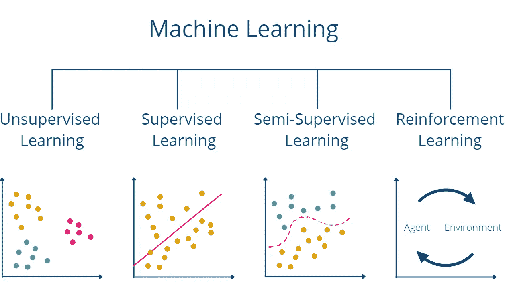

# 什么是监督学习？

> 原文：<https://towardsdatascience.com/what-is-supervised-learning-fd86d704d855>

## 了解监督学习的应用和问题

蒂姆·莫斯霍尔德在 [Unsplash](https://unsplash.com?utm_source=medium&utm_medium=referral) 上的照片

监督学习是人工智能和[机器学习](https://databasecamp.de/en/machine-learning)的一个子类。其特征在于训练数据[已经包含正确的标签。这允许算法学习为新的](https://databasecamp.de/en/data)[数据](https://databasecamp.de/en/data)对象预测这些标签。与此相反的是所谓的[无监督学习](https://databasecamp.de/en/ml/unsupervised-learnings)，其中这些标签不存在于数据集中，算法必须进行不同的训练。

# 监督学习是如何工作的？

监督学习算法使用数据集从输入中学习相关性，然后做出所需的预测。最佳情况下，预测和数据集的标注是相同的。训练数据集包含输入和正确的输出。模型可以使用这些在几次迭代中学习。准确度反过来表明从给定的输入中预测正确输出的频率。这是使用损失函数计算的，并且该算法试图最小化它，直到获得满意的结果。

你可以把它想成一个想学英语，已经会说德语的人。有了德-英词典或词汇书，这个人可以通过覆盖英语栏，然后试图从德语单词“预测”英语单词，相对容易地自己学习。她将重复这种训练，直到她能够足够多次地正确预测英语单词。这个人可以通过计算她翻译错误的单词数，并将其与她翻译的所有单词的比例来衡量她的进步。随着时间的推移，这个人将试图最小化这个比率，直到她能够正确地将所有德语单词翻译成英语。

监督学习可以分为两大类:

*   **分类**用于将新的[数据](https://databasecamp.de/en/data)对象分配到一个或多个预定义的类别中。该模型试图从代表类别分配的输入中识别相关性。这方面的一个例子是要被识别然后被分配到一个类别的图像。然后，该模型可以预测图像，例如，是否可以在图像中看到狗。
*   [**回归**](https://databasecamp.de/en/ml/linear-regression-basics) 解释称为自变量的输入和称为因变量的输出之间的关系。例如，如果我们想预测一家公司的销售额，并且我们有前一年的营销活动和平均价格，则回归可以提供关于营销努力对销售额的影响的信息。

# 监督学习有哪些应用？

有多种商业应用可以受益于监督学习算法。下面我们简单总结了最受欢迎的几个:

*   [**图像中的物体识别**](https://databasecamp.de/en/use-case/cnn-in-tensorflow) :监督学习模型的一个用例是识别图像中的物体，比如一辆汽车前面是否有另一辆汽车。已经有数不清的模型架构在对象识别甚至分类方面提供了很好的结果。除了其他方面之外，这一特性还用于自动驾驶，以便能够对如何做出最佳反应做出估计。
*   **预测**:如果公司能够非常准确地预测未来的情景或状态，他们可以很好地权衡不同的决策选项，并选择最佳的一个。例如，对下一年预期销售额的高质量回归分析可用于决定分配多少预算给营销。
*   **:如今，许多公司都面临着从各种渠道获取产品评论的挑战。很少有顾客利用这个机会在自己的电子商务商店里描述评论。相反，他们自己的产品也会在社交媒体评论、YouTube 视频或博客文章中得到评级，这些评级有时可能与他们自己网站上的评级相差很大。这就是为什么可以自动将文本分类为正面或负面的模型是一个很好的选择。例如，这使得处理许多评论和快速获得社交媒体上的情绪概览成为可能。**
*   ****垃圾邮件检测**:许多电子邮件程序已经有了训练有素的垃圾邮件程序。这将检查收到的电子邮件，并计算它们是垃圾邮件的概率，即包含广告或用户不想要的邮件。为了识别这些邮件，会使用其他用户已经手动标记为垃圾邮件的数据。然后，这些数据被用来训练一个监督学习模型，以自动标记电子邮件。**

# **监督学习有什么问题？**

**不幸的是，监督学习模型在许多情况下取得的良好结果也具有这些算法带来的一些缺点:**

*   **如果分类还不可用，在许多情况下给培训[数据](https://databasecamp.de/en/data)贴标签是一个费力且昂贵的过程。例如，很少有图像被分类为其中是否有狗。这必须首先手动完成。**
*   **训练监督学习模型可能非常耗时。**
*   **人类的错误或辨别力也是可以学习的。因此，如果用于对求职者进行分类的训练数据集歧视某些社会群体，该模型很可能会继续这样做。**

# **监督和非监督机器学习的比较**

**假设我们想教一个孩子一门新的语言，比如英语。如果我们根据[监督学习](https://databasecamp.de/en/ml/supervised-learning-models)的原则来做这件事，我们简单地给他一本字典，上面有英语单词和他的母语的翻译，例如德语。孩子会发现开始学习相对容易，并且通过记忆翻译可能会进步很快。然而，除此之外，他在阅读和理解英语文本方面会有问题，因为他只学会了德-英翻译，而没有学会英语句子的语法结构。**

**根据无监督学习的原理，这个场景看起来会完全不同。例如，我们会简单地给孩子五本英语书，他必须自己学习其他的东西。当然，这是一项更加复杂的任务。在“[数据](https://databasecamp.de/en/data)的帮助下，例如，孩子可以识别出单词“I”在文本中相对频繁地出现，并且在许多情况下也出现在句子的开头，并且由此得出结论。**

**这个例子也说明了[监督](https://databasecamp.de/en/ml/supervised-learning-models)和非监督学习的区别。[监督学习](https://databasecamp.de/en/ml/supervised-learning-models)在许多情况下是一种更简单的算法，因此通常具有更短的训练时间。然而，该模型仅学习明确存在于训练[数据](https://databasecamp.de/en/data)集合中并作为模型的输入给出的上下文。例如，学习英语的孩子将能够相对较好地将单个德语单词翻译成英语，但不会学会阅读和理解英语文本。**

****

**不同机器学习类别的概述|图片:作者**

**另一方面，无监督学习面临更复杂的任务，因为它必须独立地识别和学习结构。这样一来，训练的时间和精力也更高。然而，其优势在于，经过训练的模型也能识别出没有明确教授给它的上下文。在五本英语小说的帮助下自学英语的孩子可能会阅读英语课文，将单个单词翻译成德语，还能理解英语语法。**

# **这是你应该带走的东西**

*   **监督学习是人工智能的一个子类，描述了在已经包含正确输出标签的数据集上训练的模型。**
*   **监督学习算法可以分为分类模型和回归模型。**
*   **公司将这些模型用于各种各样的应用，如垃圾邮件检测或图像中的对象识别。**
*   **监督学习并非没有问题，因为标记数据集是昂贵的，并且可能包含人为错误。**

***如果你喜欢我的作品，请在这里订阅***或者查看我的网站* [*数据大本营*](http://www.databasecamp.de/en/homepage) *！此外，媒体允许你每月免费阅读* ***3 篇*** *。如果你想让***无限制地访问我的文章和数以千计的精彩文章，不要犹豫，通过点击我的推荐链接:*[https://medium.com/@niklas_lang/membership](https://medium.com/@niklas_lang/membership)获得会员资格，每个月只需支付 ***5*******

*****     *****