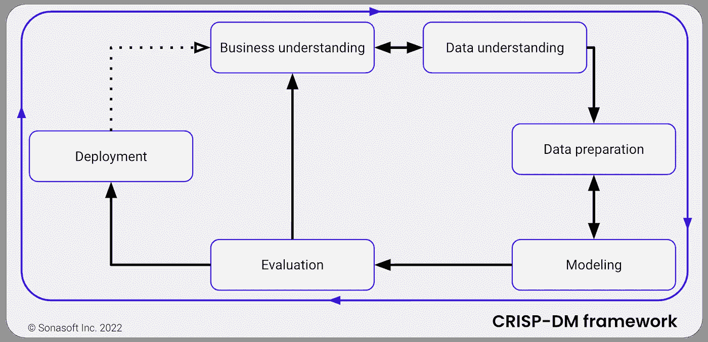

# 构建企业级人工智能应用需要什么

> 原文：<https://towardsdatascience.com/what-it-takes-to-build-enterprise-grade-ai-applications-8dac496e7880>

## 端到端思维的力量

索纳软件 2022

人工智能通常被称为第四次工业革命。毫无疑问，它正在彻底改变企业的经营方式。但构建企业级 AI 应用极具挑战性。我的数据科学职业生涯一直专注于帮助公司提供强大的人工智能解决方案。对于我目前在 Sonasoft 的角色来说尤其如此，我在那里花时间构建端到端的人工智能应用。

随着时间的推移，我已经确切地了解了如何大规模交付可靠而健壮的人工智能，我想分享其中的一些见解。

# 什么是企业人工智能？

当大多数人想到人工智能时，他们会想到自动驾驶汽车、计算机生成的艺术，或者通过从氨基酸序列预测蛋白质结构来推进药物发现。这些都需要在 AI 研究的前沿发展深度学习和大规模神经网络。但是它们与大企业有多大关系呢？好吧，如果你的生意是制造汽车或销售毒品，它们是 100%相关的。然而，对于大多数企业来说，构建和部署它们是不必要的复杂和昂贵。这就引出了一个问题。人工智能究竟能为大多数企业做些什么？

几年前，[麦肯锡](https://www.mckinsey.com/~/media/mckinsey/featured%20insights/artificial%20intelligence/notes%20from%20the%20ai%20frontier%20applications%20and%20value%20of%20deep%20learning/notes-from-the-ai-frontier-insights-from-hundreds-of-use-cases-discussion-paper.ashx)分析了许多垂直行业的数百个人工智能用例。他们的发现相当惊人。人工智能最有价值的用例出现在它被用来推动现有的商业智能和分析的时候。换句话说，坦白地说，大型企业的最佳人工智能用例是最平凡的。不过，这不应该让人感到意外。首先，如果你已经对你的数据有了很好的理解，那么你就有可能创造出更强大的人工智能解决方案。其次，对许多企业来说，重要的是提高效率、节约成本以及由此带来的更高利润。这些通常是通过复合的渐进式变革而不是一次性的革命性变革来实现的。

根据我的经验，三种形式的人工智能对企业的影响最大:

1.  **预测。**商业的许多方面都依赖于对未来结果的准确估计。下周需要多少库存来满足需求？下个月的价格会是多少？所有这些问题都可以用预测模型来回答，预测模型将历史数据与当前状态结合起来，以预测未来的状态。
2.  **异常检测**。通常在商业中，你需要发现流氓或异常事件。例如，这种交易是合法的，还是可能是欺诈性的？这个文件应该被访问吗，还是有黑客试图窃取我的数据？这就是异常检测模型脱颖而出的地方。
3.  **分类。**销售团队需要区分哪些销售线索是最有力的，哪些应该被忽略。同样，如果你从事贷款业务，你需要知道哪些人是好的信用风险者。这些只是分类模型可以帮助您做出更好决策的几个例子。

如上所述，人工智能的一个关键胜利是帮助企业通过可靠和具有统计意义的数据洞察力做出决策，数据是关键词。

# 数据是基础

我怎么强调数据在实现人工智能驱动的提升中的基础作用都不为过。企业人工智能的成功将取决于您可以访问的数据的数量、质量和范围。许多人工智能应用依赖于监督学习，为此你需要精确标记的数据。即使在使用无监督学习进行异常检测时，数据越多，结果就越准确。深度学习算法通常是数据饥渴的，需要大量的训练数据来确保它们的许多参数得到调整，以确保最终的模型能够很好地推广到看不见的场景。

当然，数据量并不是一个充分的限定条件。 [CRISP-DM](/why-using-crisp-dm-will-make-you-a-better-data-scientist-66efe5b72686) 是一个广泛用于数据挖掘和数据科学项目的框架。六个步骤中有两个与数据直接相关；数据理解和数据准备。我坚信，数据科学家必须了解数据是如何获得的，并且应该尽可能多地参与数据工程过程。每当我为一家公司做一个新的企业人工智能项目时，我总是坚持要访问他们所有的数据。我指的是他们所有的数据。我还与他们的主题专家(SME)交谈，以了解数据是什么，数据来自哪里等。如果您无法选择自己收集和设计最终数据集，那么花时间了解采样过程和任何决策是非常重要的，要特别注意潜在的数据泄漏源。

索纳软件 2022

下一个关键步骤是获得所有数据的整体视图，以确定它是否适合人工智能。我关注的主要问题包括:

*   **数据有什么特点？**是否需要监督学习，如果需要，目标的性质是什么？了解您试图预测的标签是否不平衡将对数据预处理步骤产生重要影响。它还会影响用于评估最终模型性能的指标的选择。
*   **时间在数据中扮演什么角色？**尽可能多地给数据打上时间戳有助于确保避免包含只有在预测目标值后才可用的特性。
*   **数据中有什么空白吗？**如果是，它们是否重要？了解这些差距的来源及其性质(随机遗漏“MAR”或非随机遗漏“MNAR”)将决定适当的处理方法，每种方法都有其优点和缺点。
*   数据中是否存在季节性或其他基于时间的模式？如果是，如何最好地利用这一点？
*   有什么显著的相关性吗？如果是这样，中小企业能对此给出合理的解释吗？这对于区分真实关系和杂散噪声非常重要。
*   **任何外部数据可能有助于扩充这些数据吗？**例如，这些数据会受到天气的影响吗？

所有花费在评估数据潜力以解决已确定的业务问题上的时间都是值得的。这降低了下游浪费时间和资源的风险。只有当我确信已经以应有的谨慎和关注完成了数据工程，以避免做出错误的假设和引入偏见时，我才会转向数据工程。

# 避免假设和偏见

我们人类容易出错，有偏见，这就是为什么我们收集的数据遭受同样的问题不足为奇。有缺陷的数据有许多来源，如导致数据不完整的收集做法、当前数据中固有的历史不平等或反映证据不足的假设的数据。通常，公司文化和对数据的信念如此根深蒂固，以至于你甚至意识不到自己在做假设。例如，“我们总是在月底看到收入增加，因为那是人们发工资的时候。”这很可能是真的，但也可能是因为您的系统总是在每月的最后一个工作日进行用户直接借记。这种假设可能会导致从模型中排除高价值的特征。

自然，机器学习算法反映了它们的制造者或用于训练它们的数据的偏见，在某些情况下甚至可以放大它们。这就是通常所说的算法偏差。最著名的算法偏差案例之一在 [COMPAS 系统](https://en.wikipedia.org/wiki/COMPAS_(software)#Accuracy)中得到了证明，该系统是为预测罪犯是否有可能再次犯罪而开发的。该算法的性能在整体准确性方面进行了优化，但对非裔美国人的再犯率的假阳性预测是白种人的两倍。

即使发现了数据中的偏差，也常常会采取幼稚的方法来解决它。例如，如果您怀疑存在性别偏见，您可以选择在用于定型模型的数据中隐藏性别。然而，不能依靠这个来消除实际的偏差，因为性别可能会影响数据中的其他特征。即使是最大的跨国公司也会被这一点所困扰，正如苹果公司在首次推出信用卡时所发现的那样。尽管有一个系统忽略了申请人的性别，但它仍然给女性较低的信贷限额，这是由于对历史上有偏见的数据集的训练以及[从其他数据中推断性别](https://www.wired.com/story/the-apple-card-didnt-see-genderand-thats-the-problem/)。

人工智能解决方案必须达到与我们对人类决策者的要求相同的可信度。这取决于他们的人类开发人员，以确保这是交付。数据科学家需要识别这些典型的陷阱，然后主动寻找由此产生的偏差。偏差测试应该是每个人工智能产品开发周期的一部分，评估输入的数据和最终的模型结果。一旦出现任何偏差，就应该在用例的上下文中考虑可能结果的伦理。然后，企业的公平政策和目标应该规定适当的步骤来减轻它。

# 性能意味着可扩展性，而不是完美

每个数据科学家都想创造价值。Value 通常(也是错误的)被定义为在尽可能广泛的输入数据范围内提供最佳性能的模型。从表面上看，这似乎值得称赞。毕竟，一个不准确的人工智能模型往好里说是无用的，往坏里说是有害的。然而，这是一个灰色阴影的例子。完美的模型是不存在的，专注于寻找一个会导致很多问题。首先，它很可能会大大减慢这个过程，这会影响对人工智能程序的支持。但更糟糕的是，它还经常牺牲真实世界的模型性能。如果您的生产环境缺乏对神经网络的硬件支持，那么开发一个巨大的神经网络模型是没有意义的。最后，最准确的解决方案并不一定能在业务底线方面带来最好的改善。正确预测的收益几乎永远不会等于错误预测的成本，忽略这种不对称会严重影响交付的净值。

不要追求完美，你应该寻求找到一个对手边的用例足够好的模型，用一个经过深思熟虑的基准来定义“足够好”。随着更详尽的模型竞争和更智能的超参数调整，解决方案的升级将在以后进行。在考虑部署之前，您需要问自己几个重要的问题:

*   这个模型能在大规模下足够快地运行吗？
*   您能否将该模型部署到您现有的后端系统中？
*   您能够连接所需的数据馈送吗？
*   您将如何访问模型输出并利用它们？

当然，您还需要做一些功课，了解最终的模型输出将如何被利用，以及所涉及的好处和风险。采取这种方法将会看到你的业务投资更快和更真实的回报，以及更高的获得高级管理层支持的机会，这对于完成人工智能转型计划至关重要。

最重要的是，任何人工智能应用的构建都应该考虑到其业务影响。这需要更多的考虑，而不仅仅是模型对于给定的评估指标的表现如何。因此，对待你的人工智能应用程序，就像对待你开发和构建的任何其他任务关键型软件一样，要使它们健壮、可扩展和可维护。

# 监控所有事情

MLOps(机器学习操作)是一种将 DevOps 背后的原理应用到机器学习领域的方法。目标是简化人工智能应用程序的生产过程。但是，看到一个人工智能应用程序部署到生产中并不是人工智能生命周期的结束。MLOps 还与已部署解决方案的监控和维护(或操作)相关。一旦部署了一个解决方案，您需要确保它继续按预期执行。这是确保成功的关键一步。有几个方面需要关注。

## 数据完整性

拥有始终准确可靠的数据对于保持人工智能应用程序的性能绝对至关重要。但是，考虑到所涉及的复杂系统的动态特性，维护高水平的数据完整性是很困难的。不良数据的检测并不简单，因为部署的应用程序可能会继续产生结果，尽管存在任何数据问题。因此，您需要主动监控数据，以发现诸如太多缺失值、范围违规和类型不匹配等问题。

## 系统健康

人工智能应用天生就是处理器和数据密集型的。这使得它们容易受到后端性能问题的影响。监控 CPU、内存、磁盘和网络使用趋势的偏差至关重要，这样才能发现可能影响解决方案全面运行的问题。

## 模型漂移

即使是高度精确的模型也会随着时间的推移而出现缓慢的性能下降。这是因为他们接受了在一系列条件下获得的一组给定数据的训练，这些条件随着时间的推移不可避免地会发生变化。这被称为模型漂移，有多种类型。

**概念漂移**描述了模型的输入数据特征和目标变量之间关系的变化。例如，假设您有一个帮助提高股票分销效率的模型。在训练模型时，它是基于您现有的手动股票分配。但是一旦模型开始运行，模型特征和实际库存水平之间的基本关系就会改变。这是因为您不再依赖手动方法。换句话说，有一个漂移纯粹是模型存在的结果。这种漂移通常伴随着解决方案性能的下降，因为它表明正在建模的关系发生了变化。监控评估指标是否与开发阶段设定的预期性能水平不同，这可能是概念漂移的信号。

**标签漂移**是指目标变量的真实值与训练中看到的值相比的可能性变化。例如，疫情爆发时，抵押贷款违约率较高。在预测偿债可能性的模型中，这将表现为标签漂移。理解地面真相的分布是如何变化的，将有助于理解正在发生的变化。

然而，只有当与模型预测相关联的标签可用于比较时，才能监控概念和标签漂移。考虑到地面实况可能只有在预测做出并被利用很长时间后才被返回，寻找其他不依赖于标签的漂移是很重要的，这些漂移可以给出近期性能问题的线索。

**特征漂移**指生产数据中输入数据特征的性质相对于训练期间设定的期望值的变化。数据中的这些变化通常反映了以前在训练模型时看不到或不太常见的业务或环境条件的流行程度。例如，银行内部信用贷款标准的变化将触发偿债模型所使用的信誉的特征漂移。

**预测漂移**，或监控预测输出分布的变化，可以帮助检测输入数据特征性质的多元变化。部署后批准向传统上信用较差的客户贷款将导致偿债结果的概率分布发生变化，违约的总体可能性更高。

监控和补救上述情况通常需要专业工具。有许多人工智能和 MLOps 平台旨在提供帮助，尽管它们通常需要经验丰富的数据科学家。关键是要快速确定任何问题的根本原因。这应该是您在选择 MLOps 工具时考虑的关键性能指标。这将减少糟糕的模型性能对利用模型数据产品的业务操作的影响。

# AI 是一个端到端的问题

我经常看到一些公司认为他们可以以零敲碎打的方式解决人工智能问题。他们意识到人工智能将帮助他们，因此他们注册了一个承诺为他们转变业务的人工智能平台。然后他们试图开发一个有效的人工智能模型。他们很快发现他们需要专家的帮助，所以他们雇佣了一个数据科学家团队。几个月后，他们有了一个工作模型，DevOps 团队被要求将其集成到生产中。此时他们碰上了各种各样的疼痛。一旦部署完成，团队认为可以让模型自己继续工作。但是几个月后，他们发现模型的预测不再提供商业价值。

索纳软件 2022

构建成功的企业 AI 应用实际上需要端到端的方法。在这个过程的每个阶段，你都需要记住你的应用程序需要被部署。它需要及时获取数据。它需要能够在您的生产系统中大规模运行。它需要向需要的人提供可操作的结果。最重要的是，它必须与您现有的业务流程无缝融合。这种端到端的观点是成功和失败的关键。

# 确保整个团队都参与进来

任何成功的企业人工智能项目的最后一个要求是获得公司其他部门的支持。在过去的几年里，艾的名声一直不好。一个被广泛引用的统计数据是，87%的人工智能项目没有进入生产阶段。

造成这一统计数据的因素有很多。首先，人们普遍不信任人工智能，许多员工认为它会导致机器接管他们的工作，或者比人类主导的系统做出更有偏见、更不准确的决定。这通常源于缺乏让人工智能变得可解释的努力。术语[可解释的人工智能(XAI)](https://en.wikipedia.org/wiki/Explainable_artificial_intelligence) 指的是一套帮助人类理解并因此信任人工智能解决方案产生的结果的过程和方法。利用 XAI，并花时间表明最终目标是帮助他们把工作做得更好，应该会大大提高他们的认同度。

其次，许多人对人工智能的表现做出不切实际的断言。他们承诺让你的成本减半，或者生产率翻倍。现实是，在大多数运营良好的公司，人工智能会给你带来 10%到 20%的额外优势。但这可能会转化为利润的大幅增长。

最后，人工智能转型通常需要改变公司文化，这必须来自最高层。这可能意味着帮助首席执行官和首席技术官了解人工智能应用的潜在提升，以及推迟不可避免的事情而落后于竞争对手的风险。

# 结论

AI 绝对是改变游戏规则的技术。但是构建和部署成功的企业人工智能应用程序是困难的。如果你想精心打造一个成功的 AI 应用方案，那就为生产而建，设定现实的预期。并且总是把它当作一个端到端的问题来对待，以增加你做对的机会。