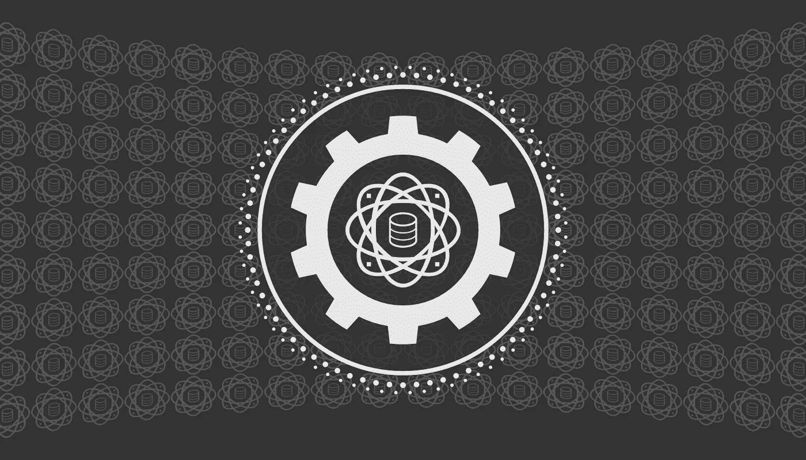

# 选择 MLOps 工具/基础设施时需要考虑什么

> 原文：<https://towardsdatascience.com/what-to-consider-when-selecting-mlops-tooling-infrastructure-88b0103a3171>

## 指导您的公司建立其 MLOps 生态系统时需要考虑的事项

作者创作的标题卡

AI/ML 社区中最近最热门的话题之一是采用 MLOps 作为最佳实践。挑战在于 MLOps 很难实现。作为一家大公司的机器学习工程师，我已经了解了许多不同的启用 MLOps 的选项，因为感觉每周至少有一家新供应商联系我，问我是否有兴趣测试他们的新 MLOps 启用工具。到目前为止，我还没有看到任何 AI/ML 社区达成共识，认为有一个特定的 MLOps 工具被认为是 MLOps 的“工具”。对 MLOps 工具没有普遍共识的部分原因是不同的公司有不同的需求，我见过的一些工具对某些人来说比其他人更好。

**这篇文章的目的是帮助你思考你自己公司的需求，以及你如何考虑 MLOps 工具和基础设施的高级方法**。因为我提到了不同的公司有不同的需求，所以你不会在这篇文章中看到强硬的回答。此外，您不会看到我推荐任何特定的工具或平台。这些考虑足够广泛，以至于我们谈论的是哪个工具或平台并不特别重要。

为了保持简单和结构化，我们将基于两个变量分析一组 4 个组合:MLOps 工具和 MLOps 基础设施。当我提到 MLOps 工具时，我指的是您将用来启用 MLOps 的实际工具，当我提到 MLOps 基础架构时，我指的基本上是运行 MLOps 工具的计算平台。为了得到这些东西的 4 个组合，我将工具和基础设施分成两个考虑事项:

*   **工具#1:供应商产品解决方案**:如果您选择使用外部供应商产品来帮助实现贵公司的 MLOps 需求，这将是参考。正如供应商产品通常所做的那样，他们试图抽象出许多挑战，这些挑战有望简化 MLOps 支持流程。
*   **工具#2:开源或定制解决方案**:与供应商生产解决方案相反的是选择使用开源或定制的、自主开发的解决方案。与供应商产品解决方案相比，它可能会为您的公司节省大量资金，但它也要求您的 MLOps 工程师在技术上有足够的能力来实现这样的事情。
*   **基础设施#1:云提供商**:如今，各种规模的公司使用云提供商来托管公司的 it 基础设施非常普遍。这些云提供商也有向特定领域提供特定服务的趋势，机器学习肯定也不例外。所有三大云提供商(AWS、谷歌云平台和微软 Azure)都有强大的机器学习支持选项。(但不是特别支持 MLOps，至少现在还不是。)
*   **基础设施#2:自我管理的环境**:鉴于云计算仍然相对较新，许多大型组织仍然维护自己的服务器群以满足其计算能力需求是很常见的。也就是说，公司利用这些环境托管 MLOps 解决方案的情况并不少见。

现在，我们已经概述了我们的选择，让我们进入组合的好处，以及谁可能是这些不同组合的最佳服务对象。

# 组合#1:云提供商的供应商产品解决方案

**好处**:假设一切顺利，这种组合应该为您的公司提供最有效的实现 MLOps 的方式。因为这里基本上没有什么本土的东西，你应该能够削减你的公司必须保留的员工数量。对产品和云基础设施的支持将来自这些公司。在一个完美的世界里，这应该是任何人的最佳选择…

挑战:好吧，正如你可能会说的，实际上我对上面提到的好处并不太有信心。如果你不小心，这可能是最昂贵的选择，抛开这个事实，你实际上是试图从两个不同的盒子里取出拼图块，并希望它们能组合在一起。有时他们可以，但我经常看到供应商产品解决方案并没有真正与云提供商很好地融合。如果你考虑到云提供商也寻求提供他们自己的机器学习服务，那感觉有点故意的。(顺便说一下，这纯属猜测。)此外，如果你的公司已经以利基的方式建立起来，你实际上是在试图将一个圆钉同时穿过一个正方形和三角形的孔！

**这是给**的:在你将在本帖中读到的所有四种组合中，我显然最纠结于谁最适合这个选项。我能想到的最接近的是**一家初创企业**，尤其是如果这家初创企业提供的产品不是 MLOps 本身。例如，如果我是一名数据科学家，有一个用人工智能以一种新的、前沿的方式预测天气的好主意，我可能不想处理所有的东西来实现 MLOps。鉴于初创公司没有更成熟公司的“包袱”，初创公司在确保供应商产品/云提供商组合能够很好地满足其需求方面有更大的灵活性。但这也可能成为一个代价高昂的解决方案，所以尽管我认为一家初创公司仍然可以从这种组合中找到价值，但他们必须非常小心地正确设置。

# 组合 2:基于自我管理基础设施的供应商产品解决方案

**好处**:如前所述，许多公司仍然管理自己的服务器场以满足计算需求，但这些公司中的许多人也是 AI/ML 的新手。此外，AI/ML 可能更多的是一种“附带利益”，而不是核心产品本身提供的价值。(通过“这是给谁的”一节中的示例，这一点会更清楚。)像这样的公司可能有兴趣雇用一些数据科学家，但他们可能希望最大限度地减少实现 MLOps 所需的人才。鉴于这些因素，供应商产品工具可能是弥合使用您自己的计算基础架构和不必维护您自己的 MLOps 支持团队之间差距的最佳解决方案。

挑战:任何厂商的产品都会带来挑战，那就是确保贵公司的产品能够与工具正确集成。这里的挑战没有“云提供商上的供应商产品”选项那么大，但它仍然存在。任何供应商产品带来的另一个挑战是，它可能无法 100%地完成您希望完成的任务，尤其是在 MLOps 方面，我个人还没有见过任何供应商产品能够 100%地完成我希望它完成的任务。也就是说，您可能不得不购买多个供应商的产品来真正获得您需要的一切，或者您可能不得不围绕供应商的产品构建一些较小的定制解决方案来使其工作。

**这是为谁准备的**:最有可能从这种选择中受益的群体是**，一家大型公司，其核心产品不是 AI/ML，但已经维护了自己的计算平台**。我想象这里有一个像麦当劳一样的大型快餐公司。(我对麦当劳的内部运作没有内幕消息，所以以下纯属猜测。)我想麦当劳可能会维护自己的服务器群，以支持所有餐厅的收银机操作。归根结底，麦当劳的核心产品是食物，尽管人工智能/人工智能可以在某些方面有所帮助，但我无法想象麦当劳会想雇佣一群强大的人工智能/人工智能专家来为他们维持人工智能运营。(再说一次，我对麦当劳一无所知，所以我可能会大错特错。)

# 组合#3:云提供商上的开源/定制解决方案

**优势**:假设您在自己的内部服务器平台上已经有了一个很好的 MLOps 解决方案，但是您的公司决定在未来减少物理空间。云提供商提供出色的解决方案，帮助您相对轻松地迁移您的定制 MLOps 解决方案。此外，云提供商本身提供许多机器学习服务，经验丰富的 MLOps 工程师可以轻松利用这些服务。

**挑战**:就像很难将供应商产品集成到自我管理的基础设施上一样，将定制的 MLOps 解决方案移植到云提供商上也同样困难。MLOps 工程师可能可以灵活地让维护自己平台的基础架构工程师实现非常具体的事情，而云提供商则没有这么灵活。这并不意味着云提供商完全僵化；这不像处理完全可塑的东西那么容易。

**这是给谁的**:这个选项绝对最适合拥有强大的 MLOps 工程师但希望减少其物理计算基础架构的**公司**。虽然维护您自己的基础架构有很多好处，但也有很多相关的挑战。撇开维护服务器本身的更明显的挑战不谈，对于纯会计来说，还有一个更微妙的挑战。正如公司摊销建筑物或车辆之类的东西一样，许多公司也摊销他们的 IT 基础设施组件。单单这个会计结构就可能是一个巨大的挑战，所以如果您发现您的 MLOps 工具需要的 GPU 比您公司现有的更多，会计结构可能会阻止您及时获得这些 GPU。

# 组合#4:自我管理基础设施上的开源/定制解决方案

**好处**:在之前的组合中，我们谈到了在供应商产品和云提供商之间使用刚性结构的挑战。因为这个选项基本上让您可以完全控制您的 MLOps 系统，所以您可以自由和灵活地做任何您想做的事情。在您的公司拥有强大的 MLOps 工程团队和自己的计算平台的世界中，这种灵活性可能是一个梦想。

**挑战**:当然，这是一种“天上掉馅饼”的组合。虽然这种组合提供了很大的灵活性，但它也把所有的责任都推给了你自己的人。这意味着您必须拥有一支强大的 MLOps 工程师团队和同样强大的计算基础设施。仅从人力资源的角度来看，这自然意味着你需要雇佣最强的人才，这显然会非常昂贵。

**这是谁的**:自然，大多数公司都无法利用这一选项，但有一个小众群体可以(并且确实)从中受益:**人工智能发电站**。我特别指的是苹果、谷歌或亚马逊这样的公司。这些人工智能巨头已经在雇用最优秀和最聪明的人，因为他们维护自己的服务器生态系统，让他们聪明的工程师在自我管理的基础设施上构建定制解决方案自然是最有意义的。

这篇文章到此结束！我希望您能够更好地理解贵公司在选择如何启用 MLOps 时应该考虑的事项。随着供应商产品继续变得更好，云提供商继续推出新的机器学习解决方案，这一领域将如何演变，这将是一件有趣的事情。取决于这些事情如何发展，这些组合中的一个可能会对你的公司更有吸引力。在这个领域工作真是太棒了！感谢您的阅读，我会在下一篇文章中与您联系。😃