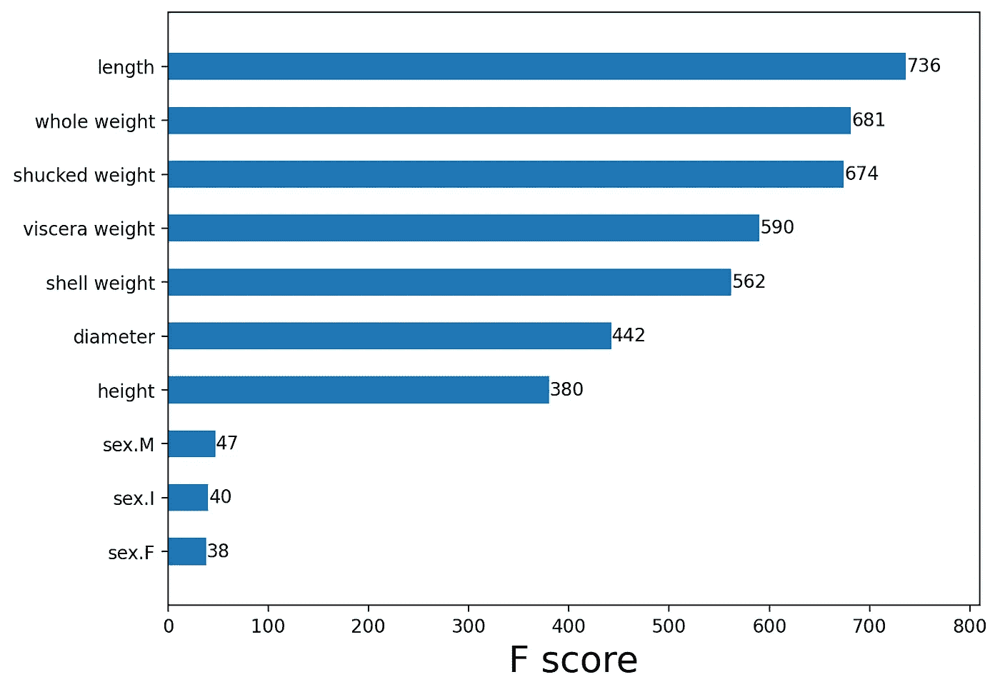
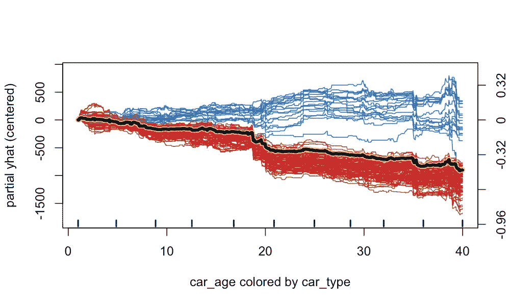

# 我们能从黑盒模型中学到什么

> 原文：<https://towardsdatascience.com/what-we-can-learn-from-black-box-models-eda3677c42f2>

## 使用非线性模型的数据探索和知识生成

(来源: [flaticon](https://www.flaticon.com/premium-icon/study_3212202) )

黑盒模型可以自动模拟复杂的关系。与线性模型相比，捕捉数据中的这些趋势可以提高它们的准确性。

然而，准确性只是好处之一。

我们可以分析这些模型，了解它们是如何做出这些预测的。这可以揭示我们数据集中的潜在关系。在某些情况下，这些对我们来说可能是全新的。这就是机器学习如何成为***数据探索******知识生成*** 的工具。

此外，提供**感觉检查**帮助调试模型。这些知识可以用来

*   通知**特征工程**非线性模型。
*   在**做出超越模型的决策**时提供帮助。

我们将讨论如何从黑盒模型中学习。这包括理解数据中的**重要关系**以及这些关系的**本质。**

# 为什么我们可以从非线性模型中学习？

在我们深入探讨之前，让我们先讨论一下 ***为什么*** 我们可以从这些模型中学习。非线性模型可以模拟数据中的非线性关系和相互作用。就拿**图一**中的二手车价格散点图来说吧。汽车**价格**并不总是随着**年龄**而降低。对于老爷车(classic = 1)，它增加。我们说在我们的数据中有一个相互作用。价格和年龄的关系取决于第三个特征——**经典**。

图 1:交互的例子(来源:作者)

非线性模型可以自动模拟这样的关系。让我们以**图 2** 中的简单决策树为例。汽车首先被分为普通(0)和经典(1)。正常车，车龄 15 年以下的价格更高。对于老爷车来说，更低。这并没有完全抓住我们在图 1 中看到的关系。要做到这一点，我们可以给决策树增加更多的层次。我们也可以使用更复杂的算法，如随机森林、XGBoost 或神经网络。

图 2:交互的决策树模型(来源:作者)

当我们谈论数据探索/知识生成时，我们通常会依赖这些更复杂的算法。它们有时被称为可解释模型或黑盒模型。他们能够捕捉数据中复杂的关系。同时，我们不需要“告诉”他们这些关系的存在。像决策树一样，我们可以只给他们经典和年龄特征。在进行预测时，模型将自动利用特征之间的相互作用。

相比之下，线性模型(即线性和逻辑回归)不太复杂。为了捕捉这些模型的非线性关系，我们需要做[特征工程](/the-power-of-feature-engineering-b6f3bb7de39c#:~:text=We%20explained%20above%20how%20feature,performance%20to%20non%2Dlinear%20models.)。使用新特性，我们可以将非线性关系表示为线性关系。为了了解要创建什么特征，我们需要研究我们的数据。我们可能还需要相关领域的领域知识。

从某种意义上来说，黑盒模型在模型的结构中进行这种特征工程。他们非常擅长在数据中寻找模式。问题在于这些模型的内部运作过于复杂。我们无法理解他们如何通过单独查看模型参数/结构来做出预测。我们需要使用额外的技术来理解它们是如何工作的。

# 我们能学什么，怎么学？

这就是可解释机器学习(IML)领域的用武之地。除其他外，它旨在开发我们可以用来理解黑盒模型如何做出预测的方法。我们讨论了其中的一些技术，以及它们在模型/数据方面能教给我们什么。

## 提供一个基准

首先，黑盒模型可以提供的一条有价值的信息是基准。通过捕捉非线性关系和相互作用，这些模型可以提高预测的准确性。为了确定性能，我们实际上不需要 IML 方法。我们可以依赖准确度、精密度或回忆等指标，或者 ROC 曲线等可视化指标。

使用黑盒模型可以告诉我们预测目标变量的能力有多强。我们可以将这些结果与不太复杂的线性模型的性能进行比较。假设，我们发现黑盒模型要精确得多。这告诉我们，线性模型在我们的数据中遗漏了重要的关系。此时，我们可以用 IML 方法来理解那些关系是什么。

## 重要的关系

首先，我们可以了解数据中哪些特征是重要的。这些是可用于预测目标变量的特征。大多数非线性模型能够处理大量特征(超过 50 个)。这些特征是否高度相关也无关紧要。这意味着，通过使用非线性模型，我们可以理解大量特征的重要性。相比之下，像线性回归这样的模型需要一个较小的不相关特征集(8-10)。

我们可以使用的一个度量是**排列特征重要性**。在图 3 中，您可以看到用于预测鲍鱼年龄的 xgboost 模型的分数。我们可以看到鲍鱼壳的长度在预测年龄时很重要。接下来的三个特征基于鲍鱼的重量。虽然这些特征高度相关，但是它们没有对模型产生负面影响。我们可以理解，所有这些特征都可以用来预测年龄。

图 3:特性重要性分数的例子(来源:作者)

如果我们使用相关性来识别重要的关系，我们可能会错过其中的一些特征。这是因为相关性仅给出线性关联的度量。换句话说，这种方法只能突出显示具有显著线性关系的要素。相比之下，特征重要性告诉我们一个特征对模型的预测有多重要。模型的预测能力可能来自相互作用和非线性关系。这些将反映在特征重要性分数中。

[SHAP 值](/introduction-to-shap-with-python-d27edc23c454)可以提供一个替代的衡量标准。我们可以使用这些来找到每个特征的**绝对平均 SHAP 值**。与要素重要性类似，这可以判断哪些要素对预测的贡献较大。这两种方法的问题在于，它们没有告诉我们模型所捕捉的关系的性质。

## 非线性关系

如果某个特征与目标变量有某种关系，则该特征可用于进行预测。它可以是线性的，也可以是图 4 中**所示的非线性关系之一。为了找到并可视化黑盒模型捕捉到的非线性关系，我们可以使用其他 IML 方法。**

图 4:非线性关系的例子(来源:作者)

可视化的例子有 [**部分相关图** (PDP)](/the-ultimate-guide-to-pdps-and-ice-plots-4182885662aa) 和**累积局部效应** (ALE)图。这两种方法都显示了要素和模型预测之间的一般关系。PDP 易于理解，但会受到功能依赖性的负面影响。ALE 图没有这个问题，但它们更复杂，更难解释。

另一种方法是使用 [SHAP 值](/introduction-to-shap-with-python-d27edc23c454)。上面我们提到了这些。对于给定的预测，它们给出每个特征对该预测的贡献。我们可以绘制 SHAP 值对特征值的曲线图。这就是所谓的**依赖图**。它可以向我们展示某个特性的值与其对预测的贡献之间的关系。

我们将在下面的文章中讨论这些以及更多的方法。第一篇更深入地介绍了如何**发现并可视化非线性关系**。第二部分关注 **SHAP 值**和用于应用它们的 **Python 代码**。我们还会查看这些值的不同**聚合**。这些包括上面提到的平均 SHAP 和依赖图。

    

## 相互作用

互动实际上被认为是一种非线性关系。它们相对于一个特征是非线性的。这些特征关系将取决于第三个特征的值。事实上，交互可以更加复杂。一个特征的关系可能取决于两个或多个特征的值。对于大多数应用程序，我们只关心两个特征之间的那些。

一种可视化互动的方法是 [**冰图**](/the-ultimate-guide-to-pdps-and-ice-plots-4182885662aa) 。你可以在**图 5** 中看到一个例子。这里，数据集中的每个观察值都用一条线表示。该数据集包含二手车销售的详细信息(例如，价格、车龄和车型)。对于每个观察值，该线显示预测价格(部分 yhat)如何随车龄变化。黄色粗体是我们上面讨论的 PDP 的一个例子。它给出了所有单个预测线的平均值。

图 5:冰图示例(来源:作者)

我们根据汽车类型给上面的线条涂上颜色。蓝色代表老爷车，红色代表普通车。你可以看到老爷车的关系偏离了平均趋势。直觉上，经典作品的价格会随着年代增长是有道理的。冰图告诉我们，车龄和价格的关系取决于车的类型。换句话说，车龄和车型是有交互作用的。

另一种方法是使用 [**SHAP 交互值**](/analysing-interactions-with-shap-8c4a2bc11c2a) 。这些是 SHAP 值的扩展，其中考虑了主效应和交互效应。我们可以用这些来可视化互动。我们还可以计算**平均绝对相互作用效应**来突出重要的相互作用。这类似于特征重要性分数，但用于交互。另一个用来强调互动的指标是弗里德曼的 h 统计量。

同样，我们将在下面的文章中更深入地讨论所有这些方法。第一篇深入探讨了如何**发现和可视化交互**。第二种侧重于使用 **SHAP 来分析相互作用。**我们还讨论了用于应用该方法的 **Python 代码**。

    

# 我们能用这些知识做什么？

所有这些 IML 方法都可以帮助我们理解模型是如何做出预测的。一个直接的好处是，它们可以帮助我们对模型进行感官检查。我们可以使用领域知识将模型捕获的关系与我们预期的关系进行比较。这些方法还允许我们向客户或同事解释我们的模型。

在本节中，我们将集中讨论间接好处。通过理解模型，我们了解了数据中的潜在关系。我们可以利用这些知识来改进线性模型，或者做出超越模型的决策。

## 改进线性模型

我们提到黑盒模型可以提供一个基准。它们可能优于线性模型，但这并不意味着这些模型的终结。这是因为我们可以使用我们获得的知识来通知我们的特征工程。我们可以创建新的特性来提高线性模型的性能。

例如，假设我们想使用线性回归对一辆二手车的价格建模。使用 PDP，我们发现价格与车龄成二次关系。同样，使用 ICE 图，我们发现了车龄和车型之间的相互作用。我们可以通过向数据集添加新要素来捕捉这些非线性关系。

具体来说，在下面的等式中，我们添加了**年龄**和交互项**年龄*经典**。其中 classic = 1 代表老爷车，否则为 0。

y =β₀+β₁(age)+β₂(age)+β₃(age*classic)+β₄(classic)

y =β₀+β₁(age)+β₂(age_sqrd)+β₃(age_classic_int)+β₄(classic)

在第一个方程中，Y 由两个特征的非线性方程建模——年龄和经典。现在，它是由四个特征的线性方程模拟的。特征工程甚至可以帮助简单的非线性模型，如决策树。最终，它允许我们用简单的模型捕捉复杂的关系。我们将在下面的文章中更实际地演示这个过程。

  

问题是我们为什么要这么做？非线性模型同样准确。那么，为什么不使用它们，避免额外的功能工程的麻烦呢？这是因为拥有一个简单的模型会给 T4 带来很多好处。首先，在许多行业中，对你可以使用的模型类型都有规定。也就是说，你可能需要在银行和保险等行业使用线性模型。

即使没有规定，你也可能更喜欢线性模型。黑盒模型很复杂。即使使用 IML 方法，我们也不能 100%确定它们是如何工作的。这可能会在它们投入生产时带来惊喜。相比之下，回归和决策树在本质上是可解释的。我们可以通过直接观察它们的参数来理解它们是如何工作的。这增加了它们在野外行为的确定性。

## 支持决策

模型用于自动化决策。有了 IML，他们的影响不再仅限于这些决定。我们获得的知识可以在更广泛的组织中为决策提供信息。以前不为人知的关系可以提供巨大的价值。例如，我们探索的交互告诉我们，老爷车会随着年龄增长而涨价。这可能会影响投资老爷车的策略。

也就是说，我们应该避免过于复杂的解决方案。对于数据科学家来说，使用数据来为决策提供信息并不新鲜。我们有许多技术和工具可以用来帮助探索数据。大多数都比使用黑盒模型简单得多。不利的一面是他们确实需要一些指导。我们需要知道我们想在数据中找到什么。有了 IML 方法，黑盒模型可以为我们找到新的重要模式。

我希望这篇文章对你有帮助！如果你想看更多，你可以成为我的 [**推荐会员**](https://conorosullyds.medium.com/membership) **来支持我。你可以访问 medium 上的所有文章，我可以得到你的部分费用。**

  

你可以在推特上找到我

## 图像来源

所有图片都是我自己的或从[www.flaticon.com](http://www.flaticon.com/)获得。在后者的情况下，我拥有他们的[保费计划](https://support.flaticon.com/hc/en-us/articles/202798201-What-are-Flaticon-Premium-licenses-)中定义的“完全许可”。

## 参考

C.Molnar，**可解释机器学习***(2021)[https://christophm . github . io/Interpretable-ml-book/shap . html](https://christophm.github.io/interpretable-ml-book/shap.html)*

*南用 Python 进行可解释的机器学习 (2021)*