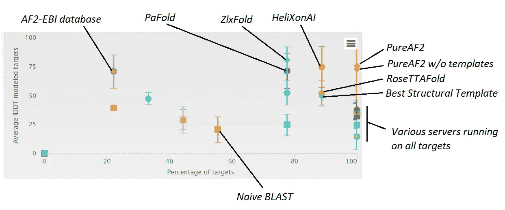

# 蛋白质结构预测的 ML 上的 AlphaFold 之后是什么？CAMEO 和下一个 CASP 的自动滚动评估

> 原文：<https://towardsdatascience.com/whats-up-after-alphafold-on-ml-for-structural-biology-7bb9758925b8>

## 人工智能驱动的生物学革命会持续下去吗？我们能期待新的突破吗？蛋白质结构预测领域目前正在发生什么？

**如果你对客串的滚动评价特别感兴趣，了解蛋白质结构预测的现状，** [**点击这里**](#4603) **。**

**如果你想了解即将到来的 CASP15，AlphaFold 如何改变它的重点，以及它的新挑战，** [**点击这里**](#793e) **。**

# 介绍

AlphaFold 2 是由谷歌 Deepmind 开发的基于人工智能的程序，旨在解决预测蛋白质结构的问题，它在 2020 年末取得了成功，当时它“赢得了”第 14 届两年一次的蛋白质结构预测“竞赛”,该竞赛名为 CASP(结构预测的关键评估)。半年后，Deepmind 在《自然》*杂志上发表了一篇经过同行评审的文章，描述了 AlphaFold 2 的工作原理，并在 GitHub 上公开发布了它的代码，作为人人都可以使用的 Google Colab 笔记本。随着科学家们开发出更好的笔记本，以及他们发现 AlphaFold 拥有的许多应用程序，甚至超过了它的最初目标，宣传越来越多。当 Deepmind 发布新版本的 AlphaFold 时，这种炒作变得更加严重，该版本更适合对多个蛋白质相互作用时产生的复合物进行建模。然后当 Deepmind 与欧洲生物信息学研究所联手发布所有已知蛋白质的 3D 模型数据库时。甚至更进一步，当科学家破解 AlphaFold 以反向使用它，从而设计出可以根据需要折叠以实现特定功能的蛋白质时。可能比我想的还要多。*

这里有几篇文章，我在其中介绍了 AlphaFold 2、可用于运行它的笔记本，以及它在生物学研究中开辟的许多积极的道路:

      

## 现在，怎么了？

在 2020 年末和 2021 年年中，对 AlphaFold 的兴趣出现了非常强烈的峰值，第二个峰值甚至在几个月后也没有下降到 0。相反，我们可以看到一个稳定的基线，可能由许多仍在研究 AlphaFold 以及如何将其应用于问题的生物学家维持:

对从 Google Trends 检索到的关键字“AlphaFold”的兴趣。作者卢西亚诺·阿布利亚塔拍摄的这张照片和其他照片。

**但是……**

**兴趣会不会出现新的高峰，体现新的突破？**

**目前在结构预测领域进展如何？**

# 蛋白质结构预测的新一轮竞赛

关于第一个问题，我认为我们可以期待一个新的峰值兴趣，尽管不一定是突破，因为新的常设问题的复杂性更高，也因为蛋白质数据库中可供人工智能方法利用的数据更少。但是，让我们看看第 15 章是怎么说的！

CASP 刚刚宣布了它的下一版，第 15 版，因此接近 30 年的蛋白质结构预测评估(CASP1 自 1994 年以来不间断地每两年进行一次)。在最新一轮的 CASP14 中，来自世界各地的近 100 个团体提交了 84 个建模目标的 67，000 多个模型。与每个 CASP 一样，独立的评估人员将模型与实验确定的各种结构进行比较，其中确定硬靶的三级结构(即没有太多来自类似蛋白质的结构信息)是最重要的一个。(或者我们应该说“曾经”，因为 AlphaFold 2 解决了这个问题？)虽然你可以在我以前的文章中了解更多关于 CASP14 和 AlphaFold 2 的信息(当 AlphaFold 出现时，我是 CASP12 和 CASP13 的评估员，所以我知道所有这些第一手资料！)，我想在这里强调一下 CASP 主办方对 CASP15 的期待。

正如我刚才暗示的那样，焦点很可能会转移到四级结构的预测上，即多个蛋白质在相互作用时如何在 3D 空间折叠在一起。CASP 的官方网站([https://predictioncenter.org/casp15/index.cgi](https://predictioncenter.org/casp15/index.cgi))明确表示，CASP 的核心保持不变:对实验结构进行独立评估的方法进行盲测，以建立蛋白质和蛋白质复合物建模的最先进技术。但更详细地说，该网站还揭示了评估轨道的一些变化。

首先，三级结构预测将不再被分为容易和困难的目标，这是有意义的，因为突然之间所有的三级结构预测都变得相对容易了。不仅是因为 AlphaFold，还因为其他新工具开发了类似 AlphaFold 的方法和其他新方法，例如来自经典 CASP 领导者之一的 RoseTTAFold。

相比之下，CASP15 将强调模型的细粒度准确性，并将密切关注四级结构的预测，即由多个蛋白质一起形成的复合物的预测。虽然α折叠多聚体大大改善了这一点，但这还不如三级结构预测可靠。我们还将更加重视准确性评估，这是我们在 CASP13 评估中预期的 AlphaFold 预测的一个关键特征。

CASP15 会去掉一些不再有太大意义的类别。但它将保持对蛋白质复合物的准确性估计，其中预测者必须对由他人建模的蛋白质-蛋白质复合物模型进行排序。

由于三级结构预测已经确定，四级结构预测也取得了很大进展，CASP15 首次计划用 3 个有趣的案例进行实验，这些案例构成了预测结构生物学的下一个前沿:与 RNA 专家合作，评估 RNA 分子和蛋白质-RNA 复合物的建模；模拟蛋白质和小分子之间的复合物，这是制药的核心，因为大多数临床相关分子通过与蛋白质结合来发挥作用；预测构象集合，即解释蛋白质如何在溶液中运动的多个模型，这一点至关重要，因为迄今为止 CASP 一直专注于蛋白质的静态快照，但实际上是非常动态的。

# 自从 CASP14 和 AlphaFold 之后发生了什么？来自 CAMEO 的见解，蛋白质结构预测的滚动评估

虽然远不如 CASP 受欢迎，但这也是一个非常有趣的比赛。这是自动发生的，所以没有太多的专家指导和分析。但是它总是向所有人开放，让大家探索蛋白质结构预测方法的最新信息。

名字叫 CAMEO，代表连续自动化模型评估。你可以访问它的主页:

  

CAMEO 是一个社区项目，由瑞士 T2 生物信息研究所的计算结构生物学小组和巴塞尔大学的 T4 生物中心共同支持，由这些机构和欧盟资助。CAMEO 不断将由蛋白质结构预测社区建立的质量评估标准应用于由一组列出的服务器产生的 3D 模型。它提供各种分数，评估预测的不同方面，如查询序列的覆盖范围、局部准确性、完整性等。

到目前为止，大多数参与 CASP 的团体也将他们的服务器绑定到 CAMEO。此外，CAMEO 为所有目标产生天真的 AlphaFold 2 预测。你猜对了，它几乎总是在顶部！甚至在它的代码和论文正式发布近 1 年后的今天，这意味着即使是在它之后开发的方法也无法通过它。虽然你可能会认为这是因为预测的准确性实际上是有限的，AlphaFold 已经尽可能好了，但 CAMEO 的数据显示，事实上许多工具，甚至是新工具，都没有达到它的水平。

您可以在带有交互式图表的专用页面上亲自查看评估数据，在该页面上，您可以选择查看所有服务器或特定服务器在不同时间段内的简单、困难或中等目标的结果。以下是截至 2022 年 4 月 16 日的过去 3 个月中所有团队的硬性目标:

所有服务器的硬目标建模的最后 3 个月。直达链接截止 2022 年 4 月 16 日:[https://www.cameo3d.org/modeling/3-months/difficulty/hard/?to_date=2022-04-16](https://www.cameo3d.org/modeling/3-months/difficulty/hard/?to_date=2022-04-16)

如右图所示，3 个月的分析包括 9 个硬性目标。左边的图描绘了每个组提交的所有模型的平均 LDDT 与他们实际提交模型的目标的比例。

现在让我放大并添加一些注释，以便更详细地讨论:

在图中，我标记了一些关键名称和执行者，并且还突出显示了为所有靶贡献预测但表现不佳的各种服务器(右下)，人们将通过简单地用最佳序列匹配(“Naive BLAST”)对 PDB 结构的 PDB 进行 BLAST 而获得的天真预测，这是事实上可用的最佳结构模板，即使它可能无法通过 BLAST 搜索检索，从 AF2-EBI 数据库中检索的模型是正确的(该数据库仅覆盖某些蛋白质组，因此覆盖了靶的低部分)。

作为关键的名字和演员，你会在右上角发现纯粹的 AF2 预测，这是你想去的地方。注意，在运行 AF2 时，有没有模板并没有实质性的区别，正如已经记录的那样。还要注意的是，偏差棒对它来说是非常重要的，这意味着 AF2 不能预测一些非常好的结构(而且对于一些目标来说，预测是极好的)。还要注意 RoseTTAFold(被认为是 AF2 最接近的竞争对手)的平均得分较低，甚至没有模拟所有目标(没有给出原因，但不一定意味着该程序不能处理它们)。最后，还有 3 种方法表现相当好，甚至比 RoseTTAFold 更好，尽管不是对所有目标都是如此:PaFold、ZlxFold 和 HelixOnAI，它们显然都是新的。

这些来自 CAMEO 的数据似乎表明竞争相当激烈，但只针对亚军，因为 AF2 似乎仍然是最好的。虽然惊喜总是会出现，就像 AF 自己在 CASP13 中首次亮相一样。此外，如上所述，CASP15 将关注细节、四级结构、配体和动力学，因此可能会有新的惊喜。谁知道从谁那里。

## 以下是我所有关于 AlphaFold、CASP 和蛋白质建模的文章和同行评议论文的总结

  

有关于蛋白质建模、生物信息学、蛋白质设计、分子建模或蛋白质生物技术的工作给我吗？[这里联系我](https://lucianoabriata.altervista.org/office/contact.html)！

www.lucianoabriata.com*我写作并拍摄我广泛兴趣范围内的一切事物:自然、科学、技术、编程等等。* [***成为媒介会员***](https://lucianosphere.medium.com/membership) *访问其所有故事(我免费获得小额收入的平台的附属链接)和* [***订阅获取我的新故事***](https://lucianosphere.medium.com/subscribe) ***通过电子邮件*** *。到* ***咨询关于小职位*** *查看我的* [***服务页面这里***](https://lucianoabriata.altervista.org/services/index.html) *。你可以* [***这里联系我***](https://lucianoabriata.altervista.org/office/contact.html) ***。***