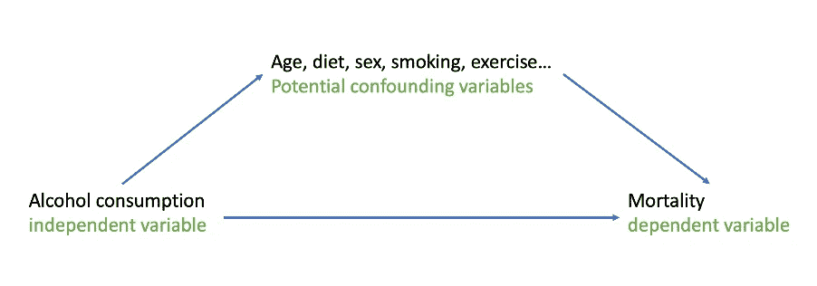
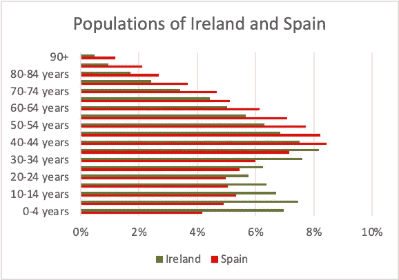
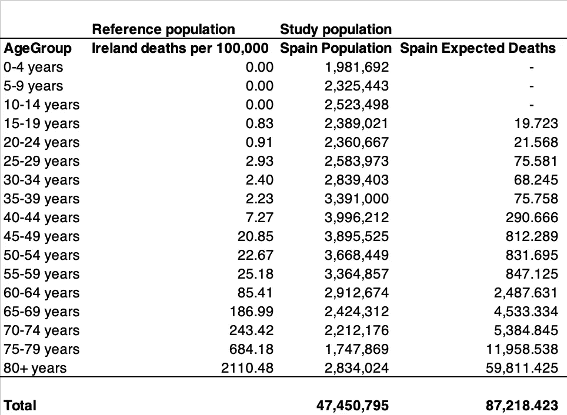
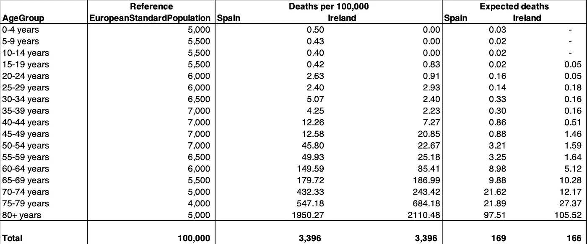
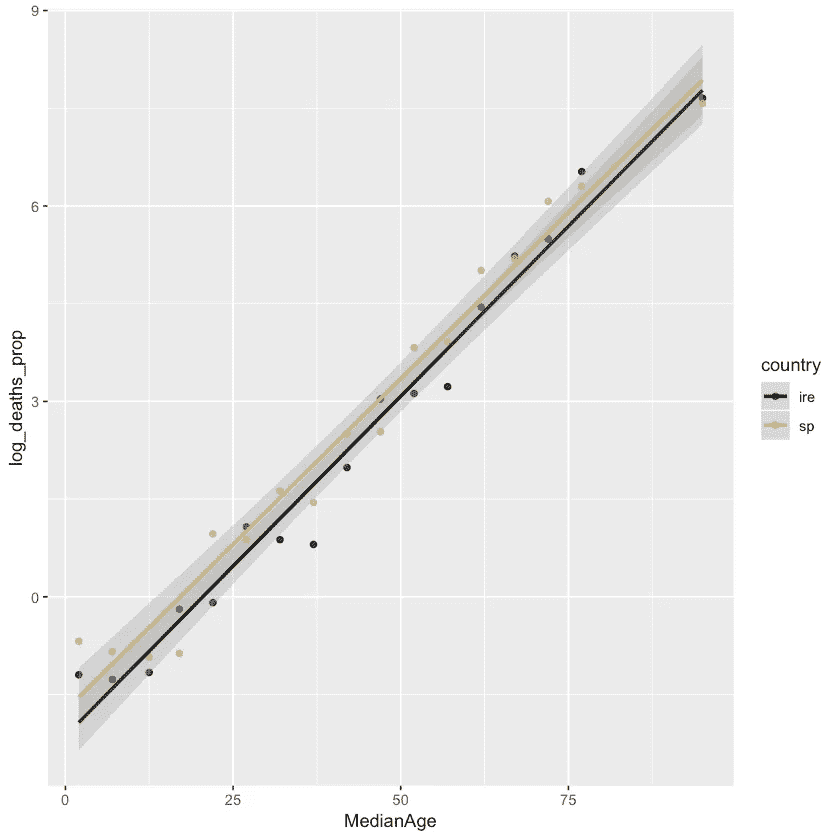

# 比较比率时，要小心混淆效应

> 原文：<https://towardsdatascience.com/when-comparing-rates-beware-of-confounding-effects-44ebd097356f>


Niklas Ohlrogge 在 [Unsplash](https://unsplash.com?utm_source=medium&utm_medium=referral) 上拍摄的照片

通常，我们使用包含代表比率的变量的数据集，我们使用这些变量在组之间进行比较或作为模型中的因素。为了使这些比较更有意义或更准确，我们需要校正这些比率中可能的混杂效应，并使用调整后的比率。

**什么是混杂？**

混杂是指自变量和因变量之间的关系受到一个或几个其他变量的影响。例如，如果我们想比较两组人的死亡率:一组饮酒量低，另一组饮酒量高，我们需要确保其他因素不会对结果产生大的影响。如果我们的低度消费者都是老年人和电视迷，而我们的重度饮酒者都年轻健康，从这项研究中得出结论可能会很复杂。



混淆的例子(图片由作者提供)

另一个例子是当比较国家之间的新冠肺炎死亡率时。撇开计算 Covid 死亡的不同标准的问题和关于 Covid 死亡或与 Covid 有关的问题，我们可以想知道各国是否有比其他国家更好的策略。让我们以西班牙和爱尔兰为例。在本文中，我们将使用基于略微不同的时间框架的官方数据，只是为了展示标准化的技术，而不是得出一个明确的结论。西班牙通常被认为是欧盟中受影响最大的国家之一，爱尔兰因其新冠肺炎管理而受到称赞。我们发现西班牙和爱尔兰的数字如下:爱尔兰每百万居民死亡 1145.32 人，西班牙每百万居民死亡 1885.95 人，高出 65%！这些价格被称为**原油价格**。但是西班牙和爱尔兰的人口结构非常不同，如下图所示。西班牙是一个更老的国家，平均年龄为 44.9 岁，而爱尔兰的平均年龄为 38.2 岁。



比较爱尔兰和西班牙的人口(图片由作者提供)

那么，如何才能做到“控龄”呢？主要有两种方法，间接法和直接法。

**间接法**

对于间接法，我们使用参考人群(例如爱尔兰人群)按年龄细分的比率，并根据爱尔兰的比率计算研究人群(在本例中为西班牙)的预期值。然后我们可以计算 SMR(标准化死亡率):


让我们来看一个例子，在下面的表格中，我们看到了爱尔兰按年龄分类的死亡率(大约，因为两国官方统计的年龄分类不同)。然后，我们简单地将爱尔兰每个年龄组的比率应用于西班牙人口，如表 1 所示。



表 1:以爱尔兰为参考人群的间接方法(按作者分类)

因此，SMR 是观察到的死亡总人数(87，905)除以将爱尔兰比率应用于西班牙人口后的预期死亡人数(87，218)，87，905/87，218 = 1.01。如果年龄分布相似，这两个国家会有相似的表现。

我们也可以计算 SMR 的置信区间，可以使用各种方法(见乌尔姆，1990)或在线计算器，使用范登布鲁克近似:[https://www.openepi.com/SMR/SMR.htm](https://www.openepi.com/SMR/SMR.htm)

**直接法**

对于直接法，我们使用一个标准的参考群体。它可以是任何人群，这并不重要。在欧洲，统计学家经常使用欧洲标准人口(ESP)，理论人口加起来有 10 万。

因此，我们将西班牙和爱尔兰的年龄组比率投射到 ESP 上，以获得预期比率。如果这两个国家的年龄结构与 ESP 相同，则这些比率称为年龄标准化比率(ASR)。然后我们可以比较这个假想总体的两个比率:绝对差、百分比差或比率。

下面我们可以看到，西班牙的死亡率是每 100，000 人中有 169 人死亡，爱尔兰是 166 人死亡，这也是与我们的粗略死亡率非常不同的结果。



表 2:直接法，以欧洲标准人口作为参考人口(作者提供的表格)

然后可以将这两个比率添加到我们的数据集中，以建立更准确的模型。

如果我们的数据集只包含原始费率，我们可能需要使用单独的数据集来进行这些修正，并添加调整后的费率/

**那么安科瓦和回归呢？**

如果我们使用年龄作为变量之一运行 ANCOVA 或回归模型，我们会得到类似的结果吗？如果我们看一下每个年龄组每 100，000 人死亡率的对数图，我们会看到西班牙的数字略高(黄线):



对数(每 100，000 人的死亡率)与平均年龄，按国家分类(图片由作者提供)

但是在运行一个回归后，我们可以看到，只有变量年龄和变量国家没有统计学意义(p 值:0.2)。年龄和国家之间也没有任何互动。

```
Call:lm(formula = log_deaths_prop ~ MedianAge + country + MedianAge *country, data = covid)Residuals:Min 1Q Median 3Q Max-0.9192 -0.3084 0.1060 0.2702 0.8555Coefficients:Estimate Std. Error t value Pr(>|t|)(Intercept) -2.138301 0.213343 -10.023 4.34e-11 ***MedianAge 0.104358 0.004267 24.458 < 2e-16 ***countrysp 0.395764 0.301712 1.312 0.200MedianAge:countrysp -0.002458 0.006034 -0.407 0.687— -Signif. codes: 0 ‘***’ 0.001 ‘**’ 0.01 ‘*’ 0.05 ‘.’ 0.1 ‘ ’ 1Residual standard error: 0.4549 on 30 degrees of freedomMultiple R-squared: 0.975, Adjusted R-squared: 0.9725F-statistic: 390.7 on 3 and 30 DF, p-value: < 2.2e-16
```

**结论**

我们看到，当比较数据集中任何类型的比率时，我们需要小心并控制潜在的混杂因素，使用调整或标准化的比率会对任何模型产生很大影响。这可能发生在许多实例和领域中:在在线营销中，我们可能会看到 CTR(点击率)或转换率因设备类型(例如移动设备与笔记本电脑)或一天中的时间而异，优化时需要针对这些因素进行调整。

**来源和附加链接**

[https://dc-covid.site.ined.fr/en/data/spain/](https://dc-covid.site.ined.fr/en/data/spain/)

[https://data.cso.ie/](https://data.cso.ie/)

[https://es . statista . com/estadisticas/1125974/新冠肺炎-波森塔耶-德-法勒西米恩托斯-波尔-埃达德-y-genero-en-espana/](https://es.statista.com/estadisticas/1125974/covid-19-porcentaje-de-fallecimientos-por-edad-y-genero-en-espana/)

[https://www . isd Scotland . org/products-and-services/GPD-support/population/standard-populations/#:~:text = The % 20 European % 20 standard % 20 population % 20(ESP，is % 20 originally % 20 introduced % 20 in % 201976](https://www.isdscotland.org/products-and-services/gpd-support/population/standard-populations/#:~:text=The%20European%20Standard%20Population%20(ESP,was%20originally%20introduced%20in%201976)

[https://ourworldindata . org/grapher/covid-deaths-daily-vs . total-per-million](https://ourworldindata.org/grapher/covid-deaths-daily-vs-total-per-million)

计算标准化死亡率置信区间的简单方法。美国流行病学杂志 1990；131(2):373–375。