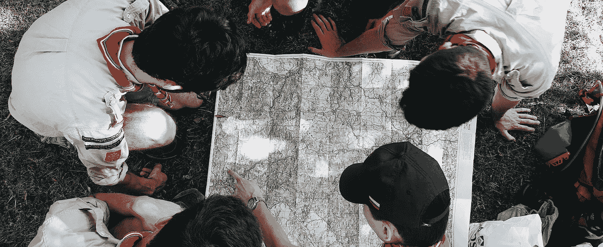
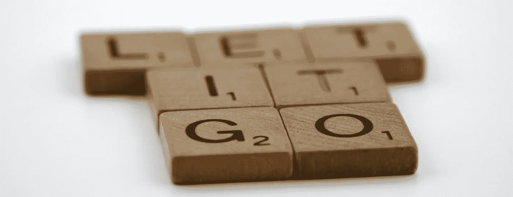

# 什么时候放弃是有成效的

> 原文：<https://towardsdatascience.com/when-giving-up-is-productive-5a9b1189ea2c>

## 识别失败的数据科学项目的信号

布雷特·乔丹在 [Unsplash](https://unsplash.com/s/photos/fail?utm_source=unsplash&utm_medium=referral&utm_content=creditCopyText) 上的照片

*顽强地攻克每一个难题，但不要对明显的失败视而不见。*

数据科学充满了左转和死胡同。这是好奇心的副产品，为了回答那些不太了解的问题，我们不得不遵循这种好奇心。我发现大多数数据科学家在遇到他们不知道答案的问题时都会感到兴奋。通常找到这个答案会带来非凡的东西，或者至少教会你一些你以前不知道的东西。问题是，要知道在荒野深处用弯刀导航和承认自己迷路之间的区别，是时候呼叫空运出森林了。

# 重点不是寻求失败——而是快速失败

我们从不承担一个认为行不通的项目。你可能会接受一些具有挑战性的、未知的、你还不知道如何解决的新事物；但是你的跋涉总是从寻找答案的意图开始。这些往往是最富有成效的事业，导致惊人的结果。只是有时我们发现，经过多次尝试，答案就是遥不可及…而且并不总是显而易见的。

在我们继续徒步旅行的类比时，请不要离开我。当你在路上时，你可以将你的周围环境与你在地图上的预期路线进行比较。三角测量你所处的位置需要技巧，有些人比其他人更精通，但是你有一个总的向导知道你什么时候偏离了航向。这并不意味着当你发现自己处于意想不到的地方时，你会放弃徒步旅行，这只是意味着你需要重新调整以确保你到达最终目的地。花时间去探索是体验的一部分。然而，如果你发现自己找不到回来的路线，那么是时候停下来，评估一下情况，考虑跳伞，而不是漫无目的地四处游荡。

所以我们需要的是一张数据科学项目的地图。我们如何确定我们已经偏离了正确的轨道？我们该如何克服自己“不用了，我懂了，都挺好”的固执？当我们迷路时也是这样。花点时间评估一下情况，问自己几个关键问题，对自己诚实。

# 评估形势

由 [Unsplash](https://unsplash.com/s/photos/hiking-map?utm_source=unsplash&utm_medium=referral&utm_content=creditCopyText) 上的 [Mael BALLAND](https://unsplash.com/@mael_balland?utm_source=unsplash&utm_medium=referral&utm_content=creditCopyText) 拍摄的照片

你对这 5 个问题的回答会让你把暂时的沮丧和闷烧的垃圾箱区分开来(或者它已经着火了，你只是在享受温暖)。

## 1.我现在对原问题的理解比开始的时候更好了吗？

如果你不能更详细地阐述这个问题，或者对幕后的细枝末节有更好的把握，那么你可能需要探索更多。即使是最模糊的项目，你越做越清晰，所以不要把它归因于一个糟糕的请求。也许答案不在您正在处理的当前数据集中，也许是时候对其他 SME 进行采访了，或者您可以作为用户亲自体验这一过程。不管怎样，这是一个信号，在对这个问题了解得更多之前，不要跳槽。

简化的数据科学流程—作者图片

需要明确的是，这个决定不是在问题发现阶段做出的。当然，你会与中小企业见面，花时间了解要求。如果你没有进行任何探索性的分析，或者至少尝试过某种形式的建模，那么你还不够深入。尽管面试很重要，但我们永远不应该打电话放弃面试。不管从他们的角度来看这个问题是否棘手，我们仍然需要给它一个体面的机会。

## 2.我知道它为什么不起作用吗？

好吧，你知道得更多，太棒了，你已经运行了多个实验，酷——输出仍然是垃圾。好吧，放松点。是不是因为你没有 X 功能所以不行？您的培训记录是“已完成”的数据，生产运行是“进行中”的记录吗？这似乎是显而易见的，但诚实地问自己是否知道为什么它很糟糕，并隔离任何障碍。受项目影响的人对找出帮助你克服它们的方法不感兴趣是非常罕见的。随便问问。

以下是一些常见问题，有助于您更深入地探究:

*   如何更好地可视化我的功能或结果？
*   训练中表现稳定的速度有多快？
*   是否有任何特征未被规范化(如果与模型相关)？
*   与生产数据相比，我的培训/测试数据有多旧？
*   某些细分市场比其他市场表现更好吗？

## 3.我还有什么想法可以尝试？

现在墙上的头状凹痕似乎在加深。确保你的想法不是出于绝望。如果你已经周而复始几个星期或几个月，你扔东西在墙上只是为了看看它是否坚持，那么你可能没有真正的想法来尝试。我不是说在项目上疯狂投入有时不会带来有趣的成功。我指的是这样一个事实，你正在阅读这篇文章，到目前为止已经深入了 3 个问题。真正评估你是否有合理的想法。如果是这样的话，那就把它们写下来，一旦你在列表的末尾没有进一步的成功，那么这可能是值得一提的。

有许多技术取决于模型类型、数据量、类的平衡等等——这本身就值得一篇文章。然而，我想给你一些指导。以下是我体验过的提供最大好处的技术。

*   首先应用弱学习者，或者基于关键特征分割数据并训练单独的模型。这可能会导致部署一个集合模型，或者简单地了解更多关于您的数据片段并增强您以前的模型。
*   除了基本的上采样或下采样，尝试更高级的方法来解决类别不平衡。这是假设你一开始就解决了阶级不平衡的问题…你已经解决了，对吗？
*   使用较少的功能。可能对一些人来说听起来不直观，但是我们经常把自己的偏见注入到我们认为预测应该如何工作中。这一步尝试起来简单得可笑，有时可能会让我们大吃一惊。
*   简化模型。复杂的问题通常不需要复杂的解决方案。体验这一点的一个好方法是与[谷歌的 Tensorflow 游乐场](https://playground.tensorflow.org/)互动，更多的层和神经元！=更智能的模型。

## 4.因为这个我没有在做什么？

无论你是在做个人项目还是专业项目，很有可能还有其他事情在等着你。如果不是，那么继续你的车轮可能没有太大的伤害。我想事实并非如此。它甚至可能不是另一个数据科学项目，也许这是在占用你上新课的时间。如果真的需要，你可以(通常)回到这个项目，再试一次。这是一个很大的问题，真正的问题是你的时间用在其他地方是否会更好。花点时间认真思考一下。

## 5.我学到新东西了吗？

我把这作为最后一个问题留给那些和我一样讨厌失败感的人。你可能已经为此倾注了一切，但你就是不想放手。可能你不能回答这个问题，但是这样做你对你只是初学者的东西有了更深的理解。或者你学到了一种你以前从未听说过的方法。这是成长的缩影。这次尝试，虽然没有完全成功，但对你未来的能力做出了有意义的贡献。不要低估它的价值。我不怀疑你开始你的数据科学之旅，从事无意义的项目，只是为了学习如何建立一个神经网络。如果你发现了其中的价值，为什么你在这次尝试中没有发现类似的价值呢？

# 向前看意味着什么

布雷特·乔丹在 [Unsplash](https://unsplash.com/s/photos/scrabble-move-on?utm_source=unsplash&utm_medium=referral&utm_content=creditCopyText) 上的照片

你可能已经注意到我没有提到任何关于“没有完成项目的后果是什么”。我发现回答这个问题通常是不相关的。如果这个项目最初被认为没有价值，你就不会开始。为什么从你开始到现在，重要性会发生变化？回答你为什么在穷乡僻壤开始徒步旅行，并不能帮助你判断你有多迷路。

即使风险很高，跳槽仍然让你不舒服，那就吸取你现在的教训，重新思考这个问题。也许你不能解决整个问题，但是有些部分是可以解决的。或者，您可以发现一个更适合数据科学解决方案的相关问题。不要害怕承认你的时间用在其他地方可能会更好。

> "当我们允许自己失败时，我们同时也允许自己超越。"― *埃洛伊塞·里斯塔德*