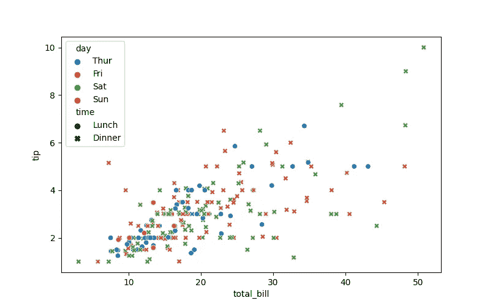

# 当异常值显著时:加权线性回归

> 原文：<https://towardsdatascience.com/when-outliers-are-significant-weighted-linear-regression-bcdc8389ab10>

贝基尔·登梅兹在 [Unsplash](https://unsplash.com) 上拍摄的照片

## 包含显著异常值的加权回归方法

离群者往往是淘气的。它们有可能扰乱一个简单的回归过程，因为它们将自己作为与其他数据同等重要的数据引入，往往会扭曲拟合的模型。一种直接的方法是在拟合模型之前，使用异常值检测方法将它们从数据集中移除。但是这有它的警告。有时，异常值可能很重要，并且对于构建适合数据的模型来说是必不可少的，这样它就可以代表所有的观察/测量结果。然而，这直接导致离群值扭曲拟合模型的问题。那么，如何解决这个问题呢？你猜对了，**加权回归**！

加权回归被定义为“ [*线性回归的推广，其中误差的协方差矩阵被并入模型*](/weighted-linear-regression-2ef23b12a6d7) ”。简而言之，这意味着在数据科学家看来，并非所有的数据点都是平等的，这种不平等也应该反映在拟合的模型中。在将数据集拟合到回归模型的过程中，等式的不平衡可以通过一些技巧来缓解。这些技术包括:插入一个新的二进制列来标记异常值，以及赋予每个数据点相对于数据集其余部分的重要性权重。

对数据进行加权的艺术往往是模糊的。什么数据比另一个数据更重要？为什么呢？它应该受到多大的重视？数据科学家在尝试应用这种方法时应该问的所有好问题。一个简单的方法是使用一个异常稳健的回归模型，如 Huber 回归器，来达到这个目的。然而，还有许多更先进的方法来对数据进行加权，有些方法使用数据本身的先验知识，有些方法则应用更复杂的统计技术。本文将通过使用异常值检测和阈值方法来关注回归之前的数据加权。

首先，让我们加载并准备将用于拟合回归模型的数据。数据集 ***提示*** 是一个示例数据集，可从其在线存储库中的 ***Seaborn*** 库中获得。这个数据集是商业统计案例研究的一部分[1]。它由一家餐馆的一名服务员在几个月的时间里提供的 244 条小费组成。数据集有 6 个探索变量( **X** )和作为响应变量( **y** )的“提示”。除了变量“总账单”之外，其余的探索性变量都是分类变量。为了将这些分类变量用于回归，数据集需要一些准备工作。必须为分类变量创建虚拟变量(代表定性属性的存在与否)。同时，我们来看看数据集是如何分布的。

**Tips** 数据集的散点图。图片由作者提供，转载自 [**Seaborn 示例**](https://seaborn.pydata.org/generated/seaborn.scatterplot.html) 。

我们现在有 8 个探索性变量，可以用来进行回归。从分布图中我们可以看到，单独使用变量“总账单”时，它与“小费”之间存在明显的线性关系。然而，在大约 25“总账单”标记处发生了有趣的事情，数据不再遵循与以前相同的线性关系。有人可能会说，可能有两个甚至三个可能的线性模型是建模该数据集所必需的。然而，本文的重点是单一加权回归拟合，而不是分段建模。从我们观察到的情况来看，周六和周日的晚餐似乎在“总账单”和“小费”的线性度上偏离最大。由于我们希望用单一的线性模型来拟合数据，因此这些数据点的权重可能需要与其他数据点有所不同，以便不会扭曲预测结果。在此之前，让我们创建一个基线回归模型，我们可以用它来比较不同权重的回归模型。

在不对探索性变量进行加权的情况下，我们得到的线性模型的 R 平方得分为 0.4699，均方误差为 1.011。正如上面在快速数据分析中提到的，单一线性模型对于该数据集来说过于简单。但是我们将继续沿着这条路走下去，看看通过给回归模型增加权重能做些什么。

首先，让我们讨论一下在回归建模中可以使用哪些类型的权重。

*   **连续权重**:每个变量都有一个独特的权重，遵循某种概率分布函数(即高斯分布)。
*   **离散权重**:特定变量或变量范围具有基于特定条件(即内点/外点)分配给它们的离散权重
*   **分段连续加权**:连续加权和离散加权的组合

然后进一步解释和演示每种加权方法在回归中的应用。也许首先想象这些权重会更好。为此，将使用示例函数，其中 x 轴遵循标准化(0–1)异常值决策得分。这些分数是对某个值相对于数据集其余部分是异常值的可能性估计。因此，决策得分越高，就越有可能是异常值。然而，我不会深入探讨似然估计及其在加权回归中的数学应用，如果你想了解更多，我会建议你去阅读 [**加权线性回归**](/weighted-linear-regression-2ef23b12a6d7) 。y 轴代表我们的权重。所以，让我们想象一下！

Top:三种类型的连续加权函数。底部:一个离散的和分段连续的加权函数。图片由作者转载自 [**例题权重**](https://gist.github.com/KulikDM/18b8369a2d1930f972e452a5a9898bde) 。

虽然这是一个伟大的可视化，这意味着什么，你如何生成这些加权函数，我们如何将它应用于回归？从上面我们可以看到，我们有相当多的权重选项可供选择。所以，我们从连续加权型开始。我们将使用高斯函数作为对 ***tips*** 数据集进行加权回归的权重。为此，我们首先需要找到数据集的离群决策得分。这将通过使用可从[***PyOD***](https://github.com/yzhao062/pyod)获得的内核密度估计(KDE)异常值检测方法来完成。

通过使用连续加权函数，我们得到一个线性模型，其 R 平方得分为 0.4582，均方误差为 1.033。您可能会注意到，这种性能比没有加权的线性模型更差！那么，为什么 R 平方值更差的回归模型是更好的选择呢？我们只是在浪费时间吗？我们通过在回归模型中使用权重实现了什么？简单的回答是，这是意料之中的…

为了更广泛地解释这一点，虽然整体模型性能确实下降了，但对数据进行加权的目的是将更多的重要性分配给更有可能发生/测量的数据。因此，允许在数据中仍然重要的离群值对模型有贡献，但是对整个模型本身只有次要的重要性。因此，较低的模型性能并不表示拟合不佳。但是，它确实表明，也许我们衡量模型性能的方式现在应该改变了。

嗯，这一切都很好，但是现在如何准确地评估我们的加权模型性能呢？为此，这实际上把我们带到了第二种类型的加权。离散加权。让我解释一下。因为权重是离散的，对于我们的示例情况**二进制**。这意味着内点和外点之间有明显的区别。有了这种区别，一个新的数据集从原始数据集产生，用它来更好地评估我们的模型性能指标。内线。

为了做到这一点，我们将使用 [***和我公开参与的项目***](https://github.com/KulikDM/pythresh) 来评估离群决策分数。因此，让我们将离散加权应用于加权回归模型。

通过使用离散加权函数，我们得到 R 平方得分为 0.4606、均方误差为 1.028 的线性模型。内含物的比例为 77.5%，离群物的比例为 22.5%。如果我们现在针对基线模型评估加权模型，仅考虑内联体，我们会得到以下结果:

*   **基线** : R 平方= 0.3814 &均方误差= 0.5910
*   **连续加权** : R 平方= 0.3925 &均方误差= 0.580
*   **离散加权** : R 平方= 0.3966 &均方误差= 0.5763

由此我们可以看出，就拟合整个数据集而言，未加权模型仍然表现最佳。然而，就内联程序而言，它的表现最差。这意味着，虽然未加权的模型总体上表现更好，但它现在可能偏向于离群值，降低了它对内部值的预测准确性。

然而，这一发现不能全信。因为我们毕竟是数据科学家，对我们自己在模型可解释性上的偏见持怀疑态度也很重要。从性能指标中可以明显看出，对数据集进行加权可以消除异常值偏差。然而，要重申的是，单一的线性模型，甚至可能是离群点检测方法，都不太适合这个数据集。那么，这项工作取得了什么成果？我们已经看到，回归模型中可以包含显著的异常值，而不会使它们与内部值同等重要。并且即使它们对最终的模型拟合有贡献，但毕竟是重要的，它们相对于预测的重要性已经被相应地调整。

在回归过程中为数据应用正确的权重变得与数据集本身一样重要。很难说您的数据存在一个完美的权重集，但是通过上面的例子，希望在尝试包含异常值时可以使这项任务变得简单一些。人们应该注意考虑在拟合过程中允许异常值存在的含义，并始终选择最能代表我们数据的答案。加权回归是实现这一点的许多方法之一，它的使用是一种宝贵的资产。

我将不包括分段连续加权的例子，正如上面的连续和离散加权例子一样，这应该很容易使用两者的组合来实现。

最后，我希望这将有助于您的数据科学技能，并成为处理重大异常值时的有力工具。祝你在数据世界的努力一切顺利！

[1] Bryant，P. G .和 Smith，M .(1995)实用数据分析:商业统计案例研究。伊利诺伊州霍姆伍德:理查德·d·欧文出版社