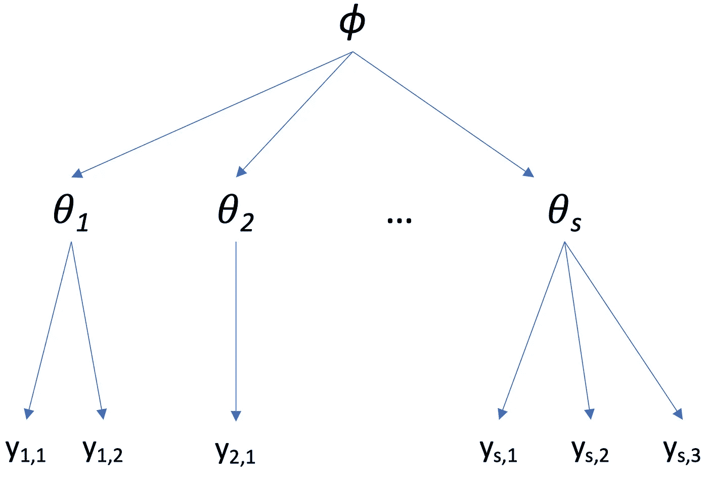

# 何时使用贝叶斯

> 原文：<https://towardsdatascience.com/when-to-use-bayesian-8723c818b742>

# 何时使用贝叶斯

## 应该考虑贝叶斯建模的 5 个场景

## 介绍

大多数统计模型都有一个频率模型和一个贝叶斯模型。两种方法之间的决策不仅仅是模型之间的选择，更是统计“语言”之间的选择。

Frequentist 统计是基于从一个潜在的真实模型中对数据进行假设性重采样。尽可能用简单的英语进行最大似然估计。它说*似然性*是给定(以基础模型为条件)的观察数据的概率。在所有可能的基础模型中，哪一个给了我们看到数据的最高概率？我们正在寻找的这个模型的贝叶斯等价是“哪个模型，或者一组参数值，我们最确定是真实的模型？”

抛开哲学不谈，选择这样或那样的方法有一些实际的原因。频繁主义者的方法通常是首选，所以在本文中，我将介绍一些使用贝叶斯建模可能有意义的场景。

注意:关于贝叶斯推理的直觉的初级读本，请看这篇[文章](/from-bayes-theorem-to-bayesian-inference-b261124633a6)。

在 [Unsplash](https://unsplash.com?utm_source=medium&utm_medium=referral) 上由 [Carlos Muza](https://unsplash.com/@kmuza?utm_source=medium&utm_medium=referral) 拍摄的照片

## 初始信息

贝叶斯统计是关于信念的。我们对真实模型有一些先验的信念，我们将它与我们数据的可能性结合起来，得到我们对真实模型的*后验*信念。(我不会在这里过多地讨论数学，但如果感兴趣，请再次查看这里的[和](/from-bayes-theorem-to-bayesian-inference-b261124633a6)。)

在某些情况下，我们在看到任何数据之前就已经了解了我们的领域。贝叶斯推理提供了一种直接的方式来将这种信念编码到一个*先验*概率分布中。例如，假设我是一名经济学家，预测利率对科技股价格变化的影响。我对经济学的信念是，低利率通常会在一定程度上推高价格，可能是每个利息点 5%左右，但可能不会超过每个利息点 25%。我们可以使用正态分布作为先验分布，以-5%为中心，方差为 40%。它看起来会像这样:

关于利率对股票价格影响的先验信念~正态(-5，40)。图片作者。

如果我担心我潜在的有偏见的先验信念对后验的影响，我可以

1.  使用“较弱的先验”，例如均值为 0、方差为 1600 的正态分布(也称为标准偏差=40)。

关于利率对股票价格影响的弱先验信念~正态(0，1600)。图片作者。

或者

2.做[敏感性分析](https://en.wikipedia.org/wiki/Robust_Bayesian_analysis#Sensitivity_analysis)，我尝试了一大堆不同的先验，看看它实际上对后验分布有多大影响。

## 有限的数据

这个场景与前一个场景相关。如果我们的数据集非常小，一些异常值可能会导致 frequentist 模型的不正确拟合(即使用 sklearn 普通最小二乘法[线性回归](https://scikit-learn.org/stable/modules/generated/sklearn.linear_model.LinearRegression.html))。然而，如果我们使用贝叶斯方法，参数的先验分布可以作为正则化来防止不可能的极值。

在数据是随时间推移而获得的情况下，您可以对现有数据进行贝叶斯推断，获得后验分布，然后在获得新数据时将该后验分布用作先验分布。这个过程称为“贝叶斯更新”，可以一遍又一遍地重复。

## 不确定度测量

如前所述，贝叶斯推断提供了更易解释的置信区间，通常称为“可信区间”这种后验分布直接类似于我们对模型中某个参数的信念，或者是给定新数据的预测。你可以说“我 95%确定参数 *θ* 在 2.2 到 3.6 之间。”

将此与 frequentist 置信区间进行比较，frequentist 置信区间可以说“在大量重复样本中，我们在 1.7 和 3.4 之间类似计算的区间将在 95%的时间内包含真实值。”如果你关心传达不确定性(特别是对非统计学家)，贝叶斯方法可能更有意义。

## 有限的测试数据

如果您在两个不同的发行版上进行训练和测试，一个可能的情况是测试发行版中的数据量要小得多。比方说，我们希望训练一种计算机视觉算法，从全身 CT 扫描中定位一种罕见的癌症类型。我们将来自更常见癌症类型的患者的扫描纳入训练，并保存一些罕见癌症患者进行测试。

我们可以从我们的评估中得到一个精确点估计，但是更合适的方法可能是使用贝叶斯方法来评估[ [1](https://www.youtube.com/watch?v=5f-9xCuyZh4) ]。我们可以为我们的分类器的准确性创建相对较弱的先验，添加评估试验作为数据，并获得后验分布，其中我们可以说“我有 95%的信心，测试分布上的分类器准确性在 65%和 82%之间”。

## 分层模型

分层模型在贝叶斯框架中运行良好。在分层模型中，有多个层次的随机变量。例如，您正在对学生的标准化考试成绩进行建模。每个学生的分数来自他们所在学区的分数分布。学区的参数来自全国学区平均分数的更全球化的分布。

分层模型。 *ϕ代表全局参数。* 𝜃是特定于组的参数，来自ϕ.定义的全球分布 y 是属于 s 组之一的特定数据点。作者图片

分层方法的一个好处是，您可以对所有分类的属性进行建模，即使给定分类中只有很少的数据点。在这个例子中，如果我们有非常少的来自某所学校的数据点，那么它的分布将会更广，更类似于全球的总体分布( *ϕ* )。同样，与为每个聚类创建单独的模型相比，层次模型更能抵抗离群值和有限数据。

等级线性模型的频率主义方法可能寻找后验分布的模式，这通常在等级模型中，可以在后验空间的边缘或边界[ [2](https://discourse.mc-stan.org/t/hierarchical-linear-models-bayes-vs-frequentist/12012/1) ]。在学习模型参数时，这可能会给你一个不正确的结果。通过贝叶斯推理，我们获得了一个完整的后验*分布*，并且我们可以计算更合适的(对于复杂的分布)统计数据，如均值、中值和 95%可信区间。

随着最近计算和算法的进步，贝叶斯推理对于更大的模型和更多的数据更加可行。虽然在实践中，频率主义方法通常是默认选择，但在某些情况下，贝叶斯方法可能是更好的选择，最常见的情况是:

1.  你有可量化的先验信念
2.  数据有限
3.  不确定性很重要
4.  模型(数据生成过程)是分层的

## 参考资料:

[1][https://www.youtube.com/watch?v=5f-9xCuyZh4](https://www.youtube.com/watch?v=5f-9xCuyZh4)

[2][https://discourse . MC-stan . org/t/hierarchical-linear-models-Bayes-vs-frequentist/12012/1](https://discourse.mc-stan.org/t/hierarchical-linear-models-bayes-vs-frequentist/12012/1)