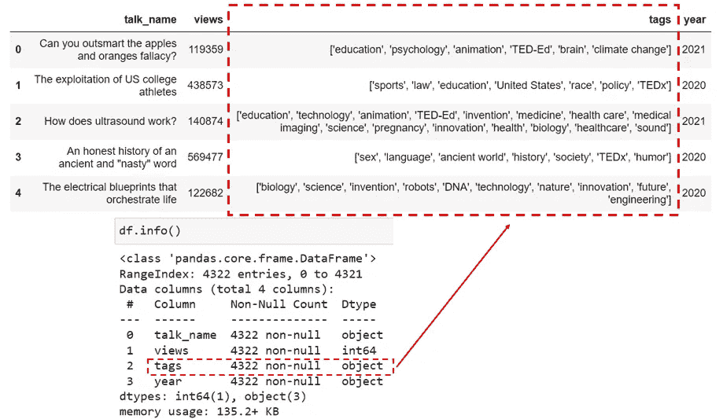
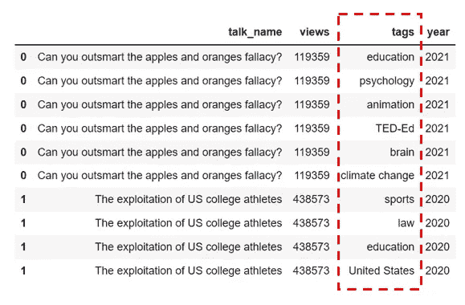
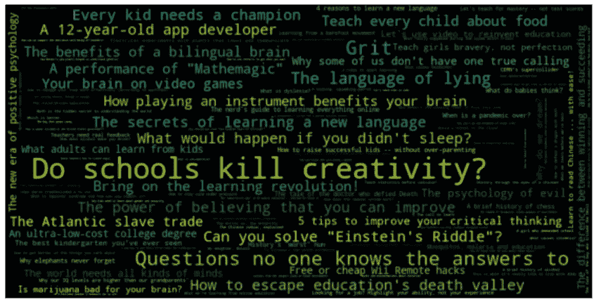

# 为什么以及如何在 Pandas 中将类似列表的列“展开”为行

> 原文：<https://towardsdatascience.com/why-and-how-to-explode-a-list-like-column-to-rows-in-pandas-b69c3391c01c>

## 一个非常酷的熊猫把戏，你应该看看


图片由 [Pixabay](https://pixabay.com/vectors/panda-little-panda-baby-panda-baby-1454629/) 提供(作者修改)

什么是列表式列？在 pandas dataframe 中，我所说的将一个类似列表的列“分解”成行是什么意思？为什么我们需要这样做？这听起来像是一个罕见的数据争论问题，但在数据世界中并不罕见(记住，数据以各种形式和格式出现在我们面前)。

解释它的最好方式是给你看一个真实世界的例子。假设我们想对以下 TED 演讲数据(2006 年至 2021 年)进行一些分析，并使用单词云来可视化“教育”标签类别中最受欢迎的 TED 演讲。你可以在[Kaggle.com](http://kaggle.com)上这里[下载数据。](https://www.kaggle.com/datasets/thedatabeast/ted-talk-transcripts-2006-2021)



作者图片

在这个数据框架中，我们有每个 TED 演讲的名字，总浏览量，以及它所属的标签。请注意“tags”列与典型的列(例如，string、integer、float 等)有何不同。)你会看到的。“tags”列由一组用逗号分隔并用方括号括起来的标记组成——看起来就像一个 python 列表！我们称之为类似列表的列(这个列的实际数据类型是 object/string)。

嗯，虽然在一个列表式的列(即标签列)中显示 TED talk 所属的所有标签很简洁，但用这种格式分析数据并不方便。例如，如果我们想从数据帧中过滤掉所有带有“教育”标签的 TED 演讲，我们该怎么做呢？

幸运的是，有一个非常简单明了的`Pandas`方法叫做`DataFrame.explode()` ，可以用来专门解决这个问题。它将把类似列表的列的每个元素转换成一行，复制索引值。让我们通过例子来看看它是如何工作的。

正如我前面提到的，“标签”列只是一个列表的字符串表示(dtype: object)，因此我们需要首先使用 python 的`ast.literal_eval()`方法将“标签”列从字符串转换为列表。

```
from ast import literal_eval
df['tags'] = df['tags'].apply(literal_eval)
```

然后我们使用 Pandas 的`dataframe.explode()`方法将列表分解成行。在`explode`程序之后，我们还可以使用`drop_duplicates()`来删除任何可能的重复。

```
df = df.explode('tags').drop_duplicates()
```



作者图片

不错！现在我们有了一个更容易处理的数据框架！有了重塑后的数据框架，我们可以快速创建一个单词云，只需几行代码就可以将“教育”标签类别中最受欢迎的 TED 演讲可视化。

## 额外收获:为 TED 演讲创建一个单词云

让我们创建一个单词云，将 2006 年至 2021 年最受欢迎的 TED 演讲可视化在标签类别“教育”中。创建单词云的方法有很多。这里我们将使用`matplotlib`来做这件事。



作者图片

还有很多方法可以美化如上图所示的基本单词云，包括改变背景颜色、调整字体大小、使用定制的遮罩图像等。如果你想做一个比我们在这篇文章中创建的基本视觉效果更好的视觉效果，你可以在这里阅读我关于文字云[的另一篇文章。](https://medium.com/@insightsbees/let-your-artistic-creativity-shine-with-advanced-python-visualization-d4fcccd78848)

[](https://medium.com/@insightsbees/let-your-artistic-creativity-shine-with-advanced-python-visualization-d4fcccd78848) [## 借助先进的 Python 可视化技术，让您的艺术创造力大放异彩

### 使用自定义图像、形状和颜色创建首个 Word Cloud 可视化的分步指南

medium.com](https://medium.com/@insightsbees/let-your-artistic-creativity-shine-with-advanced-python-visualization-d4fcccd78848) 

总的来说，如果您的数据帧有一个类似列表的列，并且您需要通过解包列表并将每个元素分解为一行来重塑数据帧，您可以使用下面的代码片段轻松实现您的目标。

```
from ast import literal_eval
df['column_name'] = df['column_name'].apply(literal_eval)
df = df.explode('column_name').drop_duplicates()
```

## 数据源:

本文中用于演示的数据集是一个免费的开放数据集，可以从 Kaggle 的网站[这里](https://www.kaggle.com/datasets/thedatabeast/ted-talk-transcripts-2006-2021)下载。这个数据集是由 Ramshankar Yadhunath 创建的。

你可以通过这个[推荐链接](https://medium.com/@insightsbees/membership)注册 Medium 会员(每月 5 美元)来获得我的作品和 Medium 的其他内容。通过这个链接注册，我将收到你的会员费的一部分，不需要你额外付费。谢谢大家！