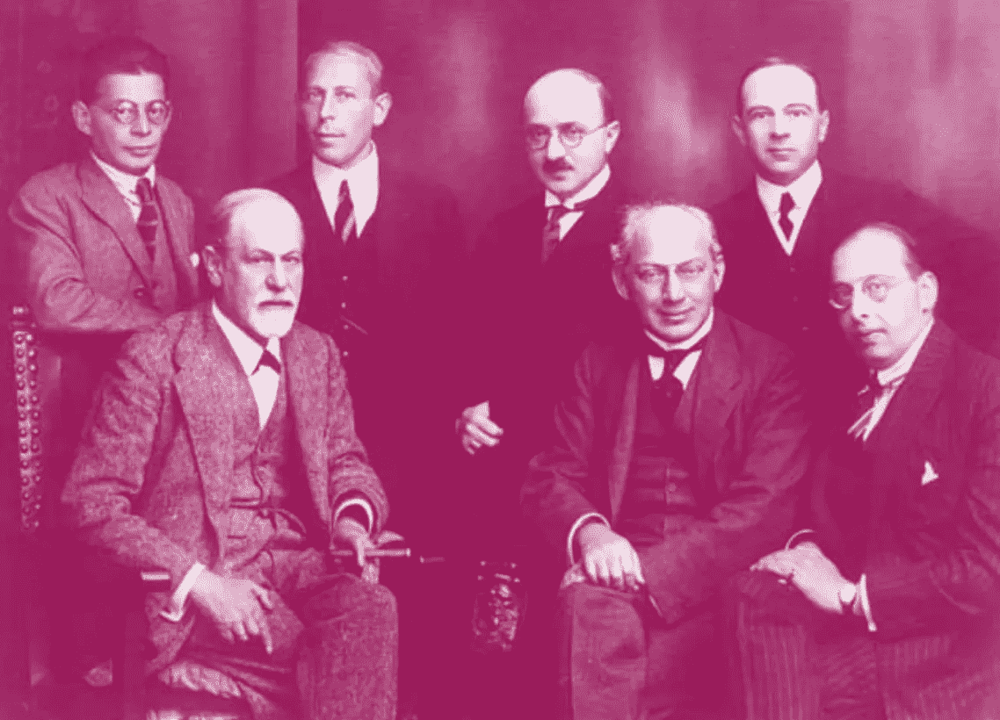

# 为什么争论度量标准是浪费时间

> 原文：<https://towardsdatascience.com/why-arguing-about-metrics-is-a-waste-of-time-b1c6f9026724>

## 数据科学自封的语言警察

西格蒙德·弗洛伊德和其他精神分析学家，1922 年。来源:[维基百科](https://commons.wikimedia.org/wiki/File:Freud_and_other_psychoanalysts_1922.jpg)。

当心理学还处于婴儿期时，我想可能会有不少这种风格的学术通信:

**心理学家 1:***亲爱的先生！你所谓的“记忆”实际上并不是记忆！取而代之的是内存…”*

**心理学家 2:** *“尊敬的先生！我向你保证，我的定义是记忆，而你的不是记忆…”*

想象一下他们像争吵的孩子一样，来回争吵却毫无进展。那段时间我不在(你也不在)，但我有一个清晰的印象，这门学科的历史引发了足够多的职业尴尬，以至于所有心理学研究生——包括我自己——从第一天起就被灌输操作化的实践，直到我们忍不住在睡梦中大喊“操作化”。

Diana Polekhina 在 [Unsplash](https://unsplash.com?utm_source=medium&utm_medium=referral) 上拍摄的照片

如果你以前没有听说过 ***操作化*** 这个术语，我在这里为你写了一本入门书。长话短说，这是严格调查模糊概念的可测量代理的创建。

> 操作化是为严格调查模糊概念创造可测量的代理。

为了走出黑暗时代，并声称自己是一门真正的科学，心理学必须在这一领域发展出坚实的最佳实践，从一个非常重要的实践开始:一个共同的理解，即度量标准不是通用的，它们只是有用的代理。

你和我被允许使用同一个词来表示不同的东西，只要我们在开始时定义我们的术语，就像当我们在解决不同的问题时，我被允许让 X=5，你被允许让 X=10。因此，今天的学术话语采取了更加文明的语调:

**现代心理学家:** *“亲爱的同事！你对记忆的操作化和我对记忆的操作化是不同的。因此，我不能在我自己的研究中使用你的发现，但我仍然认为你很棒，我祝你在那里做的一切顺利。祝你生活愉快！”*

好多了，你同意吗？谁不喜欢操作化的文明影响呢？

卢卡斯·布拉塞克在 [Unsplash](https://unsplash.com?utm_source=medium&utm_medium=referral) 上的照片

不幸的是，[数据科学](http://bit.ly/quaesita_datascim)的年轻学科，以及许多科技行业，似乎跳过了关于[操作化](http://bit.ly/quaesita_opera)的整个章节。每当我听到一些咄咄逼人的新手唱着一个版本的*“亲爱的先生！你所谓的用户快乐并不是用户快乐！！!"以一种最好归入上一个千年的风格(或者至少归入互联网论坛的坏部分)。*

对其他人如何定义他们的术语感到愤怒(我看到你，我的小但忠诚的读者群，他们喜欢讨厌我互换使用 AI 和 ML)不仅是无益的，而且通过试图将所有潜在的含义塞进同一个盒子，它减少了人类创造力的范围。要么这个盒子变得太大而无用，要么它一直很小，但除了最初争论的少数赢家之外，对所有人都没用。为了保持小规模，语言警察必须忙于对任何敢于改变他们神圣术语的人进行恶毒的攻击。

你希望人们怎么做，把他们的度量用户命名为 UserHappiness1092412？或者，每当他们想要表达什么的时候，使用一个完整的连字符段落？

我更喜欢自己生活，也让别人生活。毕竟，只要不误导，速记和随意的语言是有用的。作者可以尽自己的一份力量，定义我们的意思什么时候重要，什么时候不重要，什么时候不重要。

是一个人工智能！Eduardo Velazco Guart 在 [Unsplash](https://unsplash.com?utm_source=medium&utm_medium=referral) 上拍摄的照片

坦率地说，如果我在下一篇博文的顶部写道，“为了讨论的目的，定义人工智能是指飞机”，然后我写道在人工智能中飞行，我会说我是清白的。收起你的尖牙，纯粹主义者，当你意识到你每次写代码或解方程都在做同样的事情时，你会觉得很傻。

> 你第一次学习操作化是在你童年的数学课上。

你第一次遇到操作化是在你童年的数学课上，在那里你学到了你可以使用 *X* 作为你喜欢的任何东西的占位符。你只需在这一页的顶部写下，*“让 X 成为……”*。

照片由[米克·豪普特](https://unsplash.com/@rocinante_11?utm_source=medium&utm_medium=referral)在 [Unsplash](https://unsplash.com?utm_source=medium&utm_medium=referral) 拍摄

心理学家和其他社会科学家被训练去理解抽象概念也是如此，但我希望这种训练成为常态。要是每个人的老师都强调说，不先去查确切的定义就过多地解读抽象词汇是很危险的就好了…

> 在你查看度量标准是如何定义的之前，养成不要把科学发现看得太重的习惯。

如果你想用“用户幸福度”这个术语来简写“用户在这个调查问题上点击至少 4 颗星(满分 5 颗星)的倾向”，那么你可以这么做。在我将你的任何发现移植到我自己的应用程序之前，我有责任确保查阅你的定义。如果我选择给你建议，我会根据你的目标，而不是我的用词品味。

我敢打赌，围绕操作化的更好的心理习惯可以挽救相当多的婚姻。哇，想象一下，如果人们真的定义他们的话，而不是提高音量。桑迪·米勒在 [Unsplash](https://unsplash.com?utm_source=medium&utm_medium=referral) 上拍摄的照片

但是，即使我不喜欢你的衡量标准，我们也没有必要争论某样东西是不是用户快乐，就像没有一个理智的人会争论我选择标记为 *X* 的数量是否与你八年级笔记本上的 *X* 相同一样。

如果我们学会记住 X 只是一个占位符，那么我们的争论就会少得多,“幸福”这个词和它所有模糊的朋友也是如此。

照片由 [Cytonn 摄影](https://unsplash.com/@cytonn_photography?utm_source=medium&utm_medium=referral)在 [Unsplash](https://unsplash.com?utm_source=medium&utm_medium=referral) 上拍摄

# 感谢阅读！YouTube 课程怎么样？

如果你在这里玩得开心，并且你正在寻找一个为初学者和专家设计的有趣的应用人工智能课程，这里有一个我为你制作的娱乐课程:

在这里欣赏整个课程播放列表:[bit.ly/machinefriend](http://bit.ly/machinefriend)

# 喜欢作者？与凯西·科兹尔科夫联系

让我们做朋友吧！你可以在 [Twitter](https://twitter.com/quaesita) 、 [YouTube](https://www.youtube.com/channel/UCbOX--VOebPe-MMRkatFRxw) 、 [Substack](http://decision.substack.com) 和 [LinkedIn](https://www.linkedin.com/in/kozyrkov/) 上找到我。有兴趣让我在你的活动上发言吗？使用[表格](http://bit.ly/makecassietalk)取得联系。