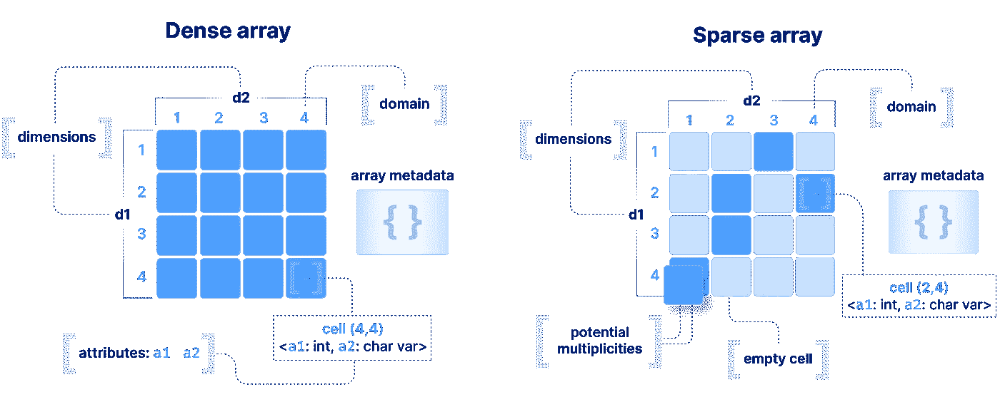
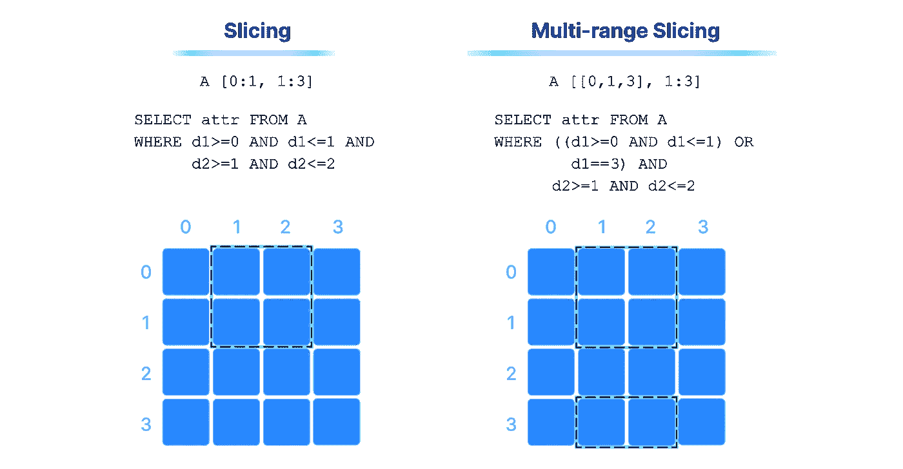
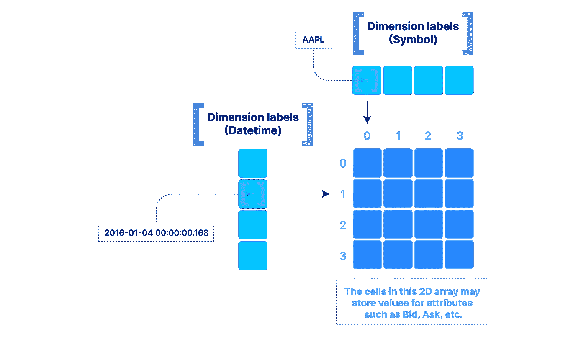
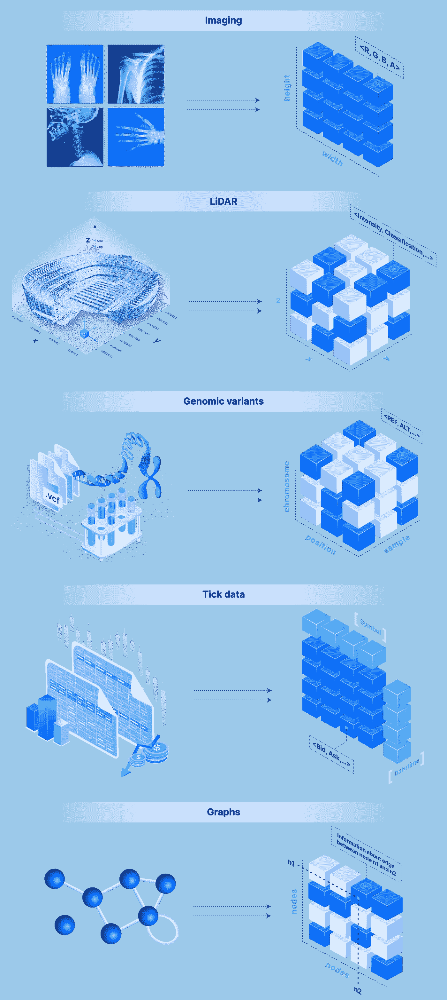
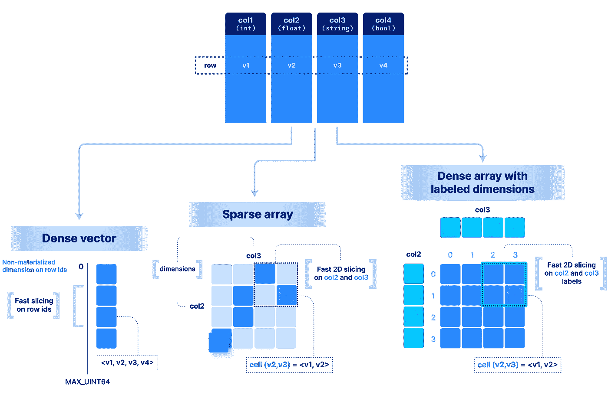
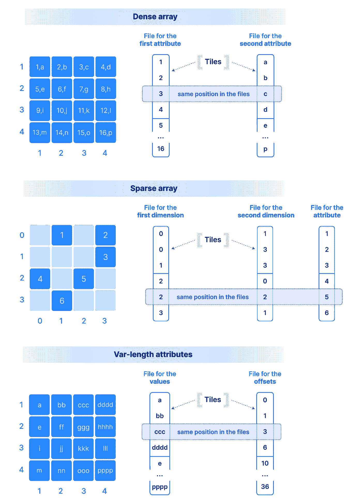
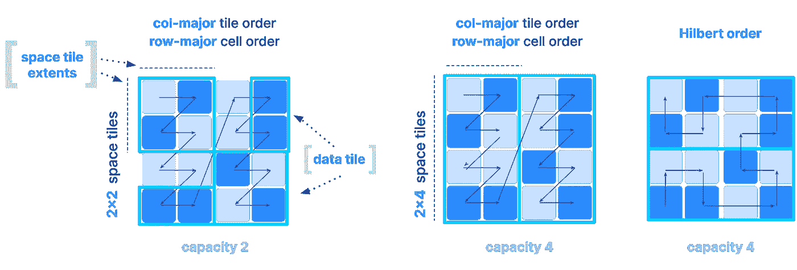
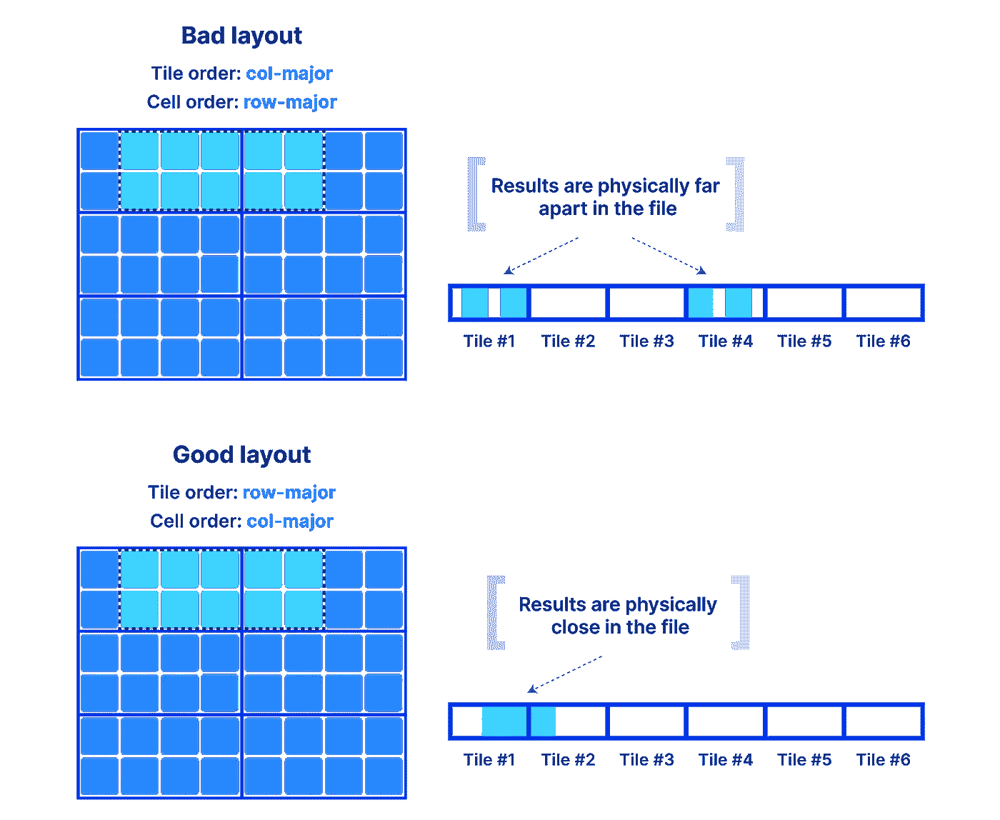
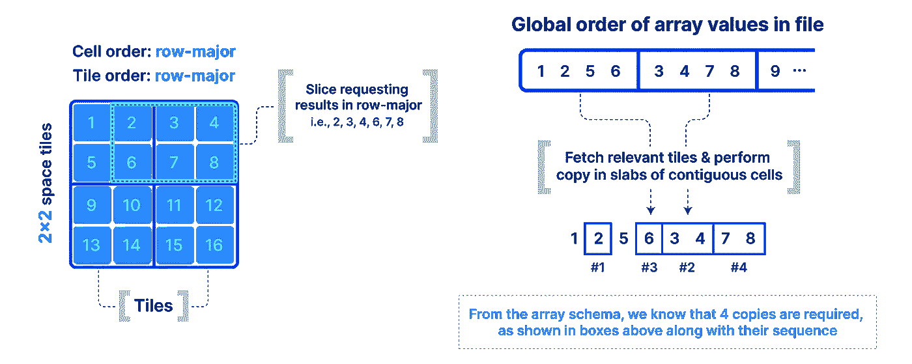
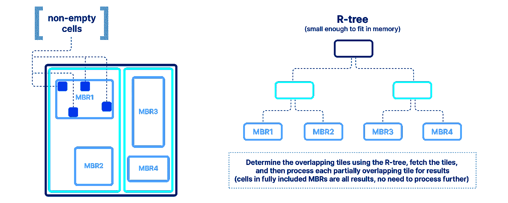

# 为什么将数组作为通用数据模型

> 原文：<https://towardsdatascience.com/why-arrays-as-a-universal-data-model-808d140e59f>

## 走向数据管理的乐土

所有图片由作者提供

对于任何致力于数据问题的人来说，这都是激动人心的时刻，因为数据行业一如既往地火热和炒作。众多的数据库、数据仓库、数据湖、湖屋、特征存储、元数据存储、文件管理器等。在过去的几年里一直在冲击市场。我的整个职业生涯都在从事数据管理，但与市场趋势背道而驰的是，我们一直在为每一种不同的数据类型和应用程序创建新的数据系统，这让我感到非常困惑。2014 年至 2017 年，我在英特尔实验室和麻省理工学院担任数据库研究员期间，我问了自己一个简单的问题:我们可以建立一个单一的数据库来存储、管理和处理所有数据，包括表格、图像、视频、基因组学、激光雷达、要素、元数据、平面文件和未来可能出现的任何其他数据类型，而不是每次我们的数据需求发生变化时都建立一个新的数据系统。

这个问题源于一个简单的观察，即所有数据库系统(及其变体)都有显著的相似性，包括将数据放置在选择的存储介质上，以及根据特定的查询工作负载提取数据进行处理。因此，为了回答上面的问题，我不得不问一个稍微不同的问题:*有没有一个数据模型可以高效地捕获所有应用程序的所有数据？*因为如果这样一个通用数据模型存在，它可以作为构建一个通用数据库的基础，该数据库具有所有数据库通用的所有子系统(查询规划器、执行器、认证器、事务管理器、API 等。).在这篇博文中，我认为这样的模型确实存在，而且它是基于**多维数组**。

在阐述为什么数组是通用的之前，我需要回答另一个问题:为什么您应该关心通用数据模型和通用数据库？以下是一些重要的原因:

*   **数据多样化。**您可能认为传统的数据仓库(或数据湖，或 lakehouse)可以处理所有的表格数据，但实际上，组织拥有大量其他非常有价值的数据，如图像、视频、音频、基因组、点云、平面文件等等。他们希望对这些数据集合执行各种操作，从分析到数据科学和机器学习。
*   **供应商优化。**为了能够管理其多样化的数据，组织求助于购买大量不同的数据系统，例如数据仓库、ML 平台、元数据存储和文件管理器。那要花费金钱和时间；金钱是因为一些供应商有重叠的功能，您需要为此支付两次费用(例如，身份验证、访问控制等)，时间是因为团队必须学习操作许多不同的系统，并在需要通过组合不同的数据源来获得洞察力时争论数据。
*   **整体治理。**即使组织对众多的供应商感到满意，每个不同的数据系统都有自己的访问控制和日志记录功能。因此，如果组织需要对其所有数据实施集中治理，则需要在内部构建。那要花费更多的钱和时间。

即使我已经成功地让你相信了通用数据库的重要性，我还需要做最后一个重要的评论。*如果通用数据库不能为其服务的所有数据类型提供出色的性能，那么它就是不可用的*。换句话说，通用数据库必须和专用数据库一样高效，否则会有很多人对采用它持怀疑态度。这就是通用数据库的困难所在，也是为什么今天没有人建立这样一个系统(嗯，几乎没有人)。

在这篇博文中，我展示了多维数组是正确的选择，不仅因为它们的通用性，还因为它们的性能。在完全公开的情况下，我是 TileDB 的创始人兼首席执行官，这是一家以多维数组为一等公民构建通用数据库的公司。我将介绍我们在 TileDB 设计阵列数据模型时做出的许多关键决策、高效的磁盘格式以及支持它的强大存储引擎。我的目标是强调通用数组原则，希望本文可以作为从专门构建的数据系统转向开发更通用的数据库的一小步。

深呼吸，我们即将进行一次技术性跳水！

如果你符合以下条件，这篇博文的其余部分就属于你了:

*   您使用单一数据类型(表格、基因组学、激光雷达、图像等),并可能使用特殊用途的数据系统，但您希望深入了解多维数组如何为您的用例提供优雅且性能更高的解决方案。
*   您使用现代本机工具处理来自许多来源的各种数据，并希望了解通过通用格式、引擎和接口使多维数组能够适应任何数据集或工作负载的技术设计选择。
*   对您来说，了解您要使用和比较的工具的基础是很重要的，并且需要确定它们是精心设计的，以满足您现在和将来的需求。

# 数组数据模型

我们在 TileDB 遵循的基本阵列模型如下所示。我们对**密集**和**稀疏**数组进行了重要的区分。密集阵列可以具有任意数量的维度。每个维度都必须有一个包含整数值的域，并且所有维度都具有相同的数据类型。数组元素由一组唯一的维度坐标定义，称为单元。在密集数组中，所有单元格都必须存储一个值。一个逻辑单元可以存储多个不同类型的值(可以是整数、浮点数、字符串等)。属性定义所有单元格中具有相同类型的值的集合。密集数组可能与一组任意的键值对相关联，称为数组元数据。

数组数据模型

稀疏阵列与密集阵列非常相似，但它有三个重要的区别:

1.  稀疏数组中的单元可以是空的。
2.  维度可以具有异构类型，包括浮点和字符串(即，域可以是“无限的”)。
3.  允许单元多重性(即，具有相同维度坐标的单元)。

关于是使用密集数组还是稀疏数组对数据建模的决定取决于应用程序，它会极大地影响性能。此外，在选择将数据字段建模为维度或属性时，应该格外小心。这些决策将在下面的性能部分详细介绍，但现在，您应该知道:*阵列系统针对在维度坐标* *上快速执行范围条件* ***进行了优化。*数组也可以支持属性上的有效条件，但是通过设计*最优化的*选择性能将来自维度上的查询，原因很快就会清楚。**

维度上的范围条件通常称为“切片”，结果构成“切片”或“子数组”。下图显示了一些例子。在 numpy 表示法中，`A[0:2, 1:3]`是一个切片，由第一维上的坐标为 0 和 1 的单元格的值以及第二维上的坐标为 1 和 2 的单元格的值组成(假设只有一个属性)。或者，这可以用 SQL 写成`SELECT attr FROM A WHERE d1>=0 AND d1<=1 AND d2>=1 AND d2<=2`，其中`attr`是一个属性，`d1`和`d2`是数组`A`的两个维度。还要注意，切片可能在每个维度上包含多个范围(多范围切片/子数组)。

切片数组数据

上述模型可以扩展到包括“维度标签”。这个扩展可以应用于密集和稀疏数组，但是标签在密集数组中特别有用。简而言之，维度可以接受将任意数据类型的值映射到整数维度坐标的标签向量。下面展示了一个例子。这在数据非常密集(即没有太多的空单元)但维字段不是整数或在整数域中不连续出现的应用程序中非常有用。在这种情况下，通过首先有效地查找标签向量中的整数坐标，然后如上所述应用切片，来执行多维切片。为什么这可能比简单地用稀疏数组建模数据更好的原因将在下面的性能部分变得清楚。

标注维度的密集数组

# 多维数组捕获的用例

多维数组已经存在很长时间了。但是，对于数组有两种误解:

1.  阵列仅用于科学应用。这主要得益于它们在 Python、Matlab、R、机器学习等科学应用中的大量使用。数组捕捉科学用例绝对没有错。相反，这样的应用程序很重要，也很有挑战性，没有关系数据库可以高效地容纳它们(原因很快就会清楚)。
2.  **阵列只有密集。**在 TileDB 之前构建的大多数阵列系统(即存储引擎或数据库)只关注密集阵列。尽管密集阵列适用于广泛的用例，但对于稀疏问题，如基因组学、激光雷达和表格，密集阵列是不够的。稀疏阵列已被忽略，因此，没有阵列系统能够声称普遍性。

对于支持密集和稀疏阵列的系统来说，天空是适用性的极限。图像是 2D 密集阵列，其中每个单元是可以存储 RGBA 颜色值的像素。类似地，视频是 3D 密集阵列，二维用于帧图像，第三维用于时间。激光雷达是具有浮点坐标的 3D 稀疏阵列。基因组变体可以通过 3D 阵列来建模，其中维度是样本名称(字符串)、染色体(字符串)和位置(整数)。时间序列分笔成交点数据可以用 2D 数组来建模，用时间和分笔成交点符号作为标注维度(这当然可以任意扩展到密集或稀疏数组)。类似地，天气数据可以用具有浮点标签(纬度/经度实际坐标)的 2D 密集阵列来建模。图可以被建模为(稀疏 2D)邻接矩阵。最后，平面文件可以存储为简单的 1D 密集数组，其中每个单元格存储一个字节。

数组可以模拟各种各样的应用程序

但是表格数据呢？数组在这里有很大的灵活性。在最复杂的场景中，我们可以将一个表存储为一组 1D 数组，每列一个(对于熟悉它的人来说，类似于 [Parquet](https://parquet.apache.org/) )。如果我们想一次对一系列行进行切片，这是很有用的。或者，我们可以将一个表存储为一个稀疏数组，使用列的子集作为维度。这将允许对维度列进行快速切片。最后，我们可以使用上面针对时间序列分笔成交点数据所解释的带标签的密集数组。

数组包含表

您可能想知道我们如何为每个应用程序做出所有这些关于维度与属性以及密集与稀疏的决定。要回答这个问题，我们需要了解密集和稀疏阵列如何在存储介质上布置数据，以及切片时哪些因素会影响性能，这是下一节的重点。

# 为什么阵列有利于数据管理

在基于上述阵列模型构建的系统中，提高性能的第一步是确定*磁盘格式*。这将决定 IO 成本，对于许多查询工作负载来说，IO 成本通常是主要因素。我将首先解释我们在 [TileDB Embedded](https://github.com/TileDB-Inc/TileDB) 中采取的一些架构决策，以构建高效的数组格式。然后我将解释这种格式如何产生高效的切片操作，并总结所有的性能因素。

## 磁盘格式

让我们从如何存储维度坐标和属性值开始。为了有效地支持云对象存储和版本化写入，我们选择了多文件格式，其中每个维度或属性的值都存储在单独的文件中。密集数组不会具体化维度坐标，而稀疏数组必须。下图显示了密集和稀疏阵列示例。请注意，所有维度和属性中的每个单元格值都出现在对应文件中的相同绝对位置。此外，在可变长度属性或维度中，需要一个单独的文件来存储每个值在值文件中的起始位置的字节偏移量。

维度和属性磁盘布局

这种将相同类型的值分组在一起的布局非常适合在查询期间对属性/维度进行压缩、矢量化和子集化(类似于其他列式数据库)。因为典型的查询会对这些值的子集进行切片，所以我们不会将整个文件压缩为单个 blob。相反，我们*将*平铺(即分块)成更小的块。因此，我们需要一种机制来创建细胞群。如上图所示，每个图块中的单元格在相应的文件中将显示为连续的。切片是 IO 和压缩的原子单位，(以及其他潜在的过滤器，如加密、校验和等。).

出现了一个问题:我们如何在一维文件中对多维空间的值进行排序。该顺序将决定每个单元在其相应图块中的位置，以及图块在文件中的位置。我们称这个顺序为阵列中单元的*全局顺序*。我将分别解释密集和稀疏数组的全局顺序和平铺。

在密集阵列中，全局顺序和平铺由 3 个参数决定:

1.  每个维度的空间切片范围。
2.  每个图块内的单元格顺序
3.  平铺顺序

下图描述了我们改变上述参数时的三种不同订单。请注意，每个分块的形状和大小仅由空间分块范围决定。

密集阵列的全局顺序示例

稀疏数组的情况略有不同，因为仅基于空间切片进行切片可能会导致每个切片中非空单元的数量严重失衡，从而进一步影响可压缩性和切片性能。在稀疏阵列中，全局顺序可以确定如下:

1.  通过指定与密集情况下相同的三个参数，或者
2.  通过使用希尔伯特空间填充曲线

一旦确定了全局顺序，就通过一个额外的参数来指定平铺，该参数称为*平铺容量*，即每个平铺中非空单元的数量。下图描述了稀疏阵列的所有上述参数的不同选择的不同全局顺序(非空单元用深蓝色表示)。

稀疏阵列的全局顺序示例

为什么全局顺序和平铺如此重要？对于大多数典型的切片形状，全局顺序应该尽可能地保留查询结果的同位置性。记住，数组是多维的，而存储数组数据的文件是一维的。您只有一次机会(除非您想为冗余付费)按照一个 1D 顺序对数据进行排序。这个顺序绝对决定了多维查询的性能。原因是您的结果在文件中出现得越近，IO 操作检索它们的速度就越快。此外，图块的大小也会影响性能，因为完整的图块将从存储中提取到内存中。下面的例子展示了给定切片的一些好的和坏的全局顺序和分块，集中在密集阵列上(对于稀疏的情况可以进行类似的论证)。

全局顺序对结果磁盘局部性的影响

你会说，*“我需要知道我的切片的形状，以便选择全局顺序”*。在我们开发的许多应用程序中，典型的查询模式确实是已知的。如果不是这样，数组仍然给你机会定义一个顺序，为你的大多数查询模式带来可接受的性能。这里最重要的一点是，阵列为您提供了简单灵活的方法来操作数据在磁盘上的表示，以便为所有类型的数据和应用程序实现理想的性能*。这就是数组通用的原因！*

## *索引和访问数组数据*

*既然我们已经弄清楚了磁盘上的格式，那么我们如何有效地对数组进行切片，以及我们可以选择构建什么索引来方便查询呢？首先，我们关注高密度阵列，并使用下图中的示例。除了切片查询，我们还知道以下内容:维数、全局顺序、平铺以及数组中没有空单元的事实。这些信息统称为*数组模式*。仅使用数组模式和简单的算法，我们可以计算组成查询结果的*单元块*(即磁盘上的连续单元集)的数量、大小和位置，而无需任何额外的索引。因此，我们可以设计一个高效的多线程算法，它可以从磁盘中提取相关的图块，解压缩并将单元板复制到结果缓冲区中，所有操作都是并行的。如果适当地开发算法，并且明智地选择全局顺序和平铺，切片密集阵列确实是快速的！*

**

*索引隐含在密集数组中*

*稀疏数组中的切片更加困难，因为在数组被写入之前，我们不知道空单元的位置。因此，与密集数组不同，我们需要显式存储非空单元格的坐标，并在它们之上构建一个索引。索引必须很小，以便在提交查询时可以快速加载到主存中。在 TileDB 中，我们使用 R 树作为索引，但也存在其他多维索引。R 树将非空单元的坐标分组到最小包围矩形(MBR)中，每个瓦片一个，然后递归地将这些 MBR 分组到树结构中。下图显示了一个示例。然后，切片算法遍历 R 树，找出哪些图块 MBR 与查询重叠，从存储中并行获取这些图块，并对它们进行解压缩。然后对于每个部分重叠的瓦片，算法需要进一步逐个检查坐标，以确定它们是否落在查询切片内。这个简单的算法，如果高效开发(使用多线程和向量化)，可以产生极其高效的多维切片。*

**

*用于索引稀疏数组的 r 树*

## *绩效总结*

*我已经提到了数组格式的某些方面对性能的影响，但下面我对它们进行了总结:*

1.  ***维度与属性。**如果大多数查询工作负载在一个数据字段上有一个范围条件(即切片),则该字段应该被建模为一个维度。否则，它应该被建模为一个属性。*
2.  ***维数。**随着维度数量的增加，你会经历收益递减。您应该选择最多 4-5 个维度，这些维度对于您的查询来说是高度选择性的(即，具有高修剪能力)。这个数字是经验值，因应用而异。*
3.  ***全球秩序。**全局顺序决定了单元相对于查询的位置，并且可以极大地影响整体成本。*
4.  ***平铺尺寸。**如果查询片太小而切片太大，则会从存储中提取大量冗余数据，并对其进行解压缩和处理，因此性能会下降。相反，如果切片太大而切片太小，则处理大量切片会产生额外的开销。*
5.  ***密集 vs 稀疏。**如果数组中的所有单元格都必须有一个值，那么这个数组应该是密集的。如果绝大多数单元是空的，那么阵列应该是稀疏的。如果数组相当密集，但是维度坐标从非整数域中取值或者是非连续的整数，那么数组应该是密集的，并且标注维度。*

*最后，应该清楚的是，数组可以有效地对表格数据建模，但反之亦然，这将进一步证明为什么关系数据库(或 Parquet 之类的表格格式)从未在科学领域取得成功。以一个简单的 2x2 密集阵列`[[1, 2], [3, 4]]`为例。回想一下，密集数组并不具体化单元的坐标，而是从数组模式中推断结果位于何处(即，维度、全局顺序和平铺)。在数组引擎中，数组值将在文件中序列化为`1, 2, 3, 4`(假设没有平铺范围和以行为主的单元格顺序)，数组将能够在单元格`(1, 0)`中定位值，即第二行第一列，很容易定位为 3。然而，在表格格式中没有维度的概念。如果表格格式将一列中的数组值存储为`1, 2, 3, 4`，那么对于本例来说，它不会拥有前两个值对应于第一行，后两个值对应于第二行的必要信息。因此，没有办法定位单元格`(1, 0)`的值，除非我们创建两个额外的列来显式存储每个值的坐标并扫描该表，这将导致大量不必要的开销。如果你觉得这个例子很简单，试着想象一下在多维、平铺和不同的平铺和单元顺序的情况下会变得多么复杂。*

# *构建存储引擎，而不是格式*

*到目前为止，我们已经设计了一个很好的数据模型和一个相关的磁盘格式，这可以带来出色的性能，但是我们将从这里走向何方呢？在回答这个问题之前，我将指出我们在其他阵列系统中观察到的一些缺陷:*

*   ***关注密集阵列。**我们所知的另外三个出色的阵列系统 SciDB、HDF5 和 Zarr，只专注于高密度阵列。如上所述，密集阵列有广泛的应用，但无法支持稀疏数据的用例，如激光雷达、基因组学、表格等。*
*   ***专为单一语言打造。**例如，Zarr 是用 Python 编写的，因此不能在其他语言中使用。这限制了它的可用性。其他的 Zarr 实现正在出现，但是达到对等的工程成本非常高。*
*   ***专为有限后端打造。**例如，HDF5 是围绕单文件格式的理念构建的。对于 HPC 环境和 Lustre 这样的分布式文件系统来说，这是一个很好的选择，但是对于所有文件/对象都是不可变的云对象存储来说，这是不可行的。此外，对象存储对延迟提出了其他限制，需要在高效 IO 的读取算法中加以考虑。*
*   ***关注格式规范。**定义和公开数组格式规范没有错。格式规范的最大问题是实现负担留给了更高级别的应用程序(例如，MariaDB 之类的 SQL 引擎，或者 Spark 之类的计算框架)。这反过来提出了两个问题:(1)围绕构建将解析和处理格式的存储层有大量的重复劳动，以及(2)不同的社区需要就发展格式规范达成一致，因为改变它将导致所有使用它的应用程序崩溃。*

*我认为数据模型和格式规范是不够的。我们需要专注于构建强大的存储引擎，以支持和发展阵列数据模型和格式，并遵循以下设计原则(我们在 TileDB Embedded 中遵循了这些原则):*

*   *支持密集和稀疏阵列，这样我们就可以实现通用性。*
*   *内置 C++以提高性能，但包装在众多 APIs、C++、C#、Python、R、Java、Go、Javascript)中以获得更广泛的采用。这些 API 还可以促进与 SQL 引擎、计算框架、机器学习库和其他特定领域工具的集成。*
*   *针对所有后端(基于 POSIX、HDFS、S3、GCS、Azure Blob 存储、MinIO，甚至 RAM)进行优化，在存储引擎中抽象 IO 层并使其可扩展。*
*   *关注存储引擎，而不是格式规范。更高级别的应用程序应该与存储引擎集成并使用其 API。他们应该完全忘记底层的格式规范。这将允许存储引擎快速发展和改进格式，而不会破坏更高级别的应用程序。*

*以上只是存储引擎应该具备的“基本”功能。为了建立通用数据库的基础，需要一些更高级的特性:*

*   *版本控制和时间旅行，这对任何数据库系统都是至关重要的。*
*   *计算下推，如属性条件和更复杂的查询，如分组聚合。这可以消除不必要的数据复制和移动。*

*主要的收获是，如果有正确的存储引擎支持，多维数组会非常强大。构建一个精心设计的阵列引擎是一项艰巨的任务。幸运的是，现在已经有了这样一个引擎，叫做 [TileDB Embedded](https://github.com/TileDB-Inc/TileDB) ，它在麻省理工学院的许可下是开源的。我希望它的设计原则将推动新的阵列引擎的出现。*

# *结论*

*在这篇博文中，我说明了多维数组是一个强大的数据模型，可以作为一个通用数据库的基础，该数据库可以捕获所有数据类型和应用程序。我解释了普遍性的好处，并展示了数组数据模型。然后，我描述了一种高效的磁盘阵列格式，并通过深入的技术探讨阐述了为什么它可以带来出色的性能。最后，我认为，如果不构建一个强大的存储引擎来支持和改进阵列模型和磁盘格式，它们是不够的。*

*我一直期待着社区的反馈。你可以在 TileDB [Slack workspace](https://join.slack.com/t/tiledb-community/shared_invite/zt-ndq1ipwl-QcithaWG6j1BImtuQGSpag) 和[论坛](https://forum.tiledb.com/)找到我和我的团队，或者你也可以[直接联系我们](https://tiledb.com/contact/)。对于进一步的阅读，我建议使用 [TileDB 文档](https://docs.tiledb.com/)和以下博客/网络研讨会:*

*   *[揭穿“专用数据系统”:进入通用数据库](https://tiledb.com/blog/debunking-purpose-built-data-systems-enter-the-universal-database-2021-08-04)*
*   *[深入了解 TileDB 数据格式&存储引擎](https://tiledb.com/blog/a-deep-dive-into-the-tiledb-data-format-storage-engine-2021-09-21)*
*   *[TileDB 云通用数据库的技术演练](https://tiledb.com/blog/debunking-purpose-built-data-systems-enter-the-universal-database-2021-08-04)*

***非常感谢整个** [**TileDB 团队**](https://tiledb.com/about/) **让这一切成为可能！***