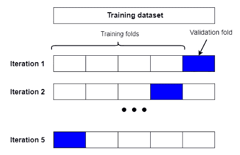

# 为什么除了训练集和测试集之外，我们还需要一个验证集？

> 原文：<https://towardsdatascience.com/why-do-we-need-a-validation-set-in-addition-to-training-and-test-sets-5cf4a65550e0>

## 用简单的英语解释培训、验证和测试集


舒米洛夫·卢德米拉在 [Unsplash](https://unsplash.com/?utm_source=unsplash&utm_medium=referral&utm_content=creditCopyText) 上的照片

您可能已经熟悉了训练集和测试集。在训练 ML 和 DL 模型时，通常会将整个数据集分成训练集和测试集。

这是因为您需要一个单独的测试集来根据看不见的数据评估您的模型，以提高模型的泛化能力。

我们没有在用于训练的相同数据上测试我们的模型。如果我们这样做，模型将试图记忆数据，而不会对新的看不见的数据进行归纳。

验证集也是原始数据集的一部分。就像测试集一样，是用来评估模型的。然而，这并不是最终的评价。

> **机器学习是一个高度迭代的过程** —吴恩达

机器学习不是一蹴而就的。在找到您寻找的最佳模型之前，您需要通过为[超参数](https://rukshanpramoditha.medium.com/parameters-vs-hyperparameters-what-is-the-difference-5f40e16e2e82)设置不同的值来试验不同的模型。

这就是验证集发挥作用的地方。

# 训练集与验证集与测试集

培训、测试和验证是 ML 工作流程中的关键步骤。对于每一步，我们都需要一个单独的数据集。因此，entree 数据集分为以下几个部分。

*   **训练集:**就数据集的大小而言，这是最大的部分。训练集用于训练(拟合)模型。模型参数从训练数据中学习它们的值(规则或模式)。换句话说，训练集用于在超参数的固定组合上拟合模型的参数。
*   **验证集:**我们的模型训练过程不是一次性的过程。我们必须通过尝试超参数的不同组合来训练多个模型。然后，我们在验证集上评估每个模型的性能。因此，验证测试对于超参数调整或从不同模型中选择最佳模型非常有用。在某些情况下，验证集也被称为**开发(Dev)集**。
*   **测试集:**在调整过程之后，我们选择具有最佳超参数组合的最佳模型。我们使用测试集来衡量该模型的性能。

理解训练集和测试集的作用是很简单的。您可能还不熟悉验证集的作用，也就是今天文章的标题。

让我们看一个例子。

比方说，我们希望通过尝试不同的`n_estimators`和`max_depth`超参数值，在数据集上训练一个随机森林分类器。

```
from sklearn.ensemble import RandomForestClassifierrf_clf = RandomForestClassifier(**n_estimators=?, max_depth=?**)
```

`n_estimators`的默认值是 100，而`max_depth`的默认值是无。但是我们对这些默认值不感兴趣。相反，我们想尝试以下值。

*   **n _ 估计值:** 100，500，1000 (3 个不同的值)
*   **最大深度:** 2，3，5，10 (4 个不同的值)

超参数有 12 (3 x 4)种不同的组合。这意味着我们将通过一次考虑每个超参数组合来构建 12 个不同的随机森林分类器。举个例子，

```
rf_clf_1 = RandomForestClassifier(**n_estimators=100, max_depth=2**)
```

我们在训练集上训练第一个模型，在验证集上评估它的性能，记录它的性能分数并将其放在一边。

```
rf_clf_2 = RandomForestClassifier(**n_estimators=100, max_depth=3**)
```

我们在相同的训练集上训练第二个模型，在相同的验证集上评估它的性能，记录它的性能分数并将其放在一边。

同样，我们训练所有 12 个模型并记录性能分数。然后，我们选择具有最佳性能得分的模型，并记下其超参数值。假设这些超参数值是`n_estimators=500`和`max_depth=3`。

```
rf_clf_best = RandomForestClassifier(**n_estimators=500, max_depth=3**)
```

最后，我们在测试集上对该模型进行了评估。

总之，训练集用于拟合模型参数，验证集用于调整模型超参数。最后，我们使用测试集来评估最佳模型。

有人可能会问，为什么我们需要一个单独的验证集。我们不能使用训练集而不是使用单独的验证集来调整模型超参数吗？答案是，我们也使用验证测试进行某种测试，测试不应该在用于训练的相同数据上进行。

使用验证和测试集将提高模型对新的未知数据的概括能力。

此外，请注意，如果您不打算通过尝试超参数的不同组合来优化模型，则不需要验证集(冗余)。在这种情况下，您可以只使用训练集和测试集来继续训练过程。

# 如何创建训练集、验证集和测试集

现在，您已经熟悉了训练集、验证集和测试集的用法。在本节中，我们将讨论如何在 Python 中创建这些集合。

我们将讨论创建训练集、验证集和测试集的 3 种不同方法。

## 1.使用 Scikit-learn train_test_split()函数两次

您可能已经熟悉了 sci kit-learn**train _ test _ split()**函数。这里，我们使用它两次来创建训练集、验证集和测试集。下面是怎么做的。

首先，我们通过分配原始数据集中 70%的样本来创建训练集。因此， **train_size** 为 0.70。

```
from sklearn.model_selection import train_test_splitX_train, X_rem, y_train, y_rem = train_test_split(X, y,
                                                  **train_size=0.70**)
```

训练装置包括 **X_train** 和 **y_train** 部件。 **X_rem** 和 **y_rem** 部分属于剩余的数据集，用于在下一步创建验证和测试集。

```
X_valid, X_test, y_valid, y_test = train_test_split(X_rem,y_rem,
                                                    **test_size=0.15**)
```

验证集包括 **X_valid** 和 **y_valid** 部分。 **X_test** 和 **y_test** 零件属于测试组。在这里，我们使用了`test_size=0.15`。这意味着对于每个验证和测试集，我们得到原始数据集中 15%的样本。

## 2.使用 Fast-ML 训练 _ 有效 _ 测试 _ 分离()函数

在上面的方法中，您需要调用 **train_test_split()** 函数两次来创建训练集、验证集和测试集。通过使用 Fast-ML 库中的**train _ valid _ test _ split()**函数，您可以通过一次函数调用创建所有集合！

```
X_train, y_train, X_valid, y_valid, X_test, y_test = train_valid_test_split(X, y, **train_size=0.70**, **valid_size=0.15**, **test_size=0.15**)
```

## 3.使用 Scikit-learn GridSearchCV()和 RandomizedSearchCV()函数

在这里，我们不需要显式地创建验证集，因为这些函数会在后台创建它以及 k-fold 交叉验证。

首先，我们需要使用 Scikit-learn**train _ test _ split()**函数将数据集分成训练集和测试集。

```
X_train, X_test, y_train, y_test = train_test_split(X, y,
                                                    **test_size=0.15**)
```

测试集包含原始数据集中 15%的样本，而训练集包含 85%的样本。

然后，我们用训练集执行 GridSearchCV()或 RandomizedSearchCV()函数。

```
from sklearn.model_selection import GridSearchCVgs = GridSearchCV(cv=5)
gs.fit(X_train, y_train)
```

找到最佳模型后，我们使用之前创建的测试集对其进行测试。

通过在 GridSearchCV()函数中设置`cv=5`，该算法将训练集分成 5 个部分，每个部分包含 17% (85/5)的样本。在每次迭代中，都会保留一个折叠作为验证集，如下图所示。



(图片由作者提供)

在每次迭代中，验证集都会发生变化，如图所示。在计算绩效得分时，将取平均值。

如果你不熟悉 k 倍交叉验证、网格搜索或随机搜索，请阅读我写的以下文章。

[](/k-fold-cross-validation-explained-in-plain-english-659e33c0bc0) [## 用简单的英语解释 k 倍交叉验证

### 用于评估模型的性能和超参数调整

towardsdatascience.com](/k-fold-cross-validation-explained-in-plain-english-659e33c0bc0) [](/python-implementation-of-grid-search-and-random-search-for-hyperparameter-optimization-2d6a82ebf75c) [## 超参数优化的网格搜索和随机搜索的 Python 实现

towardsdatascience.com](/python-implementation-of-grid-search-and-random-search-for-hyperparameter-optimization-2d6a82ebf75c) 

# 训练、验证和测试数据集需要多大？

这是一个很好的问题，也很难给出准确的答案，因为集合大小取决于以下因素。

*   **你拥有的数据量**
*   **模型的表现应该有多好**
*   **检测绩效得分的微小变化**

一个重要的规则是，您应该为定型集分配尽可能多的数据。为训练集分配的数据越多，模型从数据中学习规则的能力就越强。

另一个规则是，在分割数据集之前，您应该总是打乱数据集。

最后，每个数据集应该是原始数据集的一个很好的代表性样本。

Scikit-learn 默认的测试集大小是原始数据的 25%。

对于只有数百或数千行的小数据集，最好使用`0.8 : 0.1 : 0.1`或`0.7 : 0.15 : 0.15`进行训练、验证和测试集。

对于拥有数百万或数十亿行的大型数据集，您不需要为验证和测试集分配更大比例的数据。最好使用`0.98 : 0.01 : 0.01`或`0.96 : 0.02 : 0.02`进行训练、验证和测试集。

> **验证(开发)集应该足够大，以检测你正在尝试的算法之间的差异** —吴恩达

验证集用于超参数调整。它应该足够大，以捕捉性能分数的微小变化，从而突出最佳模型。

# 摘要

现在，您对训练集、验证集和测试集有了一个清晰的概念。作为总结，记下以下事情。

*   训练集用于模型训练(学习参数)
*   验证集用于超参数调整。
*   测试集用于最佳模型的最终评估。
*   如果您不打算执行超参数调优，则不需要验证集(冗余)。
*   GridSearchCV()和 RandomizedSearchCV()函数在后台创建验证集。因此，在使用这些函数时，我们不需要显式地创建验证集。

今天的文章到此结束。如果你对这篇文章有任何疑问，请在评论区告诉我。

感谢阅读！

下一篇文章再见！一如既往，祝大家学习愉快！

## 成为会员

如果你愿意的话，你可以注册成为会员，以获得我写的每一个故事的全部信息，我会收到你的一部分会员费。

[](https://rukshanpramoditha.medium.com/membership) [## 通过我的推荐链接加入 Medium

### 作为一个媒体会员，你的会员费的一部分会给你阅读的作家，你可以完全接触到每一个故事…

rukshanpramoditha.medium.com](https://rukshanpramoditha.medium.com/membership) 

## 订阅我的电子邮件列表

订阅我的电子邮件列表，再也不会错过精彩的故事了。我一点击发布按钮，你就会在收件箱里收到每一篇文章。

[](https://rukshanpramoditha.medium.com/subscribe) [## 每当鲁克山·普拉莫迪塔发表文章时，就收到一封电子邮件。

### 每当鲁克山·普拉莫迪塔发表文章时，就收到一封电子邮件。通过注册，您将创建一个中等帐户，如果您没有…

rukshanpramoditha.medium.com](https://rukshanpramoditha.medium.com/subscribe) 

拉克山·普拉莫蒂塔
**2022–04–11**