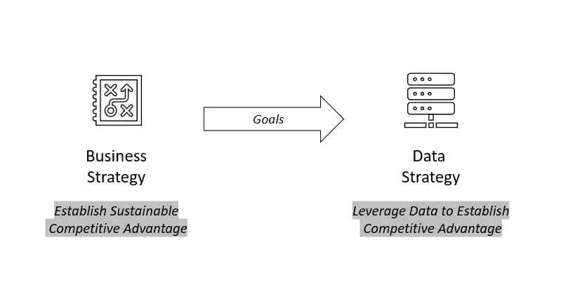
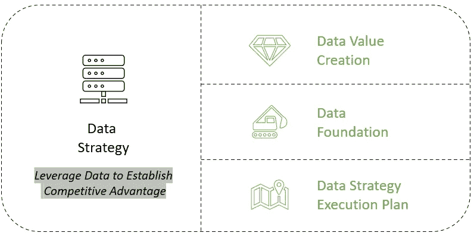
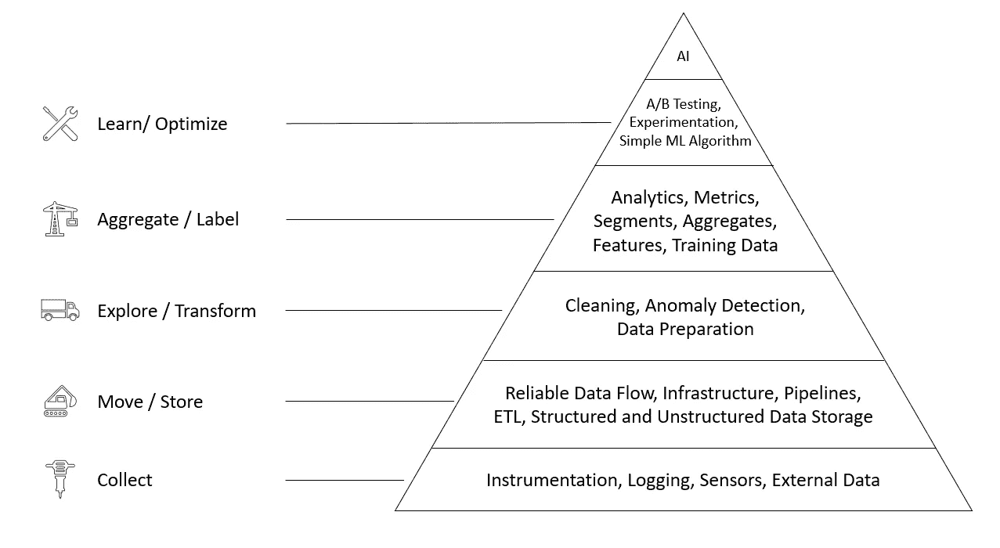

# 为什么需要数据策略？

> 原文：<https://towardsdatascience.com/why-do-you-need-a-data-strategy-f9ad8a66ba51>

# 为什么需要数据策略？

在许多组织中，数据已经成为董事会级别的话题。在您的组织中，您(很可能)有一个适当的业务战略来定义如何实现和保持可持续的竞争优势。然而，大多数组织还没有一个关于如何从数据中提取正确价值以建立竞争优势的战略。

照片由[盒装水更好](https://unsplash.com/@boxedwater?utm_source=medium&utm_medium=referral)上 [Unsplash](https://unsplash.com?utm_source=medium&utm_medium=referral)

正如迈克尔·波特(Michael Porter)在 1996 年对 T1 所做的著名解释，一个公司只有在能够创造出一种可以保持的差异时，才能超越竞争对手。这种差异是相对于竞争对手的优势，也是*可持续发展的优势*。此外，现代商业战略非常注重多样化。数据和由数据推动的创新无疑是可以创造额外竞争优势的主要支柱之一。这正是您需要数据策略的原因。您的数据策略应该定义组织如何将数据作为资产进行管理。

业务战略和数据战略之间的关系(图表由作者提供)

制定任何战略都是一项具有挑战性的任务。也许与其说它是科学，不如说它是一门艺术。此外，数据策略是一个相当新的主题，关于这个主题的资源非常少。因此，明确定义制定数据战略的目标非常重要。*定义要从数据中提取哪些值、提取这些值所需的元素以及确保成功实施数据策略的步骤是数据策略的三个主要目标。*这些将在下面详细解释。

数据策略的组成部分(图表由作者提供)

**数据价值创造**:这无疑是构建数据战略的起点之一。在高层次上，这个过程应该分为两个部分。首先，我们需要理解(也许想象一点)我们可以从数据中创造的所有可能的价值。当然，这意味着我们需要对业务领域和我们拥有或能够获得的数据有深入的了解。第二步，就是做出正确的选择。有了这些选择，你就能让你的公司在市场上处于一个特殊的位置。

此外，价值可以有不同的形式。例如，您可以提供由数据驱动的产品或服务。您还可以通过数据支持的新功能来强化当前产品或服务的现有地位。这些功能往往非常独特，可以帮助您从基于成本的定价转向差异化或基于价值的定价。第三，你可以使用数据来改善内部业务流程(尽管运营效率是否真的是战略的一部分是一个长期存在争议的话题)。

数据价值创造(作者图表)

**数据基础:**这一部分包括您在组织中需要的所有拼图，以实现从数据中提取的选定值。数据架构、数据管道、人工智能和机器学习算法、组织和能力、基础设施、数据质量控制、数据治理以及数据管理的所有其他基本元素，这些都是高效提取数据价值所必需的。这是一个广泛的话题，我想写一篇未来的文章来为这个话题带来更多的结构。不过，我会参考一个中等经典，[Monica Rogati 的](https://medium.com/hackernoon/the-ai-hierarchy-of-needs-18f111fcc007)人工智能需求层次(2017)。这篇文章总结了实现人工智能所需的所有数据基础的需求，确实超前了。

数据基础(来源:“人工智能需求层次”莫妮卡·罗加蒂)

构建这个视图也是一个两步的过程。首先，考虑到现有的策略(即 IT 策略)，您需要对您组织中的“现状”有一个清晰的了解。第二，您需要使用您所掌握的所有专业知识来可视化数据基础的“理想”状态。

**数据战略执行计划:**没有执行力的好战略是没有意义的。当一个策略失败时，你会想这是不是因为这个策略不好；或者执行力不足。这也是一个非常广泛的话题，值得写几篇文章。但是，以下三项是执行计划的基本要素:

1.  *目标和措施*详细说明如何将数据战略转化为短期和长期目标和措施。
2.  *组织结构*审查当前组织和(如果需要)支持实施我们的数据战略所需的理想组织。
3.  *组织文化*解释与组织紧密相关的文化价值观如何在数据战略中实施。

制定战略不是一件容易的事情。由于数据创新用例的快速发展，围绕数据的需求比以往任何时候都更加复杂。数据策略是一个新的话题，这篇文章总结了我目前对这个话题的想法。我希望你喜欢阅读这篇文章，如果你对这个话题有任何想法，我很乐意在评论区听到你的想法。