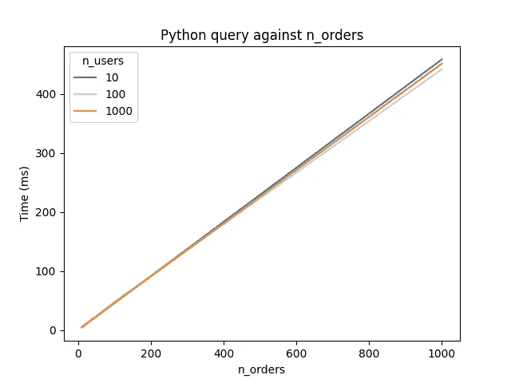
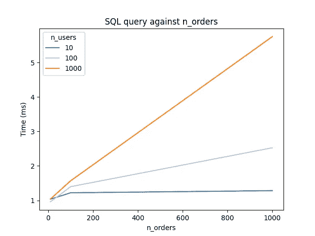
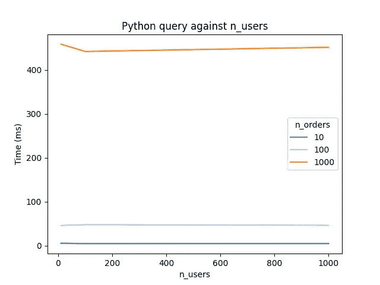
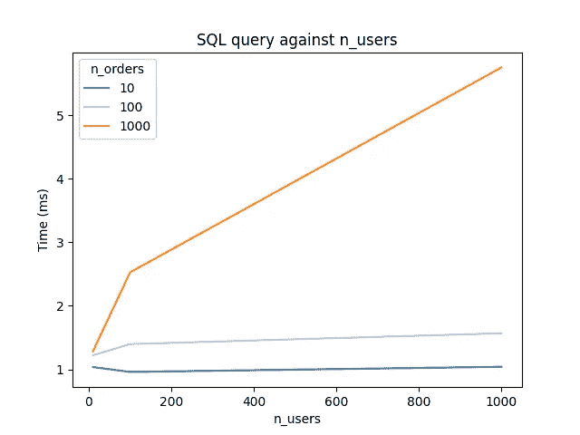

# 为什么每个软件工程师都应该学习 SQL

> 原文：<https://towardsdatascience.com/why-every-software-engineer-should-learn-sql-ae3d7192a8d9>

## 通过合理利用数据库来加速你的程序


托比亚斯·菲舍尔在 [Unsplash](https://unsplash.com?utm_source=medium&utm_medium=referral) 上拍摄的照片

几乎每个软件应用程序都依赖于将数据存储在可访问的地方。对于小的脚本和程序，这通常是在计算机的内存中，或者有时只是作为本地磁盘上的纯文本或二进制文件。

然而，较大的应用程序几乎肯定会使用存在于程序本身外部的数据库，而目前最流行的数据库技术是关系数据库。大多数关系数据库都可以使用结构化查询语言(SQL)进行查询，因此对于软件工程师来说，除了对 SQL 有基本的了解之外，还必须编写与数据库交互的高效代码。

如果你在想“哦，但是我已经知道如何从我的数据库中选择数据，肯定不会比这难太多”，再想想吧！我见过很多代码使用一个`for`循环来完成一项任务，而使用 SQL `JOIN`子句可以更快更简单地完成这项任务。

本文将使用一个非常基本的例子来展示正确使用 SQL 的强大功能。本文的代码是用 Python 编写的，使用的是 [SQLAlchemy](https://www.sqlalchemy.org/) ORM 库，但是我将包括程序打算模拟的原始 SQL，以便更加与语言无关。

虽然示例和测试看起来很简单，但这是根据我在生产中看到的真实代码改编的，所以请注意！

TL；DR:SQL`JOIN`实现要快得多。

# 这个例子

我将使用的例子是一个在线商店。该数据库将包含一个`users`表和一个`orders`表，其中将存储网站用户的信息以及这些用户下的任何订单。每个表都有一个 ID 列，而`orders`表包含一个`user_id`列，该列包含一个引用`users`表的外键。

## 计算机编程语言

## 结构化查询语言

# 测试设置

如您所见，每个`order`都有一个`payment_status`列，其中包含一个布尔值，表示订单是否成功支付。目的是测试一个函数，该函数找到至少有一个失败订单的用户，并返回一组描述这些用户的`User`对象。

测试将在本地 dockerised MySQL 数据库上运行，该数据库使用以下`docker-compose.yml`文件创建:

该数据库将预加载一些使用 Python `faker`库生成的用户和订单。该测试将针对 10、100 和 1000 个用户和订单的每种组合运行，并使用 Python `timeit`库对 100 多次迭代进行计时。

为了避免数据库缓存使用的不一致性，每个查询都将带有前缀`SQL_NO_CACHE`标志。

将有两个测试函数。我们将使用一个简单的 Python 实现，包括查询失败的订单，然后遍历结果，并在每次迭代中对`users`表运行 select 语句，以生成一组至少包含一个失败订单的`User`对象。第二个实现将使用 SQL `JOIN`和`DISTINCT`在单个查询中生成同一组用户。

函数的代码如下所示。

## 计算机编程语言

## 结构化查询语言

从代码中可以清楚地看出，使用 SQL `JOIN` 的实现将只进行一次数据库查询，而更简单的 Python 实现将进行最少 1 次最多 N 次查询，其中 N 是`orders`表中的行数。

# 结果呢

毫不奇怪，该函数的纯 SQL 实现比依赖 Python `for`循环的实现要快得多。

在 10 个用户和 10 个订单的情况下，Python 函数在 5.97 毫秒内完成，而 SQL 实现只花了 1.04 毫秒。随着`orders`表中行数的增加，运行时间也增加了，但 Python 的情况开始变得糟糕。

在 10 个用户和 1000 个订单的情况下，SQL 实现仍然保持在 1.28 毫秒，而 Python 实现每次测试花费了 458.49 毫秒！当然，这是因为 SQL 实现只进行了一次数据库调用，而 Python 实现进行了大约 500 次调用。

有趣的是，就运行时而言，`users`列中的行数对 Python 实现的影响很小，但对 SQL 实现的影响较大。这可能是因为 MySQL 服务器需要做更多的工作来在更大的列表中查找`DISTINCT`用户，而 Python 版本是逐个用户地构建`set`对象。

完整的结果可以在下面看到，还有一些图表显示了每个函数的性能如何随数据库中的行数而变化。

## 基准输出

```
n_users: 10, n_orders: 10
Python: 5.97ms, SQL: 1.04msn_users: 10, n_orders: 100
Python: 46.22ms, SQL: 1.22msn_users: 10, n_orders: 1,000
Python: 458.49ms, SQL: 1.28msn_users: 100, n_orders: 10
Python: 4.85ms, SQL: 0.96msn_users: 100, n_orders: 100
Python: 48.08ms, SQL: 1.40msn_users: 100, n_orders: 1,000
Python: 441.89ms, SQL: 2.53msn_users: 1,000, n_orders: 10
Python: 4.97ms, SQL: 1.04msn_users: 1,000, n_orders: 100
Python: 46.54ms, SQL: 1.57msn_users: 1,000, n_orders: 1,000
Python: 451.37ms, SQL: 5.75ms
```

## 图表



图片作者。



图片作者。



作者图片



作者图片

# 结论

虽然上述两种实现都可以被优化以获得更高的性能，但是 SQL 实现每次都会胜出。最棒的是，用的 SQL 其实很简单，谁都可以学！

网上有很多学习 SQL 的免费资源，所以如果你是一名软件工程师或者有抱负的人，就去那里开始学习吧！好处将是巨大的。

如果您喜欢这篇文章，您可能也会喜欢我的关于我的 Python 库`quiffen`的文章，这个库用于解析来自`QIF`文件的金融信息:

</parsing-qif-files-to-retrieve-financial-data-with-python-f599cc0d8c03>  

我也可以在[我的博客](http://isaacharrisholt.com/newsletter)，在[推特](https://twitter.com/IsaacHarrisHolt)和 [LinkedIn](https://www.linkedin.com/in/isaac-harris-holt/) 上找到我，所以如果你有任何问题，请随时聊天！

-艾萨克

另外，我在下面列出了我运行的基准测试的完整代码，所以你可以自己尝试一下！