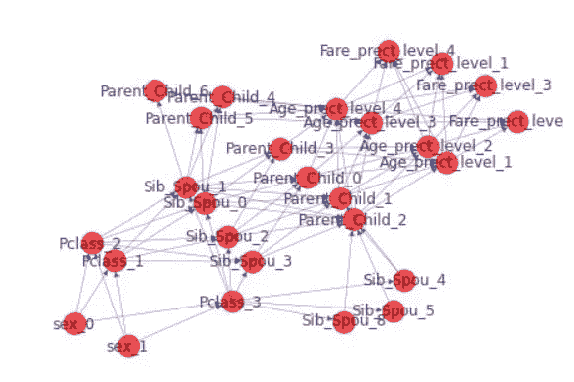
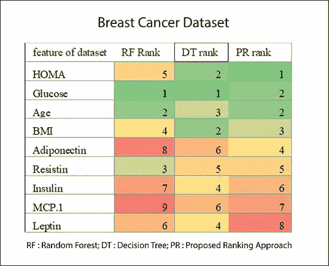
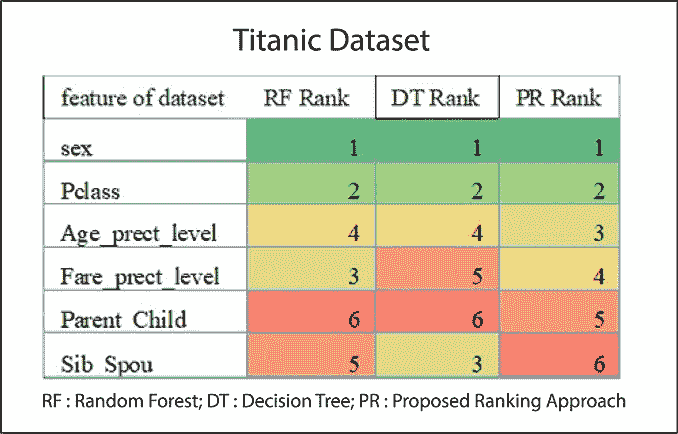
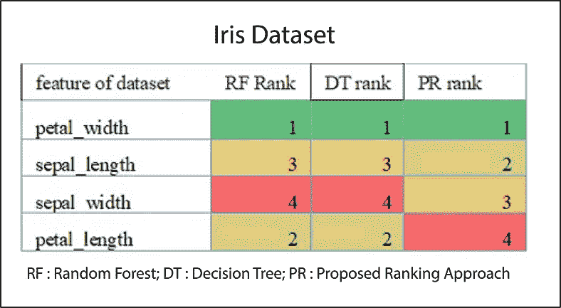
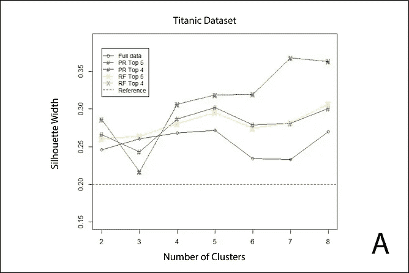
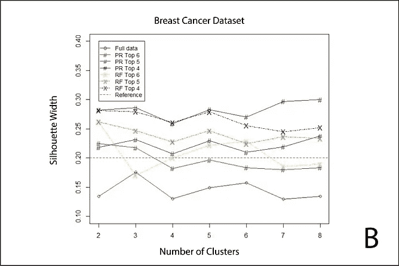
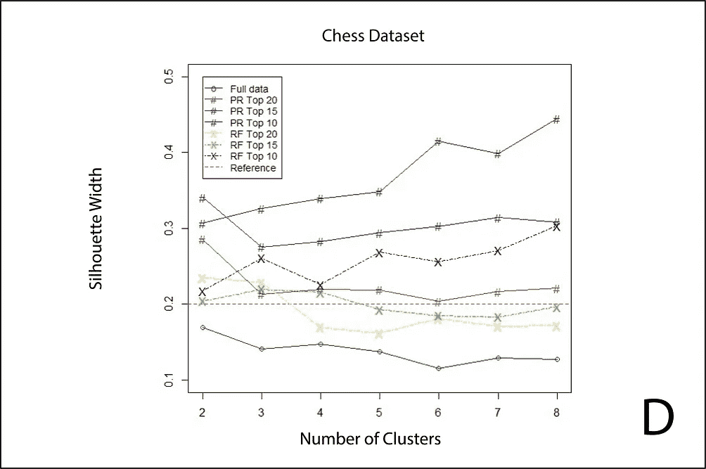
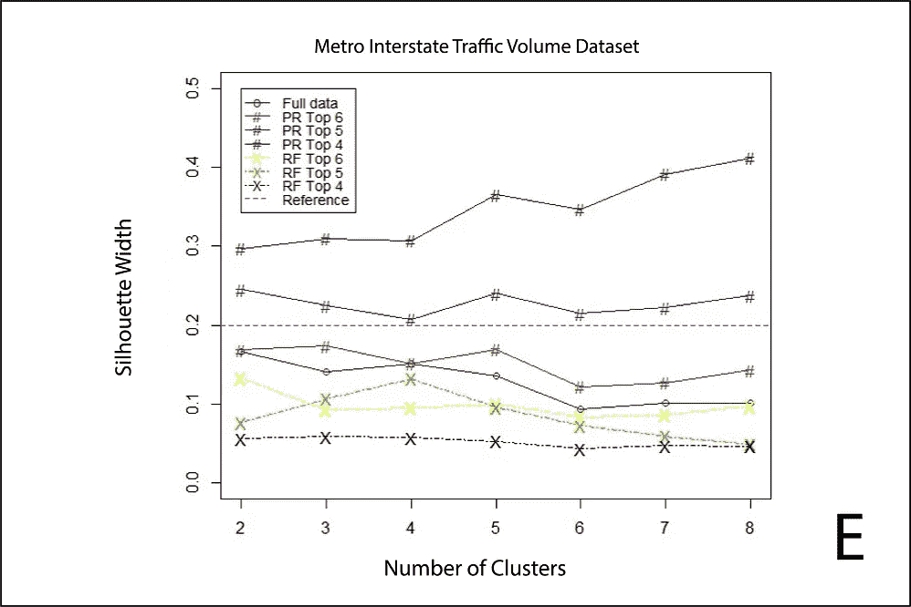

# 为什么图建模框架是无监督学习的未来

> 原文：<https://towardsdatascience.com/why-graph-modeling-frameworks-are-the-future-of-unsupervised-learning-2092b089caff>

## *用于在无监督学习场景中估计特征重要性的迭代图建模方法*

由拜耳制药公司的机器学习工程师 [Abhishek Singh](https://www.linkedin.com/in/abhishek-singh-8997a215/) ，前微软、摩根大通&公司、汇丰银行和拜耳制药公司的数字健康数据科学[Cristiana de aze vedo von Stosch 合著。](https://ch.linkedin.com/in/cristiana-de-azevedo)

在 Titanic 数据集上迭代有向图方法。图片作者。

*并非所有的特征都是相同的*。此外，特征确定重要性仍然是机器学习中的一个基本问题。

监督学习中的大多数特征重要性方法依赖于目标特征。然而，如果目标特征不存在，并且仅存在独立特征，则计算特征重要性是一个挑战。

像图建模这样的新技术已经揭示了在无监督学习应用中发现特征重要性。

# **图建模框架的案例**

如果对于样本数量而言，您有太多的特征，或者想要移除共线特征以改进模型，有许多技术可以应用于监督学习设置中，如决策树、随机森林等。

到目前为止，很少有方法可以识别无监督学习问题中的特征重要性。

基于特征重要性确定的特征选择将减少任何建模方法的处理时间。在无监督的学习设置中，特征重要性方法可以被应用于寻找最小的特征子集，该子集最好地从数据中揭示有趣的自然分组。

# **为特征重要性确定创建图建模框架的 7 个步骤**

想用这种方法创建自己的图形建模框架吗？按照我们下面的步骤，开始为你的无监督学习排名问题创建解决方案！

对于这个实验，我们应用了这些方法:我们提出的排序方法、随机森林、决策树和使用高尔距离的聚类。

对于数据，我们使用了来自 [UCI ML 数据集](https://archive.ics.uci.edu/ml/datasets.php) : [乳腺癌](http://archive.ics.uci.edu/ml/datasets/Breast+Cancer?ref=datanews.io)，[虹膜](https://archive.ics.uci.edu/ml/datasets/iris)，[免疫疗法](https://archive.ics.uci.edu/ml/datasets/Immunotherapy+Dataset)，[地铁州际交通](https://archive.ics.uci.edu/ml/datasets/Metro+Interstate+Traffic+Volume)的 4 个数据集，以及著名的[泰坦尼克号](https://www.openml.org/search?type=data&sort=runs&id=40945&status=active)个体乘客生存状态数据集。

这个实验是在 Python 中运行的，使用随机森林和决策树算法及其默认的内部参数。这个项目的代码是 GitHub 上的[。](https://github.com/abhisheksinghocp/Python_Graph)

# 准备数据

我们希望通过开始处理列在数据集中出现的顺序来创建一个有向图。这些柱子将成为我们的节点。有向边允许在任何数字和/或分类数据集上创建图形。

我们将把五个数据集的列转换成虚拟列，并包括基本列和属性。在没有分类列的情况下，可以将连续属性放入虚拟列中。

有向图的基本元素:节点和有向边。图片作者。

# **逐步创建您的图表**

要在无监督学习中利用图表方法创建用于特征选择的节点，请遵循以下方法。

1.  将所有列和行作为节点和边转换成有向图。将属性顺序设置为未排序([单元格#10](https://github.com/abhisheksinghocp/Python_Graph/blob/master/3_Iris_data_Graph_Creation_variable_selection.ipynb) )。
2.  使用 Google PageRank 计算每个节点的排名，确定排名最高的节点( [cell #14](https://github.com/abhisheksinghocp/Python_Graph/blob/master/3_Iris_data_Graph_Creation_variable_selection.ipynb) )。
3.  将此节点设置为图形中的起始节点。再次构建图表([单元格#14](https://github.com/abhisheksinghocp/Python_Graph/blob/master/3_Iris_data_Graph_Creation_variable_selection.ipynb) )。
4.  重复这个过程 *n-* 次。在这种情况下， *n* 是独立特征的数量。对于每次迭代，创建一个 m*n 大小的矩阵(m =节点数，n =迭代次数)。
5.  存储所有迭代中每个虚拟特征的最小分数。
6.  计算每组假人在每个特征级别的总和。
7.  按升序对模型的输出(特征)进行排序，并对其进行排名。

自己尝试一下，看看你的结果会把你带到哪里！

# **评估结果:监督学习与提议的排序方法**

在下图中，您可以看到在乳腺癌、Titanic 和 Iris 数据集中运行的特征排名结果。我们比较了两种监督方法(随机森林，决策树)和提出的排序方法。在每个表中，显示了由三种算法中的每一种算法识别的前 9、6 和 4 个特征。

排名结果显示在梯度热图表中。在我们的实验中，我们用深绿色表示最重要的特征，用红色表示最不重要的特征。

尽管这三种算法返回的特征排序略有不同，但所提出的排序方法能够在所有实验中识别排名最高的特征。

使用乳腺癌、Titanic 和 Iris 数据集的随机森林、决策树和提议的排序方法实验的排序结果。在每个表中，显示了由三种算法中的每一种算法识别的前 9、6 和 4 个特征。

# **聚类排名靠前的数据集**

为了进一步比较从我们提出的排序方法得到的排名靠前的结果与其他金标准方法的“适合度”，我们将使用不同的数据子集运行聚类算法，以比较聚类的可分性。

**引入聚类**

聚类采用整个数据集并识别集合的可分性。然而，聚类方法无法确定重要性的顺序。在群集技术中，数据集中的记录被组织到不同的逻辑分组中。数据分组的方式是同一组内的记录比组外的记录更相似。聚类根据相似性矩阵自动将数据集分成不同的组。

聚类方法使用逻辑分组。因此，不能提取关于特征重要性的信息。如果没有排名方法，就需要分析所有列的维度和数据项，这非常耗时。

类似地，聚类是比较所提出的排序方法和随机森林结果以及评估它们的可分性适合度的有用工具。

**不同数据集的聚类**

为了进一步分析我们的发现，我们使用三组排名靠前的特征来执行五组聚类实验。在我们的聚类算法中，我们使用高尔距离来计算两个实体之间的距离，这两个实体的属性中都有混合的分类值和数值。

聚类方法的有效性取决于“距离”的定义。如果这个属性不存在，就必须定义它，这并不容易，尤其是在多维场景中。

通过参考轮廓宽度，可以显示一个聚类中的点与相邻聚类的接近度。这样做提供了一种可视化评估和分析集群数量的方法。

例如，该度量的范围为[-1，1]。查看轮廓系数时，有几个关键点需要考虑。

*   Near +1:表示样本远离相邻聚类。
*   0:表示样本位于或非常接近两个相邻分类之间的判定边界。
*   Near -1:表示样本可能被分配到了错误的簇。

轮廓宽度图与每个聚类实验中的聚类数，对 5 个数据集的每个数据集运行不同的特征。使用绿色(o)标绘的所有特征，使用红色(#)标绘的建议分级方法的顶部特征，蓝色(#)标绘的建议分级方法的顶部特征，黄色(x)标绘的随机森林的顶部特征，绿色(x)标绘的随机森林的顶部特征。水平虚线表示轮廓宽度为 0.2 的基准阈值，这是“好的”可分离性的阈值，用于选择最佳的聚类数目:高于 0.2，模型具有好的可分离性，低于差的可分离性。离这个阈值越远，模型的可分性越好。

使用上图中的信息，数据显示所提出的分级方法产生了排名靠前的特征片段。当在聚类方法中使用时，而不是来自随机森林示例的排名靠前的特征段，可分性更容易识别。在该练习的所有运行中，使用所提出的排序方法的顶部特征的聚类实验的轮廓宽度系数总是高于使用来自随机森林方法的顶部特征时的轮廓宽度系数。

# **图形建模概要**

我们提出了一种新的图建模方法，该方法可以在没有目标特征的情况下识别数据集的特征重要性。在本文中，我们提出的排名方法使用数据集运行，目标特征列从其数据集“隐藏”，我们计算它们的特征重要性以及常用的监督方法(不隐藏目标列)。

在使用监督方法和提议的排序方法确定最有影响力的特征的排序之后，所有方法在其最高特征重要性顺序中包含大量重叠。

我们的框架试图用图建模来弥合监督和非监督特征选择方法之间的差距。在无监督的设置中实现我们提出的基于图的排序方法允许识别特征的重要性。与随机森林和决策树相比，这些排名靠前的功能还提供了更好的聚类。

虽然仍有许多研究要做，但基于图论的特征重要性识别可以扩展到半监督学习设置。

**利益冲突**

这项工作基于个人实验、研究和公开可用的数据集，与现任或前任雇主的数据没有任何联系。如有任何出版或专利目的，请联系作者。

**作者投稿**

[克里斯蒂安娜·德·阿泽维多·冯·斯托施](https://ch.linkedin.com/in/cristiana-de-azevedo)进行文献综述，撰写手稿，并提供概念指导。Abhishek Singh([Abhishek Singh](https://medium.com/u/2afe5c904a53?source=post_page-----2092b089caff--------------------------------))编写代码并运行实验。马修·埃利斯·普里查德编辑了这篇文章。