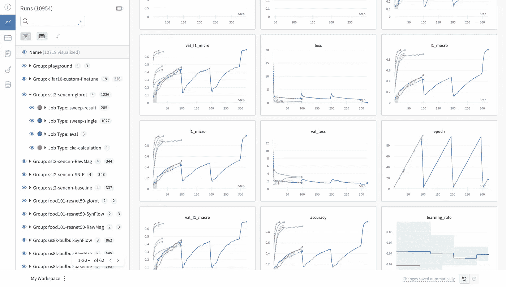

# 为什么我在机器学习博士研究中使用权重和偏差

> 原文：<https://towardsdatascience.com/why-i-use-weights-biases-for-my-machine-learning-ph-d-research-11ab2fe16956>

## 实验跟踪、超参数优化、私人托管

照片由[弗雷迪婚姻](https://unsplash.com/@fredmarriage?utm_source=medium&utm_medium=referral)在 [Unsplash](https://unsplash.com?utm_source=medium&utm_medium=referral)

让机器学习变得更容易的工具的数量正在增长。在典型项目的所有阶段，我们可以利用专用软件来获得洞察力。我们可以监控我们的培训渠道，观察部署过程，自动进行再培训，并跟踪我们的实验。尤其是最后一类，实验跟踪，随着越来越多的专用工具的引入，已经获得了关注。海王星。艾已经收集了一份[概述 15(！)不同的 ML 实验管理工具](https://neptune.ai/blog/best-ml-experiment-tracking-tools)。

Neptune 概述中涉及的工具之一是 Weights & Biases，通常缩写为 W&B。如果我没有弄错的话，我想我一直在使用这个工具，当时它还在 0.9 版本中。在开始我的 ML 博士研究后，我开始更加欣赏 W&B 提供的好处，并且我已经在我参与的几乎所有项目中使用了它。该软件是成熟的，与任何 python 兼容，并帮助我理解和比较我的实验结果。在下面，我列出了这个工具对任何一个 ML 研究者都有价值的主要原因。

## 跨不同框架的实验跟踪

很容易，这是我如此看重 Weights & Biases 框架的首要原因:它允许用户跟踪他们的实验，而不管使用的是什么机器学习框架。与所有主流 ML 框架(TF、PyTorch、sklearn 等)的原生集成。)意味着我们可以在一个地方收集来自 Jupyter 笔记本、TensorFlow 脚本、PyTorch 脚本、基于 Sklearn 的代码和任何其他库的结果。这个特性的有用性很难被夸大:我们有一个单独的空间来收集所有的日志和结果！我们不再需要手动跟踪实验 A 的纯文本日志的存储位置，以及这个位置是否不同于实验 b 的位置，非常方便简单。

wandb 跟踪工具的集成非常简单。我们可以通过在适当的地方添加几行代码来快速更新预先存在的脚本。为了展示这个过程，请看下面的脚本。它显示了测井前的一个(简单)实验，带有权重和偏差:

升级这个脚本以支持使用权重和偏差进行日志记录非常简单。在为 wandb 包(Weights & Biases python 库)添加了一个额外的 import 语句后，我们登录我们的(免费！)账户在第 4 行。然后，在第 21 到 24 行，我们利用集成回调来记录训练进度，并利用 *wandb.log* 语句来手动记录测试结果:

除了跟踪原始实验结果，如测试分数，W&B 还捕获元数据(即关于数据如何产生的数据)。这一点使我想到了下面的原因。

## 元数据跟踪和查询

除了跟踪实际数据——度量、预测甚至梯度——权重和偏差库还跟踪使用的计算单位、实验的持续时间和开始命令。乍一看，这些信息似乎只是一个很好的好处，但没有什么真正有用的。但是，我们用户可以通过 python 代码查询 W&B 服务器。

通过一个简短的脚本，我们可以收集关于实验的统计数据，例如我们使用的计算小时数，或者根据用户定义的标准对单次运行进行排名。自动查询这些数据的能力使我能够收集有关我的计算使用情况的统计数据。根据计算使用情况，我可以得出我的实验将花费的金额。在这里，一个小时的花费可能不到一美元，但是一个小时的计算是远远不够的。特别是当我优化 hyperparameter 时(见下面的列表)，我很快积累了数百个小时。而且这只是针对一个单一的研究思路。因此，你阅读我的博客帖子有助于我支付任何即将到来的计算账单。谢谢！

## 透明性、再现性和可理解性

最终，我们希望发表研究成果，部署模型。尤其是对于前者，对整个实验有一个透明的视角可以让其他人理解和验证你所做的是正确的。任何人都可以输入一些好看的数字——比如说，98 %的准确率——但只有当硬结果支持这一点时，它才是可信的。

默认情况下，记录到 Weights & Biases 的实验是私人的，这意味着只有你和你的团队成员可以看到它们。然而，为了增加透明度，实验可以公开，特别是在提交作品发表时。有了这个设置，任何有链接的人都可以访问你的结果并验证它们。

即使我们只为自己记录数据，我们也会从 Weights & Biases 提供的透明度中受益。我们可以看到参数(批量大小、时期、学习率等。)我们解析我们的脚本，可视化它们产生的结果，并在任何时候(以后)从中获得洞察力。最好的是，我们甚至可以使用我们存储的信息来重现结果！

## 交互式强大的图形用户界面

虽然 W&B 可以通过其 API 进行交互，但我更经常使用基于浏览器的界面。它让我轻松地浏览所有的实验。为了增加清晰度，在开始加权和偏差时，我指定了实验的组和工作类型。第一个特性允许我在 UI 中对实验进行分组；后者进一步将运行划分为更精细的类别。为了给你一个看起来像什么的例子，看下面的截图:

在左边，我们看到许多(事实上超过 10k！)实验列举。如果我没有把它们归类到有意义的组中，我很快就会失去这个概述！由于分组功能，我们可以看到运行被放置到子类别中。此外，在每个组中，我们可以通过将运行分成不同的作业类型来增加更多的粒度层。最实际是，这将是“训练”或“评估”在上面的截图中，我在启动脚本时使用了 *job_type* 参数来区分实际的训练运行和助手实验。如果我把这些助手作为训练的一部分，我会大大减慢它的速度。然而，作为一个独立脚本的一部分，这些额外的信息——实际上是细微之处——可以事后收集，并与已完成的实验联系起来。

值得注意的是，交互式 GUI 使得基于许多标准组织实验变得容易。这个特性让我们获得更多的洞察力:我们可以看到哪些批量有效，找到适当数量的训练时期，或者查看扩充是否改进了度量。除了我在这里介绍的内容，Weights & Biases 还提供了更多有助于提高洞察力的特性。要了解更多信息，我建议浏览这个 ML 研究工具背后的人提供的示例笔记本，以获得实践经验。

## 它是免费的

这个论点很简短:W&B 是免费使用的，直到你达到一个公平的使用配额。在撰写本文时，您的数据大小可能不会超过 100 GB，但这已经是足够的容量了。超过这些限制，您可以花很少的钱购买额外的存储空间。

## 通过(免费)团队轻松协作

Weights & Biases 提供团队:不同的用户在一个项目上合作。对于学术研究和开源团体，团队可以免费创建。根据您的订阅级别，您可以创建的协作者和独特团队的数量会有所不同。共同点是团队成员可以将数据记录到单个项目中，使多个实验之间的协作变得轻而易举。

## 提供自托管服务

对于处理敏感数据的用户来说，有机会自己托管 W&B 应用程序。在撰写本文时，有三种托管软件的方式。首先，使用谷歌云或亚马逊网络服务。该选项导致在选择的云中运行定制的 W&B 版本。第二个选项类似，但使用 Weights & Biases 的云结构。

最后，最后一个选项最适合敏感数据和总体数据控制。尽管如此，它带来了必须提供底层资源和设置运行中的 W&B 实例的开销。最重要的是，必须监控存储容量，因为常规的每用户存储配额约为 100 GB。大量使用，例如在处理大型项目(GPT 风格、Neo 等)时。)，可能超过百万兆字节，并可能达到百万兆字节。因此，提前使用可扩展的数据系统。

总而言之，自托管路线非常适合处理敏感数据或需要完全控制记录数据的(学术研究)团队。因此，在研究小组处理企业数据(并利用 ML 工具)的典型情况下，ML 运营商应该考虑私人托管。

## 内置超参数优化

除了提供数不清的方法来记录所有数据类型，Weights & Biases 还提供了进行参数搜索的工具。请想一想:没有必要设置一个额外的服务(即搜索协调器)。相反，人们可以让 W&B 应用程序处理所有讨厌的东西。在进行了 k-fold 交叉验证的超参数搜索后，我可以向你保证 Weights & Biases 非常适合这种极端情况。如果你已经设置了 Optuna，那么继续使用它。但是如果到目前为止您一直在使用权重和偏差进行日志记录，但是希望扩展，那么可以尝试一下提供的优化工具。

由于参数优化是一项常见的实践——我敢打赌，它甚至可能是许多 ML 研究方向的标准实践——拥有一个结合了日志记录和参数研究的单一工具是一件幸事。此外，由于实验已经通过 W&B 记录，自然也要使用他们的优化框架。

这些是我喜欢使用 W&B 库进行 ML 研究的主要原因。如果你有另一个观点认为使用权重和偏好是一个极好的选择，那么请在评论中与我们分享！