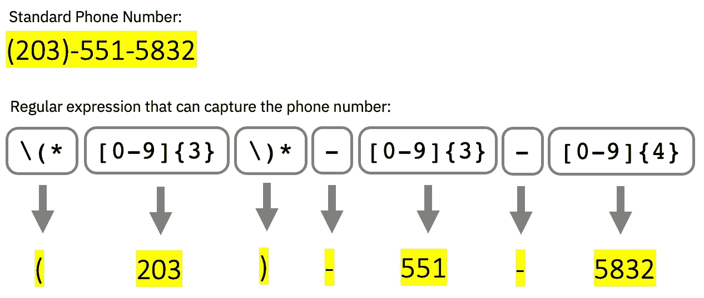
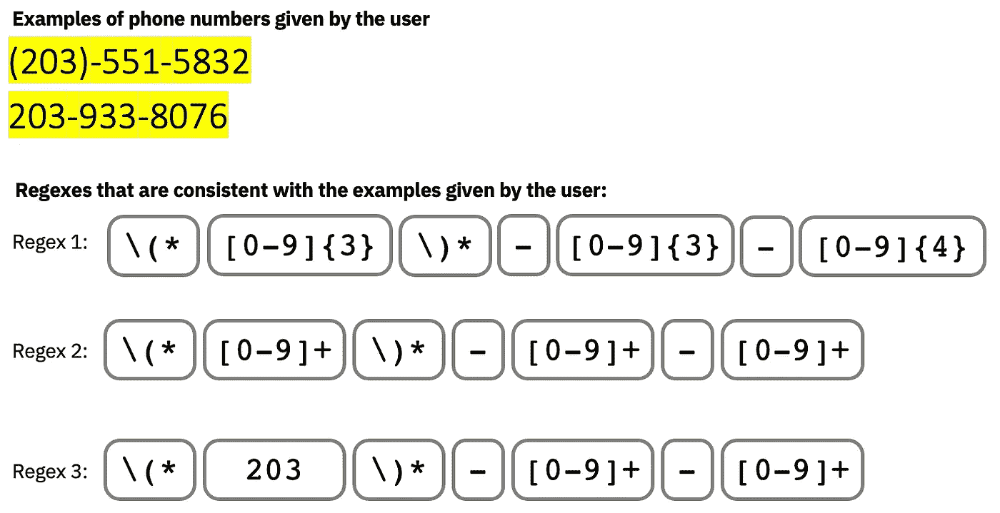
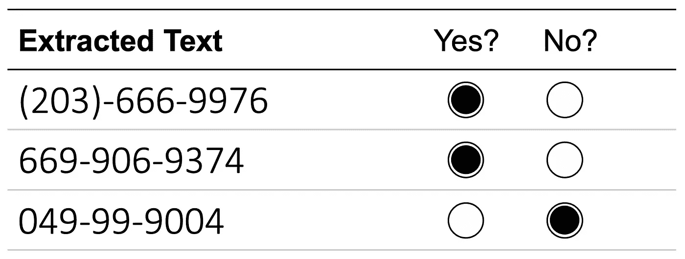
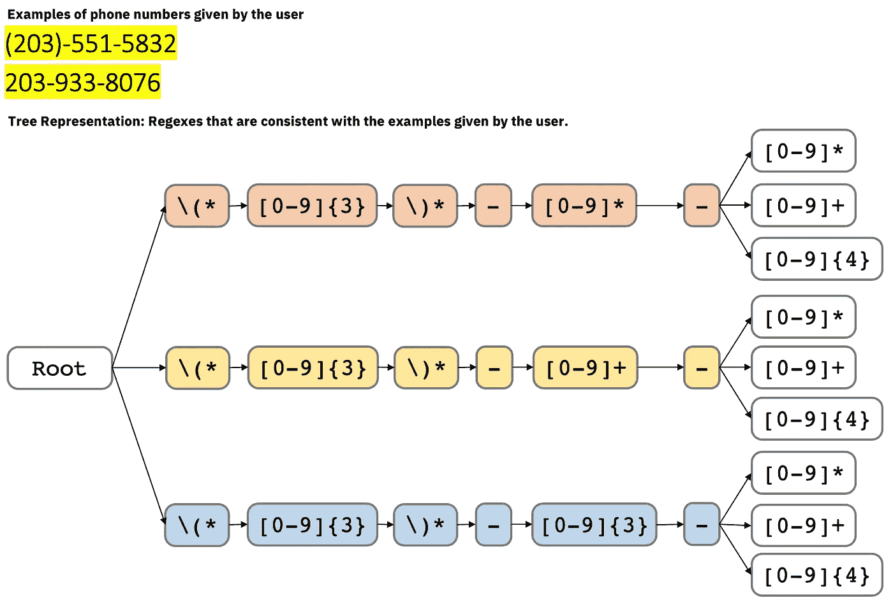

# 为什么自动生成代码很难？

> 原文：<https://towardsdatascience.com/why-is-automatically-generating-code-hard-88d9720ed2bd>

## 用程序合成自动生成代码的挑战

几年前，我迷上了一个叫做 [FlashExtract](https://www.microsoft.com/en-us/research/publication/flashextract-framework-data-extraction-examples/) 的工具。这是一个在 Microsoft Excel 中自动生成数据提取代码的工具。在 FlashExtract 中，用户可以突出显示他们想要从 Excel 表中提取的文本。FlashExtract 会自动提取 Excel 表格中的相似文本。

因此，如果您想提取工作表中的所有电话号码，您只需突出显示一个电话号码，工作表中的其余电话号码也会自动提取出来。这几乎就像魔术一样，因为你不必写任何代码或公式。你不必做手工工作，通过表和搜索所有的电话号码。

从文档中提取电话号码。不过，FlashExtract 专门用于表格数据。图片作者。

## 程序合成

FlashExtract 使用一种叫做*程序合成*的技术来实现这种自动行为。**程序合成**指的是根据用户对程序行为的说明生成程序的技术。为了了解更多，我编写了自己的程序合成器，从文本文档中提取模式。在本文中，我想讨论我在开发用于数据提取的程序合成器时遇到的挑战。

## 用于数据提取的程序合成器

下面是我的程序合成器如何工作的基本想法:

图片作者。

程序合成器生成某种语言的程序，如正则表达式、Python、Java 等。我的合成器用正则表达式(regexe)生成程序，因为 regexe 通常用于查找文本中的子串匹配。

所以，这里有一个正则表达式可以捕获电话号码:

图片作者。

然而，电话号码可能比这复杂得多。可能还有其他符号，如代表国家代码的“+”或表示区号的括号。为了捕捉所有这些可能性，合成器从一组预定义的正则表达式中学习一个正则表达式:

图片作者。

预定义的正则表达式可以有任何指定匹配正则表达式长度的限定符*。以下是合成器学习的量词类型:*

图片作者。

合成器的目标语言可以描述为预定义的正则表达式和字符串文字的模式。

## 生成正则表达式的挑战

给定上面的目标语言，程序合成然后将生成程序，具体地说，在这种情况下是正则表达式，它与用户的文本示例(即用户提供的电话号码)一致。如果一个正则表达式捕获了所有用户提供的电话号码，那么它就是**一致的**。

假设用户提供了两个电话号码的例子。程序合成器可以生成*许多一致的正则表达式*:

图片作者。

以上是程序合成器生成的正则表达式示例。Regex 1、2 和 3 捕获用户提供的所有电话号码示例。注意，一些生成的正则表达式可能过于笼统。Regex 2 捕获电话号码。但是，Regex 2 也可以捕获社会安全号(SSN)，例如“049–99–8933”。其他生成的 Regex 可能过于具体，比如 Regex 3，它只捕获区号为“203”的电话号码。虽然 Regex 3 不能捕获诸如 SSN 之类的文本，但是它太具体了，不能按照用户的要求提取文档中所有的电话号码。

注意，即使只有两个电话号码的例子，程序合成器也可以生成许多可能的一致正则表达式。程序合成器如何确定选择哪个正则表达式？这个搜索问题在程序综合中引入了两个常见的挑战:

1.  我们如何选择一个真正符合用户意图的正则表达式？用户可能实际上想要非常具体的东西，比如区号为“203”的电话号码(参见 Regex 3)。或者用户可能想要所有的电话号码，而不考虑区号(参见 Regex 1)。虽然程序合成能够生成许多有效程序，但挑选一个与用户意图匹配的有效程序是程序合成的一个常见挑战。
2.  此外，我们必须想出一个策略来导航有效程序的大空间，以及有效地存储可能的程序。可能的程序数量是指数级的。如果我们让 **x** 成为我们语言中预定义正则表达式的最大数量，那么一个用户提供的 **n** 个令牌的例子将有最多**个 x^n** 个可能的正则表达式来捕获它。

更具体地说，程序合成的挑战实际上在于用户意图的*多样性*和程序空间的*难处理性*。克服这些挑战的常用技术如下:

*   消除用户意图的模糊性 **:** 获得有用的用户反馈，以确定用户的意图。
*   限制程序空间的棘手问题:一些技术通过以有效的方式表示候选程序的空间来克服棘手问题。其他策略包括使用试探法在搜索空间中导航。

## 用户意图不明确

作为输入的少量用户示例可能导致用户意图的模糊性。简单的策略有助于减少合成器的意外输出。一个简单的策略是向用户呈现或可视化所学习的程序，并允许他们直接编辑该程序。

此外，向用户呈现合成的程序和程序的提取输出还可以以应该提取什么的更精炼的示例的形式引出用户反馈。显示生成的程序有助于用户理解合成器如何解释他的输入，即生成的程序是太普通还是太具体，或者可能正好合适。

获得更多用户输入的另一个简单方法是*间接*让用户与合成器的当前输出进行交互。下面是合成器如何引发这种反馈的界面:

图片作者。

上面的一组问题是从学习过的正则表达式中提取出来的。当用户对 SSN“049–99–9004”回答“否”并对电话号码回答“是”时，这将通知合成器不要生成也捕获 SSN 的正则表达式。它还教导合成器不要创建对特定区号(如“203”)过于具体的正则表达式。

## 程序空间的难解性

处理指数级大量有效候选节目的一种策略是有效地表示可能的节目。在我们生成的正则表达式的例子中，许多正则表达式共享相同的子表达式:

图片作者。

我们可以通过将可能的正则表达式存储为树来利用这种观察，其中(1)树中的每个节点都是预定义的正则表达式或文字，以及(2)从根节点到任何叶节点的任何路径都形成与用户提供的示例一致的正则表达式。

图片作者。

在上面的图像中，合成器基本上表示了树结构中正则表达式的可能空间，因此具有相同起始子表达式的正则表达式用相同的节点表示。将正则表达式的空间表示为树允许合成器生成大量有效的正则表达式，而不必在内存中枚举它们。

处理可能节目的大空间的另一个策略是设计一些搜索策略，以便能够快速导航该空间。在程序合成中，有几种搜索技术可用，最简单和最天真的是暴力搜索。其他更有效的搜索技术包括使用版本空间代数、机器学习和概率推理。你可以在这里阅读更多关于这些技术[。](https://www.microsoft.com/en-us/research/publication/dimensions-program-synthesis/)

## 结论

在本文中，我解释了为什么为数据提取自动生成正则表达式具有挑战性。这些挑战在开发程序合成器时很常见。我还讨论了处理这些问题的一些解决方案。要阅读关于程序合成器实现的更多细节，请查看我在这里为 IBM 制作的一个程序合成器，我在一份研究出版物中描述了它:[https://dl.acm.org/doi/10.1145/3025453.3025540](https://dl.acm.org/doi/10.1145/3025453.3025540)。

**截至 2022 年更新:** SEER 现采用为 ***模式归纳*** 可以在 IBM Cloud 上免费试用:[https://Maeda-Han . medium . com/Pattern-Induction-what-is-a-Pattern-part-1-79 ee 1 BD 5 ADC 6](https://maeda-han.medium.com/pattern-induction-what-is-a-pattern-part-1-79ee1bd5adc6)

***前田花非写的。***