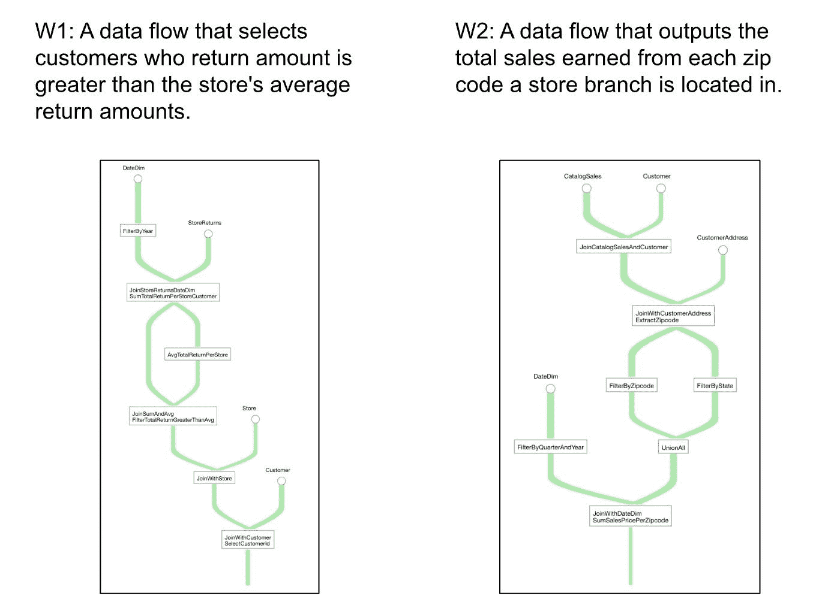
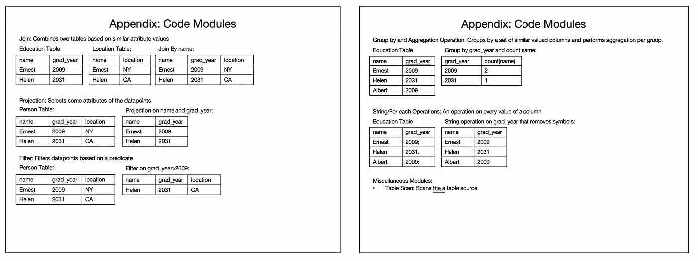
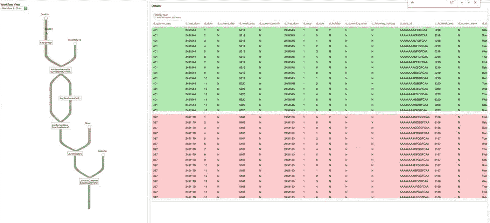
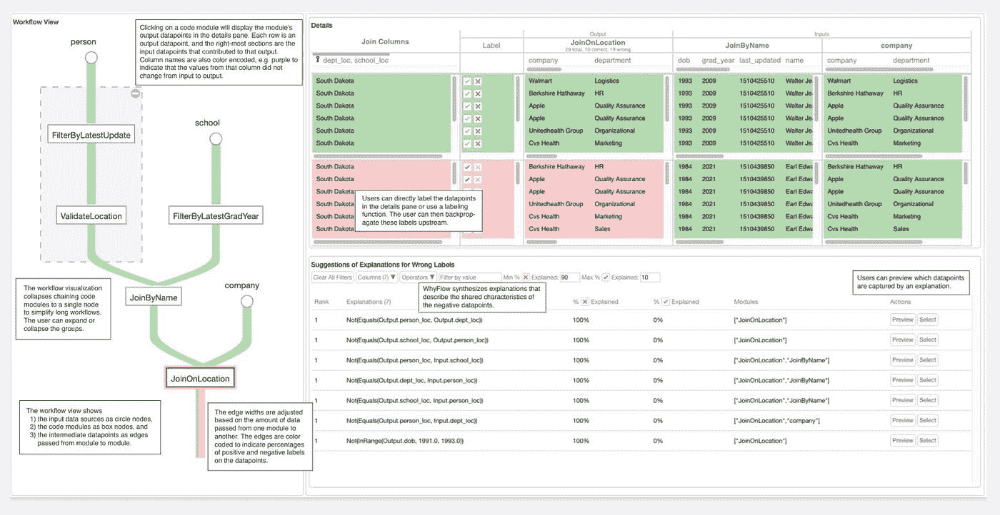
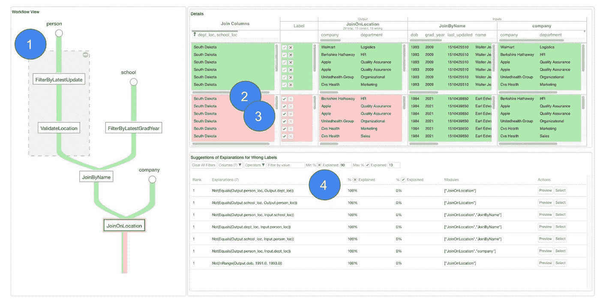

# 为什么调试数据流很难？

> 原文：<https://towardsdatascience.com/why-is-debugging-data-flows-hard-78aa0f1e095>

## 用户研究观察人类如何调试大数据流中的错误

“我输出中的这些错误来自哪里？!"在大型数据流的输出中发现错误是一个常见的问题。大型数据流接收多个数据集，这些数据集通过许多代码模块进行处理，这些代码模块可能由多个开发人员编写。

图片作者。

然而，在数据流中追踪错误的来源是困难的:

*   它通常是通过反复试验来完成的。
*   必须分析每个中间输出，因为错误会在整个数据流中传播。
*   不是错误源但传播错误的代码模块可能被误识别为错误源。

考虑到这些挑战，我们构建了一个名为 *WhyFlow* 的可视化交互式工具，帮助用户识别数据流中传播错误的模块。在建立 WhyFlow 之后，我们进行了一项用户研究，我们要求用户识别小玩具数据流中的错误。

*虽然给用户提供了小的玩具数据流，但我们发现非常有趣的是，即使使用可视化工具处理带有简单错误的小玩具数据流，用户(都是计算机科学专业的高材生)也发现完成这些调试任务非常耗时。*

在本文中，我们希望深入研究我们给用户的具体任务，检查它们，并展示为什么我们认为即使在今天，调试数据流仍然是一件具有挑战性的事情。

# 什么是数据流？

连接客户和商店表的迷你数据流示例。对于每个模块，显示了中间输出数据点。图片作者[作者](https://www.proquest.com/openview/01f09ca188f1f1039d55025cb9b2ea2c/1.pdf?pq-origsite=gscholar&cbl=18750&diss=y)。

数据流包含处理、转换和联接数据的代码模块。输入数据源从左到右流经数据流。该数据流连接两个数据库表， **Customer** 和 **Store** ，然后在数据流的末尾，它计算每个位置的人数。

**客户**模块读取客户表中的位置等个人信息，而**商店**模块读取包含特定商店信息的商店表。数据流使用 **ValidateLocation** 模块清理客户表中的位置细节，然后**innerjoinolocation**模块通过当前位置字段连接两个表。最后，工作流使用 **GroupbyLocationCount** 模块计算某个位置内存在多少个匹配。

# 错误如何传播到数据流中

将数据流的最终输出用于其他目的的用户可能会捕捉到错误的输出。由于以下原因，错误会传播到数据流

1.  故障代码模块或
2.  由于上游故障代码模块导致的不正确输入。

假设一个商店经理注意到有一个错误的记录，记录中的商店位置不正确。管理器通知开发人员，以便修复传播错误的模块。在此示例中，数据流在联接模块中有一个错误，该模块中出现了左联接，而不是内联接。

其中一个模块中出现错误的数据流，导致错误向下游传播到最终输出。用户在输出端捕捉到错误。图片由[作者](https://www.proquest.com/openview/01f09ca188f1f1039d55025cb9b2ea2c/1.pdf?pq-origsite=gscholar&cbl=18750&diss=y)提供。

虽然这种数据流有点小，总共只有 5 个代码模块和不到 50 个数据点，但我们希望用户能够轻松地调试这种数据流中出现的错误。

然而，当我们将这些数据流的调试任务交给人类时，我们发现这是一项耗时的任务。我们甚至为他们提供了自动生成的错误数据点解释和易于理解的数据点可视化，以帮助用户进行调试。

在下文中，我将描述我们进行的用户研究，我们要求用户扮演开发人员的角色，他们需要识别通过数据流传播的错误的来源。我们从观察中发现，即使在很小的数据流中调试错误也是非常耗时和具有挑战性的。

# 用户研究:实验设置

我们招募了 10 名参与者。在实验中，我们让用户扮演一个调试器的角色，这个调试器必须找出数据流中的错误。

实验前给用户的一些教学指南。图片作者。

## 数据流

我们的用户看到了两个数据流。这两个数据流是从[TPC-决策支持(TPC-DS)](https://www.tpc.org/tpcds/#:~:text=TPC%2DDS%20is%20a%20decision%20support%20benchmark%20that%20models%20several,general%20purpose%20decision%20support%20system.) 基准查询和数据集复制的。TPC-DS 基准测试广泛应用于系统研究和行业，用于评估通用决策支持系统和大数据系统。

图片作者。

在实验开始时，我们向参与者提供了没有任何错误的数据流 W1 和 W2，并要求他们描述每个代码模块的预期操作，并识别它所操作的列。这一练习有助于参与者熟悉数据流。

## 所有可能的代码模块

所有的用户都上过数据库应用入门课程。虽然参与者熟悉标准的关系操作符，但是他们不熟悉它们是如何在数据流中实现的。在教程中，我们预先向用户提供了所有可能的代码模块的空间知识。

图片作者。

我们发现这是必要的，因为当我们在没有告诉他们可能的代码模块的空间的情况下运行初始试点用户研究时，一些用户花了 4 个多小时试图完成一个调试任务。大多数用户研究对一个人的限制通常建议不要超过 2 小时。

## 错误类别和可能的错误

此外，我们还提供了可能引入错误的空间。这也帮助我们将每个用户的时间限制在 2 小时。

错误的示例包括重复错误、不正确的筛选器谓词、不正确的空值处理、不正确的字符串操作或不正确的字符串常量操作数，或者用左连接替换了内部连接。具体地说，以下是引入数据流 W1 和 W2 的可能误差:

1.过滤器错误:这些错误会修改过滤器操作，使其在输出中选择正确和不正确的值。

2.联接类型错误:这些错误会修改联接类型，用完整的外部联接替换内部联接。

3.连接列错误:这些错误会修改连接操作的参数，导致连接操作在不正确的列上进行。

我们没有涵盖的错误是分组和聚合代码模块中的错误，或者是涉及丢弃数据的错误(因为我们局限于数据流的特定类型的历史数据血统，称为数据流的*why-出处*，它不维护关于被丢弃的数据点的信息)。

图片作者。

当一个代码模块中出现错误时，该错误会传播到下游的其他代码模块。然后，错误在每个下游代码模块中有不同的表现。我们称之为*标签传播*。

我们在教程中向用户解释标签传播是如何工作的。图片作者。

为了简化实验，并让用户专注于调试而不是标记，我们预先标记了数据点，并向用户解释“数据流中的所有数据点都已经由识别出不正确数据点的领域专家进行了标记。”

## 将传统的手动调试与借助错误解释的调试进行比较

为了理解人类如何调试数据流中的错误，我们将该实验设置为用户对比研究。我们比较了用户在错误解释的帮助下进行调试(我们称之为 WhyFlow 的工具)和用户手动调试(基线工具)。在基线工具中，用户只限于单击简单数据流可视化中的模块，以表格格式查看每个代码模块的输出数据点。

手动调试数据流的接口(我们的基线)。图片作者。

WhyFlow 与基线的不同之处在于，它使用户能够直观地检查数据流。它的核心特性是在不同的代码模块中由不正确的数据点产生的错误解释。错误的解释是谓词，它捕获导致最终输出错误的数据点。WhyFlow 为每个代码模块生成解释。解释有助于用户快速识别错误数据点的共有特征。例如，如果一个代码模块有一个错误，其中发生了左连接而不是内连接，那么错误数据点将包含不相等的列值，而内连接应该发生在该处。要了解更多解释是如何产生的，你可以在这里阅读。

WhyFlow 界面截图。联接模块中有一个错误，所有错误数据点的值都不相等，而内部联接应该出现在该处。图片作者。

*我们假设，与基线相比，WhyFlow 用户可以在更短的时间内更准确地识别错误并选择合适的解释。*

## 用户任务

在实验的开始，我们用一个快速教程和一些模拟调试任务对每个参与者进行了工具培训。然后，我们向参与者展示 WhyFlow 中数据流 W1 和 W2 的正确执行，并要求他们描述每个代码模块的预期操作，并识别它所操作的列。

然后，我们在这些数据流 W1 和 W2 中引入错误，并要求用户调试错误并确定错误的来源。如果他们使用的是 WhyFlow，我们会问他们，“在描述错误出现的数据的列中选择一个解释。”如果他们使用基线，我们会问他们，“对观察到的误差给出一个解释。描述出现错误的数据，例如，包括错误列和不正确数据共有的特征。”换句话说，要完成一个调试任务，用户必须要么*选择*一个对 WhyFlow 错误的解释，要么*提供*一个对基线的解释。

对于每个条件，为什么流和基线，每个参与者都有三个针对不同错误类别的调试任务。我们随机排列了他们开始时的条件顺序和每个条件下的任务顺序。

用户研究中使用的 6 种不同的错误场景。错误以粗体和斜体显示。图片作者。

我们还要求用户在他们认为他们已经识别出有问题的模块、确定了错误类别，或者可以对错误的性质表达一些直觉时，大声思考并说出他们的想法。我们记录了这些事件发生的时间，以及用户在实验过程中所说的话。

# 对用户如何调试数据流错误的观察

在实验过程中，我们观察了用户在使用 WhyFlow 时如何调试数据流中的错误。他们的工作流程分为以下步骤:

1.  **高层数据流分析**:用户首先选择一个可疑模块。WhyFlow 显示代码模块的错误和正确数据点。
2.  **代码模块分析**:用户接着分析数据面板中的数据点。
3.  **假设并识别错误类别**:用户通过分析数据点来识别错误类别，例如“看起来像是**一个不正确的过滤谓词**导致值等于 *CT* ”。
4.  **错误解释**:用户通过查看错误数据点上生成的解释来确认他们假设的错误类别。在这种情况下，用户试图找到一个解释谓词，其本质上是说，例如“所有的错误数据点都有值 *CT* ”。

在每一步，我们记录下用户完成时的时间戳。

用户如何使用 WhyFlow 来调试错误:(1)高级数据流分析，(2)和(3)代码模块分析以及假设和识别错误类，以及(4)通过选择与错误类相关的错误解释来进行错误解释。图片作者。

## 大多数用户花了太多时间来完成调试任务(步骤 3 和 4)

对于每个用户，我们给出了完成调试任务的时间。我们标记每个错误类和工具的平均时间(B 代表基线，W 代表 WhyFlow)。错误识别错误类别或解释的用户用“x”字形而不是圆圈来区分。图片由作者提供(同样取自[此处](https://www.proquest.com/docview/2428045206))。

我们对用户完成调试任务的总时间进行了双向重复测量 ANOVA。我们没有发现显著的交互作用，也没有发现所用工具的显著主效应(为什么流与基线)。换句话说，WhyFlow 中自动生成的错误解释在帮助用户快速完成调试任务方面并没有显著的不同。

## 但是 WhyFlow 中的用户能够快速识别错误类别(步骤 3)

对于每个用户，我们给出识别错误类别的时间。图片由作者提供(同样取自[此处](https://www.proquest.com/docview/2428045206))。

我们对用户描述错误类别的持续时间进行了双向重复测量方差分析，将错误类别和使用的工具(WhyFlow vs Baseline)作为独立因素。错误类别既没有显著交互效应，也没有显著的主效应。我们确实发现了工具使用的显著主效应(F1，9 = 10.15，p = 0.01)。换句话说，用户用 WhyFlow 识别错误类花费的时间更少。除了连接类型错误，他们对错误的最初直觉比基线更准确。

## 完成调试任务的剩余大部分时间主要用于选择错误解释的任务(步骤 4)

对于每个用户，我们用 WhyFlow (W)来估计选择一个解释的时间，或者在基线(B)中提供一个解释，作为完成调试任务和描述错误类之间的时间差。不正确的解释用“x”字形标记，而不是用圆圈。图片作者(同样取自[此处](https://www.proquest.com/docview/2428045206))。

换句话说，大多数用户花了很多时间在 WhyFlow 中选择一个解释。具体来说，我们观察到用户花在 WhyFlow 中选择解释的时间与识别错误类别的时间一样多。三名用户评论说，“有很多解释。”一位用户说，“看到 1000 个解释，就好像是 1000 种不同类型的错误。”一些模块生成了多达 60 个解释。四个用户发现很难辨别建议的解释的质量，因为它们中的许多似乎彼此相似。

最终，WhyFlow 在帮助用户快速确定错误类别方面所提供的任何收益都会因为花费时间来搜索和选择适当的解释而丢失。我们估算了在 WhyFlow 中选择一个解释或在基线中提供一个解释的时间，作为完成调试任务(步骤 3 和 4)的总时间与描述错误类(步骤 3)的时间之差。

上图显示了每个用户的大概解释时间。这次我们再次进行了双向重复测量方差分析，我们发现了工具使用的显著主效应(F1，9 = 6.790，p = 0.028)。

## 大多数用户在 WhyFlow 生成的解释的帮助下选择了正确的解释(步骤 4)

我们发现用户使用 WhyFlow 比使用 Baseline 更频繁地选择正确的解释。有五个用户最初错误地识别了连接类型错误类，例如，认为错误类型是除连接错误类型之外的其他错误类型。但是这五个用户从 WhyFlow 生成的解释中选择了正确的解释，例如“错误的数据点具有不相等的 storeID ”,尽管该模块是对 storeID 执行连接的连接模块，因此它们应该相等。

按语言化错误类别的正确性和最终解释的正确性细分的用户百分比。图片作者(同样取自[此处](https://www.proquest.com/docview/2428045206))。

总的来说，我们的定量结果表明 WhyFlow 可以是一个有效的数据流调试工具，因为用户可以使用 WhyFlow 选择更准确的解释。

# 结论:为什么调试数据流中的错误具有挑战性

WhyFlow 面向调试数据流并试图确定最终输出中错误数据点原因的最终用户。WhyFlow 用谓词解释错误，并可视化数据流、输出的出处以及错误和正确数据点之间的差异。我们的结果表明，WhyFlow 使大多数用户能够准确地定位和交流故障。

但是为什么调试数据流中的错误仍然具有挑战性呢？一方面，我们发现提供自动生成的错误解释有助于用户识别错误类别的任务，尽管不一定有助于解释和选择错误的解释。调试数据流是一项耗时的任务，即使解释小数据流上的错误也是如此。用户研究中的数据流量很小，超过不超过 40 个代码模块，引入的错误有些简单。但是用户仍然花了很长时间来调试错误。

此外，我们的用户研究是有限的。现实世界的部署往往有我们的研究没有涵盖的其他方面:

*   **调试多个错误。**在我们的评估中，WhyFlow 针对数据流进行了测试，只引入了一个错误。然而，即使数据流中只引入了一个错误，我们的用户研究表明，这仍然是一个非常耗时的过程，因为 WhyFlow 用户平均总共需要大约一个小时来调试三个数据流中相当简单的错误。虽然调试数据流中的一个错误仍然具有挑战性，但实际上，数据流可能有多个错误。
*   **支持可解释的错误。** WhyFlow 的当前语言无法捕捉聚合错误。但是，在执行聚合的模块中可能会出现错误。此外，还存在可能丢失所需数据点的误差。在 WhyFlow 的帮助下，无法调试输出中缺失的数据点。

改进人工调试数据流中错误的方式肯定有很多机会。

详细论文:[https://openreview.net/forum?id=uO07BC54cW](https://openreview.net/forum?id=uO07BC54cW)