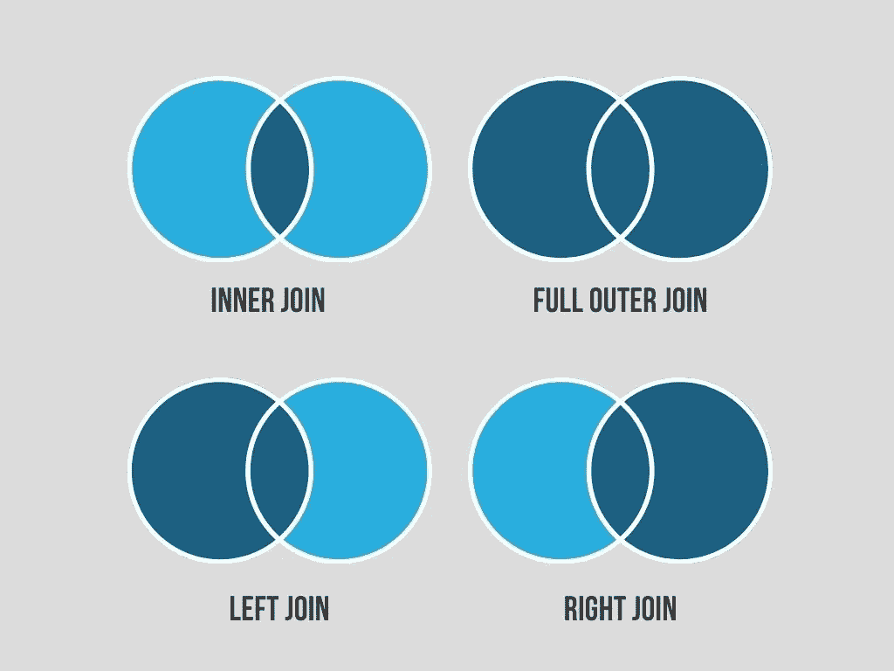

# 如何在您的数据科学职业生涯中使用 SQL 反连接

> 原文：<https://towardsdatascience.com/why-is-nobody-talking-about-sql-anti-joins-f970a5f6cb54>

## 数据科学

## 以及为什么你应该知道它们

作者图片

我经常在社交媒体上看到类似上面的图片。它们包括一条简短的消息，说明这些是“常用的 SQL 连接”。问题是这些帖子通常会忽略反连接。我相信反联接在你职业生涯的早期学习是很重要的，这样你就能意识到它们，以备不时之需。在这篇文章中，我想向您展示如何有效地使用反连接来快速获得您需要的数据洞察力。

我将使用这个 SQLite 沙盒数据库作为我的代码示例:【https://www.sql-practice.com/。

## 什么是反联接？

作者图片

在上图中，您可以看到一个反连接的可视化表示。反连接是指您希望保留原始表中的所有记录，但那些与另一个表匹配的记录除外。我在工作中从未使用过右反连接，左反连接通常适用于您的用例。事实上，我通常根本不使用右连接，因为只需切换表的顺序，就可以完成与左连接相同的事情。

## 使用代码的反联接示例

这是一个左反联接的例子。除了`WHERE`子句之外，它与左连接完全相同。这就是它与典型的左连接的区别。

上面的查询查找在 physicians 表中没有匹配的 physician_id 的所有入院。通过将上面示例中的 physician_id 列设置为 null，可以找到左侧表中所有在右侧表中没有匹配记录(null 值)的行。

在这个特殊的例子中，这将返回 0 行，因为表中有相同的医生。

## 什么时候应该使用反联接？

描述上面的查询示例应该会使用例变得清晰。在上面的代码中，您可以看到第一个 CTE(通用表表达式)将内科医生表过滤为普通外科医生。

然后将该表连接(使用反连接)到入院表，以查找所有不涉及普通外科医生的入院。从这个例子中，您可以看到，当您想要查找两个连接表之间所有不匹配的记录时，这种类型的连接非常有用。

为了亲自查看这些不匹配项，我们可以将上面的查询修改为一个左连接并显示所有列。您将看到，对于右边的表，不匹配的列将全部为空值。

快速注意:您可以在`WHERE`子句中引用任何列，它不必与您用来进行连接的列相同。

例如，您可以将 first_name 列替换为 physician_id，并获得与 antijoin_example2.sql 中显示的查询相同的结果。

也就是说，最佳实践是使用与连接中的列相同的列——我只是想指出这一点来帮助您理解连接在做什么。

## 当您应该使用 EXCEPT 运算符时

*如果您使用 Oracle SQL，本节仍然适用，只需将所有对* `*EXCEPT*` *运算符的引用替换为* `*MINUS*` *运算符即可。*

我可以听到一些人已经在问，“但是等等，`EXCEPT`操作符已经做了同样的事情。为什么我不应该直接使用那个运算符呢？”

如果您不确定`[EXCEPT](https://www.postgresqltutorial.com/postgresql-except/)` [操作符](https://www.postgresqltutorial.com/postgresql-except/)是什么，基本上它会获取一个表，并查找第一个表中不在第二个表中的所有记录。这与反联接的目的完全相同，但它们用于不同的场景:

*   当您只需要在两个表之间比较的列时，可以使用`EXCEPT`
*   当需要的列比使用`EXCEPT`操作符比较的列多时，使用反连接

如果我们在这个例子中使用了`EXCEPT`操作符，我们将不得不把这个表连接回它自己，这样就可以得到与原来的录取表相同的列数。

正如您所看到的，这只是导致了一个额外的步骤，代码更难理解，效率更低。您几乎总是希望避免将表连接回自身。

也就是说，`EXCEPT`操作符仍然有用，只是在使用`EXCEPT`操作符时，除了要比较的列之外，还需要获得额外的列。

**更新:**我在下面的文章中介绍了第三种反连接方法。如果您已经理解了如何使用`EXISTS`子子句，请跳到本文中的“如何将`EXISTS`子句用于反连接”一节。

 [## 了解 SQL EXISTS 子句

### 以及何时应该考虑使用它

medium.com](https://medium.com/learning-sql/understanding-the-sql-exist-clause-f3eaa3c2c34b) 

## 结论

现在您知道了如何以及何时使用反联接。这就像在左或右连接中添加一个`WHERE`子句一样简单😎

感谢阅读！

 [## 加入 Medium 并通过我的推荐链接支持我

### 作为一个媒体会员，你的会员费的一部分会给你阅读的作家，你可以完全接触到每一个故事…

medium.com](https://medium.com/@andreasmartinson/membership) 

如果你喜欢这篇文章，请通过 LinkedIn 与我联系，或者看看我的另一个故事:

 [## 三年来每天用 SQL 写作的 10 个快速 SQL 技巧

### 这些技巧解决了您作为数据专业人员将会遇到的常见 SQL 问题

towardsdatascience.com](/10-quick-sql-tips-after-writing-daily-in-sql-for-3-years-37bdba0637d0)  [## 5 个窗口函数示例，让您的 SQL 技能更上一层楼

### 如果你想掌握 SQL 中的数据操作，你需要理解窗口函数

towardsdatascience.com](/5-window-function-examples-to-take-your-sql-skills-to-the-next-level-2b3306650bb6) 

**参考文献**

1.  sql-practice.com(2022)，SQL Practice.com
2.  [PostgreSQL 除运算符](https://www.postgresqltutorial.com/postgresql-except/) (2022)，PostgreSQL 教程