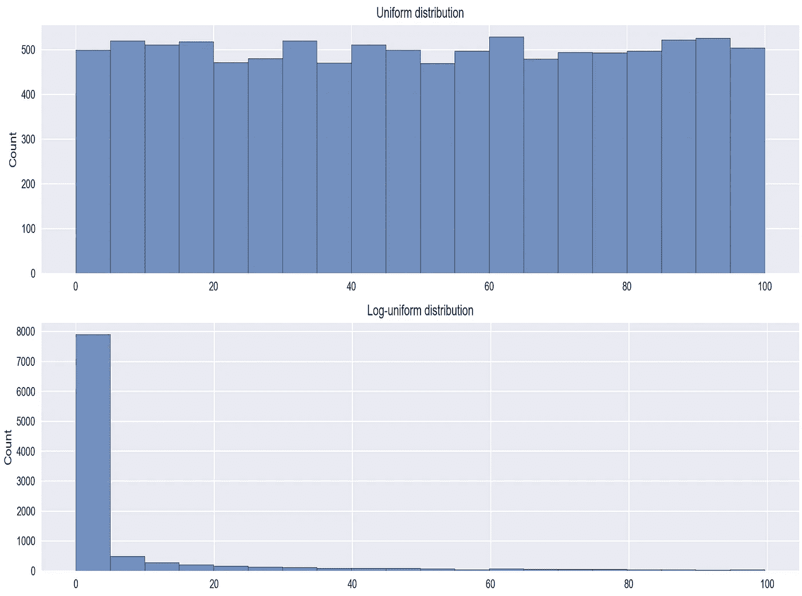
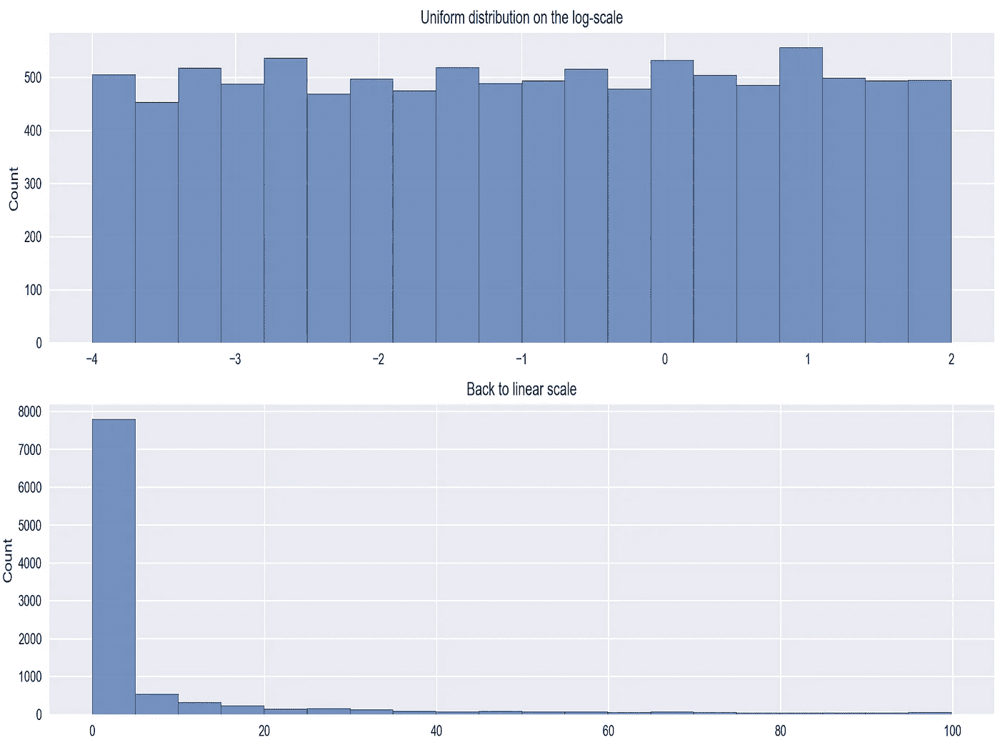

# 为什么对数均匀分布对超参数调整有用？

> 原文：<https://towardsdatascience.com/why-is-the-log-uniform-distribution-useful-for-hyperparameter-tuning-63c8d331698>


[菲利普·d·](https://unsplash.com/@filip42?utm_source=unsplash&utm_medium=referral&utm_content=creditCopyText)在 [Unsplash](https://unsplash.com/s/photos/spiral?utm_source=unsplash&utm_medium=referral&utm_content=creditCopyText) 上的照片

## 通过这个小小的改变来改进你的网格搜索

如果您使用过任何形式的网格搜索来调整模型的超参数，那么您很可能遇到过使用对数均匀分布的情况。

在网格搜索的最基本场景中，我们将超参数的可能值定义为一个列表。然而，当使用随机搜索或更高级的贝叶斯方法时，我们也可以使用统计分布来定义搜索空间。

您是否曾经想过，为什么一些超参数的范围是使用均匀分布定义的，而另一些则使用对数均匀分布？如果是这样，本文将回答这些问题。

# 均匀分布和对数均匀分布

在我们继续之前，让我们快速回顾一下这些发行版实际代表了什么。

**均匀分布**假设某一范围内所有值的概率相等。通常用 *a* 和 *b* 表示范围的下限和上限。超出该范围的值根本不可能发生。分布的概率密度函数(PDF)如下:


[来源](https://en.wikipedia.org/wiki/Continuous_uniform_distribution)

在**对数均匀分布**中，点在 *log(a)* 和 *log(b)* 之间均匀采样，其中 *log* 最常见的是以 10 为底的对数。

# 理论答案

TL；博士对这个有名无实的问题的回答是，对数均匀分布对于探索在几个数量级上变化的数值非常有用。

话虽如此，用一个具体的例子可能更容易理解这句话。假设我们正在调整一个[套索模型](https://scikit-learn.org/stable/modules/generated/sklearn.linear_model.Lasso.html)(不管是回归还是分类)。它有一个超参数`alpha`，决定正则化的强度——值越大，正则化越强。我们知道值应该≥ 0，没有上限。此外，使用`alpha` = 0 使模型等于普通逻辑回归，但是，由于数值原因，不建议在`scikit-learn`使用该值。

有了上面的信息，我们知道了对 *alpha* 的值的约束。但是我们不知道哪些值对模型和我们的数据最合适。这就是为什么我们想要有效地探索非常广泛的可能价值。对于我们的问题，让我们假设我们探索 0.0001 和 100 范围内的值。

使用对数标度和对数均匀分布的主要好处是，它允许我们在几个数量级上创建均匀分布的搜索空间。这是因为由于对数标度，从 1 到 10 的值与从 10 到 100 的值一样多。让我们理解这一点，并确保它变得清晰。重申:

*   在线性空间中，很明显，在第二个范围中会有更多的可能值，这仅仅是因为这个范围在线性空间中代表了更大的距离。后者的范围是前者的 9 倍。
*   在对数空间中，这两个范围的宽度相同，因为它们都是 10 的后续幂运算。

那么在实际中如何使用对数均匀分布呢？我们开始时不知道超参数的哪些值会产生良好的拟合。我们使用几个数量级的大空间进行搜索。通过这种方式，我们可以知道哪些价值观起作用。然后，我们可以重复这个过程，这一次，将可能值的范围缩小到产生良好匹配的值周围的区域。

# 手工编码示例

在本节中，我们将快速浏览一下这两个发行版，以巩固我们对它们之间联系的理解。首先，我们导入库。

然后，让我们定义分布的范围。如上例所示，我们使用 0.0001 和 100 作为下限和上限。此外，我们指定我们希望从每个分布中获得的随机生成值的数量。

在下一步中，我们从均匀分布和对数均匀分布中生成随机值。

我们使用了均匀分布的`numpy`实现，因为它比`scipy`中的实现更容易使用，后者需要传入`loc`和`scale`参数，而不是下限和上限。你可以在笔记本上看到一个`scipy`实现的例子(最后的链接)。然后，我们绘制随机生成的值的直方图来查看分布的形状。

我们可以立即看到分布的特征形状。在第一种情况下，0.0001 和 100 之间的每一个值都有相同的可能性。在第二种情况下，10 和 100 之间的值对应于所有生成值的大约 1/6，遵循对数标度的逻辑和边界值之间的幅度差。



作者图片

我们还深入探讨了均匀分布和对数均匀分布之间的关系。我们已经提到过，对数均匀分布在边界值的对数之间均匀采样。这正是我们在下面的代码片段中所做的。然后，我们通过对随机生成的值进行 10 次幂运算，将这些值放回到线性标度上。

在下图中，我们可以看到这些值在对数标度上均匀分布(0.0001 的对数为-4，而 100 的对数为 2)，在线性标度上呈对数均匀分布。



作者图片

最后，我们还可以验证对数均匀分布生成了一个均匀分布的搜索空间。

运行代码会产生以下摘要:

```
Number of values between 0.0001 and 0.001: 1659 
Number of values between 0.001 and 0.01: 1620 
Number of values between 10 and 100: 1614
```

每个箱中的观察值的数量大致相同，并且随着我们增加随机生成的值的数量，将收敛到相同的数量。因此，我们已经确认搜索空间是均匀分布的。

需要记住的一点是，我们没有设置种子，这意味着每次运行代码时，这些数字都会略有不同。

# 外卖食品

*   在对数均匀分布中，点在*对数(a)* 和*对数(b)*之间均匀采样
*   对数均匀分布对于探索在几个数量级上变化的值是有用的，
*   我们可以使用该分布对大范围的值进行初始扫描，然后在确定哪些值更适合我们的模型和数据后缩小范围。

你可以在我的 [GitHub](https://github.com/erykml/medium_articles/blob/master/Machine%20Learning/log_uniform_hyperparam_search.ipynb) 上找到本文使用的代码。此外，欢迎任何建设性的反馈。你可以在推特上或者评论里联系我。

喜欢这篇文章吗？成为一个媒介成员，通过无限制的阅读继续学习。如果你使用[这个链接](https://eryk-lewinson.medium.com/membership)成为会员，你将支持我，不需要你额外付费。提前感谢，再见！

您可能还会对以下内容感兴趣:

[](/8-more-useful-pandas-functionalities-for-your-analyses-ef87dcfe5d74) [## 用于分析的 8 个更有用的熊猫功能

### 它们可以让你的日常工作更轻松、更快捷

towardsdatascience.com](/8-more-useful-pandas-functionalities-for-your-analyses-ef87dcfe5d74) [](/pur-the-easiest-way-to-keep-your-requirements-file-up-to-date-22d835279348) [## pur——保持您的需求文件最新的最简单的方法

### 用一行代码更新 requirements.txt 中的所有库

towardsdatascience.com](/pur-the-easiest-way-to-keep-your-requirements-file-up-to-date-22d835279348) [](/a-simple-way-to-turn-your-plots-into-gifs-in-python-f6ea4435ed3c) [## 用 Python 把你的图转换成 gif 的简单方法

### 用动画情节打动你的观众

towardsdatascience.com](/a-simple-way-to-turn-your-plots-into-gifs-in-python-f6ea4435ed3c)