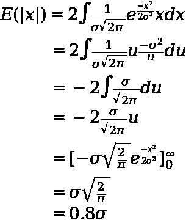
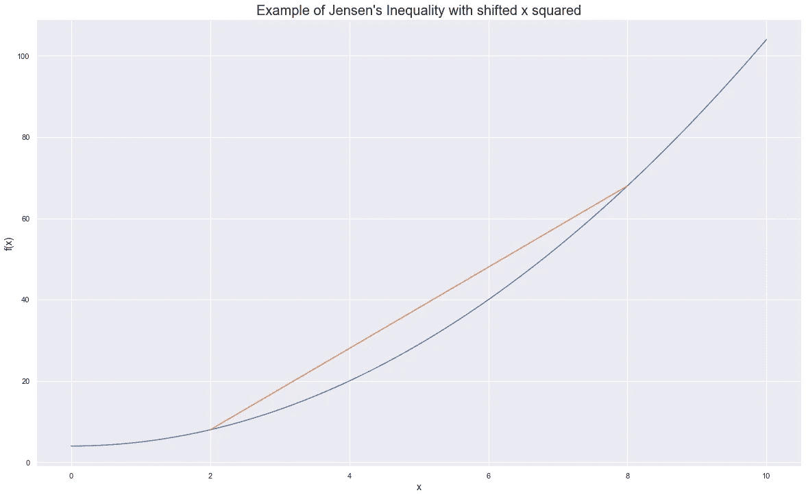

# 为什么 MAD 总是比 STD 小？

> 原文：<https://towardsdatascience.com/why-is-the-mad-always-smaller-than-the-std-77c7fcee80a4>

照片由[达维德·马泽基](https://unsplash.com/@djmalecki?utm_source=unsplash&utm_medium=referral&utm_content=creditCopyText)在 [Unsplash](https://unsplash.com/s/photos/measurement?utm_source=unsplash&utm_medium=referral&utm_content=creditCopyText) 拍摄

## 直觉、求导和詹森不等式

平均绝对偏差(MAD)和标准偏差(STD)都是测量一组数据的离差的方法。MAD 描述的是预期偏差，而 STD 则更抽象一些。给出的通常例子涉及发现 68%的观察值在 1 个标准差内，95%在 2 个标准差内，等等——但这只是正态分布的特殊情况[。](https://en.wikipedia.org/wiki/68%E2%80%9395%E2%80%9399.7_rule)

虽然由于[切比雪夫不等式](https://en.wikipedia.org/wiki/Chebyshev's_inequality)，STD 确实可以用于为更多的(有限均值和方差)分布提供这样的界限，但关键是 STD 从了解数据的分布中获得信息内容，这在现实世界中是一个很好的假设。部分由于这个原因，部分由于[属性替换](https://en.wikipedia.org/wiki/Attribute_substitution)在 STD 的抽象定义后面，这两个概念经常被混淆，当引用的数字恰好是 STD 而不是正确的 MAD 时，就产生了“平均偏差为 x%”的说法。

这里的目的是展示:

*   疯牛病和性病是如何联系在一起的
*   混淆这两者会导致严重的问题
*   当疯狂是唯一的选择

## 快速定义

平均绝对偏差(MAD)和标准偏差(STD)都是测量一组数据的离差的方法。对于随机变量`X`，我们可以收集`n`个观察值`{x_1, x_2, ..., x_n}`来形成一个样本，样本 STD 由下式给出:

作者图片

样本 MAD 由下式给出:

作者图片

在这两种情况下，我们都假设平均值为 0。原来`m < s`不管分配。

## 为什么？

一个直观的答案是把每个函数想成一个加权和。对于 MAD，我们给每个值一个相等的权重`1/n`。然而，对于 STD，我们通过`x_i/n`对每个值进行加权，即因为我们对每个值进行平方，这意味着我们有效地对每个值进行加权，其中权重是偏差本身的大小。这将通过赋予较大的权重来夸大较大的偏差，反之亦然。

## 高斯情况下的求导

事实证明，在正态分布的情况下，我们可以相当简单地得出`m < s`的结果(几乎总是如此)。我们想要的是一种用性病来表达 MAD 的方法。假设[结构的标准偏差在正态分布中被参数化](/why-do-we-use-the-standard-deviation-51d5d1a502a8)，我们可以通过获取 MAD 的期望值来实现:

作者图片

 [## 为什么我们要用标准差？

towardsdatascience.com](/why-do-we-use-the-standard-deviation-51d5d1a502a8) 

期望是:

*   我们得到某个 MAD 的概率——`p(x)`
*   乘以那个 MAD—`x`的绝对值项

现在假设正态分布是对称的，我们可以:

*   将它乘以 2，只从 0 到无穷大积分(不是从负无穷大)，就像对折一样
*   去掉绝对值符号，因为这是由我们只看正域(从 0 开始积分，而不是负无穷大)这一事实保证的

这给了我们:

作者图片

现在我们需要做一点叫做“变量替换”的魔术，使整个积分更容易处理。对于替换，我们使用以下内容:

作者图片

求微分得到`x dx`，所以我们可以把它代入我们的积分:

作者图片

所以重新排列上面的我们得到:

作者图片

把这个代入，我们就有了替换积分。很有帮助的是(这些巧妙的替换往往如此)，取消了`u`，我们得到了一个相当简单的积分:

作者图片

在这最后一步中，我们有:

*   重新代入`u`后积分，并将积分范围返回到`{0, infinity}`
*   计算定积分

因此，在正态分布的情况下，MAD 约为 STD 的 0.8 倍，反之亦然，STD 约为 MAD 的 1.25 倍。

## 越胖的尾巴会怎么样？

为了回答这个问题，我们可以利用我们先前的直觉，根据每个点各自的大小对每个点进行 STD 加权。随着尾部越来越厚，我们越来越有可能得到非常大的偏差。由于这些较大的偏差在 MAD 中仅获得相等的权重，因此它们对 STD 的影响要比 MAD 大得多，因此会增加这个比率。

在 1，000，000 次移动的简单情况下，其中:

*   999，999 是-1
*   1 是一百万

我们将有`MAD=2`但是`STD=1000`导致我们之前 1.25 倍的比率膨胀到 500 倍。

## 其他发行版呢？

这里有一篇很棒的文章展示了这如何应用于遵循相同过程的均匀分布——导出 MAD 和 STD，然后取它们的比率。但是，我们怎么能笼统地说 MAD 永远小于或等于 STD 呢？

为此，我们可以依靠詹森不等式。Jensen 不等式是一个非常有用的结果，它在几乎所有处理凸性的领域都有应用，并且与如何:

*   凸函数的两个值的平均值与
*   取平均值时凸函数的值

这一点通过如下图示更容易看出:

作者图片

橙色线代表在 2 个点(`x=2`和`x=8`)的函数平均值，我们可以清楚地看到，这总是大于这 2 个点的任何线性组合的实际函数——这就是詹森不等式所陈述的。回到 MAD vs STD 的例子，我们可以这样写:

作者图片

但右边的项只是方差的表达式，因为绝对值表达式是多余的，因为我们无论如何都要对观察值进行平方。我们可以这样表达:

作者图片

然后求平方根让我们回到:

作者图片

## 这何时会导致问题？

正是由于上述结果我们才会有这样的说法:

*   大多数偏差会比 MAD 小
*   会有一些比疯子更大的
*   会有一些比 MAD 大得多的(取决于你的变量有多少峰度)

这是必需的，这样我们的平均偏差就是它——如果我们有一些大得多的值，那么我们必须只需要一点点小的批次来平均我们的平均值。

如果我们对一个非常糟糕的结果(或估计误差)被一串好的结果抵消没有意见，那么这就没有问题，混淆 2 也没什么问题。然而，现实生活中很少出现这种情况。一些例子包括:

*   一旦你在 21 点输掉了所有的钱，你就不能再赢回来了(一个大的负错误会让你血本无归)
*   一家超市低估了库存，在一周内完全耗尽并破产，这并不能被接下来几周的完美预测所抵消
*   谷歌地图估算你的旅程时间——航班提前 30 分钟并不能抵消迟到 30 分钟而错过的时间
*   根据误差的平方，或者有[吸收障碍](https://en.wikipedia.org/wiki/Absorbing_barrier_(finance))的任何其他例子

在上面所有的例子中，如果你把你的决定建立在 MAD 的概念上，而不考虑你会得到更大偏差的事实(即使在高斯世界中)，那么你会遇到麻烦。

## 性病不存在的时候呢？

上面隐含的假设是我们有一个变量，它的分布有一个有限的方差。有了有限的方差，我们就有了有限的(因而也是可比较的)标准差。由于样本统计的性质，我们总是有一个有限的样本方差，要计算它，我们只需获取所有数据，并将其代入上述 STD 方程。

然而，也有这样的情况，当*人口*方差为无穷大时，我们必须计算离差的唯一度量就是 MAD。我们仍然可以计算样本标准差，但这实际上不再是一个有用的量，因为它不能用于估计总体参数(因为它不存在/无限)。例子是遵循[帕累托分布](https://en.wikipedia.org/wiki/Pareto_distribution#Occurrence_and_applications)的任何事物:

*   城市的规模
*   在 Steam 上玩游戏的时间(有些人玩得很多，有些人玩得很少)

在这种情况下，理解 MAD 是至关重要的，因为 STD 不会带我们去任何地方。

## 概述

总而言之:

*   由于詹森不等式，所有分布的 MAD <= STD
*   当我们对错误有一个凸暴露时，混淆 STD 和 MAD 会导致严重的错误(一个大错误比几个抵消的小错误重要得多)
*   有时 MAD 是我们真实人口无限变化的情况下的唯一选择