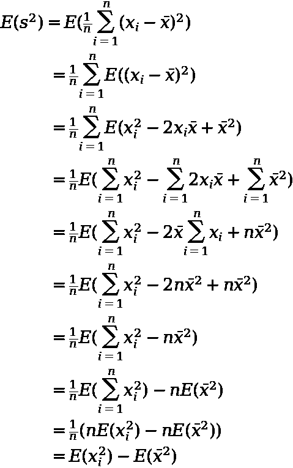
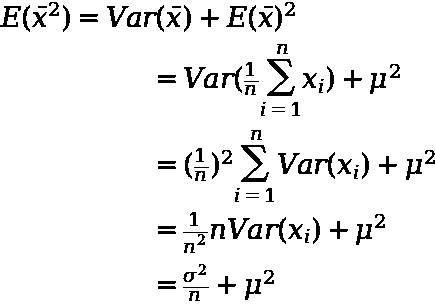
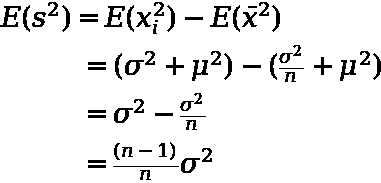
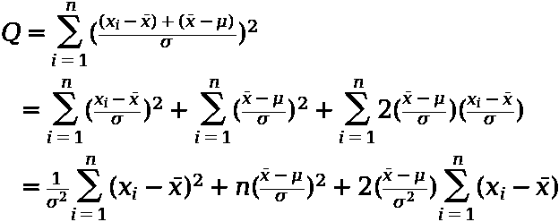
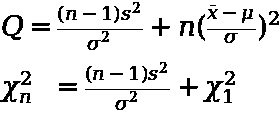
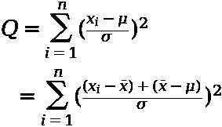

# 为什么样本方差是 n-1 个自由度的卡方分布？

> 原文：<https://towardsdatascience.com/why-is-the-sample-variance-distributed-with-n-1-degrees-of-freedom-c9edcdada28b>

安托万·道特里在 Unsplash[拍摄的照片](https://unsplash.com/s/photos/maths?utm_source=unsplash&utm_medium=referral&utm_content=creditCopyText)

## 将网上随处可见的直觉派生物混合在一起

这是我一直在努力解决的问题——一半是因为我对卡方分布感到不舒服，一半是因为“自由度”的概念看起来非常模糊。大多数推导是:

*   符号**沉重的**,大量不必要的数学知识迎面扑来
*   最终*从技术上*证明了为什么它有`n-1`个自由度，但不知何故让你不明白

不管怎样，直觉有点欠缺。幸运的是，互联网上有一些很好的解释来解释为什么会出现这种情况。嗯，主要是在[交叉验证](https://stats.stackexchange.com/)上——统计堆栈交换。这里的目的是将它们拼凑成直观的东西，而不删除不必要的数学来表达观点。如果你有时间，原始帖子来自一些非常聪明的人，值得一读简历[这里](https://stats.stackexchange.com/a/532771)，这里[这里](https://stats.stackexchange.com/a/3934)以及这些未经交叉验证的[这里](https://online.stat.psu.edu/stat414/lesson/26/26.3)和[这里](https://statproofbook.github.io/P/norm-chi2)。

## 为什么重要？

因为很好地理解我们的抽样分布是很重要的。我们一生中很少会知道:

*   我们数据的分布
*   真实人口平均数
*   真实的总体方差

因此，我们必须继续收集样本，计算样本统计数据(例如样本均值和方差)，然后将它们与一些假设值进行比较。如果不知道这些样本统计数据应该遵循什么分布，我们就不能对我们得到的样本值与我们假设的总体值相比的可能性做出任何陈述:

*   只是碰巧
*   这不太可能是偶然的，我们可以带着“一定程度的信心”接受这个假设值为真

上述过程被称为“假设检验”,我们对样本统计分布的了解使上述想法得以量化。

## 我们想证明什么？

想法是这样的:我们有一些变量，`X` -它可能是任何东西。事实上，不，它不可能是任何东西。我们不需要知道太多关于`X`的信息，但是我们需要知道(或者强加)的一件事是它必须是正态分布的。我们不需要知道`X`的真实均值或方差——只要知道它遵循正态分布。正态分布现象的经典例子是自然事物——身高、鞋码、出生体重等。假设我们生活在一个经典的钟形统计土地上是相当大的，但这是这个特殊的统计结果所必需的。

给定这个变量`X`，我们就可以通过收集变量的`n`个观测值(比如记录随机人的身高)，每个观测值称为`x_i`，形成一个样本`x_1, x_2, ..., x_n`。如上所述，我们不知道随机变量`X`的真实均值和方差是什么，但是我们可以通过使用样本数据来“推断”它们，从而“估计”这些东西。

我们可以把样本均值写成:

作者图片

和(校正的)样本方差为:

作者图片

我们试图证明以下几点:

作者图片

换句话说，样本方差乘以`n-1`并除以某个假设的总体方差(因为我们不知道真实方差是多少)，遵循带有`n-1`“自由度”的卡方分布。

## 为什么会这样呢？

让我们先陈述一下直观的/非数学的结果。因为:

*   我们假设每个`x_i`都是独立的(例如，你的身高不会影响我的身高——除非是我的 ma 在读这篇文章),并且是对正态分布变量的观察
*   样本标准偏差要求您在某个点对这些值进行平方(因为它们是样本平均值的平方偏差)
*   平方(标准)正态分布值实际上是卡方变量的定义

我们应该期望这个变量`V`是卡方分布的。`n-1`位，而不是`n`位，则来自以下内容。为了计算样本方差，我们需要一些东西来计算离差。我们不知道分布的真正中心(总体平均值)，而是用它的估计值——样本平均值来代替它。

事实证明，与样本均值的偏差平方和*总是*小于真实总体均值附近的值。因此，我们的样本方差(如果未校正)将总是总体方差的低估值。使用`n-1`而不是`n`自由度解决了这个问题，因为卡方分布的自由度越低，分布越紧密。

**这种略微紧密的分布弥补了我们对真实总体方差的低估。如果我们不这样做，我们将无法拒绝真实人口方差小于实际人口方差的假设。希望到最后，你会相信这是正确的改正。**

## 卡方分布是什么样的？

在推导之前，让我们先画出:

*   正态分布
*   平方正态分布
*   卡方分布

这样我们就能想象我们在做什么。

作者图片

所以在左边我们有一个标准的正态分布——这里没什么不寻常的。接下来，我们对从左边的正态分布中采样的每个值进行平方。假设我们已经对它们进行了平方，每个值都是正的，与零的偏差大于标准正态变量，因为 2 的偏差变成了 4，等等。

最后，我们有各种卡方变量——“各种”，因为每个变量都有不同的“自由度”(dof)。简单地说，假设卡方分布是我们对独立标准正态分布变量的平方求和得到的结果(确切地说)，那么自由度就是我们求和的数量。你可以通过我们中间的图表看起来与具有 1 个自由度的卡方变量有多相似来看出这一点，因为我们中间的图表是如果我们只平方一个值并且不添加任何其他平方值会发生的情况。

为了得到带有`dof=2`的图表，我们可以只取成对的正态分布值，将它们平方并求和。如果我们这样做 1000 次，并将结果绘制成直方图，我们将得到非常类似于卡方图的东西，在右边上面有 2 个自由度。

## 我们的样本方差应该服从这种分布，这有直观意义吗？

是的—有两个原因:

*   方差必须始终为正，卡方分布也必须始终为正
*   我们的样本方差公式包括对正态分布值求平方并求和，这非常接近卡方分布的公式

所以不用深究太多，它似乎并不合适。

## 为什么我们指的是“修正的”样本方差？

在我们开始推导样本方差的分布之前，最后一件事是看看样本方差本身的定义——当我们有与样本均值的`n`平方偏差时，为什么要除以`n-1`而不是`n`?

这种校正被称为[贝塞尔校正](https://en.wikipedia.org/wiki/Bessel's_correction#Intuition)，是上述结果的数学含义——样本均值周围的偏差平方和总是小于真实总体均值周围的偏差平方和。我们可以通过计算校正后的样本方差的期望值来仔细检查除以`n-1`是否正确。如果你对此感到高兴(或者只是高兴地接受我的话，我们应该除以`n-1`)，那么就直接跳过。

我们可以将*未校正的*样本方差的“期望值”(即除以`n`而不是`n-1`)如下所示:

作者图片

我们有:

*   扩展了平方
*   使用样本均值的定义来简化括号展开后最右边的两个术语
*   使用期望的属性“内部”引入了期望运算符:

作者图片

现在我们只剩下两个需要计算的量，这两个量都可以通过重新排列下面的方差定义来计算:

作者图片

重新安排并放入我们的第一个上下文中:

作者图片

这是根据`X`分布的定义得出的。那么对于第二种情况:

作者图片

将这两个值代入我们的原始方程，我们得到:

作者图片

换句话说——如果我们除以`n`而不是`n-1`,样本方差的值将是总体方差的低估值。我们落后了多少？**正如我们在倒数第二行中看到的，我们未达到样本均值的方差。**因此，如果我们的样本均值略高于真实均值，我们将得出比实际值略小的偏差，反之亦然。

让我们用 python 来演示一下——使用样本均值而不是真实总体均值会导致低估。我们将执行以下操作:

*   从标准正态分布(均值为零，方差为 1) 100x 中抽取 100 个观察值(即 100 个观察值中的 100 个样本)
*   使用*样本*平均值计算每个样本的样本方差
*   使用*总体*平均值(刚好为零)计算每个样本的样本方差
*   比较我们所有 100 个样本的 2，并绘制它们

我们期望使用样本平均值计算出的数字比使用总体平均值计算出的数字稍小。

作者图片

因此，模拟支持直觉——真实总体均值周围的变化总是略高于样本均值周围的变化。为了纠正这一点，我们需要通过只除以`n-1`而不除以`n`来提高样本方差。如果我们真的知道真实的总体均值，那么我们可以用它来代替样本均值作为中心来计算我们的变异性。在这种情况下，我们最终会被`n`而不是`n-1`除。

## 开始推导

因此，给定一个来自随机变量`X`的`n`观测样本`x_1, x_2, ..., x_n`，我们知道如果`X`正态分布为:

作者图片

然后我们可以通过以下操作将`X`转换成一个*标准的*正态分布变量`Z`:

作者图片

或者用语言来说:

*   减去平均值，使每个观察值都集中在 0 附近
*   按标准偏差缩小离差，这样我们的方差为 1

通过卡方分布变量定义的陈述，我们可以得到`Q`为:

作者图片

所以我们知道`Q`是分布卡方与`n` dof。这里聪明的一点是尝试重新安排上面的公式，以便我们包括样本方差的项。在上面的公式中，我们将偏差集中在真实的总体均值上——然而，实际上我们不知道这是什么。我们只有样本均值来计算我们的偏差。让我们首先将它分解如下:

作者图片

我们有:

*   将顶部分成两个表达式
*   扩展了括号
*   将不依赖于`i`的常数移至总和之外

请注意，最终项只是样本均值周围的偏差(未平方)之和，根据样本均值的定义，这将为零，因此最终项消失。我们现在剩下以下两个术语:

作者图片

## 第一项:在样本方差中代入

文字中的第一项是样本平均值周围的方差平方和除以总体方差(一个已知常数)。看看上面我们对样本方差的定义，我们可以把它代入得到:

作者图片

现在我们有一个表达式:

*   我们知道`Q`是具有`n`自由度的卡方分布
*   表达式中的第一项是我们要检查其分布的确切数量！！！

如果我们能找出右边第二项的分布，那么我们只需要推断我们感兴趣的部分的分布。

## 第二项:样本均值的分布

我们的第二项是归一化样本均方。鉴于我们知道:

作者图片

作者图片

那么我们有以下结果:

作者图片

如果我们平方一个标准的正态变量，那么我们得到一个自由度为 1 的卡方变量。对上述项求平方得到:

作者图片

这是上面等式中的第二项。代入我们所知道的关于上述等式的分布，我们得到:

作者图片

## 进行最后的跳跃

对我来说，以上已经足够好了，我相信——为了在分布上平衡上面的等式，那么我们所关心的(右边的第一项)应该具有带`n-1` dof 的卡方分布。

然而，形式上还需要一点，为了完成证明，我们:

*   需要证明样本方差和样本均值是独立的，这样上面等式右边的两项就彼此独立了
*   一旦证明了这一点，我们就可以引用科克伦定理，它们是独立的卡方变量
*   使用矩母函数(MGF)的唯一性来证明我们关心的变量具有带`n-1`自由度的卡方变量的 MGF，因此它必须如此分布

如果你想看看这个，那么我推荐这篇文章的最后一点，但对我来说，这已经足够好了，还有它提供的直觉。

## 最后一点直觉？

我遇到的关于我们为什么将自由度下移 1 的另一个论点是，当我们有变量`Q`时，我们进行的第一次分解——我们不知道真实的总体均值，所以我们将分数的顶部分开，以包括样本和总体均值:

作者图片

这是一个很好的方式来表明我们的样本方差只关注第一项(样本均值周围的离差)而不是第二项(样本均值周围的离差)。我们在数据中缺少的第二个变量(如果不知道总体均值，我们就无法知道)意味着我们需要使用`n-1`而不是`n`来缩小样本方差的分布。

## 摘要

希望你和我一样确信，这实际上并不像你刚得到公式和积分符号时的第一感觉那样神秘。这个想法很简洁——因为我们需要使用样本均值来锚定我们的离差度量，我们错过了样本中的一些方差——样本均值围绕真实总体均值的方差。因此，当评估我们的样本方差与一些假设的总体方差时，我们需要使用少 1 个自由度的卡方分布。

这个分布稍微紧密一些，以弥补我们的样本方差稍微低估了真实总体方差的事实。如果我们不这样做，我们将无法拒绝真实人口方差小于实际人口方差的假设。

## P.S 失去一个自由度’这个想法的直觉呢？

我认为这是值得一提的——摘自[这里](https://stats.stackexchange.com/questions/58230/degrees-of-freedom-for-standard-deviation-of-sample/532771#532771)。“自由度”这个术语对我来说一直有点不确定，大致翻译为“等式中的移动部分”。根据这一优点，我们可以认为它如下。当我们知道真实总体均值时，样本方差分布为χ^ 2，dof 为`n`。然而，当我们使用样本时，意味着我们“失去了一个自由度”。为什么？因为当我们使用样本均值时，我们会失去每个标准化观察值之间的独立性。换句话说:

作者图片

对于第一项，所有观测值(`x_i`减去均值)将是彼此独立的；但第二项不会。这是因为在第二个表达式**中，这些观察值被用于计算样本均值。**在`n=2`的极端情况下，如果我们知道:

*   第一个观察
*   样本均值

那么第二次观察就不是随机的，因为它必须是相对于第一次观察的平衡行为——以便等于样本均值。因为我们“失去了 1 次观察的随机性”,所以我们只有`n-1`个自由度。在我看来，这不是一个真正有意义的论点，为什么我们最终会使用稍微紧密的采样分布，但这仍然很有趣。