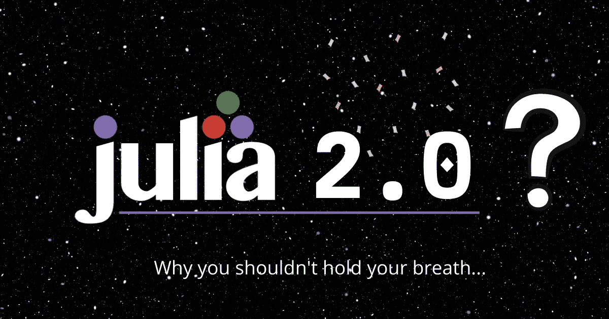

# 为什么 Julia 2.0 不会很快出现(为什么这是一件好事)

> 原文：<https://towardsdatascience.com/why-julia-2-0-isnt-coming-anytime-soon-and-why-that-is-a-good-thing-641ae3d2a177>

## 朱莉娅 2.0:你不应该屏住呼吸等待它

作者图片

如果你已经编程有一段时间了，很有可能你经历过生态系统的突破性变化，这些变化可能会让你留下不好的印象。我遇到的许多人都轻蔑地谈到 Python 生态系统从版本 2 开始所经历的转变。x 到 3.0。虽然大多数人可能同意从长远来看这是值得的，但这种转变仍然消耗了生态系统的大量资源。

但是朱莉娅呢？有一个 1。x 版给人的感觉是生态系统还是太不成熟？2.0 版本会引发大规模采用吗？会成为 Julia 成为顶级编程语言的催化剂吗？

在本文中，我们将探讨为什么 Julia 不可能很快发布 2.0 版本，以及为什么这对当前和未来的 Julia 开发者来说是一件好事。

*编辑:我和我的合著者很高兴地告诉大家，我们的新书《茱莉亚速成班》已经开始预售了:*

  

# 历史背景(0.6 版➡️0.7 版➡️1.0 版)

在 Julia 生态系统的早期，对 Julia 的很多批评都源于生态系统的易变性。这种语言的核心 API 将会改变，这使得开发人员不得不努力适应变化。这些频繁的变化阻碍了行业采纳者对该语言的信心，这就是为什么许多最初的用例是学术或爱好项目。

随着通往 1.0 和稳定性的道路越来越近，核心开发团队发布了 Julia 0.7，它是通往 Julia 1.0 的桥梁，并包含了许多关于 API 在新版本中将如何变化的警告。就个人而言，这段时间正是我开始使用 Julia 的时候。我对这种语言的第一次体验是在我为 NASA 工作的一个大型 Julia 项目中处理反对警告和更新语法。

# 下一个朱莉娅版本是什么？1️⃣.9️⃣

即将发布的次要 Julia 版本是 Julia 1.9。根据目前的发布时间表，这个版本可能会在 3-4 个月左右推出。你可以在 GitHub 上看到提议的改变:

  

我个人感到兴奋的一大变化是:

> `@kwdef`现在被导出并添加到公共 API ([#46273])

这是一个来自社区的长期开放请求，以前您必须使用外部包来完成。添加的另一个新功能是:

> 新的`pkgversion(m::Module)`函数获取加载给定模块的包的版本，类似于`pkgdir(m::Module)`。([#45607])

这应该给用户更多的关于什么版本被加载到某些模块中的上下文，这是你过去必须繁琐地弄清楚的事情。

所有这些都是说，在每个新的 Julia minor 版本中仍然有许多令人惊讶的新功能、错误修复和改进。

# 朱莉娅 1.9 ⁉️之后的下一步是什么

嗯，朱莉娅 1.9 后是…..朱莉娅 1.10😄。不，真的！Julia 的核心开发者和联合创造者 Jeff Bezanson 在今年的 JuliaCon 上说:

> “没有 2.0 计划。没有日期，也没有规格。确实没有这样的计划在进行中。如果有人想到了一些听起来不错但可能会被打破的想法，我们只需将其标记为 2.0 问题，并将其留到发生时再解决。”

如果您想了解 2.0 中正在考虑的问题类型，请查看:

  

正如你所看到的，细节是相当稀少的，因为大部分被提出的想法都可以在不破坏改变的情况下实现。

跳到 27:45 听 Jeff 谈论 2.0

另一位 Julia 联合创始人 Viral Shah 在 Slack 上向我指出，Julia 生态系统已经能够:

> 添加主要的语言特性，如多线程，而不需要修改主要版本号。像 GPU 处理这样的功能从主线语言设计和依赖性中分离出来，可以自行发展(同样没有 2.0)

这个设计决策允许生态系统快速发展，同时为核心 API 提供稳定性。

# 为什么 2.0 不会很快到来是件好事？🎊

作者图片

Julia 的稳定性是用户和开发人员多年来越来越喜欢的东西(特别是对于那些经历了早期 Julia 时代不断变化的人)。从设计的角度来看，它真实地说明了所做的高质量决策，即我们一直到现在(自 1.0 发布以来的 4 年)都没有做出突破性的改变。

杰夫进一步说:

> “B 但是就我个人而言，在我想看到的事情中，我认为没有一件真的需要重大改变。我认为我们应该做的任何事情都可以在 1。x 非破方式。所以我认为现在不需要 2.0。”

随着 Julia 核心团队的需求和观点的改变，这显然会随着时间而改变，但是今天的开发人员可以高枕无忧，因为他们知道如果他们投入时间、金钱和智力资本来用 Julia 构建系统，API 将在未来几年保持稳定。

虽然我个人认为 2.0 版本会给这种语言带来很大的可见性，但在生态系统继续呈指数增长的同时，尽可能保持稳定可能更好。一个小小的反驳点是，如果有 2.0 版本，早做比晚做可能更好，因为我们等待的时间越长，就有越多的 Julia 代码需要更新才能工作。希望，如果有一天到来，基诺·菲舍尔可以重启自动为你更新废弃语法的[茱莉亚·菲莫克莱尔](https://github.com/JuliaComputing/FemtoCleaner.jl)。

你对朱莉娅 2.0 有什么看法？在下面留言告诉我吧！