# 为什么 PCA 看起来是三角形的

> 原文：<https://towardsdatascience.com/why-pca-looks-triangular-a642daac721a>

## [生命科学的数理统计和机器学习](https://towardsdatascience.com/tagged/stats-ml-life-sciences)

## 通常在计算生物学中

对 1000 个基因组遗传变异的主成分分析(左)，对微生物丰度 HMP 数据的主成分分析(右)。作者图片

这是我的专栏 [**生命科学的数理统计和机器学习**](https://towardsdatascience.com/tagged/stats-ml-life-sciences?source=post_page---------------------------) 中的**第二十四篇**文章，在这里我用通俗易懂的语言讨论了计算生物学和生命科学中一些有趣的分析方法。[主成分分析](https://en.wikipedia.org/wiki/Principal_component_analysis)广泛应用于计算生物学，特别是[群体遗传学](https://en.wikipedia.org/wiki/Population_genetics)、[微生物生态学](https://en.wikipedia.org/wiki/Microbial_ecology)、[单细胞分析](https://en.wikipedia.org/wiki/Single_cell_sequencing)，用于建立样本与细胞之间的**关联性**。PCA 经常呈现出一种奇特的**三角形**或**拱形**或**马蹄形**形状，这可以用数据中一些有趣的潜在模式来解释。在这篇文章中，我将讨论哪些数据可以导致三角 PCA 结构，以及为什么理解这种效应对于**仔细**解释 PCA 图很重要。

# 为什么 PCA 而不是 tSNE 用于群体遗传学？

从遗传变异和微生物组数据(上图)到**单细胞**基因表达分析(下图)，显著的三角形 PCA 模式在生命科学中随处可见。

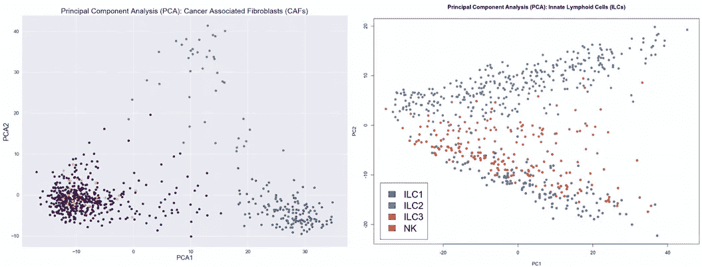

PCA 对来自[癌症相关成纤维细胞](https://pubmed.ncbi.nlm.nih.gov/30514914/)(左)和[先天淋巴细胞](https://www.nature.com/articles/ni.3368)(右)的基因表达的影响

然而，正如人们所看到的，PCA 似乎没有提供足够的**分辨率**来辨别单细胞基因表达分析中的不同细胞类型，而 [tSNE](https://en.wikipedia.org/wiki/T-distributed_stochastic_neighbor_embedding) 或 [UMAP](https://umap-learn.readthedocs.io/en/latest/) 通常更能提供这方面的信息。相比之下，群体遗传学和基因组学研究人员很少(或几乎从不)使用 tSNE 和 UMAP，样本之间的遗传相似性通常通过 PCA 或[系统发育树](https://en.wikipedia.org/wiki/Phylogenetic_tree)来建立。为什么这两个领域在选择降维技术上有如此大的差异？一种解释似乎是[tSNE / UMAP 提供样本聚类之间可靠相似性的内在困难](/how-exactly-umap-works-13e3040e1668)，这使得使用 tSNE/UMAP 进行群体遗传学分析非常成问题，其中一个非常重要的目标是建立不同群体之间的遗传距离。相比之下，主成分分析可以提供更准确的样本组之间的关系，但对于发现样本之间的异质性(即样本总体)可能不是那么方便。另一方面，在计算 PCA 之前，从人类学和考古学研究中，群体通常在群体遗传学中是已知的，因此这里的目标不是发现它们，而是理解群体之间的**相互关系**。

# 遗传距离和地理距离之间的联系

通过 PCA 可视化精确的遗传相似性对于**群体遗传学**如此重要的原因之一是，人们很早就认识到世界人口的遗传距离和地理距离之间存在某种相关性。Menozzi、Piazza 和 Cavalli-Sforza 在 1978 年注意到了这一趋势，并建议将新石器时代的农业迁移作为这一效应的可能解释。

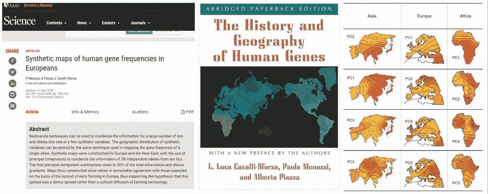

Menozzi，Piazza 和 Cavalli-Sforza，科学，第 201 卷，第 786 页，1978 年

后来，随着[下一代测序](https://en.wikipedia.org/wiki/Massive_parallel_sequencing)技术的兴起，当更全面的采样变得可用时，[约翰·十一月布雷和合著者](https://www.nature.com/articles/nature07331)提出，欧洲的地理地图自然出现，作为欧洲人遗传变异的有效二维 PCA 总结。

[J. Novembre 等人，自然，第 456 卷，第 98 页，2008 年](https://www.nature.com/articles/nature07331)

事实上，从上图可以看出，根据欧洲人的基因变异计算出的五氯苯甲醚图可以很好地反映欧洲地图。此外，有人提出，PCA 成分可用于准确预测欧洲人的血统(即原产地)的**。也请注意上图中 PCA 图壮观的**三角形**形状。**

# 随机数据的主成分分析

我们看到 **PCA 是建立样本组之间**相似性**的重要工具**，在群体遗传学的情况下，PCA 的三角形形状在关联遗传和地理距离时可能是有意义的。然而，事实证明，生命科学中的某些数据类型能够产生三角形或楔形的 PCA 图，这是因为数据的非高斯性质，即如果在计算 PCA 之前没有对数据进行适当的转换。为了证明这一点，让我们使用不同的概率分布，如泊松分布、二项式分布等，生成样本之间没有结构或相关性的随机数据矩阵**。这在生命科学中是常见的，并在模拟数据上计算 PCA。**

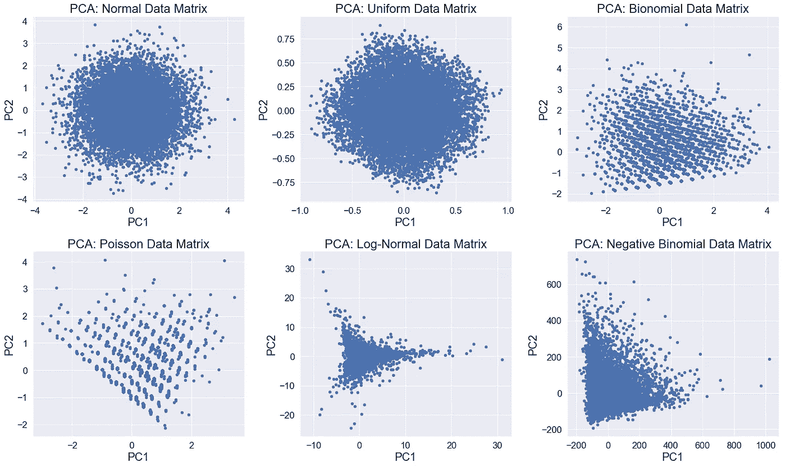

作者图片

这里，人们可以观察到，通常没有任何相关结构的**分布数据应该给出围绕 PCA 图原点的数据点的**近似球形分布**。遵循**均匀**分布的随机数据产生了一个有趣的**方形**外观的主成分分析，就好像在两个正交的方向上拉动前面图上的高斯圆。非常值得注意的是，泊松、对数正态和负二项分布数据往往在 PCA 图中形成三角形或楔形结构。甚至，二项式分布的数据有时会给出一个看起来像**楔形或三角形**的 PCA，见上图。事实是，模拟的统计观察应该是独立于**的**，也就是说，随机数据矩阵中没有相关性，并且样本不应该形成聚类。然而，稍微发挥一下**想象力**，人们就可以将三角形/楔形 PCA 形状的顶点中的点误解为属于不同细胞群或人类群体的**。****

**这些三角形或楔形结构可以部分地由计算生物学中许多类型数据的**非高斯性**来解释，这似乎违反了 PCA 的一个非常基本的假设。也就是说，PCA 可以被看作是用两个矩阵(加载和得分)的乘积来逼近一个数据集，数据和逼近之间的平方误差的以下**隐式最小化**。平方误差的最小化意味着假设近似误差或残差的正态/高斯分布，如果数据矩阵 X 不遵循高斯分布，这可能**难以**满足。有人会问，在非正态分布的数据上使用 PCA 是否可行？实际上，如果在计算 PCA 之前已经应用了一些**数据** **变换**，PCA 通常在非正态分布的数据上运行。**

****

**作者图片**

**标准化和**对数变换**通常在 PCA 之前应用于许多生命科学数据，即**屏蔽** **数据的非高斯性**并满足 PCA 的正态性假设。在实践中，这通常会导致五氯苯甲醚图呈不太明显的三角形。让我们将标准化和对数变换应用于先前模拟的数据矩阵，并观察差异。**

**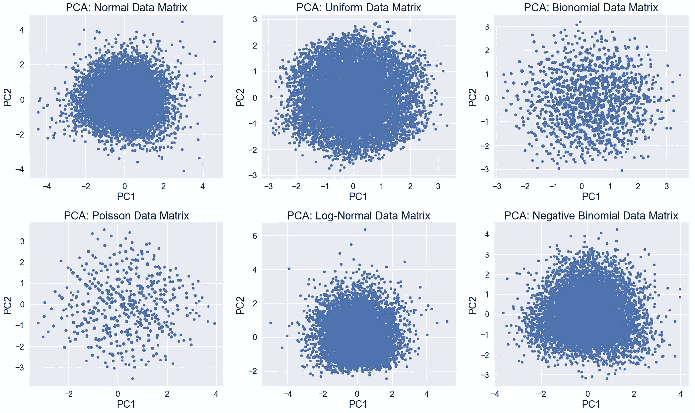**

**作者图片**

**我们可以观察到，一旦应用了**对数变换**和**标准化**，PCA 图中数据点的分布变得越来越呈球形。这直观地意味着在高维空间中没有数据的优选取向的**方向，即所有方向都具有同等的信息性/重要性。****

**上面的例子处理的是纯随机数据**，样本之间没有任何相关**结构。然而，通常在基因表达或微生物丰度数据中存在大量相关性，其中样品或细胞可能不是独立的并形成集群。在这种情况下，可以获得有意义的三角形 PCA 图，其中三角形的顶点通常表示不同的样本总体。下面讨论一个有趣的例子，叫做**拱门**或**马蹄效应**。**

# **具有块结构的数据，以及拱形效应**

**就我的经验而言，拱形效应或马蹄形效应在遗传学或单细胞分析中讨论得不多，但在微生物生态学中却很有名。人们需要检查例如一些[旧的讨论](https://stats.stackexchange.com/questions/158552/what-is-the-horseshoe-effect-and-or-the-arch-effect-in-pca-correspondence)来获得关于效果的更多信息。还有这篇[优秀论文](https://www.ncbi.nlm.nih.gov/pmc/articles/PMC5320001/)提供了关于马蹄效应起源的见解，我强烈推荐阅读。**

**事实证明，当统计观察值之间存在强**相关性**时，即当样品/细胞属于**不同的簇/群**时，可以得到三角形的 PCA。在这种情况下，数据矩阵具有特殊的形式:人们可以直观地观察到对于一些样本和一些变量具有大值的元素的**块**，而低值**零**在矩阵中的其他任何地方。让我们用**两个这样的块**模拟一个数据矩阵，并将矩阵的元素可视化为热图。**

**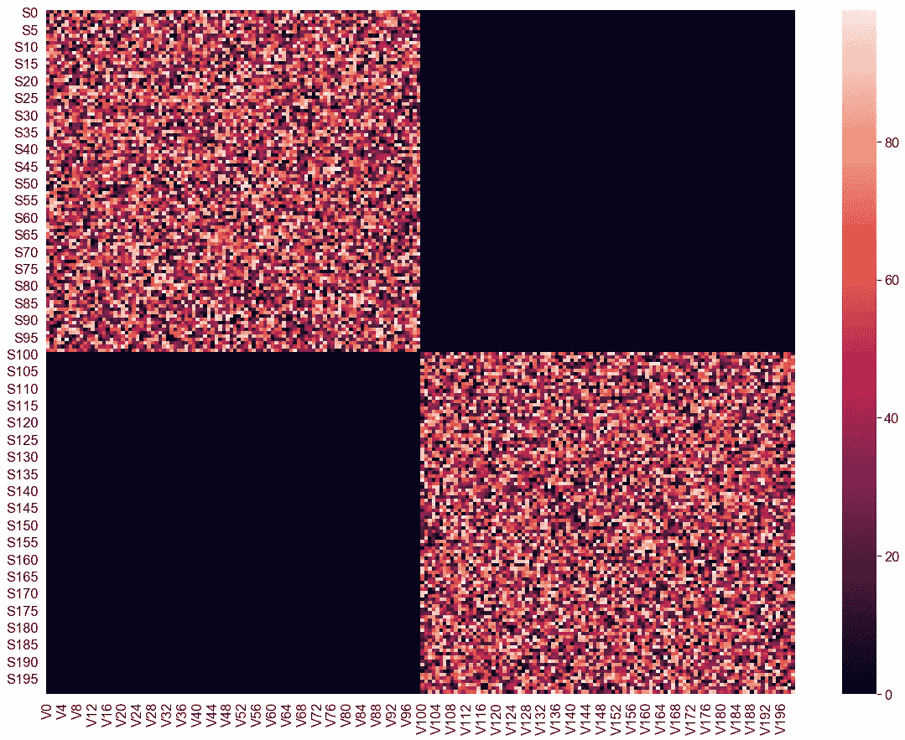**

**作者图片**

**上面模拟的数据矩阵包含 200 个样本(S0，…，S199)和 200 个变量(V0，…，V199)。热图中较暗的区域对应于矩阵的**零**个元素，而较亮的颜色对应于矩阵元素的较大值。因此，**数据矩阵由** **两个空白块**或**簇**或总体组成，其中样本 S0、…、S99 看起来完全**与样本 S100、…、S199 解耦**，因为它们没有公共变量，即变量 V0、…、V99 仅对于样本 S0、…、S99 具有非零值，而变量 V100、…、V199 仅对于样本 S100、…、S199 具有非零值这是一个极端的解耦，**对于现实世界的项目来说，这种情况很少发生**，但是这个模拟将帮助我们**建立我们的** **直觉**关于是什么导致了 PCA 图中的**三角形结构。在微生物生态学中，研究人员通常谈论导致这种块状数据(pH、温度等)的**环境** **梯度**。).通过对两个块中变量的元素进行平均，我们确实可以查看数据矩阵，就好像两个不相互作用的**物种**存在于不共享环境的数据中，即无法找到两个物种都存在的样本。****

**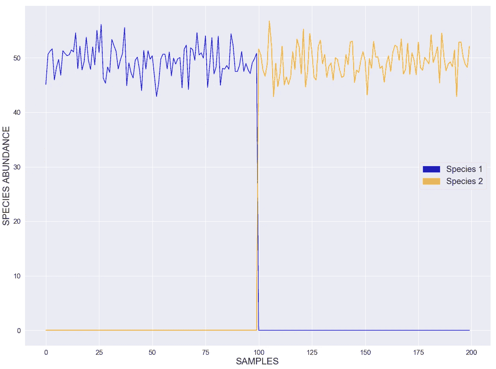**

**作者图片**

**因此，人们可以得出这样的结论:如果样品碰巧是按照**强** **环境梯度**排序的，这可能会导致某种物种在一组样品中大量存在，而在其他组中完全不存在的情况。例如，土壤微生物组可能与海洋微生物组非常不同。在这种情况下，计算来自 **极端不同环境**的样本之间的正确**相似性通常变得越来越成问题。然而，在这里，为了演示和建立我们的直觉，让我们在块数据矩阵上计算 PCA，并可视化 PCA 图和显示由每个主成分解释的方差的图。****

****

**图片作者。添加红色虚线(右图)是为了突出潜在的三角形**

**这里我们可以观察到**数据中几乎所有的方差都被第一主成分**捕获。这并不奇怪，因为我们知道在样本中有两个集群的非常强的主导分组效应(**梯度**)。因此，人们可以将领先 PC 的数量 k(解释了数据中的大部分变化)视为一种**快速方法，以将数据中的聚类数量估计为 k+1 个聚类**。**

**接下来，我们或许可以观察到，使用**两块**矩阵，著名的 PCA 三角形开始变得更加明显，不过，通过一些**想象**，我用红色虚线突出显示了它。我们可以在 PCA 图中清楚地看到两个集群。然而，如果我们**增加**数据矩阵中的块数，会发生什么呢？让我们模拟一个具有三个块的数据矩阵，并可视化每个 PC 解释的方差以及 PCA 和 tSNE 图，以进行比较。**

**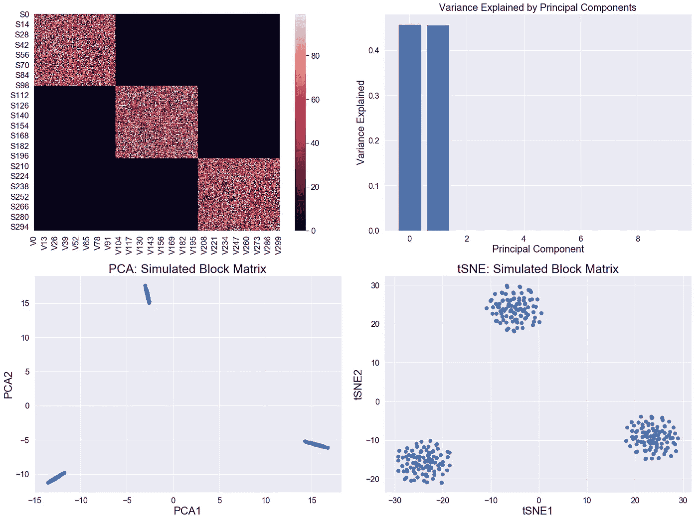**

**作者图片**

**正如所料，我们看到**两个 PC**解释了**数据中的大部分方差**，并且**三组样本**在 PCA 和 tSNE 图中都清晰可见。然而，当集群数量增加更多时，即当我们拥有超过 2–3 个集群时，情况会发生巨大变化。现在让我们用 10 个不同的样本群体来模拟一个块矩阵。**

****

**作者图片**

**值得注意的是，我们**似乎不能区分 2D PCA 图中的** 10 个集群，事实上一些种群似乎**聚集在一起**，以至于**从 PCA 图的视觉检查中检测不到超过 4 个清晰的集群**。这意味着，即使我们提供了数据中样本总体的准确数量**和**，任何聚类算法都很难根据**两个主成分**对样本进行分组。因此，需要考虑两个以上的主成分来获得样本的正确聚类，然而，这将越来越难以可视化，甚至更难在降维和聚类之间达成一致。引人注目的是， **tSNE 似乎只用两个潜在的 tSNE 变量**就能轻松解决所有 10 个集群 **。即使总的来说这不是一个好主意，但对于这种特殊的情况，在 2D tSNE 图上进行聚类将是成功的，也就是说，人们可以很容易地将所有样本归入它们的 10 个群体。****

# **具有模糊块和马蹄铁效应的数据**

**上一节所示的**极端** **块**结构在现实世界数据中很少见到。通常，样本聚类不太透明，人们可能会认为具有更多**模糊块** **结构**的数据矩阵对于生命科学项目来说非常典型。给先前的块矩阵增加一些“模糊性”的一种方法是创建一个**带数据矩阵**，其中只有对角线周围的元素是非零的。这里，我们仍然怀疑一些样本块，但是它们**不像上一节中的**那样透明。让我们用**两个“模糊”模块**模拟并可视化一个典型的波段数据矩阵。**

**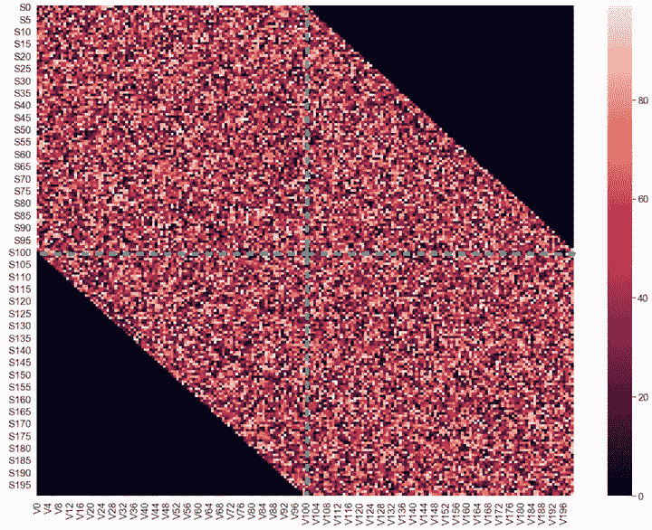**

**图片作者。添加绿色和蓝色虚线是为了突出显示模糊的块**

**这种**带矩阵**可能会在计算生物学项目中出现，当样本有很强的**空间**或**时间**排序时，通常他们说有一个**梯度**影响样本中的丰度。这种梯度的例子可以是 **pH** 、**温度**、**空间坐标**、采样的时间周期，也可以有诸如批次(实验室、技术、国家)的技术梯度。使用上一节中关于在特定环境中存在但在其他环境中不存在的物种的**直觉**，我们可以再次对以下变量组中的矩阵元素进行平均:V0、…、V99 ( **“物种 1”**)和 V100、…、V199 ( **“物种 2”**)，并观察到从一种环境改变到另一种环境时物种 1 和 2 丰度的更为**渐进的**，即不太突然的变化在下文中，我们可以观察到，例如，物种 1 也可以存在于上一节中仅由物种 2 占据的环境中，但是丰度较低。**

**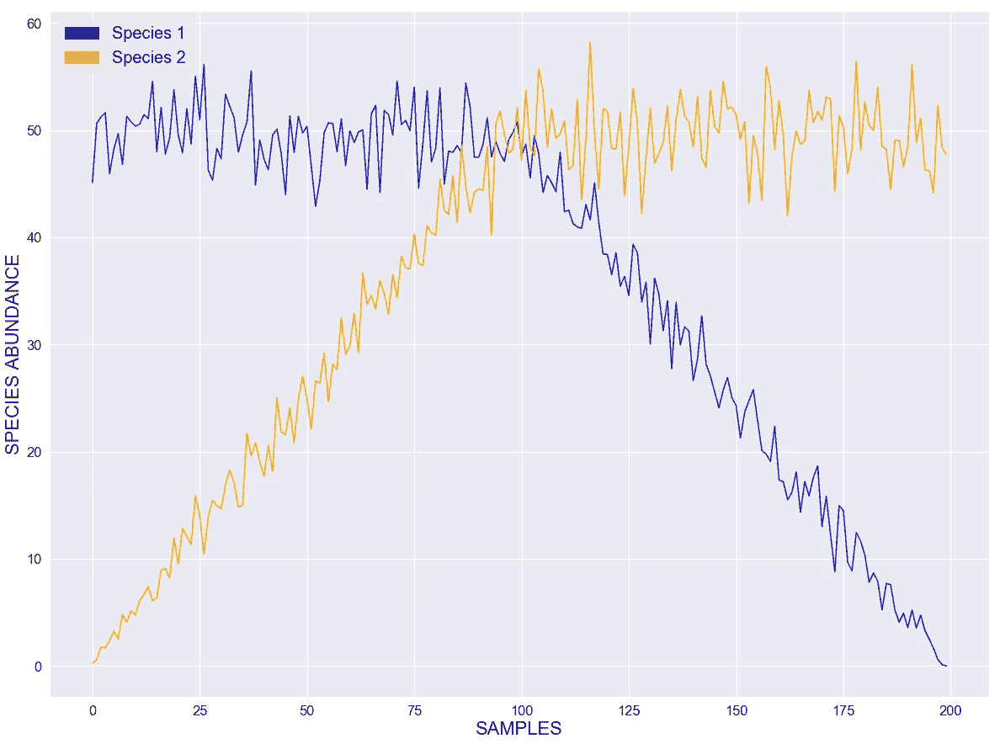**

**作者图片**

**一个 **PCA** 用于**波段矩阵**怎么样？下面，我们将计算由主成分解释的方差以及带数据矩阵的 PCA 图，该带数据矩阵具有两个可能的模糊聚类。**

****

**作者图片**

**这里我们观察 PCA 图中著名的**拱门或马蹄铁**。数据点分布的形状仍然有点像三角形，拱形或马蹄形的两个“翅膀”对应于两个不同的簇。另外，请注意由主成分图解释的方差的逐渐变化。对于干净的块结构矩阵，有**几个同样重要的** **主导 PC**，而现在有**一个主导 PC** ，其通常对应于主导带数据矩阵的值的强**梯度**(例如**时间**)。通常，他们说马蹄形 PCA 图中的样本按时间从早到晚排序**、**即**时间排序**，或从地理西到地理东(**空间排序**)。在单细胞分析中，当监测**干细胞分化**时，换句话说，当细胞沿着所谓的 [**细胞命运轨迹**](https://www.nature.com/articles/nbt.2859) 排序时，这种有序的细胞“线”是典型的。通常， [**扩散图**](https://academic.oup.com/bioinformatics/article/31/18/2989/241305) (另一种降维技术)在解析**细胞轨迹**方面表现出色，在单细胞生物学**中与**细胞发育**一起工作时，广泛使用**代替 PCA** 。****

**PCA 图中奇特的拱形或马蹄形形状的形成与数学上已知的 [**李沙育曲线**](https://en.wikipedia.org/wiki/Lissajous_curve) 有关。这也在群体遗传学文献中被注意到，例如见 2008 年 11 月 Stephens 在《自然遗传学》中的文章。**

**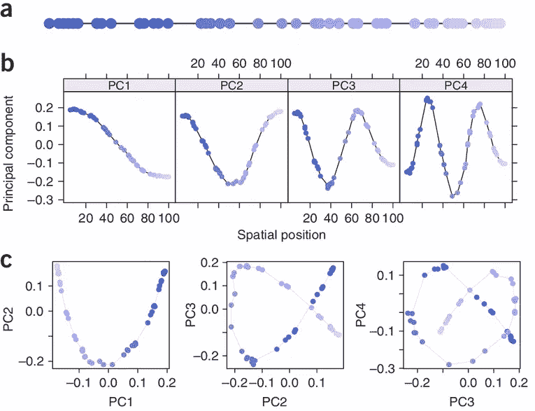**

**从具有马蹄形效应的 PCA 中可见的利萨如曲线。遗传学 2008**

**当**样本已经沿着环境梯度****排序时，如果我们将每个主成分绘制为样本数量的函数，则可以看到那些**曲线**。让我们检查这些曲线从模拟带矩阵上计算的 PCA 中是否可见:****

********

****的确，非常有趣和**奇特的形状**！请注意，PC1 似乎与环境梯度密切相关。现在，如果我们考虑三个“模糊”样本总体，会发生什么？****

****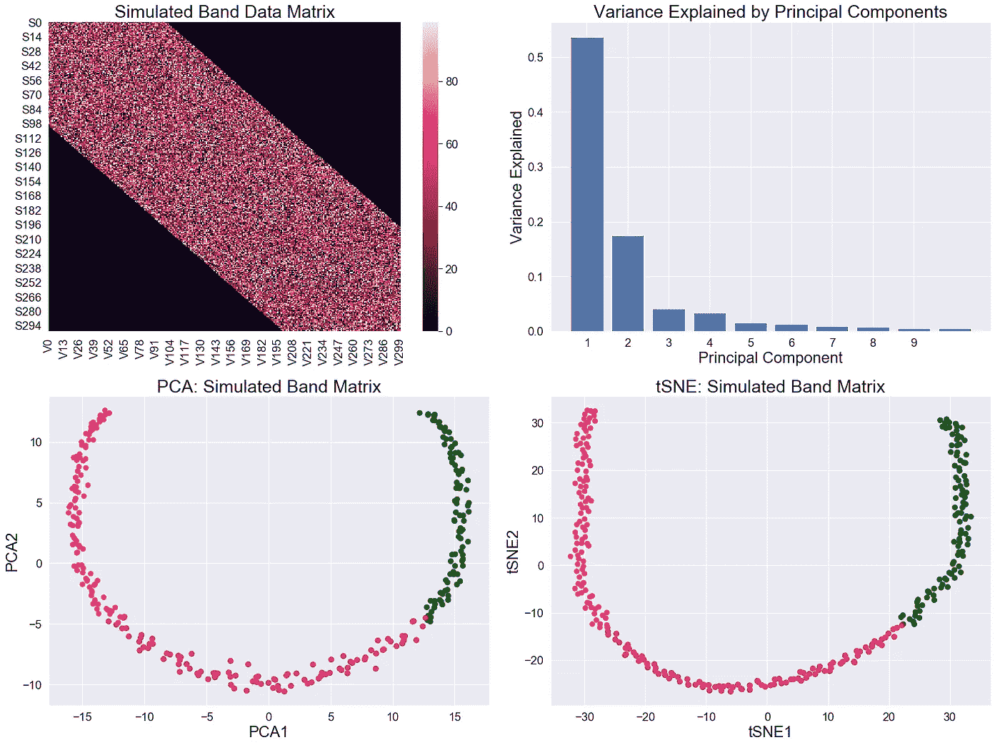****

****作者图片****

****我们可以看到马蹄铁的两端开始向质心弯曲。我们可以观察到的另一件事是深绿色和品红色样本群体看起来彼此非常遥远，而红色样本群体是共同的邻居。如果我们查看**波段数据矩阵**并认识到前 100 个(深绿)和后 100 个(洋红)样本**几乎不共享任何变量**，而红色样本(波段矩阵中间的 100 个样本)与洋红和深绿样本群体共享大量 V 变量，则可以直观地理解这种效应**。现在，我们将更多地增加“模糊”块的数量，看看对于 **10 个样本群体**的 PCA 和 tSNE 图会发生什么。******

****

**作者图片**

**这里一个明显的观察结果是，PCA 图中马蹄铁的两端现在向马蹄铁的质心弯曲了很多。因此，这里我们有一个反直觉的效果:马蹄形两端 **的金色和深绿色样本群**看起来比马蹄形**中间的青色和蓝色样本群**彼此更接近**，并且如果我们增加数据矩阵中模糊块的数量，它们将彼此更加接近。现在，假设有一个**时间梯度**沿着马蹄形起作用，即样本从早时间到晚时间**排序**，深绿色样本最年轻，金色样本最老，而青色和蓝色样本来自一些中间时间点。这种马蹄铁两端**的**相互靠近意味着**最小的**和**最大的**样本**与来自**中间时间点**的样本相比**变得非常相似，这很奇怪。人们会**期望**相对于来自中间时间点的样本，最年轻和最老的样本彼此更加**不相似**。********

在比较世界人口的遗传变异时，对五氯苯甲醚图中马蹄形的解释变得更加棘手。如果存在样本的**空间梯度** **【地理分离】****其中遗传变异被测量为条带矩阵中的 V-变量，那么从 PCA 图看起来，来自远东的种群与来自远西的种群在遗传上比它们的共同邻居更相似**。因此，拱形和马蹄形效应通常被认为是[微生物生态学](http://ordination.okstate.edu/CA.htm)中的一种**假象**，最近在群体遗传学中也是如此，在群体遗传学中发展了特殊的方法**来最小化这些效应**，例如参见 Francois & Jay 在《自然通讯 2020》中的**因子分析**方法。

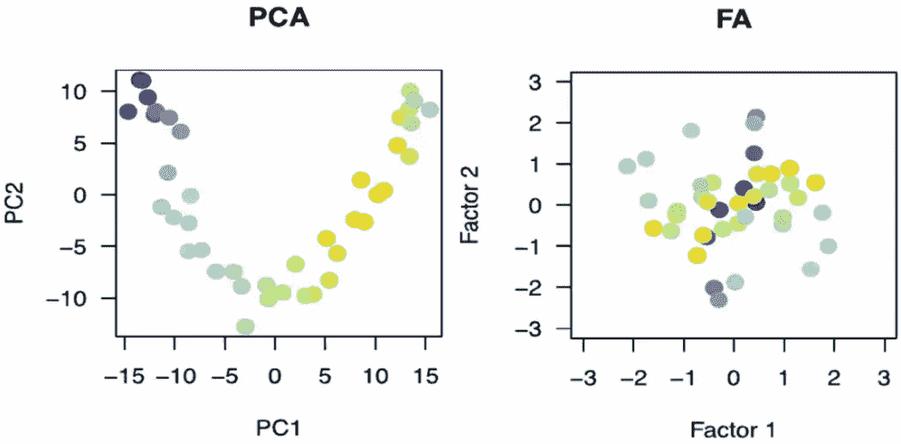

消除五氯苯甲醚马蹄形效应的因子分析，Francois & Jay，Nat。通信 2020

# 摘要

在本文中，我们了解到，在生命科学的各个领域，如微生物生态学、群体遗传学和单细胞生物学中，经常可以看到特殊的三角形 PCA 结构。我们讨论过，假设数据的**概率分布**不远离正态分布，这对于 PCA 是必不可少的，PCA 图中数据点的三角形分布通常意味着数据中存在**相关结构**。特别是，当数据矩阵由不同的或模糊的样本块组成时，它会导致一个拱形(T20)**或马蹄形******效应**，有时会导致对 PCA 图中聚类的错误生物学解释。尽管如此，PCA 似乎仍然比 tSNE 和 UMAP 更准确，更适用于群体遗传学，其中样本(群体)聚类之间的遗传相关性至关重要。**

**像往常一样，让我在下面的评论中知道生命科学和计算生物学的哪些分析方法对你来说似乎**特别神秘**，我将在这个专栏中尝试解决它们。在我的 [github](https://github.com/NikolayOskolkov/WhyPCALooksTriangular) 上查看帖子使用的文件。在**Medium**[**Nikolay Oskolkov**](https://medium.com/u/8570b484f56c?source=post_page-----a642daac721a--------------------------------)关注我，在**Twitter**@ NikolayOskolkov 关注我，并通过 [**Linkedin**](http://linkedin.com/in/nikolay-oskolkov-abb321186?source=post_page---------------------------) 连接。在下一篇文章中，我们将讨论**如何在 UMAP 空间**聚集，敬请关注。**