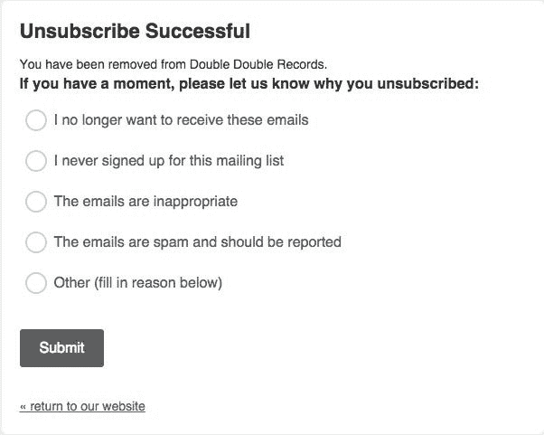

# 为什么一家数据驱动型公司应该符合 GDPR 标准？

> 原文：<https://towardsdatascience.com/why-should-a-data-driven-company-be-gdpr-compliant-3778b7df1663>

## 不遵守 GDPR 可能会让您损失 2100 万美元

照片由[戴恩·托普金](https://unsplash.com/@dtopkin1?utm_source=medium&utm_medium=referral)在 [Unsplash](https://unsplash.com?utm_source=medium&utm_medium=referral) 上拍摄

如果你从事机器学习、人工智能或数据科学领域的工作，你很可能在你的模型和算法中至少使用过一次用户的个人或可识别信息。或者您可能仍在处理这种类型的数据。

如果你的目标完全合乎道德，你只想开发报告或高级功能，这并不重要。如果你的意图不是侵犯用户的隐私，这并不重要。如果您处理来自欧盟用户的数据，您必须遵守欧洲隐私保护法规 GDPR。

不遵守 GDPR 可能会让您损失高达 2100 万美元。如果是公司的话，就更！幸运的是，你可以通过遵守 GDPR 法规来避免这样的罚款。

在这里，你会明白什么是 GDPR。此外，您将了解为什么 GDPR 合规性如此重要，但却不容易实现。

让我们深入了解 GDPR 合规背后的“原因”。

*免责声明:我不提供任何法律建议，只是 GDPR 在行业中的概述。*

# 什么是 GDPR？

GDPR，简称[通用数据保护条例](https://en.wikipedia.org/wiki/General_Data_Protection_Regulation)，是一项于 2018 年 5 月生效的条例，更新和规范了整个欧盟(EU)的数据隐私法律。[官网](https://gdpr.eu/what-is-gdpr/)将其定义为“世界上最严厉的隐私和安全法”。

具体来说，GDPR 的一些隐私和数据保护要求包括:

*   要求用户同意处理他们的数据。
*   匿名化从用户处收集的数据以保护隐私。
*   在数据泄露的情况下向您的用户提供通知。
*   安全管理从一个国家到另一个国家的数据传输。

简而言之，GDPR 为欧盟公民的数据处理强加了标准。请注意，GDPR 对任何地方的公司和个人都施加了义务。所以，你或你的公司在哪里并不重要。只要您收集或处理有关居住在欧盟的人的数据，您就必须遵守 GDPR 法规。

请记住，GDPR 不仅仅是一个遵守的义务。让我们了解一下为什么 GDPR 合规性会带来诸多好处。

# GDPR 合规的三大优势

让我们看一下 GDPR 合规性如此重要的三大原因。

## 1.提高信任度、声誉和可信度

近年来，人们越来越意识到与滥用个人数据相关的危险。换句话说，消费者现在比以往任何时候都更加怀疑他们的数据是如何被管理的。

为了遵守 GDPR，您必须获得用户的同意，然后才能使用他们的数据。在此过程中，您需要清楚地解释您计划如何使用他们的个人信息。这给了用户更多的选择，也让他们对你打算如何处理他们的数据放心。

因此，如果你是一家企业，或者只是有一个通过 cookies 收集数据的网站，符合 GDPR 标准会让你在用户眼中更加可信。另一方面，如果你是一名 ML 工程师、数据科学家或研究人员，遵守 GDPR 将帮助你产生隐私安全的报告或提高你在科学界的声誉。

## 2.提高营销效果

GDPR 要求您实施选择加入政策。这意味着您的用户可以随时要求您删除他们的所有个人数据。丢了这个数据就不是剧了。相反，这将帮助您减少数据中的噪音，并支持您的营销目标。我们用一个例子来理解为什么。

假设你经营一份时事通讯。给你的读者选择的机会会帮助你精简你的邮件列表。只有真正对你的产品、服务或新闻感兴趣的用户才不会退订。这将使你能够更有效地与他们沟通，并相应地提高转化率。

此外，请记住，让用户取消订阅可以为您提供数据来生成关键业务 KPI。具体来说，您将能够确定有多少用户决定取消订阅以及为什么会发生这种情况。由于这个原因，大多数简讯退订页面都要求用户在告别前留下反馈。

Mailchimp 的退订表格

## 3.增强的数据管理

遵守隐私法规迫使您改进数据管理流程。这将有助于您遵守 GDPR 施加的限制。此外，拥有更好的数据管理流程更容易证明您符合 GDPR 标准。

具体来说，无论你是大公司还是个人，采用创新技术将有助于避免数据隐私争议。例如，您应该能够与您的 ML、数据科学或分析团队共享您的生产数据，同时保护用户个人数据。

# 如果您不符合 GDPR 标准，会发生什么？

不遵守 GDPR 协议是有代价的。如[第 83(5)](https://gdpr-info.eu/art-83-gdpr/) 条所述，如果作为个人未能遵守 GDPR，最高可被罚款 2000 万欧元(2100 万美元)。就公司而言，罚款可达全球年营业额的 4%。现在应该很清楚了，你必须认真对待 GDPR。

请注意，GDPR 适用于所有人，无论企业规模如何。比如[亚马逊因违反欧盟数据保护规则](https://www.bloomberg.com/news/articles/2021-10-15/amazon-fights-record-865-million-eu-data-protection-fine)被罚款 8.65 亿美元。同样， [Meta 因泄露 5 亿用户数据被欧盟](https://www.bloomberg.com/news/articles/2022-11-28/meta-fined-277-million-for-data-leak-of-half-a-billion-users)罚款 2.77 亿美元。同样的事情也发生在谷歌身上，因为 GDPR 的侵权行为，谷歌不得不支付[超过 5000 万美元。](https://edpb.europa.eu/news/national-news/2019/cnils-restricted-committee-imposes-financial-penalty-50-million-euros_en)

因此，在 GDPR，即使是大公司也会失败。这是因为确保数据隐私并不容易。特别是，从文档、数据库和多媒体文件中识别和删除敏感数据是一个需要手动操作的复杂问题。幸运的是，这不再是真的了！

得益于机器学习和自然语言处理服务和技术，你可以 <https://www.private-ai.com/asr/> 自动从文本文档和多媒体文件中删除个人数据。具体来说，如果你[在谷歌学术](https://scholar.google.it/scholar?q=machine+learning+for+gdpr&hl=it&as_sdt=0&as_vis=1&oi=scholart)找“gdpr 的机器学习”，你会找到超过 37k 的结果。所有这些方法都有助于您自动实现 GDPR 合规性。

# 结论

在本文中，您了解了什么是 GDPR，为什么您必须遵从 GDPR，以及如果您不遵从 GDPR 将会面临什么。正如在这里了解到的，GDPR 保护您的用户的隐私，也为您和您的企业带来了一些好处。

与此同时，提取和识别个人信息可能具有挑战性。幸运的是，你可以通过基于机器学习和人工智能的工具来实现自动化。所以，技术是来帮助你的！

感谢阅读！我希望这篇文章对你有所帮助。如果有任何问题、意见或建议，请随时联系我。