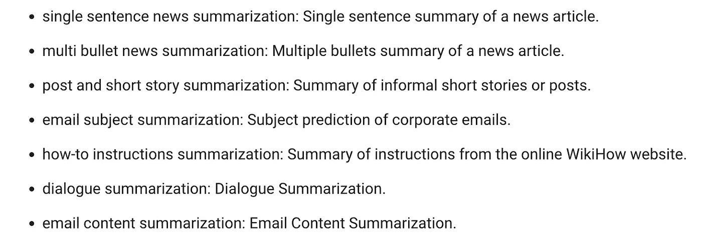

# 为什么文本摘要仍然很难

> 原文：<https://towardsdatascience.com/why-text-summarization-is-still-hard-39e5559db86>

## 以及这如何给创业公司带来机会

在所有自然语言处理(NLP)任务中，摘要可以说是最不值得上头条的任务之一。缩减一篇文章的内容比让 GPT-3 自动产生创业想法要少得多。然而，尽管文本摘要比较低调，但它还远远没有得到解决，尤其是在工业领域。像[微软](https://docs.microsoft.com/en-us/azure/cognitive-services/language-service/text-summarization/quickstart?pivots=rest-api)这样的大公司提供的基本 API 为小公司从各种角度处理摘要留下了足够的空间，目前还没有明显的赢家。本文讨论了为什么文本摘要仍然是一个挑战的原因。

[斯蒂夫·约翰森](https://unsplash.com/@steve_j?utm_source=medium&utm_medium=referral)在 [Unsplash](https://unsplash.com?utm_source=medium&utm_medium=referral) 上拍照

# 摘要不仅仅是文本到文本

> *很简单，摘要可以被看作是通过有损压缩进行的文本到文本的转换*。实际上，摘要是一个(文本+上下文)到文本的问题。

摘要将较长的文本缩减为较短的文本，同时在这个过程中丢弃不太重要的信息。但是什么*重要*？做出一个普遍的判断是非常困难的，因为答案高度依赖于文本的领域、目标读者和摘要本身的目标。例如，考虑一篇关于新冠肺炎的科学论文。摘要应该包含任何生物学术语，还是应该让外行人也能理解？它应该是一个主要事实发现的干巴巴的列表，还是为了说服用户阅读整篇文章而变得爽快和有悬念？

换句话说，什么是好的总结取决于上下文。摘要不仅仅是文本到文本的转换，而是一个文本到文本的问题。像微软的 Azure 认知服务这样的通用摘要 API 遵循了天真的文本到文本的 T21 定义。除了期望的摘要长度之外，它们不允许关于期望输出的任何规范。这就是它们在现实应用中失败的原因，在现实应用中，上下文的细微差别可以成就或摧毁一个产品。

# 提取是幼稚的，抽象是不根植的

在摘要领域，有一个既定的二分法:摘要可以是*提取的*(即来自原始文本的片段)，或者是*抽象的*(即新生成的文本)。**摘录摘要**定位原文中的关键句子，因此倾向于准确地反映主要思想(除非句子被恶意地精挑细选，以歪曲它的方式)。不利的一面是摘录摘要在完全抓住内容的能力上受到限制——被删除的句子将永远丢失。

另一方面，**抽象总结**更接近于模仿人类总结的方式:我们把旨在讲述整个故事的新句子放在一起，但是是从更高层次的角度。然而，抽象的摘要在技术上很难产生，因为它们需要*生成*模型，如 [GPT 家族](https://openai.com/api/)。目前，此类模型遭受*幻觉—* 它们的输出可能与事实不符和/或不受原文支持。这对于摘要来说是一个巨大的障碍，因为忠实于输入文本是不可避免的。虽然防止幻觉是一个活跃的研究领域，但没有保证一定质量的防弹解决方案。这就是为什么谷歌的[抽象摘要 API 仍然是实验性的(即，它不像通过谷歌云平台提供的产品那样得到官方支持)。](https://cloud.google.com/ai-workshop/experiments/abstractive-document-summarization)

# NLP 仍然在长文档中挣扎

根据定义，摘要假设一个*长的*输入文本；否则，一开始就不需要它。然而，NLP 领域仍然难以处理相当大的文档。

主要的模型架构是[转换器](https://arxiv.org/abs/1706.03762)，它强制输入令牌的最大数量在几千以内。任何超过这个令牌数的文档都需要被分割成片段，分别进行汇总。最终结果仅仅是独立子摘要的拼接。对于某些文档类型，比如新闻文章，我们可能会使用这种技术，因为新闻文章可以自然地分成几个独立的部分。然而，当应用于小说时，它就变得不可用了，因为小说在设计上包含了复杂的章节间依赖关系。例如，一个人物的拱形常常横跨整本书；由于子概要是简单地连接在一起的(并且彼此都不知道)，所以概要中的角色的轨迹也会被分割。没有一句话能简洁地描述他们的旅程。

# 公司如何应对总结

由于没有通用的摘要解决方案，各公司根据目标文档的性质，以不同的方式进行处理，从手动到全自动。

## 人工生成的图书摘要

一方面，像 [Blinkist](https://www.blinkist.com/) 和[12 分钟](https://12min.com/)这样的公司雇佣人类专家为非小说类书籍制作高质量的摘要，这些摘要可以在 15 分钟内阅读完。虽然这种方法确实确保了高质量的内容，但它并没有超出人类策划的畅销书名单，所以如果你的阅读品味与众不同，这种方法就行不通。

## 中型内容的自动化摘要

为博客帖子、新闻文章、研究论文或内部公司文档等中等大小的内容制作摘要更适合自动化处理，但仍然很费力。由输入域定义的每个用例(例如，新闻、法律、医疗等。)和输出格式(要点、亮点、单段摘要等)。)需要单独的训练数据集，并且可能需要单独训练的模型。

Google AI 最近发布的一篇[博客](https://ai.googleblog.com/2022/03/auto-generated-summaries-in-google-docs.html)宣布了 Google Docs 中自动生成摘要的新功能，为收集*干净的*训练集提供了理由，这些训练集专注于特定的输入领域，并在收集的摘要中强制执行一致的风格:

> [……]早期版本的[摘要]语料库存在不一致和高度变化的问题，因为它们包括多种类型的文档，以及多种撰写摘要的方式，例如，学术摘要通常冗长而详细，而执行摘要则简短而有力。这导致了一个很容易混淆的模型，因为它已经在如此多不同类型的文档和摘要上接受了训练，以至于它很难学习它们之间的关系。[……]我们仔细清理和过滤了微调数据，以包含更加一致的训练示例，并代表了摘要的一致定义。尽管我们减少了训练数据的数量，但这导致了更高质量的模型。(摘自[谷歌人工智能博客](https://ai.googleblog.com/2022/03/auto-generated-summaries-in-google-docs.html))

与上面自己的建议一致，谷歌为它的[实验性抽象概括 API](https://cloud.google.com/ai-workshop/experiments/abstractive-document-summarization) 提供了不同的端点，每个端点都专注于一个相当狭窄的应用:

由谷歌的[实验抽象摘要 API](https://cloud.google.com/ai-workshop/experiments/abstractive-document-summarization) 提供的独立摘要模型(目前在私人访问下)。

## 创业案例研究:总结

(本文不是由 Summari 或任何其他提到的产品赞助的。)

缺乏一个可以在任何环境下执行摘要的单一模型为创业公司提供了一个巨大的机会；他们可以专注于对大型科技公司不太有吸引力的利基市场。

例如，[**summary**](https://www.summari.com/)**开始着手一项任务，帮助互联网消费者在进行端到端阅读之前筛选文章。在早些时候的一次采访中，这位创始人表达了对最先进的摘要技术的失望，最初选择了人工生成的摘要:**

> **不幸的是，我们没有从人工智能技术中获得我们想要的质量类型。我们相信伟大的总结是有艺术的，它不仅仅是从文本中复制精选的短语，还需要更深层次的理解，这需要一个人，至少现在是这样。( [Ed Shrager](https://medium.com/u/ad8695fdaa03?source=post_page-----39e5559db86--------------------------------) ，Summari 的创始人，在奈斯实验室的[采访中)](https://nesslabs.com/summari-featured-tool)**

**快进大约一年，Summari 现在提供了一个 [Chrome 扩展](https://chrome.google.com/webstore/detail/summari-for-chrome/hfbolicepmhlpoiabgkpeojpagpcmccc)，可以为几乎所有有文本内容的网站制作高亮显示。毫无疑问，人类策划的摘要相当于一个干净的训练集，使他们能够建立一个模型，自动化和扩展他们的原始任务。这里的是到目前为止他们对这篇文章的总结。**

# **文本之外:音频和视频摘要**

**与音频和视频相比，文本可以说是最简单的总结形式。毫不奇怪，音频和视频的最新模型和行业实践落后于文本。**

**例如，在缩短播客的过程中几乎没有自动化。对于播客来说，通常的做法是发布从他们的完整剧集中剪辑出来的 YouTube 短片(例如，见[乔·罗根的频道](https://www.youtube.com/c/joerogan/featured))。这是手动的*提取*汇总。相比之下， [Blinkist](https://www.blinkist.com/) 直接与播客创作者合作，额外制作他们剧集的较短版本，他们称之为“短播”——相当于*抽象*摘要的人工版本。**

**然而，有些自动化是可以预见的。像 [Snackable](https://www.snackable.ai/) 这样的初创公司旨在从音频和视频文件中自动提取并拼接关键片段，目前是以纯粹的提取方式。随着视频处理和生成技术的进步，抽象概括成为可能只是时间问题。**

# **结论**

**总结文本是一项艰巨的任务，因为它高度依赖于上下文。正因为如此，我们不太可能趋同于一个单一的普遍解决方案，也不太可能依赖万能的 GPT 模型为每一种情况做出正确的总结。这种分散的格局为创业公司提供了一个机会，可以投资于专注于非常具体的用例的干净的培训集，并补充大型技术的产品。**

**特别感谢 [Gaurav Nemade](https://medium.com/u/1004186a5b2d?source=post_page-----39e5559db86--------------------------------) 与我分享他一贯深思熟虑的观点。**