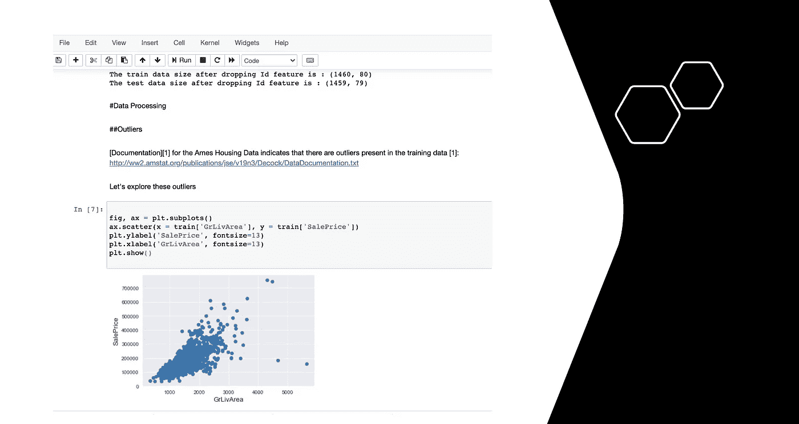
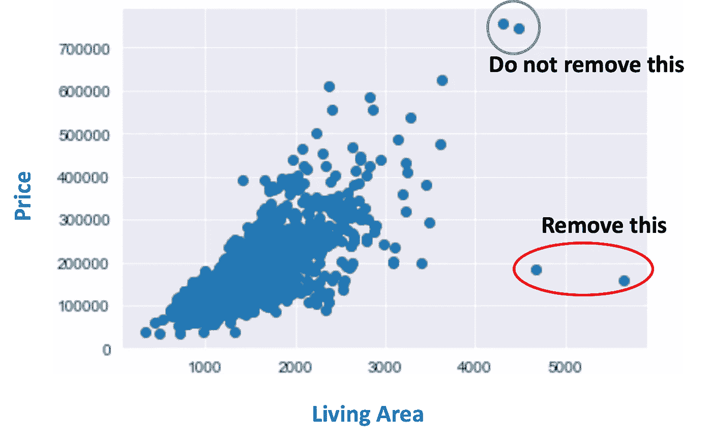
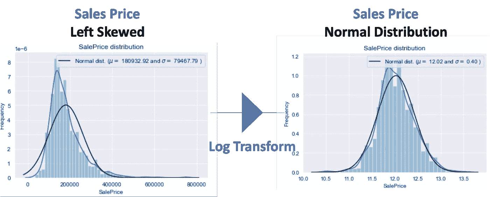
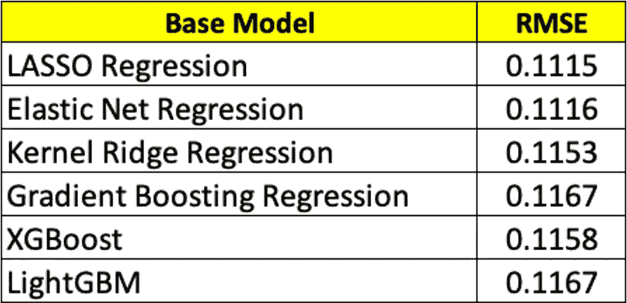
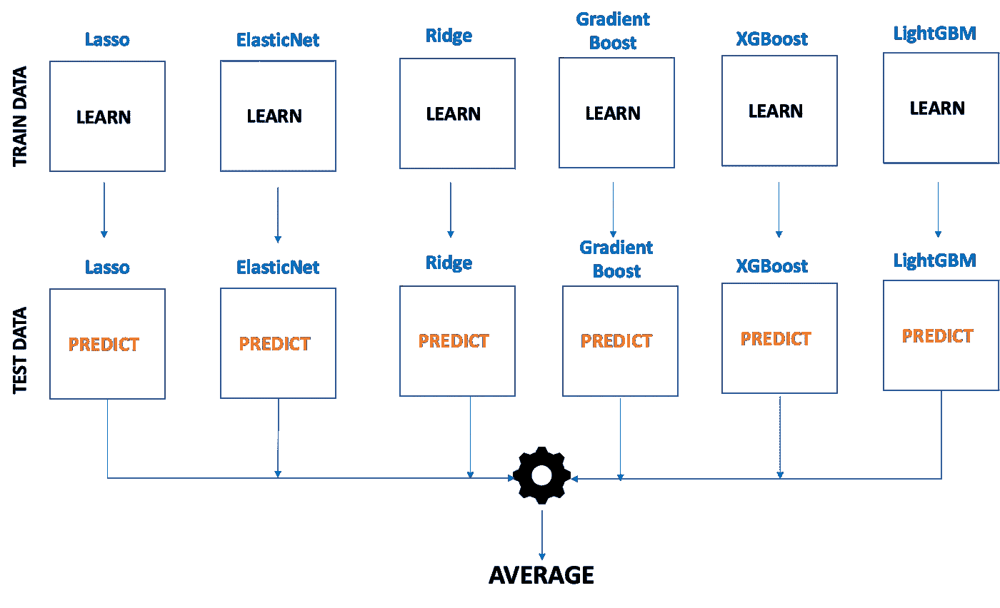
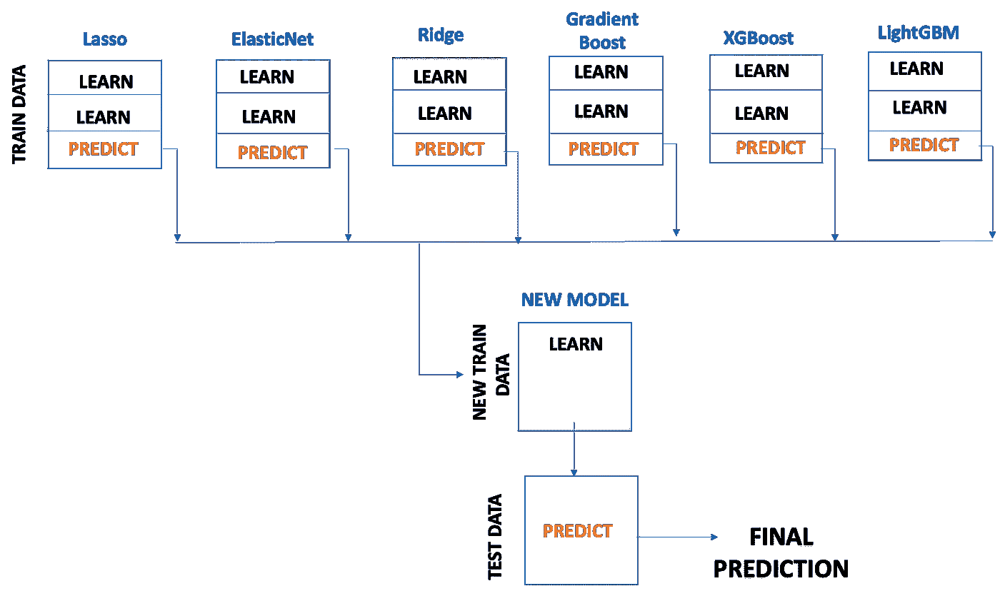

# 为什么要为机器学习问题编写解决方案描述

> 原文：<https://towardsdatascience.com/why-write-a-solution-description-for-a-machine-learning-problem-3ce60649d0a5>

## 完成开发机器学习模型。嗯，还没有完成

杰森·古德曼在 [Unsplash](https://unsplash.com/s/photos/girl-on-computer?utm_source=unsplash&utm_medium=referral&utm_content=creditCopyText) 上的照片

你已经解决了一个机器学习问题。你的模型的准确性是令人敬畏的。你完了。等等！没那么快！

到目前为止，你的工作可能是一个 Jupyter 笔记本，其中充满了代码，一些视觉效果，很少的文档。如果你在一个月左右后看到你的作品，你可能会很难理解你自己的创作。更糟糕的是，Jupyter 笔记本没有你在解决方案中所做的所有决定和假设。

将您所做的惊人工作制作成解决方案描述文档是一个很好的做法。这种文件有以下好处:

*   无论说了什么，做了什么，一份写得很好的文档比一本笔记本更容易理解。
*   你可以记录下为什么你采取了一种特殊的方法。它有助于把你的解决方案放在一个角度。
*   它可以帮助运营团队理解您的解决方案。通常，运营或 IT 团队会对他们更了解的解决方案感到满意。

我举个例子说明一下。就拿 Kaggle 房价预测问题([https://www . ka ggle . com/c/House-prices-advanced-regression-techniques](https://www.kaggle.com/c/house-prices-advanced-regression-techniques))来说吧。这是 Jupyter 笔记本中解决方案的快照。

Jupyter 笔记本中解决方案的快照图像(图片由作者提供)

现在，让我们看看如何写一个解决方案描述所做的工作。解决方案描述是记录您如何解决给定问题的一种方式。该文档可以有三个主要部分:

**业务目标**:这部分解释了问题，以及为什么需要机器学习来解决问题。

**解决方案总结**:这部分有解决方案的总结。它可以是一个列出主要步骤的表格。查看汇总表是快速了解解决方案的好方法。

**解决方案细节**:这一部分简要描述了解决方案、所采用的假设以及解释该方法的视觉效果。

我举个房子预测问题的例子来说明一下。

# 商业目标

目标是预测爱荷华州埃姆斯的住宅价格。有 79 个变量与房子有关。人类不可能确定如此多的变量和价格之间的关系。所以我们采用机器学习的方法。

# **解决方案摘要**

该摘要以简明的方式列出了解决方案步骤，如下所示。

解决方案摘要(图片由作者提供)

如表格有助于以非常简洁的方式清晰高效地记录解决方案。你可以更进一步，为你解决的每个问题做一个标签。这也将让你了解你通常如何处理机器学习问题，重用你的方法以及在你自己的游戏中改进。

# 解决方案详细信息

本节通过解释和视觉效果来描述解决方案。它包含了重要的步骤以及你所做的假设。在房价预测问题上，我们总结了数据处理、特征工程、机器学习方面的解决方案。

## 数据处理

**剔除目标变量中的异常值:**观察价格和其中一个输入变量居住面积之间的散点图，我们观察到一些价格是异常值。我们可以通过删除它们来移除它们。

房价-异常值剔除(图片由作者提供)

**移除目标变量中的偏斜:**目标变量价格偏斜。所以我们可以用*对数变换* 来定价，以使其呈正态分布

销售价格—消除偏差(图片由作者提供)

**估算缺失值**:房价数据集有许多缺失值。丢失值非常多的要素有:游泳池、其他要素、小巷、栅栏、壁炉、前区。

缺少值的要素(按作者排序的图像)

这是估算缺失值的方法。

*池*:我们假设缺少值意味着没有池。这是一个很好的假设，因为大多数房子没有游泳池。我们用 NONE 替换丢失的值。

*杂项、小巷、栅栏、壁炉*:我们可以使用与 Pool 类似的方法，用 NONE 替换缺失值。

*基底表面积特征*:我们假设缺失值意味着没有基底。所以我们用零来代替它。

*地块面积*:由于与该房产相连的每条街道的面积很可能与其邻近的其他房屋面积相似，我们可以通过邻近地块面积的*中位数*值来填充缺失值。

*MSZoning(一般分区分类):*缺失值百分比为 0.13%，非常少。所以我们可以用最常见的值来填充缺失的值，也就是‘RL’。

电气、厨房质量、外观、销售。Type: 我们遵循与 MSZoning 相同的方法，因为缺失值的百分比非常小。我们用最常见的值替换它。

## 特征工程

这里我们应用一些“常识”和“创造性”的特征工程。

**转换一些真正分类的数值变量**:数据具有建筑类别(MSSubClass)、整体状况(OverallCond)、销售年份(YrSold)、销售月份(MoSold)等特征。虽然它们有数值，但它们实际上是分类的。所以我们可以把它们转换成非数值。我们将能够一次性编码它，而不是将其规范化。

**能够表示有序集的标签编码特征:**在数据集中，存在与质量相关的特征。例如壁炉质量、地下室质量、车库质量等。低值表示低质量，高值表示高质量。这意味着这些值代表一个排序:从最低质量到最高质量。这些特征是应用标签编码并将其转换为 1、2、3 等的良好候选

**组合特征**:我们可以创建一个名为总表面积的新特征，它是地下室总面积+一楼总面积+二楼总面积。

**将高度偏斜的特征转换为正态分布**:类似于消除目标可变价格的偏斜，正如我们在上面看到的，我们也可以将高度偏斜的特征转换为正态分布。对于价格，我们应用了对数变换，因为价格中的值是高值。但是，倾斜的输入要素大多与公摊面积、地下室面积、地块面积等区域相关。由于面积值在数值上不是很高， *box-cox 变换*是一个很好的方法。

## 机器学习

在这一部分，我们将看到机器学习的解决方案。

**交叉验证策略:**决定交叉验证策略是机器学习模型训练首先要做的决定之一。在解决方案中，我们将随机选择 K 倍(K=5)。

**精度指标**:由于这是一个连续值预测问题，精度指标为 RMSE(均方根误差)。

**基础模型**:基础模型由应用不同的机器学习算法组成:Lasso 回归、弹性网回归、核岭回归、梯度推进回归、XGBoost 和 LightGBM。

基本模型精度(图片由作者提供)

**集合模型**:这种方法结合了这里描述的多个模型。

*所有基础模型的平均值*:一种方法是取所有基础模型的平均值来生成最终价格预测，如下图所示。

所有基本型号的平均价格预测

集合平均模型的 RMSE 为 0.1081，优于基本模型。

*所有基础模型的堆叠:*在这种方法中，我们对模型的一个折叠进行预测。然后，这些预测用于训练另一个模型，该模型用于进行测试数据预测。

所有基本模型的堆叠

这种方法得到的 RMSE 为 0.07，比平均方法好。

# 结论

制作这样的解决方案文档是一种以简洁明了的方式获取知识产权的好方法。向他人解释你的解决方案以及理解你自己的解决方案将被证明是有效的。

# 额外资源

# 网站(全球资讯网的主机站)

你可以访问我的网站进行零编码分析。[T3【https://experiencedatascience.com】T5](https://experiencedatascience.com/)

# 媒体订阅和推荐链接

请 [**订阅**](https://pranay-dave9.medium.com/subscribe) 每当我发布一个新的故事时，请保持通知。

您也可以通过我的 [**推荐链接**](https://pranay-dave9.medium.com/membership) 加入 Medium

# Youtube 频道

这是我的 YouTube 频道
[https://www.youtube.com/c/DataScienceDemonstrated](https://www.youtube.com/c/DataScienceDemonstrated)的链接