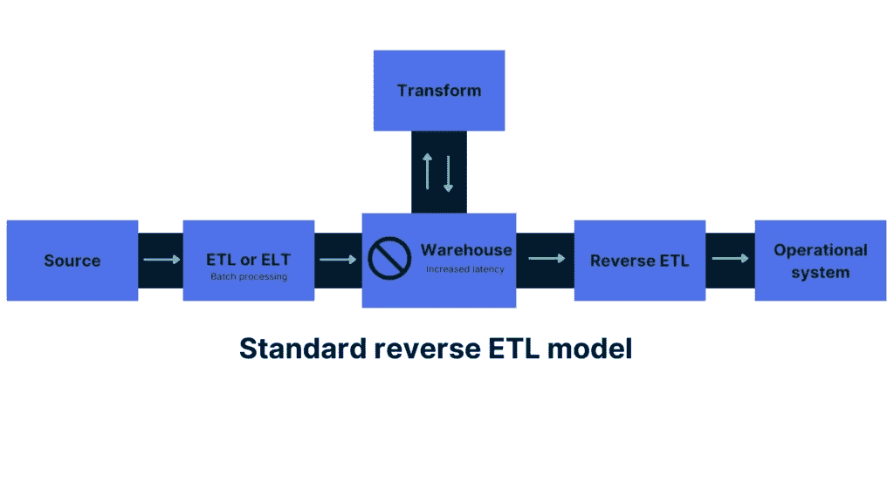

# 为什么你实际上不需要一个反向 ETL 平台

> 原文：<https://towardsdatascience.com/why-you-dont-actually-need-a-reverse-etl-platform-bee9366b5ecb>

## 你只需要一个强大的数据管道系统

Photo by 愚木混株 cdd20 on Unsplash

如果你熟悉[数据管道](https://www.estuary.dev/data-pipeline-basics-for-modern-organizations/)产品，你很可能会遇到一些自称为*反向 ETL* 平台的产品。其他人可能不接受这个标签，但是承认他们支持这个功能。

那么，逆向 ETL 是怎么回事呢？它需要成为一件东西吗？如何在数据栈中实现反向 ETL 呢？

在这篇文章中，我认为这三个问题的答案是:

*这是任何好的管道系统都应该具备的能力。*

*不，如果您有一个架构良好的集成堆栈。*

而且，

*专注于能够捕获和操作数据的健壮、灵活的数据管道，不要担心什么是向前的，什么是“反向的”*

和往常一样，为了搭建舞台(还有，咳咳，为了安抚万能的算法)，让我们从一些定义开始。

# 什么是反向 ETL？

在我们深入研究*反向* ETL 之前，我们必须先谈谈原始(正向)版本，以及与之密切相关的 ELT 概念。

最简单的定义是，ELT、ETL 和反向 ETL 最终都是数据管道。他们的工作是将数据从系统 A 转移到系统 B，并在此过程中应用转换。“E”代表“提取”，“T”代表“转换”，“L”代表“加载”。

ETL 和 ELT 的概念都偏向于管道的*接收*方面。也就是说，数据生命周期的一部分，其中数据从外部位置提取到组织的统一真实来源中。通常，这是一个数据仓库或数据湖。

ETL 和 ELT 之间的区别充其量是模糊的— [参见我的帖子](https://www.estuary.dev/etl-vs-elt-breaking-down-the-split-paradigm/)了解更多。但是一个快速的经验法则是，ELT 通常被视为更现代的框架。它的目标是让数据相对不变地进入数据仓库或湖。在那里，你可以随心所欲地分析和操作它。

许多分析工具直接处理仓库中的数据，比如 dbt 和 BI 工具，如 Superset 或 Looker。但是最终，数据将需要被操作化。它必须以适当的格式被输送到需要它的地方，并投入使用。

这是你经常听到的反向 ETL 的卖点。

反向 ETL [被定义为](https://medium.com/memory-leak/reverse-etl-a-primer-4e6694dcc7fb)“将数据从数据仓库转移到第三方系统以使数据可操作的过程。”

# 数据操作化的重要性

**数据操作化**是向系统提供准确、及时的数据的过程，数据可用于推动行动。

这是数据生命周期的关键部分，它需要来自数据存储系统的输出。

运营数据的例子不胜枚举。以下是几个例子:

*   使用客户行动数据加快技术支持体验
*   在仍有时间防止失去风险客户或销售线索的情况下识别它们
*   基于与在线商店的互动定制超个性化营销
*   监控产品和平台的使用，以确保应用程序的健康，并为用户提供个人消息和指标

您会注意到关于这些用例的两件事。

首先是**他们相对较快地需要新数据。**

第二个原因是，它们主要是由从事*而非*严格意义上的数据相关工作的人驱动的。数据人员喜欢将所有这些人归为“业务人员”这一大类更具体地说，他们从事营销、销售、客户服务、客户宣传和管理等工作。

这些专业人员拥有广泛的技术技能水平，他们需要的不仅仅是访问可操作的数据。他们还需要对它有很大程度的控制，因为，当然，环境是不断变化的。

这意味着**对于数据操作化工具来说，广泛可用和 UI 向前尤其重要。**

我们稍后将回到这一点。

# 批处理数据范式如何创建反向 ETL

因此，我们现在已经确定，我们需要将数据从存储中取出，并对其进行操作。这是毫无争议的。

但是为什么我们需要一整套独特的工具来做这件事呢？这与任何其他类型的数据管道有何不同？

简短的回答是:不是。反向 ETL 是一个简单的模型，它起源于以批处理为中心的范例和数据仓库作为唯一真实来源的概念。

# 批量数据范例

批量数据处理是指在给定的时间间隔内对数据执行操作，如接收或转换数据。因为这并不反映事件在现实世界中是如何发生的，所以这种类型的处理在数据管道中引入了一个滞后——新事件直到下一次批处理运行时才会反映出来。

这与实时处理或事件流形成对比，在实时处理或事件流中，拾取的每条新数据都会触发一个事件，该事件通过数据管道连续流动。更多的背景，你可以查看我在[批处理 vs 实时数据处理](https://www.estuary.dev/real-time-and-batch-data-processing-an-introduction/)的帖子。

批处理一直被认为是一种更容易实现的方法。一般来说，公司使用批处理在内部建立管道。最近，开箱即用的 ELT 提供商被广泛采用(例如 Fivetran)。这些更容易使用，但仍然依赖于批处理。

# 数据仓库是事实的唯一来源

您有时会在当今的数据架构中看到一种模式——也是逆向 ETL 假设您遵循的模式——将数据仓库作为事实的中心来源。从其他系统获取数据到数据仓库进行分析有很高的优先级。

这在多个层面上都存在问题。

第一个问题是，当与我们刚刚讨论的批量接收方法结合使用时，数据仓库如何成为陈旧、停滞数据的温床。使用这些类型的管道，数据不会流入仓库；它在那里着陆，当它着陆时，它已经有点过时了。

现在，这对于探索性的分析和转换来说是可以接受的。毕竟，这就是数据仓库的设计目的。

当您还试图操作来自数据仓库的数据时，这个*真正成为一个问题。*

数据仓库与操作数据库非常不同。你可以在这里阅读[更多关于差异的内容，但最终，当你想要人类或系统可以快速处理的新鲜数据时，你应该从为此目的而设计的运营数据库中获取数据。](https://www.estuary.dev/database-vs-data-warehouse-vs-data-lake-key-differences-and-usage/)

如果您将批处理管道和数据仓库放在操作数据库和目标系统之间，那么您已经为失败做好了准备。

反向 ETL 平台在将数据从仓库中取出来方面有多好并不重要，即使它是一个实时管道也不重要，因为仓库中的数据已经过时了。

当然，记录的体系结构和系统有很多变化。无论如何，来自批处理管道终止的延迟不能在下游取消。

从仓库批量接收和反向 ETL 的栈的简单示意图。按作者。

# “只是另一个数据管道”

一些构建管道平台的公司倾向于“逆向 ETL”的标签其他人对此持怀疑态度。这是有意义的，因为正如我们所看到的，围绕反向 ETL 的对话倾向于转向糟糕的架构模式领域。

数据管道平台 Rudderstack 的首席执行官 Soumyadeb Mitra 写了一篇关于逆向 ETL 技术细节的文章。

他的文章中有几个要点值得一提:

*   一个好的管道平台应该能够将数据传入和传出存储器，并传到各种外部系统，因此没有必要进行区分。
*   实时管道(或事件流)在数据生命周期的所有阶段都很重要。实时和批处理的划分是很多问题开始出现的地方。

我想再详细阐述一下第二点。

# 统一的实时数据管道使得反向 ETL 变得不必要

假设您是一家拥有在线商店的公司，您正在执行分析，目标是提高您的销售和营销工作。您在几个 SaaS 工具中拥有客户数据，并且您可以使用 ELT 工具轻松地将这些数据传输到您的仓库中。

至关重要的是，您还拥有客户与您的在线商店互动的事件日志。您希望这些事件实时到达仓库，所以您不辞辛苦地与 Kafka 建立了一个基于事件的管道。

通过一些操作，您可以在您的仓库中一起探索和分析所有这些数据，并为一些准备好投入使用的数据产品建模。

现在怎么办？

多亏了卡夫卡，你有了一个低延迟的数据流，这很棒，但它终止于仓库。动态数据变成了静态数据，受到批处理数据管道和数据仓库的限制。现在，你的数据仓库是你最好的事实来源。阻力最小的途径是购买一个逆向 ETL 产品，然后就此收工。

但是有一个更好的方法:用一个管道平台统一您的数据系统，这个平台首先基于事件，但是也可以处理批量数据。当然，通过管道将数据传输到仓库进行*探索性*分析，但是直接从数据源*操作它，*并即时应用任何您需要的转换。被操作化的数据和你分析的数据是一样的，但是它不需要通过*到*仓库。

实时数据管道如何连接堆栈各种组件的简单示意图。按作者。

这是可能的，因为正如 Mitra 指出的，您可以将表格数据(您通常批处理的数据)建模为事件流，并在以后重建该表。但反过来就不对了。

现在，我们到了困难的部分。在今天的环境中，创建这种基于事件的数据集成是一个巨大的技术障碍。

像 Materialize 这样的实时 SQL 平台可以为实时数据分析提供一种可行的方法，尽管这实际上增加了一种新的数据存储类型，但仍然需要额外的工作才能完全集成到整个堆栈中。

Kafka，作为最受欢迎的事件总线和一个无人化的框架，可能是一个解决方案——对于一些具体的例子，查看 Kai Waehner 关于[反向 ETL 如何成为反模式](https://kai-waehner.medium.com/when-to-use-reverse-etl-and-when-it-is-an-anti-pattern-c7beaa64c92a)的帖子。

但是 [Kafka 很难](/re-evaluating-kafka-issues-and-alternatives-for-real-time-395573418f27)，成功使用它往往需要你集成多个第三方连接器和服务。

而且，正如我们前面提到的，数据操作需要可访问和透明，否则您可以剥夺“业务人员”的权力，他们的工作职能需要可靠的数据基础。

理想情况下，您想要的是一个事件驱动的实时管道框架，它提供工程能力*，也提供业务人员可以利用的*一个直观的、UI 向前的应用程序。

# 反向 ETL 的更好选择

你可能读过最后一段，然后想:*好吧，这很好，但是它存在吗？*

“反向 ETL”的趋势是一个有趣的趋势，因为它既可以鼓励你对糟糕的架构贴上创可贴，*或*当公司的真正使命是改善整体数据集成时，它可以是一个营销术语。

简而言之，这些管道是绝对可能的，而且已经开始出现了。就目前而言，任何潜在客户的工作都是阅读公司使用的营销术语之外的内容，并了解他们实际上支持什么样的架构。

在我的公司 Estuary，我们的平台是围绕实现实时数据访问民主化的使命而构建的。我提出这个问题是因为我们选择这个任务的原因与此特别相关。

我们相信[该行业正处于向实时数据转变](https://www.estuary.dev/the-estuary-story-and-guiding-principles/)的风口浪尖，我们很高兴成为其中的一员。

拥有一个实时数据中枢是解决大量基础设施问题的方法。从技术上来说，这是完全可能的，但你不会看到它开始接管，直到它变得比旧的替代品更方便。

幸运的是，作为一个行业，我们正处于风口浪尖。

*本文原载于* [*河口博客*](http://www.estuary.dev/blogs) *。*

*你可以在*[*LinkedIn*](https://www.linkedin.com/company/65266256/)[*Slack*](https://join.slack.com/t/estuary-dev/shared_invite/zt-86nal6yr-VPbv~YfZE9Q~6Zl~gmZdFQ)*[*GitHub*](https://github.com/estuary/flow)*上和我以及我的整个团队联系。**