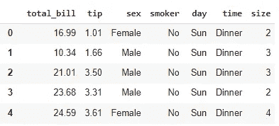
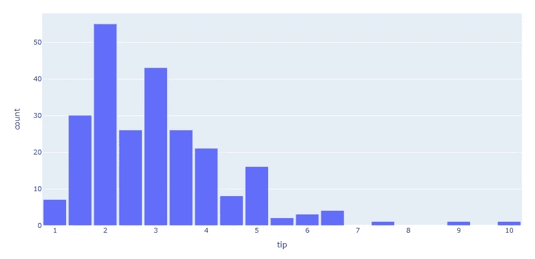
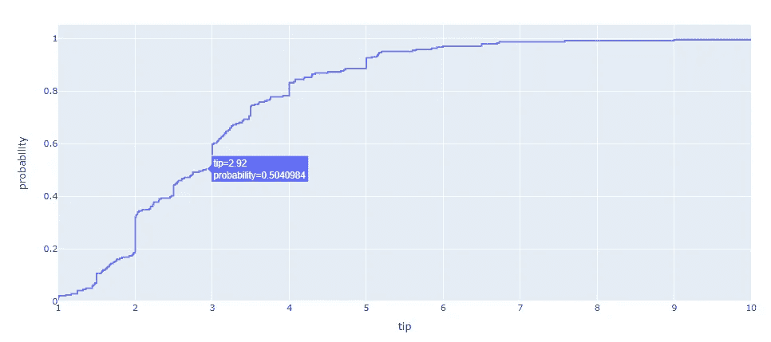
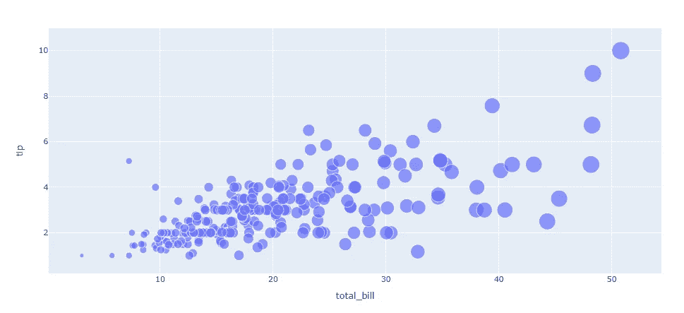
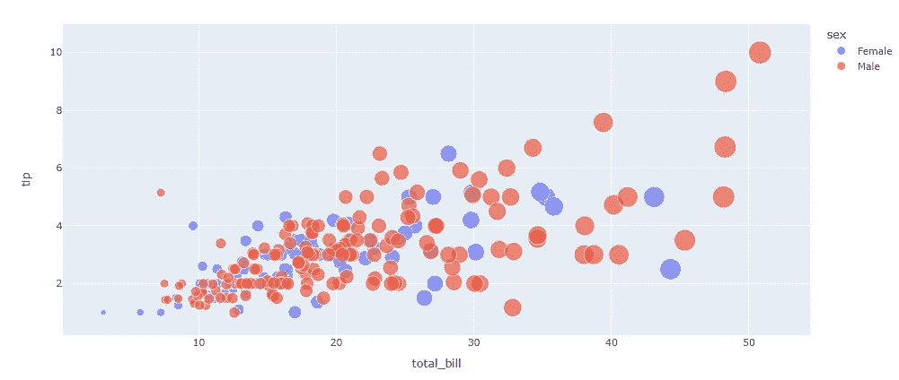
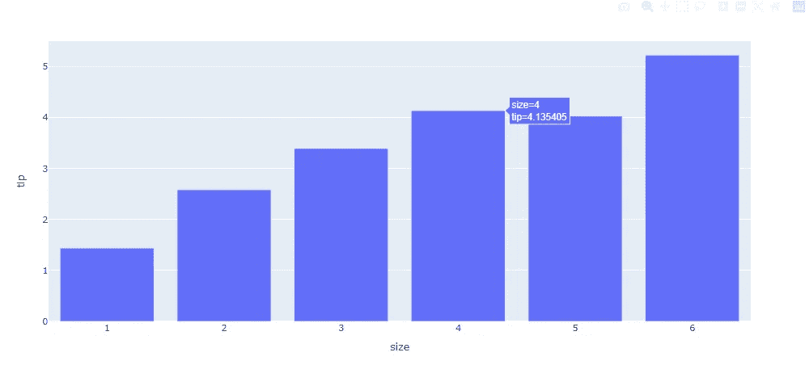
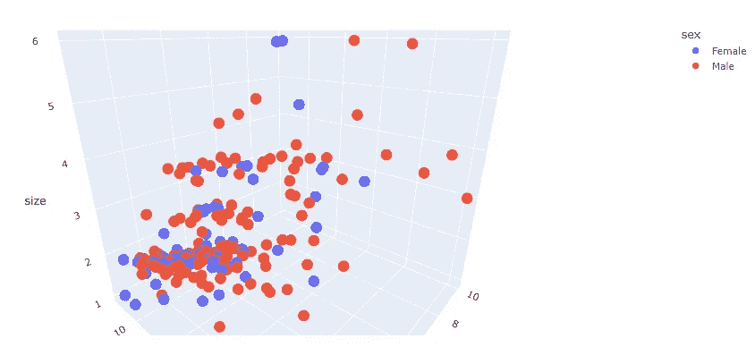
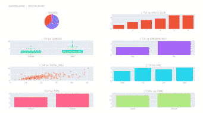

# 为什么必须使用 Plotly Express 进行数据可视化

> 原文：<https://towardsdatascience.com/why-you-must-use-plotly-express-for-data-visualization-9d47f9182807>

## 这个可视化库提高了您的工作效率，并提供了更好的见解


在这篇文章中创建的仪表板。图片由作者提供。

## Plotly Express

*Plotly* 是一家来自加拿大的公司，基于 JavaScript、D3.js、HTML 和 CSS 创建动态图形库。他们的库可用于 Python、R、Julia 和其他编码语言，我见过的用于创建仪表板的最强大的工具之一是他们的 *Dash* 库。

然而，Dash 的使用并不简单，因为您必须具备一些 HTML 和 CSS 的基础知识才能更好地使用它。这并不难，只是更复杂，需要更多的学习时间来适应语法。

知道这一点，也愿意获得更大的市场份额，Plotly 在几年前推出了 Plotly Express。这是一个低代码和易于使用的 Dash 图形版本。在我看来，它是 Python 可用的最棒的图形库之一，特别是因为你可以与数据交互，使你的分析更加动态，并获得比静态图形更有趣的见解。

也就是说，这个论点是我为什么在执行探索性数据分析时应该选择 Plotly express 的主要原因。与数据进行交互，能够只选择数据的一部分，放大数据的某些部分，而且视觉效果非常好，这将对您分析和呈现数据有很大帮助。

## Plotly Express 101

说比做更好。所以我们来编码吧。

从安装`pip install plotly-express`开始。

然后用`import plotly.express as px`导入。

语法非常简单。

```
**# Basic syntax
*px.graphic_type(dataset, x, y, color, size, title...)***# Creating a basic scatterplot
px.scatter(x=[1,2,3,4,5], y=[6,7,8,9,10], title='My First Graph')
```


你刚刚建立了你的第一个 Plotly 图形。图片由作者提供。

小菜一碟，不是吗？这就是这个图书馆的妙处！现在让我们把我们的图形做得更漂亮一点。为此，我将使用众所周知的玩具数据集*提示*，您可以从 Python 中的 seaborn 库中加载该数据集。

```
import seaborn as sns
df = sns.load_dataset('tips')
```



来自 Seaborn 的 Tips 数据集。图片由作者提供。

## 单变量图形

单变量图形仅显示数据集的一个变量的分布。直方图、箱线图、小提琴图*等都是这类图形的好例子。*

```
# Histogram
fig = px.histogram(df, x='tip')
fig.update_layout(bargap=0.1)
fig.show()
```



直方图。图片由作者提供。

如果你注意到在上面的代码中，我把我的图形赋给了一个名为 **fig** 的变量。这种做法必须成为代码中的“标准”,因为当您想要向可视化添加自定义更新时——就像上图中条形之间的间隙——您将能够将图形作为它所分配到的变量的名称来引用，在本例中为 fig。

```
#Boxplot
fig = px.box(df, y='tip')
fig.show()
```


按性别分列的小费方框图。图片由作者提供。

创建箱线图和其他图形一样简单。你可以在上面的图片中看到，我只是使用了基本语法`px.graph_type(data, variable)`，这就是图形。看看最大值、最小值、中值是多么容易:你只需将鼠标悬停在画面上。然后，我们可以很快看到这个分布向右倾斜，tips 值中有一些异常值。

您也可以使用下面的代码快速绘制小提琴图。

```
# Violin plot
px.violin(df, x='tip')
```

或者绘制经验累积分布图。此图显示了点数的分布及其百分比。50.4%的数据在 2.92 以下。



用 Plotly 实现 ecdf。图片由作者提供。

## 多变量图形

在这种情况下，我们将使用两个或更多的变量来比较或分析它们之间的关系。常见的例子有散点图、线图、条形图、多盒图*等*。

让我们来看看*提示*和*合计 _ 账单*是什么关系。

```
# Scatter plot comparing Tips vs. Total Bill
fig = px.scatter(df, x='total_bill', y='tip', size='total_bill')
fig.show()
```



散点图。图片由作者提供。

很容易看出 total_bill 和小费金额之间有线性关系。当我们增加一个时，另一个也会增加。请注意，我们还使用了 *total_bill* 作为我们的大小参数，因此随着账单金额的增加，点数也会增加。

```
# Including another variable
px.scatter(df, x='total_bill', y='tip', size='total_bill', color='sex')
```



按性别划分的小费与总额 _ 账单。作者图片

我们还可以添加*颜色*参数，看看男女是怎么给小费的。在这个数据集中，除了右侧的几个异常值之外，看起来差别不是很大。如果我们快速检查一下这些数字，平均值实际上并不太远(男性:3.08，女性:2.83)。

```
# Mean tip by size
mean_tip = df.groupby('size').tip.mean().reset_index()
px.bar(mean_tip, x='size', y='tip')
```



按聚会规模计算的平均小费。图片由作者提供。

要通过按团体大小的提示创建条形图，首先需要创建一个分组数据框架，然后绘制它。不像用熊猫绘图那样实用，在熊猫绘图中你可以收集所有的东西并用一行代码绘图，但是结果没有这个漂亮。

## 3D 图形

Plotly Express 的另一个很酷的功能是可以很容易地绘制 3D 图形。你所要做的就是使用功能`scatter_3d`并添加一个 **z** 轴。

```
**# 3D Plot total_bill vs. tip vs. size**
fig = px.scatter_3d(df, x='total_bill', y='tip', z='size', color='sex')
fig.show()
```



3D 绘图。图片由作者提供。

3D 绘图的一个有趣之处在于，你可以获得一些在 2D 绘图中可能得不到的洞察力。请注意，在这张图中，对于人数等于 2 的聚会，红色和蓝色更加平衡，这表明可能会有更多的夫妇一起吃午餐或晚餐。然后我们可以看到，在其他规模的聚会中，男性人数更多。

3D 图形非常酷，但也应该小心使用，因为它们读起来并不像看起来那么琐碎。当看这些图时，你更容易失去注意力。

## 创建简单的仪表板

使用 Plotly，很容易创建一个仪表板。与 plotly express 的不同之处在于，你必须使用`plotly.graph_objects **as** go`来代替 Plotly Express。我的 GitHub 中的要点有完整的代码，你可以用它作为模板来创建你自己的可视化。

您可以看到代码本身与 px 图形非常相似。通过一些调整，您可以创建一个数据集的漂亮的“仪表板”视图。


使用 Plotly 的仪表板。图片由作者提供。



图片由作者提供。

现在分析数据更容易了。我们可以看到，数据显示男性占大多数，聚会人数越多的桌子自然给的小费就越多。如果你是一个服务器看到这个，你可能会选择周五和周日的晚餐时间。不吸烟的人也倾向于给更多的小费。

## 在你走之前

数据可视化对于良好的数据探索至关重要。如果一幅图像胜过千言万语，为什么不用一幅好的图像呢？

Plotly express 与其他可视化库一样简单，并为您提供了额外的功能，如与数据交互、缩放、选择要显示或隐藏的类别。仪表板是我们在单个视图中汇编大量信息的好方法，允许对数据集进行更完整的分析。这就是为什么我总是将这个库导入到我的会话中。

我希望你今天在日常工作中学到了一些有用的东西。如果是这样，请关注我的博客。另外，如果你想加入中级会员来阅读好的内容，[这里有一个推荐链接](https://gustavorsantos.medium.com/membership)。

## 参考

[](https://plotly.com/python/plotly-express/)  [](https://plotly.com/python/subplots/)    [](https://gustavorsantos.medium.com/) 