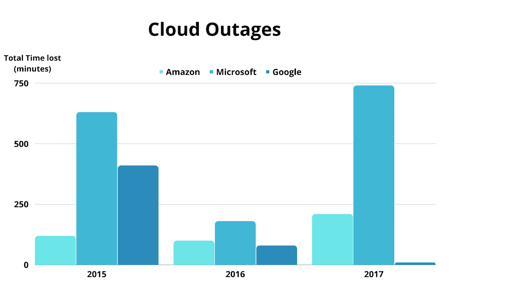

# 为什么您应该在下一个机器学习项目中考虑多云策略

> 原文：<https://towardsdatascience.com/why-you-should-consider-a-multi-cloud-strategy-in-your-next-machine-learning-project-994858273c5e>

## 多云战略使公司能够选择不同云服务提供商提供的云服务

照片由[达拉斯里德](https://unsplash.com/@dallasreedy?utm_source=medium&utm_medium=referral)在 [Unsplash](https://unsplash.com?utm_source=medium&utm_medium=referral) 上拍摄

云计算服务一直由世界上最受欢迎的大型科技公司主导，如 AWS、微软 Azure、谷歌 GCP 和 IBM。但是每个云服务提供商都有一些优点和缺点，这使得一个云解决方案很难满足组织的所有需求。

实施多云战略使公司能够更加灵活地优化成本、速度和性能。

在本文中，您将了解什么是多重云策略，它的优点和缺点，以及它将如何降低运行您的基础设施和应用程序的成本。

让我们开始吧。

# 什么是多云战略？

多云策略是指使用来自两个或更多供应商的一个以上的云服务(多个云服务)。公司实施多云战略，为他们提供的不同服务分配计算资源，以最大限度地降低停机和数据丢失的风险。

使用 canva.com 的[创建](https://www.canva.com/design/DAE5MEj-jzk/Lh3seTNUcEFacOsbqDa5cw/view?utm_content=DAE5MEj-jzk&utm_campaign=designshare&utm_medium=link&utm_source=publishsharelink)

根据来自 [Tech Target](https://www.techtarget.com/searchcloudcomputing/definition/multi-cloud-strategy) 的调查，在 EMA 调查的 260 家企业中，61%的受访者报告使用两家或更多公共云提供商。

对于从事人工智能和机器学习项目的公司，建议考虑采用多云战略，以帮助利用不同云服务提供商提供的独特而经济的服务来管理您的基础设施和应用程序。

例如，一家公司可以在两家云服务提供商中存储、处理和分析他们的数据集，然后在另一家云服务提供商中构建和[部署一个机器学习模型](https://hackernoon.com/how-to-deploy-machine-learning-models-to-the-cloud-quickly-and-easily)。

**注意:**多云环境可以是公共的、私有的或两者的组合。

# 按需云定价比较

*表 1:云和本地选项的每小时成本*

上表显示了基于 GPU 的三种不同性能级别(低、中和高)的价格，还显示了两种利用率假设:低(10%)和高(100%)。

# 实施多云战略的优势

如果您计划实施多云战略，以下是您将从中受益的一些优势。

# 1.价格承受能力

这是实施多云战略的最重要的优势之一。云服务提供商提供不同的价格和等级，因此，您可以根据价格选择不同的服务。

例如，如果运行您的机器学习应用程序需要大量的计算资源来进行预测并提供快速响应，您可以在计算资源比其他云服务提供商更便宜或更实惠的地方部署您的模型。

由[canva.com](https://www.canva.com/design/DAE5MMYtuP4/ZONEBqDNKGFaXATLyoqAQQ/view?utm_content=DAE5MMYtuP4&utm_campaign=designshare&utm_medium=link&utm_source=homepage_design_menu)创作

*“如今，92%的组织已经实施或正在实施云计算战略，82%的大型企业已经采用了混合云基础架构。平均而言，组织使用的是 2.6 版本的公共云和 2.7 版本的私有云。”-*

# *2.防止停机。*

*几个小时的停机时间会造成数百万美元的收入损失，此外，还会失去客户的信任。实施多云战略可以帮助公司全天候运行其应用程序，这提供了额外的可靠性，因为一家云提供商的停机时间不一定会影响其他云提供商的服务。*

**

*由[canva.com](https://www.canva.com/design/DAE5L2syNkU/L5quHU3BOF9ns8ag2D6dsQ/view?utm_content=DAE5L2syNkU&utm_campaign=designshare&utm_medium=link&utm_source=homepage_design_menu)创造；数据来源:[algorithmia.com](https://algorithmia.com/)*

# *3.更低的延迟*

*如果你依赖于一个云服务提供商，如果他们远离云服务器，有时会导致用户访问数据和应用程序的延迟。使用多云策略可以帮助您避免延迟(称为延迟)，因为离用户最近的服务器可以在很短的时间内提供所请求的数据。*

# *4.避免供应商锁定*

*毫无疑问，依赖一个云服务提供商的所有服务会带来困难和挑战。如果供应商决定改变价格模式或功能，你就有麻烦了。转移到另一家供应商也很昂贵，而且耗费大量时间。*

*跨多个云服务提供商运行您的应用程序可以帮助您避免依赖单一云服务提供商。*

# *5.访问 spot 实例的灵活性。*

*Spot 实例是云中未使用的备用容量，其价格低于按需实例。对于需要快速存储、大量内存或快速网络的应用程序或工作负载，您可以使用 spot 实例。*

*例如，大多数 AI 和 ML 应用程序可能需要更多的计算能力，这使得 spot 实例成为最佳选择。*

*但是一些云服务提供商，如 AWS，并不总是有能力提供符合您要求的 spot 实例。如果你依赖单一的云服务提供商，你的应用程序将不会像预期的那样运行。*

*通过实施多云策略，您可以避免这种挑战，因为您可以选择立即从其他云服务提供商那里选择 spot 实例。*

# *实施多云战略的劣势*

*尽管有它的优势，多云策略也有它自己的缺点。*

# *1.需要更多的人才。*

*在实施云计算战略之前或之时，拥有合适的人员非常重要。一个人无法学习和理解来自不同供应商的云服务的基础设施、需求和规范。*

*供应商提供的大多数云服务在配置、迁移和维护流程等方面各不相同。拥有合适的人才对于从云计算环境中获益至关重要。*

# *2.安全风险*

*当与单个云提供商合作时，根据数据和访问权限来管理应用的安全性是很容易的。当您在多个云环境中运行您的应用程序时，它变得更加复杂和具有挑战性。*

*如果您不跨多个云配置安全控制，这可能会增加安全违规的可能性。*

# *3.管理复杂性。*

*实施多云战略会增加运营管理的复杂性。您使用的云环境越多，管理所有环境的管理任务就越多，因为每个云提供商都有自己独特的管理环境的方式。*

*如果云环境管理不善，公司最终可能会为未使用的服务付费，这将增加更多不必要的成本，而不是最大限度地降低成本。*

# *适用于多云战略的管理平台和工具*

*采用和管理多个云服务环境并不容易，借助以下管理平台和工具，您可以轻松迁移到多云环境。*

*[1。Avi Networks —多云服务平台](https://avinetworks.com/)*

*该平台允许您跨不同的数据中心和云服务提供商使用多云应用服务。该平台支持由微软 Azure、谷歌云和 AWS 提供的公共和私有云服务。*

*[2。ai paca——专为机器学习打造的云端工具](https://aipaca.ai/)*

*当涉及到训练和部署机器学习模型时，Aipaca 可以帮助您为您的机器学习项目管理多个云环境。Aipaca 提供了一个名为 Aibro 的无服务器 MLOps 工具，使机器学习云计算变得便宜、简单、快速。*

*他们目前支持 AWS 云平台，并计划支持更多云平台，如 Microsoft Azure、Google Cloud 和 IBM Cloud。*

*[3。centily TIC s——一个多云管理平台](https://www.centilytics.com/)*

*Centilytics 是一个云管理平台，允许公司管理其多云环境。Centilytics 提供了灵活性和成本节约，该公司还可以在一个位置分析、管理和优化您所有客户的云支出。它还为云优化提供了准确的建议。*

# *最后的想法*

*尽管实施多云战略存在诸多挑战/缺点，其中大部分都是可管理的，但优势大于劣势。*

*多云战略使公司能够选择不同云服务提供商提供的云服务，因为有些服务比其他服务更适合特定的任务。最后，公司可以从云开支中节省大量资金。*

*在本文中，您了解了什么是多重云策略、它的优点和缺点，以及可以帮助您管理多重云环境的推荐平台。*

*如果你学到了新的东西或者喜欢阅读这篇文章，请分享给其他人看。*