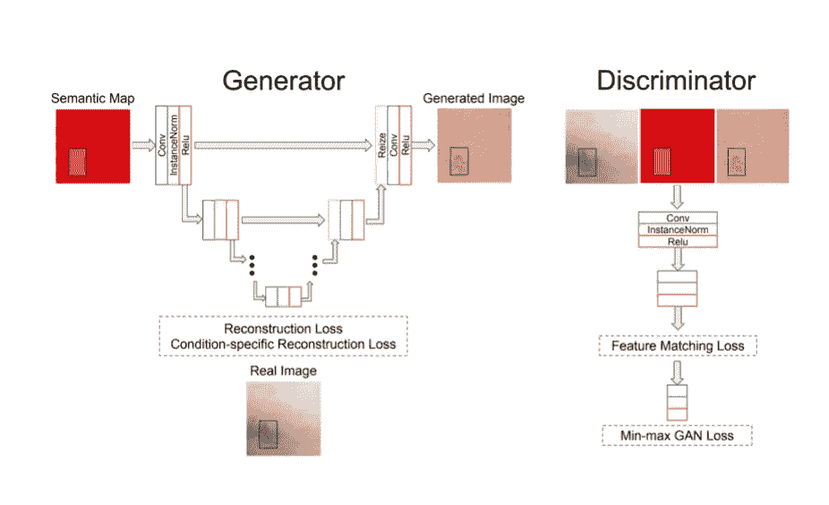

# 为什么您应该考虑对医疗数据使用生成式对抗网络

> 原文：<https://towardsdatascience.com/why-you-should-consider-using-generative-adversarial-networks-for-medical-data-d0fc03314b3>

## 将 GANs 用于医疗数据的两个优势

[国家癌症研究所](https://unsplash.com/@nci?utm_source=medium&utm_medium=referral)在 [Unsplash](https://unsplash.com?utm_source=medium&utm_medium=referral) 上拍摄的照片

有监督的深度学习方法需要大量可能难以获得的数据，尤其是在医学领域。一个原因是，它是私人数据，我们不能总是获得、使用和共享。第二个原因是很难获得这些数据的标签。需要专家标注者，比如医生护士，既费钱又费时。即使我们有大量带标签的数据，我们也可能会遇到其他问题，比如数据平衡。罕见的情况不会在数据中频繁出现，并且会产生影响我们模型结果的偏差。

**那么我们如何克服这些问题呢？有没有一种方法有帮助的潜力？生成性对抗网络。**

有这种潜力的一种方法是生成模型。在这篇文章中，我将描述如何使用生成方法，特别是生成敌对网络，我们可以减少上述问题。这篇文章将涉及数据量、平衡和隐私问题。

# 生成对抗网络

GAN 模型生成与训练集具有相同统计信息的新数据。它由两个相互竞争的网络组成，即生成器和鉴别器。**生成器**学习从潜在空间映射到感兴趣的数据分布，以便生成新的样本。**鉴别器的**目标是将生成器生成的候选数据与真实数据分布区分开。换句话说，对每个样本进行分类，不管它是真实样本还是生成的样本。**生成器的**目标是骗过鉴别器，让它相信生成的样本是真实的，最大化鉴别器的错误率。

**通过使用 GANs，我们可以生成新的医学样本，并解决数据量、平衡和隐私问题。**

# 数据量和平衡

在许多情况下，我们希望开发一种用于医疗目的的算法，但我们没有足够的数据，即使有，也是不平衡的。这两个问题都可以通过使用 GAN 方法生成高质量的合成数据来解决。

比如德摩根。DermGAN 是一个生成网络，将临床图像与皮肤状况相结合。皮肤状况、其存在区域(橙色矩形)和皮肤颜色(红色背景)的贴图编码通过生成器生成合成图像。

图片来自报纸—[https://arxiv.org/pdf/1911.08716.pdf](https://arxiv.org/pdf/1911.08716.pdf)

使用 DermGAN，我们可以生成大量关于皮肤状况的图像。这解决了数据量问题。我们还可以控制图像的平衡。我们可以从稀有条件中产生更多的样本，这解决了数据平衡问题。

这只是这一领域工作的一个例子。

**使用生成式方法可以生成几乎任何数量的图像，并且需要对样本进行平衡。这是克服数据量和平衡问题的一步。**

# 数据匿名化

大多数医学研究都是使用真实患者的私人医疗数据进行的。开源的数据集有好几个，但是局限于特定的领域和特定的数据分布，对于开发真实世界的系统来说是不够的。为了解决这个问题，每个小组都为自己手头的问题创建了自己的医学数据集。这些数据集是私有的，不能与组外的同事共享。因此，知识共享和结果的可复制性变得几乎不可能。

**通过使用 GANs 生成合成医疗数据，我们将能够创建新的数据集，并在医疗界共享它们，从而进一步推动研究。**

# 挑战

虽然这听起来很棒，但在使用合成数据之前，我们需要考虑几件事。比如说-

*   真实数据和合成数据之间的比率
*   用于从 GAN 采样图像的采样技术
*   合成数据的分布。
*   合成数据的质量
*   …

当我们考虑在模型中使用合成数据时，我们应该想到这一点。

# 总结

我希望我说服了您，医学界可以从开发和改进 GAN 方法中受益，以生成高质量的合成医学数据。我不确定我们是否已经到了只能使用合成数据的地步，尤其是不能用于所有领域。但我认为这是一个很好的动机，让我们努力开发医疗数据的 GAN 方法。我会继续在我的地盘上调查此事，并随时通知你。

 [## CVPR 2021 开放存取知识库

### 皮肤病变分析中基于 GAN 的数据增强和匿名化:一项重要的综述

openaccess.thecvf.com](https://openaccess.thecvf.com/content/CVPR2021W/ISIC/html/Bissoto_GAN-Based_Data_Augmentation_and_Anonymization_for_Skin-Lesion_Analysis_A_Critical_CVPRW_2021_paper.html)  [## DermGAN:临床皮肤图像与病理学的综合生成

### 尽管最近在将有监督的深度学习应用于医学成像任务方面取得了成功，但获取图像的问题仍然存在

arxiv.org](https://arxiv.org/abs/1911.08716)