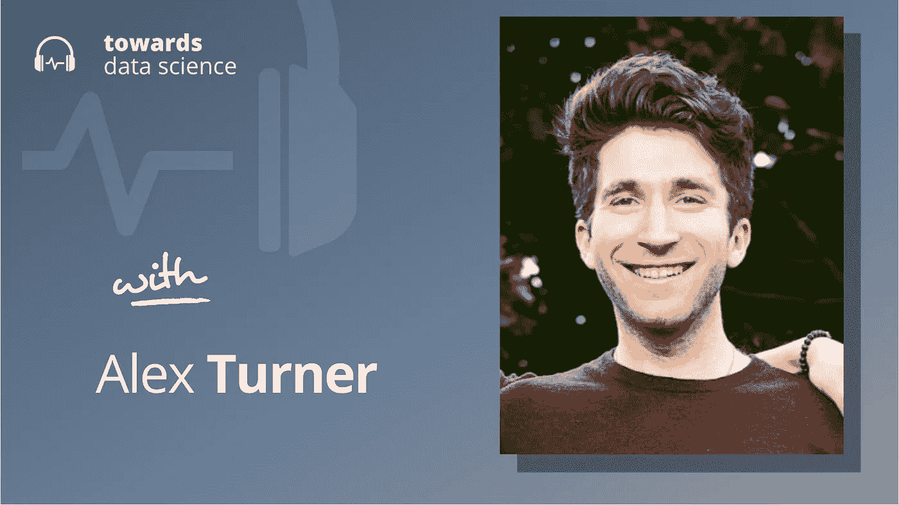

# 高级 ai 会倾向于寻求权力吗？

> 原文：<https://towardsdatascience.com/will-powerful-ais-tend-to-seek-power-e3b6bb02f3a5>

## [播客](https://towardsdatascience.com/tagged/tds-podcast)

# 高级 ai 会倾向于寻求权力吗？

## 亚历克斯·特纳在他备受关注的 2021 NeurIPS 论文中写道，为什么我们应该担心人工智能系统的寻权行为

[苹果](https://podcasts.apple.com/ca/podcast/towards-data-science/id1470952338?mt=2) | [谷歌](https://www.google.com/podcasts?feed=aHR0cHM6Ly9hbmNob3IuZm0vcy8zNmI0ODQ0L3BvZGNhc3QvcnNz) | [SPOTIFY](https://open.spotify.com/show/63diy2DtpHzQfeNVxAPZgU) | [其他](https://anchor.fm/towardsdatascience)

*编者按:TDS 播客由杰雷米·哈里斯主持，他是人工智能安全初创公司墨丘利的联合创始人。每周，Jeremie 都会与该领域前沿的研究人员和商业领袖聊天，以解开围绕数据科学、机器学习和人工智能的最紧迫问题。*

今天的这一集有些特殊，因为我们将要谈论的可能是第一次对高级人工智能系统在未来可能具有的权力寻求倾向进行的定量研究。

很长一段时间以来，在人工智能安全领域一直存在这样的争论:

*   有些人担心强大的人工智能最终会取代甚至完全消灭人类，因为他们一方面找到了更聪明、更有创造性和更危险的方法来优化他们的奖励指标，另一方面
*   那些说这是终结者的好莱坞胡说八道，以一种无益的和误导的方式将机器拟人化。

不幸的是，最近在人工智能比对方面的工作——特别是 2021 年 NeurIPS 的一篇引人注目的论文——表明人工智能收购的论点可能比许多人意识到的更强。事实上，它开始看起来像我们应该期待看到高能力人工智能系统默认的权力寻求行为。这些行为包括像人工智能系统阻止我们关闭它们，以病态的方式重新利用资源来服务于他们的目标，甚至在极限情况下，产生将人类置于危险之中的灾难。

就这些可能性而言，令人兴奋的是，我们开始开发一种更强大、更量化的语言来描述人工智能故障和寻力。这就是为什么我如此兴奋地与人工智能研究员亚历克斯·特纳坐下来，在这一集的 TDS 播客中，讨论他进入人工智能安全的道路，他的研究议程和他对人工智能未来的看法。

以下是我在对话中最喜欢的一些观点:

*   人工智能对齐是一个非常复杂的问题，从远处看似乎很简单。出于这个原因，包括人工智能研究人员在内的人们可以确信这不值得担心，因为他们根本没有参与对齐风险的真正争论。人们太容易忽视对强大的人工智能系统在未来构成的内在风险的担忧，将其视为“终结者式的场景”，或“埃隆总是在炒作的东西”，而在现实中，人工智能风险论点背后有大量令人信服的工作(甚至越来越多的[实验结果](https://openai.com/blog/faulty-reward-functions/))和研究。
*   亚历克斯的论文表明，最优政策——在广泛的环境中实现最大回报的政策——往往会寻求权力。粗略地说，这里的“权力寻求”是指访问那些导致他们在未来有更多选择的状态。例如，对于人工智能系统来说，关机是一种低功耗状态，因为关机后它的动作空间是空的——它没有任何选择。基于 Alex 的工作，我们可以期待具有最优策略的人工智能系统避免因此而被关闭。
*   亚历克斯的论文附有一些警告。首先，它的结论只适用于最优政策，并没有明确指出不完美的政策。因此，你可能会认为次优政策(可能更现实)不会导致同样的权力追逐行为。但是亚历克斯的后续工作填补了这个漏洞:结果证明，产生权力追求根本不需要最优性。
*   第二个警告与亚历克斯对人工智能系统在环境中导航时获得的回报所做的假设有关。Alex 的工作探索了暴露于各种随机奖励分布的人工智能代理的行为，并表明在典型情况下，这些代理倾向于寻求权力。但我们可能希望人为设计的奖励分配风险更小，因为它们被明确设计为安全和有益的。但亚历克斯说，不要这么快:奖励工程是出了名的困难和违反直觉。正如许多实验所表明的那样，即使是今天的人工智能系统也没有为我们想要的东西进行优化:它们为易于测量的代理进行优化，如果这些代理被用作比人类更聪明的代理的奖励指标，那将是彻头彻尾的危险。

编者按:亚历克斯关于权力寻求的工作是重要的、及时的、有前途的。如果你对人工智能安全感兴趣，或者即使你是人工智能风险怀疑论者，我强烈推荐阅读并参与他的工作。我认为，如果不理解权力追求，尤其是亚历克斯的观点，就不可能对人工智能风险有一个知情的、怀疑的看法。你可以在 turneale@oregonstate.edu通过电子邮件联系 Alex。

## 章节:

*   0:00 介绍
*   2:05 对比对研究感兴趣
*   8:00 比对研究的两大阵营
*   13:10 neur IPS 论文
*   17:10 最佳策略
*   25:00 两件式辩论
*   放松某些假设
*   32:45 对论文的异议
*   39:00 更广义的优化
*   46:35 总结