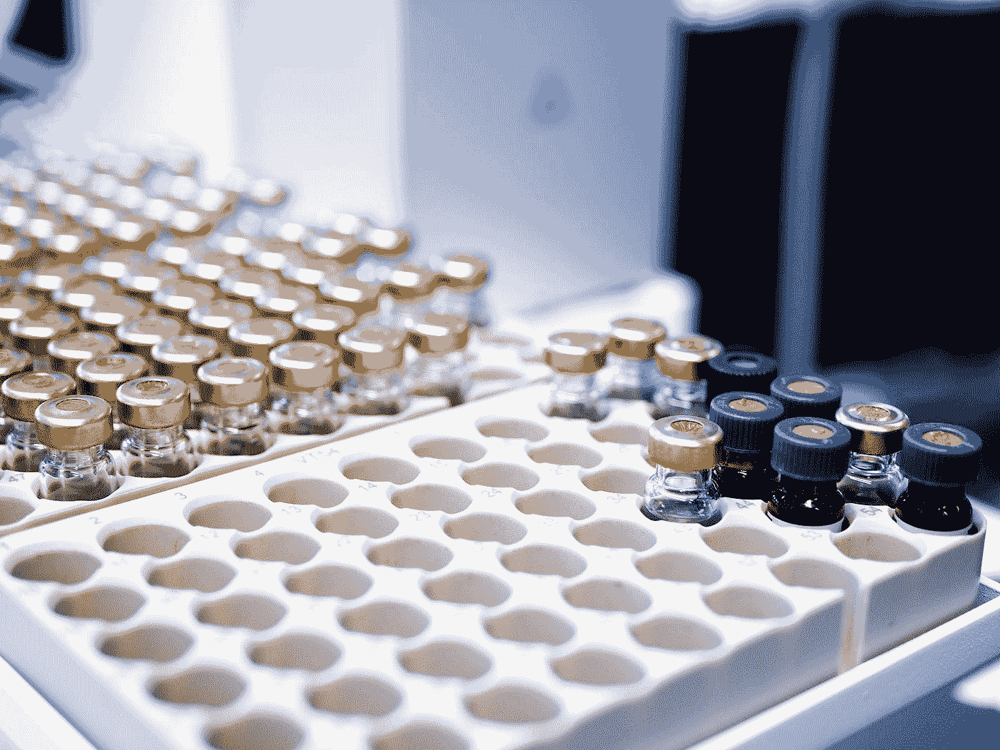

# 合成数据会给 ML 工程师带来伦理挑战吗？

> 原文：<https://towardsdatascience.com/will-synthetic-data-introduce-ethical-challenges-for-ml-engineers-b2608139d27f>

茱莉亚·科布利茨在 [Unsplash](https://unsplash.com?utm_source=medium&utm_medium=referral) 上的照片

什么是合成数据？

机器学习框架变得越来越普遍，越来越容易使用，对于大多数常见的任务，都有现成的机器学习模型。随着机器学习的模型方面变得商品化，许多机器学习计划的焦点转移到数据上。

一些业内人士估计，数据科学家 70%以上的时间都花在了收集和处理数据上。一些算法需要大量数据，如果没有标准数据集，研究人员可能需要收集和手工标注数据。这是一个缓慢、昂贵且容易出错的过程，这使得机器学习项目变得复杂，并延迟了上市时间。

合成数据集由计算机使用算法方法生成。数据点类似于真实世界的事件，但实际上并不代表真实世界的事件。至少在理论上，合成数据集可以为机器学习模型训练提供无限、高质量、低成本的数据。实际上，事情要复杂一些。

为了使合成数据有效地作为机器学习模型的输入，它需要具有三个有些矛盾的属性:

*   合成数据必须具有类似于真实数据集分布的统计分布
*   理想情况下，合成数据点应该与真实数据点无法区分
*   合成数据点应该彼此充分不同

用于生成数据的随机过程或算法并不总是能让研究者进行精细的控制。很多合成数据采样技术都是基于随机化的，有些是从随机噪声开始，逐渐形成有意义的伪影。这使得调整算法以准确提供模型所需的数据变得困难。

# 什么是 ML 工程？

[机器学习工程师](https://www.run.ai/guides/machine-learning-engineering/) (ML 工程师)是专注于研究、设计和构建人工智能(AI)系统以运行预测模型的 IT 专业人士。

机器学习工程师是专注于统计和模型构建的数据科学家与可有效训练模型并将其部署到生产中的可操作人工智能系统之间的桥梁。他们的主要角色是评估和安排大量数据，为 ML 算法和模型优化数据，并构建用于创建和运行这些模型的系统。

ML 工程师通常作为数据科学团队的一部分，与数据科学家、数据工程师、数据分析师、数据架构师和业务经理合作。根据组织的规模，他们还可能与 IT 运营、软件开发人员和销售团队进行互动。

# 合成数据生成方法

## 基于已知分布生成数据

您可以创建复杂的合成数据集或简单的表数据，而无需从实际数据开始。这个过程始于对实际数据集分布和所需数据特征的深入理解。您对数据的结构理解得越好，合成数据就越接近真实世界。

## 将真实数据拟合到分布中

如果您有真实世界的数据集可用，您可以通过识别最佳拟合分布来生成合成数据。然后可以根据分布参数创建合成数据点。有两种常用方法来估计最佳分布:

*   **蒙特卡罗方法** —使用随机抽样和统计分析结果的迭代方法。这种方法可以生成原始数据集的变体，这些变体足够随机以至于是真实的。它涉及一个简单的数学结构，但需要很高的计算能力。但是，与生成合成数据的其他方法相比，它生成的数据不太准确。
*   **非神经机器学习技术** —例如，可以使用决策树来估计真实数据集的分布。然而，机器学习模型可能会过度拟合模型，导致预测分布在原始数据集中的数据点之外具有有限的概括能力。

# 神经网络技术

神经网络是一种创建合成数据的复杂方法。它可以处理比决策树等传统算法更丰富的数据分布，并可以合成视频和图像等非结构化数据。

合成数据生成有三种常见的神经技术:

*   **变分自动编码器(VAE)** —一种无监督算法，它学习初始数据集的分布，并使用编码器和解码器产生合成数据。这个模型产生的重建误差可以通过迭代训练来最小化。
*   **生成对抗网络(GAN)** —一种使用两个神经网络来生成合成数据点的算法。第一个神经网络(生成器)生成假样本，而第二个(鉴别器)学习区分真假样本。尽管 GAN 模型训练复杂且昂贵，但它们可以生成高度真实且详细的数据点。
*   **扩散模型** —一种算法，通过逐步引入高斯噪声来破坏训练数据，直到最终图像是纯噪声。然后训练神经网络逐渐去除噪声，逆转这一过程，直到产生新的图像。扩散模型在训练期间非常稳定，并且可以从图像和音频产生高质量的结果。

# 合成数据的伦理挑战

任何数据集都会有偏差，因为人们在选择与数据集最相关的数据时会做出无意识的决定。例如，许多图像数据集被发现具有不成比例数量的显示白人或男性个体的图像。

合成数据会让这个问题变得更糟。现实世界极其复杂和微妙。合成数据不会创建它所代表的真实数据的“公平样本”——它更有可能专注于真实世界中的特定模式和偏见，并放大它们。另一个方面是，合成数据即使完美地反映了真实的数据分布，也没有考虑到真实世界的动态性。真实数据将不断变化和发展，而合成数据集将仍然是“及时的快照”，最终会变得陈旧。

最大的担忧是，最终由合成数据支撑的人工智能模型将成为一个封闭的系统。他们将基于有偏见的、重复的数据集进行训练，并生成一组封闭的、有限的预测。这些预测将会越来越偏离现实，而且可能会对用户不利。

ML 工程师有工具和技能来缩小这种“现实差距”。但是他们必须意识到这个问题。在许多情况下，合成数据集将无法准确模拟现实，组织将需要承担收集真实数据的成本和复杂性。在许多情况下，将由 ML 工程师做出决定——对于给定的问题，我们需要真实的数据，还是可以满足于合成的数据。

这是一个复杂的挑战，涉及技术、知识和道德层面。在数据的最后，有社会责任感的 ML 工程师将需要权衡问题的重要性，偏见对客户或最终用户的影响，以及数据的成本，并为组织及其客户确定一个最优的解决方案。这是 ML 工程团队肩负的新责任，将影响数百万人的生活和福祉。

# 结论

在这篇文章中，我解释了合成数据的基础，并介绍了它可能给 ML 工程师带来的几个道德挑战:

*   生成合成数据的成本要低得多，但可能比真实世界的数据更有偏差、更不准确
*   合成数据会放大现实世界数据中已经存在的偏差
*   合成数据可能会引入不准确性，导致错误的决策
*   合成数据对现实世界现象的时间变化不敏感

许多机器学习工程师将面临一个困境——选择更容易的合成数据，同时在质量和偏差上做出妥协，或者投资于提供更高保真度的真实数据集。

真实数据集不是没有偏差的，合成数据集可以以最小化偏差和不准确性的方式构建。在某些情况下，由于注释和解释中的错误，合成数据集甚至可能比真实世界的数据更准确。最终，将由对社会负责的机器学习工程师来做出决定——无论是合成数据还是真实数据——这将影响我们未来生活的许多方面。