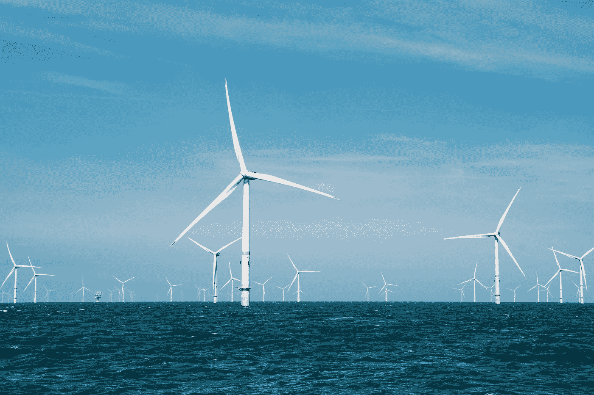
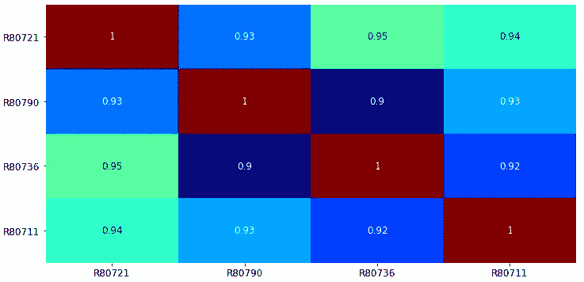
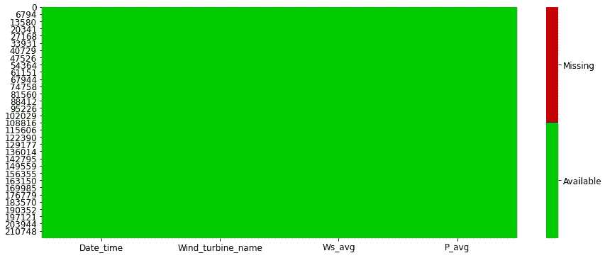
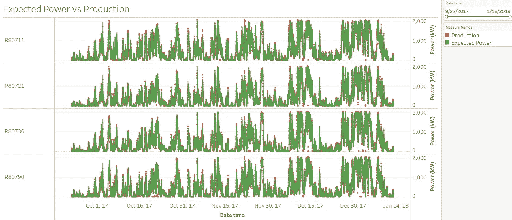
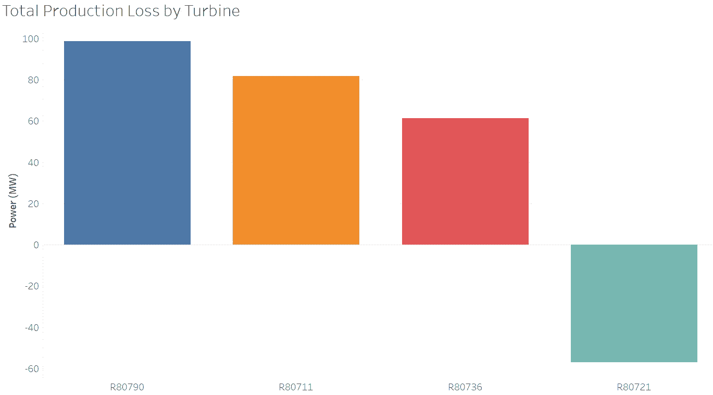

# 风能分析工具箱:预期功率估算器

> 原文：<https://towardsdatascience.com/wind-energy-analytics-toolbox-expected-power-estimator-ce166932f83d>

## 一个开源模块，用于预测运行风力涡轮机的发电量



杰西·德穆伦内尔在 [Unsplash](https://unsplash.com?utm_source=medium&utm_medium=referral) 上的照片

## 介绍

在本文中，我将介绍估算运行风力涡轮机的预期功率的程序，并展示一个带有探索性数据分析的案例研究。*除非标题另有说明，所有图片均由作者提供。*

预测运行涡轮机的功率输出对于技术和商业目的是有价值的。风能专家通过将当前产量与基于供应商提供或历史计算基准的预期值进行比较来跟踪涡轮机的性能。

功率曲线定义了风速和涡轮机输出功率之间的关系，是风力涡轮机性能分析中最重要的曲线。


涡轮机制造商通常根据流向涡轮机的不间断气流提供供应商功率曲线。然而，运行的风力涡轮机的功率输出受到诸如地形、风速表位置以及与现场其他单元的接近程度等因素的影响。

因此，被称为运行功率曲线的每个涡轮机的历史运行行为可以优选作为基准。新发布的预期功率模块使用涡轮机级运行功率曲线来估计功率输出。

## 评估程序


预期功率估计过程

评估程序从过滤历史(训练)数据开始，以去除异常运行数据，如停机时间、降额和性能不佳数据点。

接下来，使用 0.5m/s 的风速桶将净化的运行数据分箱，将中值风速和平均功率作为每个桶的代表性功率曲线数据点。

建议使用三种插值方法，即 [Scipy interp1](https://docs.scipy.org/doc/scipy/reference/generated/scipy.interpolate.interp1d.html) 中定义的线性、二次和三次插值方法，对分级后的功率曲线数据进行插值。

## 模块使用

托管在 [PyPi](https://pypi.org/project/scada-data-analysis/) 上的开源 scada 数据分析库包含预期的 power 模块，代码实现的细节可以在 [GitHub](https://github.com/abbey2017/wind-energy-analytics) 上找到。可以通过简单的 pip 命令安装该库，如下所示。

```
# Pip install library
pip install scada-data-analysis
```

此外，GitHub repo 项目可以克隆如下:

```
# Clone github repo
git clone [https://github.com/abbey2017/wind-energy-analytics.git](https://github.com/abbey2017/wind-energy-analytics.git)
```

从导入熊猫库开始。

```
# Import relevant libraries
import pandas as pd
```

接下来，加载训练和测试操作数据

```
# Load scada data
train_df = pd.read_csv(r'../datasets/training_data.zip')
test_df = pd.read_csv(r'../datasets/test_data.zip')
```

该模块由一个带有*拟合*和*预测*方法的预期功率估算器组成。估计器用唯一涡轮机标识符、风速和功率以及估计方法和插值种类的列标签来实例化。

```
# Instantiate estimator class
power_model = ExpectedPower(turbine_label='Wind_turbine_name', windspeed_label='Ws_avg', power_label='P_avg', method='binning', kind='linear')# Fit the estimator with the training data
power_model = power_model.fit(train_df)# Predict the power output based on wind speed from test data
pred_df = power_model.predict(test_df)
```

目前只实现了宁滨方法，而 autoML 方法将在未来的版本中考虑🔨。

## 案例研究:

**预测运行风力涡轮机的预期功率**

在本例中，我们将执行探索性数据分析(EDA)，预测预期功率，计算生产损失并可视化结果。

涡轮机 SCADA 数据来自由 [Engie](https://www.engie.com/en/activities/renewable-energies/wind-energy) 运营的法国 La Haute Borne 风力发电场，并且是公开可用的。

## 数据探索

首先，我们导入相关的库进行分析。


然后，我们加载数据并检查它是否被正确读取


接下来，我们检查数据中的行数和列数


现在，让我们看看涡轮机的数量和数据的时间间隔。


为了完成 EDA，我们可能想要知道哪个涡轮机的生产与现场的其他涡轮机最相关。这里，我们根据每个涡轮机的功率输出进行相关性分析。



## 数据处理

在此分析中，所需的列是时间戳(日期时间)、涡轮机标识符(风力涡轮机名称)、风速(Ws 平均)和功率输出(P 平均)。因此，我们可以从数据中提取这些列。


此外，我们必须确保数据中没有缺失值，因为所选特征对分析至关重要。如下所示，少于 1%的数据点有缺失值。


下面的代码片段用于生成缺失值在删除前后的可视化效果。

```
# Create a custom color map
from matplotlib.colors import LinearSegmentedColormapmyColors = ((0.0, 0.8, 0.0, 1.0), (0.8, 0.0, 0.0, 1.0))
cmap = LinearSegmentedColormap.from_list('Custom', myColors, len(myColors))# Plot heatmap
plt.figure(figsize=(15,6))
ax = sns.heatmap(scada_df.isna().astype(int)+1, cmap=cmap);# Post-process visualization
plt.xticks(fontsize=12)
plt.yticks(fontsize=12)
colorbar = ax.collections[0].colorbar
colorbar.set_ticks([1.2, 1.8]) # [0.95, 1.05] with no missing values
colorbar.set_ticklabels(['Available', 'Missing'], fontsize=12)
```

删除缺失值之前:


删除缺失值后:



接下来，我们使用清理数据的 70–30 时间分割来创建训练和测试数据。


训练和测试数据具有以下形状:


## 建模

让我们通过将我们的估计器拟合到训练数据来构建功率预测模型。


然后，使用测试数据预测涡轮机的预期功率。


## 结果

在分析结果时，我们将使用均方根误差(RMSE)指标并将结果可视化。此外，我们将比较三种插值方法，即线性，二次和三次。


如下表所示，这三种方法的性能相当，可用于估计预期功率。


此外，下图显示了使用不同插值方法并基于测试数据的每个涡轮机的预期功率曲线。


对于测试数据中的每台涡轮机，与实际生产相比，使用立方模型估算的预期功率的时间序列如下所示:



现在，我们可以计算每个涡轮机的生产损失，以确定哪一个应该优先维修。



如上图所示，汽轮机 R80790 在所考虑的时间内具有最大的生产损失，应优先进行运行检查。此外，涡轮机 R80721 的发电量超过预期，可视为同期性能最好的涡轮机。

总结这个例子，出于商业目的，报告每小时的生产损失通常是有帮助的。损失的时间序列如下:


如果你能在文章中做到这一步，你就是中等冠军了！

## 对未来的展望

在本文中，我们介绍了用于估算运行风力涡轮机输出功率的预期功率模块，并介绍了一个带有探索性数据分析和建模的案例研究。

我们希望发布的下一个模块将有助于根据风电场的功率曲线和风速分布计算年发电量(AEP)。这将有助于为风能分析中的关键任务提供快速且易于使用的模块。

*预期的电源模块现已在* [*PyPi*](https://pypi.org/project/scada-data-analysis/) *上提供，请不要忘记启动*[*GitHub Repo*](https://github.com/abbey2017/wind-energy-analytics)*。也可以在这里* *玩一下本文使用的 Jupyter lab 笔记本* [*。*](https://github.com/abbey2017/wind-energy-analytics/blob/main/examples/expected_power_estimation/expected_power.ipynb)

什么更有趣？你可以通过我下面的推荐链接订阅 Medium 来获得更多我和其他作者的启发性文章，这也支持我的写作。

[](https://aolaoye.medium.com/membership) [## 通过我的推荐链接加入媒体

### 阅读 Abiodun Olaoye(以及媒体上成千上万的其他作家)的每一个故事。您的会员费直接支持…

aolaoye.medium.com](https://aolaoye.medium.com/membership)