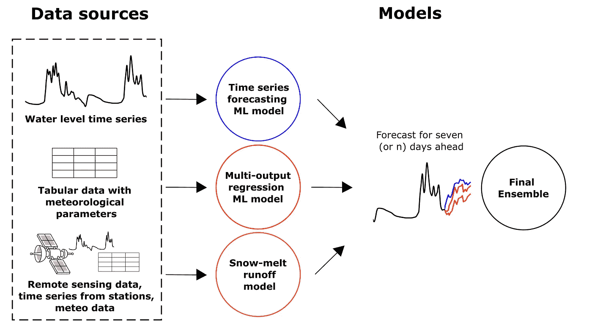
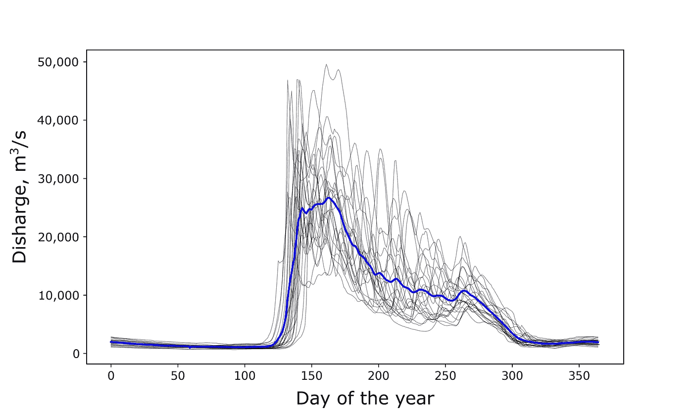
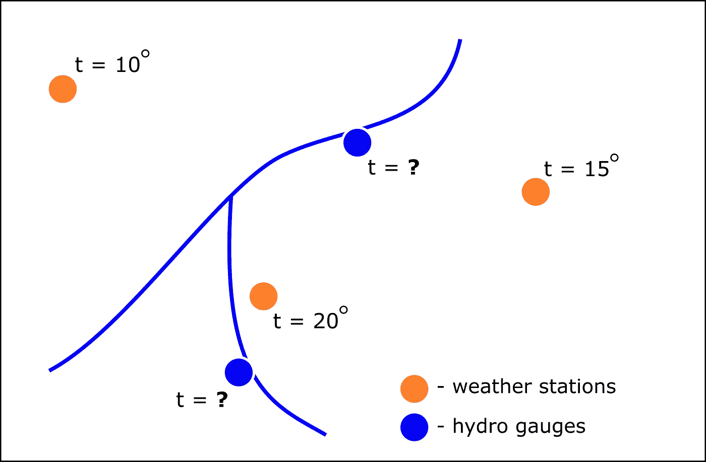
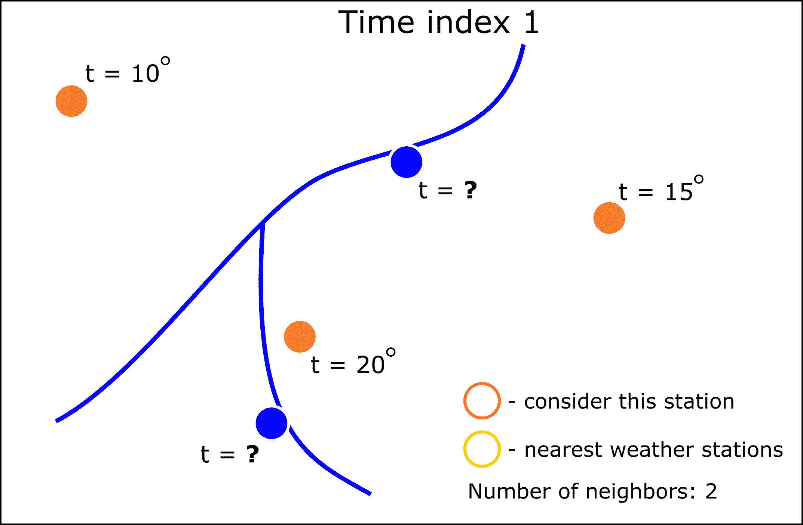
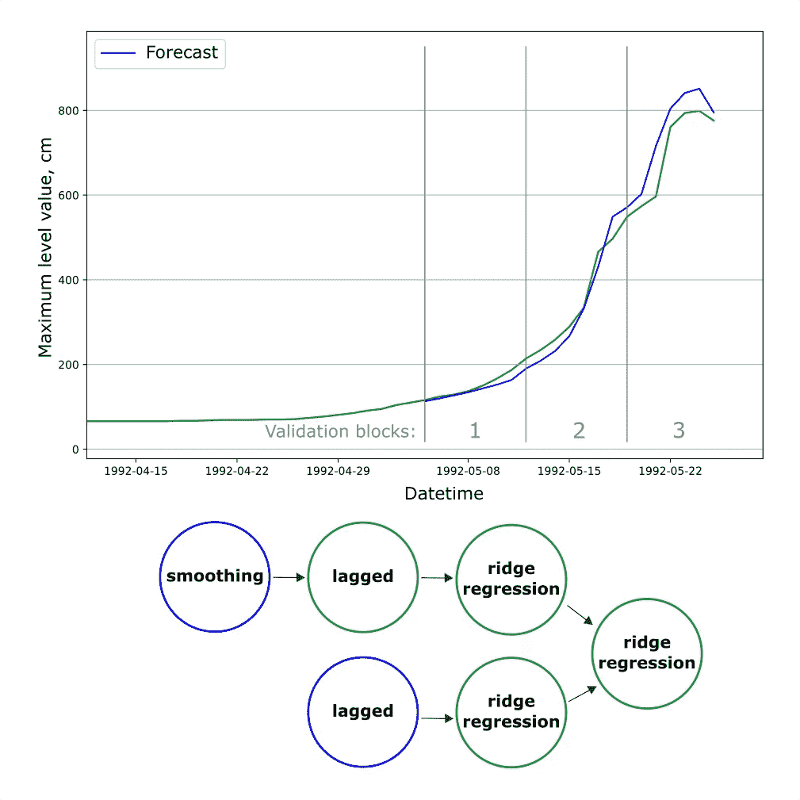
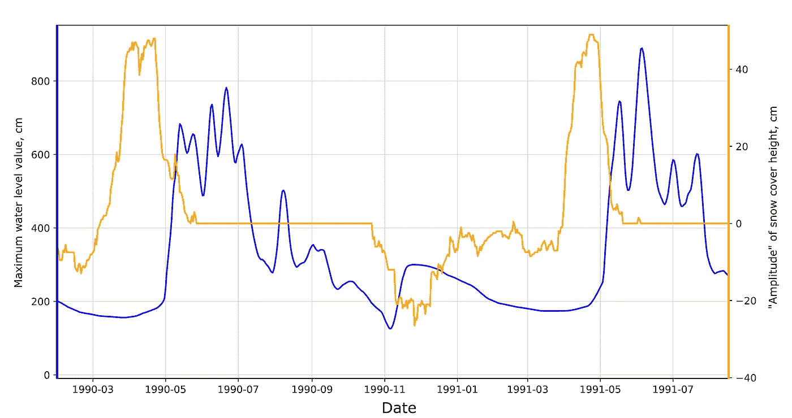
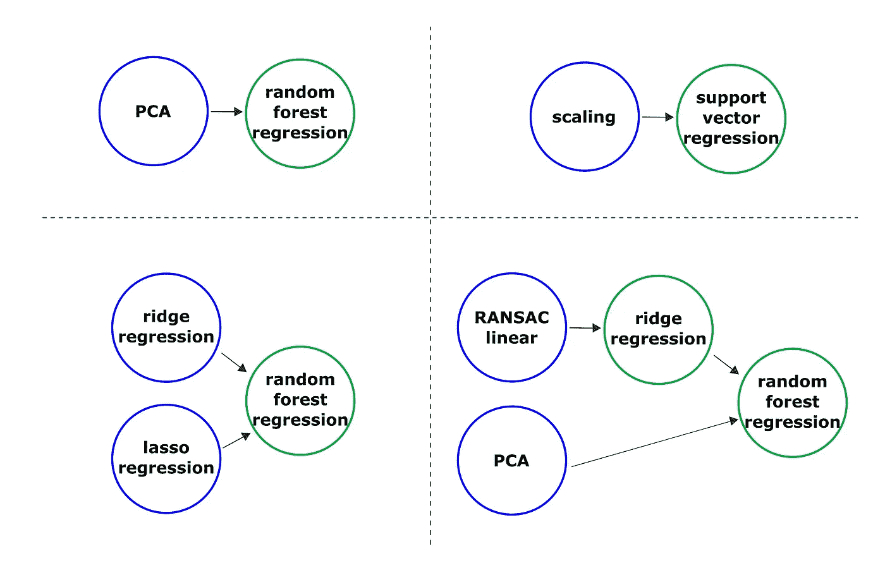
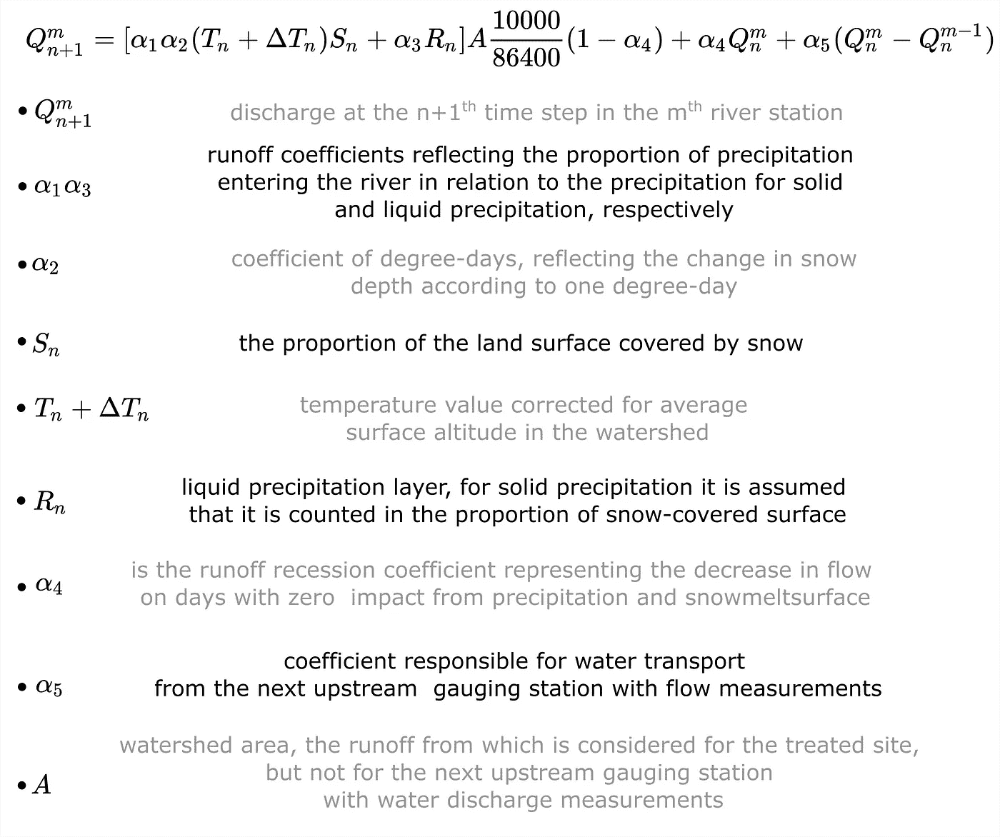
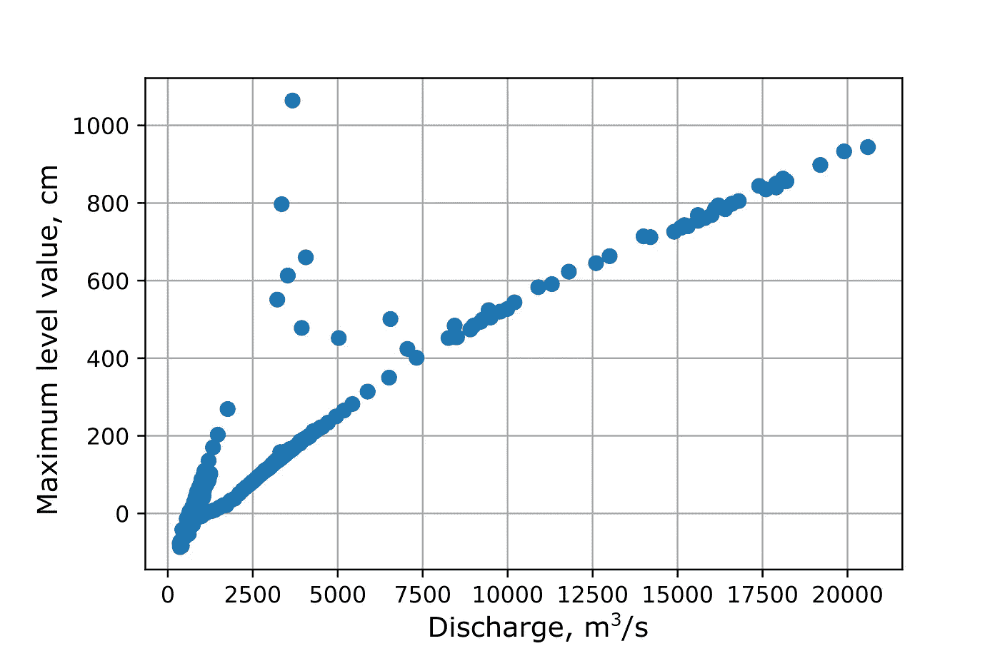

# 用水文学和自动化赢得洪水预报竞赛

> 原文：<https://towardsdatascience.com/winning-a-flood-forecasting-hackathon-with-hydrology-and-automl-156a8a7a4ede>

## [实践教程](https://towardsdatascience.com/tagged/hands-on-tutorials)

# **赢得水文和汽车洪水预报竞赛**

## 端到端项目演练

标题图片(作者图片)

大家好，一直在等待关于自动机器学习(AutoML)的新帖子！

今天我想写一篇关于我们 NSS 实验室团队和我如何使用 AutoML 工具赢得 2021 年黑客马拉松紧急数据黑客的帖子。比赛的任务是建立一个模型来预测未来七天河流水位的上升。我们使用来自气象站、仪表和卫星的数据，将这些数据源融合在一个复合模型中。复合管道由时间序列预测模型、多目标回归和物理模型组成。先说说我们是怎么建立起这么复杂的模型的。

**这是什么黑客马拉松？** [Emergency data hack](https://emergencydatahack.ru/)(俄语)是与俄罗斯紧急情况部合作举办的黑客马拉松，在为期两天的比赛中，几十个团队分析数据并建立模型以预防紧急情况。黑客马拉松于 2021 年 5 月 28 日至 30 日举行。

黑客马拉松是为了什么？首先，这是一个获得新知识和经验的好机会。其次，你可以在现实世界的任务中尝试你的发展。我们有相似的兴趣:在我们的 NSS 实验室开发的 [FEDOT 开源 AutoML 框架](https://github.com/nccr-itmo/FEDOT)被用于黑客马拉松。这让我们发现了它的优点和缺点。

如果你不知道 AutoML 是什么，你可以看看这张图(它几乎足以理解它):

几乎所有的 AutoML 框架([http://memegenerator.net/](http://memegenerator.net/))

选择这个特别的黑客马拉松的一个重要因素是它的主题。除了开发学术 AutoML 框架之外，我们还准备科学论文并管理各种与某些东西建模相关的项目，这些东西会周期性地受到自然过程的损害和破坏。在绝大多数情况下，这种建模与地球科学有关:气象学、水文学、海洋学、地质学等。我们决定在这次黑客马拉松中尝试结合我们在开发算法解决地理问题和 AutoML 方面的经验。

## **任务描述**

黑客马拉松有几条赛道，我们的是第二条。任务是:“建立一个预测模型，使我们能够提前 7 天估计春季期间勒拿河某些地区的每日最高水位增量”。

**略谈现状** 勒拿河偶尔会经历危险的洪水，给萨哈共和国(雅库特)的居民造成严重伤害。这种洪水在季节性洪水期间尤其危险(河流水情的一个阶段，每年在同一季节重复发生；河流含水量相对长期和显著的增加，导致其水位上升(即。[维基百科](https://en.wikipedia.org/wiki/Flood))。为什么春天河水泛滥特别危险？很大程度上是因为冰塞，冰塞在河上形成，起到了一种大坝的作用，导致上游水位急剧上升。另一方面，融化的雪也起了作用，因为随着时间的推移，融化的雪进入了河道。所有这些导致了更高的水位。

为了清楚起见，您可以查看其中一个水文站的流量过程线(图 1):

图一。勒拿河水文测量站“Tabaga”的流量图(图片由作者提供)

黑线显示了从 1985 年到 2019 年不同年份给定站的排水量实现情况。蓝线显示平均值。可以看出，在放电的春天有爆发式的增长。

一个预测河流水位的系统将允许有效地分配资源，以防止洪水或在正确的时间疏散人口。

共有 10 个水文站，需要对其进行预报。为解决方案提供了异构数据:

*   计量站的水位，以时间序列的形式，具有每日离散性；
*   水文站记录的气象参数，以及关于河流事件的附加信息；
*   气象站的气象条件数据:气温和降水，到积雪高度。但这些数据指的是距离水文站有一段距离的点；
*   我们从遥感数据中获得的其他参数(如积雪特征)。

数据包含间隙，一些参数需要插值到相邻点。此外，气象参数是在不同的时间点记录的:在参数的特定每日时间、每日平均值和每月平均值有观测值。因此，在构建模型之前，需要对数据进行预处理。

# **基线**

需要解决回归或时间序列预测任务，其中目标变量是水位在一天内上升了多少的值。

首先，让我们处理目标变量:“最高水位日增量”听起来太复杂了(至少对我们来说)。我们来简化一下！我们不会预测增量，而只是预测最高日水位值。增量计算将在提交前的最后一刻进行，这并不困难。

测量站的水位值最初可以使用单变量时间序列预测来“直接”预测。有这样一个工具是很好的: [FEDOT 预测时间序列足够好](/automl-for-time-series-advanced-approaches-with-fedot-framework-4f9d8ea3382c)。

虽然 AutoML 基于时间序列构建预测，但我们可以花时间提出新的方法。我们决定开发更先进的模型，并为这些“复杂”的模型准备数据作为下一步。

档案照片(右边的伊利亚)(【http://memegenerator.net/】T2)

我们决定使用多步方法:我们需要用几个独立的模块(模型)建立一个集合模型。第一个模型是时间序列预测模型。为什么是那个？因为我们已经建造了它，它已经给出了第一个预测。关于其实现的细节将在下面给出。我们将这个模型称为“模型 1”或“时间序列预测模型”。

“模型 2”。该模型应考虑天气条件以及河流上游或下游发生的事件。它可以建立在多元回归的基础上(当预测不是针对一个元素，而是针对几个元素(在本例中是针对七个元素)时，它是一种回归)。

“模型 3”是一个物理融雪径流模型(SRM)。它捕捉了融雪产生的水量。该模型描述了水从雪中转移到河流的一般过程。所以 SRM 被专家解读的很好。

# **数据预处理**

第一个预处理步骤是将值插值到正确的节点。如上所述，并非所有的参数都是指我们有水文压力计的相同地理点。这个问题可以通过下图(图 2)来说明。

图二。以日平均气温为例，将气象参数值插值到正确的节点上。显示某个时间点记录值的“时间片”(图片由作者提供)

该图显示，在某个时间点，参数值对于所有点都是未知的。有必要应用插值过程。首先想到的是应用一些简单的插值算法。但同时，我们希望保持方法的灵活性:一些气象站虽然位于我们感兴趣的测量站附近(通过经度和纬度坐标),但可能与它的相关性很差。这可能是由于地形的不均匀性。例如，这些点彼此靠近，但是最近的气象站以及测量站位于山谷中，而相邻的两个气象站位于山谷中。那么最好的解决方案就是只从最近的气象站获取数值，而根本不进行插值。在另一种情况下，一个好的解决方案是对五个相邻气象站的值进行平均。双线性插值或最近邻插值不满足这些要求。

因此，决定实施一种方法，其中 K-最近邻(K-nn)机器学习模型将对这些值进行插值。该算法的原理可以在下面的动画中看到:

动画。以两个测量站为例，演示具有不同邻居数量的 K-最近邻居算法(动画由作者制作)

从动画中可以看出，我们可以为所需的气象站更改相邻气象站的数量。在这种情况下，气象参数新值的预测基于两个预测值:纬度和经度。分类指标也可以用这种方法进行“插值”，为此，有必要用分类器代替回归 K-nn 回归器。

简短的免责声明。我们知道上述方法对于气象参数的插值并不是最佳的。如果真的那么简单，那么我们就不需要气象模型、具有同化遥感数据的再分析网格以及用于计算气象特征的复杂算法。但是为了在有限的时间内解决这个问题，我们使用了这个算法。

第二步是填补空白。

观测数据往往有大量的空白。它们可以有不同的长度(在我们的数据集中，它们达到了一年！)并且可以对数据集中的单个变量和所有观察到的特征进行观察。因为即使有很大的缺口，也不希望丢失额外的参数，所以决定根据时间序列的前后部分来填补这些缺口。

填补不重要的空白(不到半年)的主要助手仍然是 FEDOT 框架。该框架在填补空白方面的主要功能依赖于时间序列预测。对于每个间隙,“间隙间隔”中的值是基于前期(间隙左侧的系列部分)和间隙后值(间隙右侧的系列部分)预测的。预测模型首先对史前史进行预测，然后对序列的反向后续部分进行预测。然后使用加权平均值将预测值组合起来。如果您想了解更多有关如何在 FEDOT 中预测时间序列的信息。以及如何填补时间序列中的空白，请查看之前的文章“ [AutoML for time series:使用 FEDOT 框架的高级方法](/automl-for-time-series-advanced-approaches-with-fedot-framework-4f9d8ea3382c)”。

采用了更复杂的方法来填补长时间的空白(超过半年)。由于大多数气象和海洋气象数据的过程是由季节决定的，因此用单一的预测来填补长时间的空白是不可行的方法，因为峰值(被遗漏的)明显丢失了。在这种情况下，我们使用下面的方法。由于数据集代表长期观察，因此可以分解时间序列并提取所需的季节性和趋势，即使考虑到差距，这也是一项没有太大损失的可解决的任务。

图 3。时间序列中的间隙填充(图为水温示例)。红框显示了原始时间序列中的最大差距(图片由作者提供)

库 [statsmodels](https://www.statsmodels.org/stable/generated/statsmodels.tsa.seasonal.seasonal_decompose.html) 用于时间序列的分解。因此，来自“分解”时间序列的季节性成分允许检索时间序列的峰值。然而，仅使用季节性因素来填补缺口并不能反映绝对值，而是代表波动的幅度。因此，为了正确填补这一空白，趋势部分的中值被加到季节部分，这使得有可能将获得的值与主要时间序列相关联。这种方法对于填补水流量和温度之间的差距特别有效，因为这些指标的波动非常明显，而且它们之间的差距非常显著，特别是考虑到这些参数是我们模型的主要预测因素。

# **附加数据**

我们没有使用它…

所以，我们开始寻找开放的数据来源。几乎在任何与地理数据有关的活动中，第一个可能有用的东西是所需区域的高程矩阵。我们决定采用全球数字高程模型(DEM)——SRTM。基于此 DEM，我们建立了测量站的剖面图(图 4)。

图 4。数字高程模型及其生成的剖面图(图片由作者提供)

我们认为，如果我们知道流速和流量，这些数据可以用来计算河流水位。我们甚至在获得访问数据的权限之前就计划使用这种策略…但是我们没有获得流量。因此，我们对数据所能做的就是大致了解测量站河段的地形特征。理论上，我们也可以在将来的模型中使用这个浮雕，但是没有足够的时间去尝试。

# **模型 1:时间序列预测**

已经有几篇关于用 AutoML 预测时间序列的帖子了:“ [AutoML for time series:绝对是个好主意](/automl-for-time-series-definitely-a-good-idea-c51d39b2b3f)”和“ [AutoML for time series:使用 FEDOT 框架的高级方法](/automl-for-time-series-advanced-approaches-with-fedot-framework-4f9d8ea3382c)”。描述了为 FEDOT 使用的预测序列建立管道的基本原理。

然而，让我们简要描述一下时间序列预测模型是如何建立的。它首先将一维时间序列转换为滞后表(滞后表)。因此，表中的特征是时间序列在 t、t-1、t-2 等时刻的当前值和先前值。在这种情况下，目标变量变成时刻 t+1、t+2、t+3 等的值。经过这种转化，就可以在桌面上训练出合适的机器学习模型。使用堆叠技术，可以将几个模型组合成一个管道。这就是 FEDOT 所做的。

如果您查看三个验证块的最终预测示例，您可以看到该模型表现得相当好(图 5)。

图 5。使用时间序列预测模型进行洪水水位预测的示例。预测中使用的管道结构如下所示。(图片由作者提供)

# **模式二。多输出回归**

该模型负责计算气象参数和河流上发生事件的数据。先说概念:计划在如下形式的表上求解多目标回归(图 6)。

图 6。用于求解多输出回归任务的生成表示例。基于在一定时间间隔内汇总的关于天气状况的信息，建立未来七天的预测模型。(图片由作者提供)

表中的目标变量是七个，在本例中是从 4 月 21 日到 4 月 27 日，这等于预测范围。同时，可以对不同时间间隔的属性进行汇总。例如，考虑日之前 10 天或 20 或 30 天的降水量。

从特征的描述中可以清楚地看出，它们是从初始气象参数中得到的。参数可以用不同的方式聚合:取和、平均值、振幅、最频繁值等等。

这将是令人兴奋的(我希望),仔细看看积雪高度的振幅的例子。让我们马上说，在雪高的情况下，这并不完全是“振幅”，其值是通过公式 max-min 计算的。对于雪的高度，我们使用所选间隔的第一个和最后一个值之间的差值:第一个-最后一个。考虑这样一个例子，我们合计 2020 年 4 月 20 日*日*的值，并取一个时间间隔进行合计，例如 10 天:在这种情况下，我们将从 4 月 10 日*日*记录的雪高值中减去 4 月 20 日*日*获得的值，因此我们将知道“在选定的时间间隔内融化了多少毫米的雪”，我们将对 11.04 和 21.04 等进行同样的操作。有一个选项可以只计算振幅，但我们是这样做的。这样做是为了区分降雪的时间和积雪高度增加的时间，以及积雪大量融化的时间。在振幅的情况下，这是不可能的，尽管我们在这个方法的第一个版本中计算了振幅。为了更好地理解这一点，让我们看一下图表，它同时显示了当天的最高水位和积雪的“幅度”(图 7)。

图 7。积雪高度的最大值(左边的蓝色曲线和刻度)和“振幅”(右边的橙色曲线和刻度)(图片由作者提供)

橙色曲线的峰值可以解释为“融雪最强烈的时期”。在这种情况下，橙色线的零下极端可以被称为“强烈积雪期”。我们感兴趣的正是第一个。因此，我们可以从图表中看到，当雪的“振幅”达到其峰值时，水平开始增长，并一直持续到“振幅”达到接近零的值，然后观察到最高的最大水平。

我们对其他气象参数进行了类似的变换。然而，有一个重要的预测因素值得仔细研究(甚至在图 6 中它也因此用红色突出显示)——事件重要性等级的总和。这里的事件是“河上发生的事情”。它们以短语“冰漂流”、“波浪”、“破冰”、“车站上方冰塞”等形式被记录下来。这些短语不能直接转移到模型中，这些短语的聚合过程也必须通过，以便我们可以在多输出回归模型中使用它们，但目前还不清楚如何进行。

我们所做的:我们将事件与等级相匹配。等级是我们对一个事件在洪水期间对水位上升有多大影响的专家评估。排名范围从 0 到 3，其中 0 不重要，3 非常重要。因此，生成了一个特殊的表，下面展示了其中的一部分。

表 1。一些事件和重要性为它们排序

现在我们用序数值来代替文字描述。所以现在我们可以说“站下堵塞”(3)大于“河流已经干涸”(0)。接下来，应该汇总数据，就像我们之前处理气象参数一样。对于军衔，决定计算某一时期的总数。如果等级的总和很大，我们可能会预期河水位会有明显的变化，反之亦然。

因此，特性已经生成，是时候决定将特性映射到目标的模型了…但是我们不会这样做。AutoML 将自己构建一个合适的模型，它将定义数据预处理和转换的方法，所以我们只需运行 FEDOT 并继续下一步。最终管道的结构示例如图 8 所示。

图 8。解决多目标回归问题时找到的管道示例(图片由作者提供)

模型预测的结果已经由两部分组成，如下图所示(图 9)。

图 9。从两个模型获得的预测示例(图片由作者提供)

# **模型 3。物理模型**

决定为其中一个测量站建立一个物理模型。为此，我们使用现有的物理建模方法(即融雪径流模型——SRM ),并用纯 Python 实现了该算法。之后，我们将准备好的模型集成到我们的公共管道中。我们获得了一种混合建模:我们使用机器学习和物理模型来预测水位。由于黑客马拉松的时间有限，我们在一个晚上写了这个模型…

你可能会问为什么我们要这样做，为什么我们要在一个晚上写物理模型，为什么我们要用 Python？—别问了，我们只是玩玩。毕竟，这就是黑客马拉松的意义所在。

这就是它的工作原理。对于我们的方法，我们采用了相对简单的 SRM，因为它易于用代码实现和执行调整，并且我们有兴趣尝试使用确定性模型和机器学习方法的组合方法，而不管方法的复杂性。此外，通过调整模型，我们将意味着定义模型超参数，例如在计算中作为常数的系数和其他值。这种调整的需要是由于我们不能直接知道我们感兴趣的模型参数，我们必须在观察到的现象的基础上对它们做出一些假设。

所使用的模型旨在重现山区流域的日径流。该模型同时考虑了融雪和雨水的贡献。然而，该模型也可以适用于其他条件和其他数据。在我们的案例中，在计算河流流量时，我们将各种气象和融雪数据以及上游水位测量值插值到现场。在没有更好的替代方案的情况下，我们没有将流域上的降水层完全整合到我们模拟的河流量规中，而是被迫使用河流量规点的值。对于积雪数据，我们使用来自 MODIS 传感器的每日数据，并对整个流域的值进行平均。因此，对于时间 n 的流量，我们获得以下关系:

用于计算的主方程

这种模型应用的缺点是，其中包含的许多系数取决于各种气象条件，也与该地区的气候和盆地的地形特征有关。如果我们一次对所有可用数据进行模型调整(校准)，许多参数将被“平均”估计，而它们与气象因素影响相关的可能变化将不会被考虑在内。为此，我们决定根据气象测量结果，通过对观测日进行聚类来确定特征气象条件。这种聚类的困难在于空间的高维度:八个测量值描述了不同的气象特征。虽然在高维空间中有聚类方法，但我们决定先降低所研究空间的维度，然后再进行聚类。在使用主成分分析(PCA)和输入阵列的相应变换后，通过 [DBSCAN](https://en.wikipedia.org/wiki/DBSCAN) 进行分类。为每个集群分别执行后续操作以找到模型参数。

为了进一步搜索模型参数，我们对目标函数进行了优化，该目标函数通过测量站中观测到的排水量与通过之前引入的模型对选定数据进行的预测之间的差异模数来定义。

对系数进行优化，并使用[差分进化方法。](https://en.wikipedia.org/wiki/Differential_evolution)假设在处理新数据时，算法将首先确定所处理的一天属于哪种类型的气象条件，选择与这些条件对应的流量模型系数值，然后计算出水量。

最后一个任务(由于时间限制，在黑客马拉松中没有完全解决)是根据水流量确定河流水位。虽然大多数河流的特点是流量和水位之间的非线性关系，但冰冻的河流和其他冰现象具有更复杂的关系。例如，当一条河流打开时，可能会发生冰塞，阻止水向下游流动。在这种情况下，水位显著增加，但流速(定义为单位时间内流经横截面的水的体积)由于速度较低而变得不明显。图 10 显示了一个河流站的这种依赖性的例子。

图 10。测量河流站的水位和流量(图片由作者提供)

# **结论**

结果是三个模型的集合，用于时间序列预测、聚合气象数据的多元回归和单个测量站的物理建模。准备好的模型胜过竞争者。所以，我们拿了第一名。

我们希望我们的经验能帮助那些阅读这篇文章的人在他们的黑客马拉松中成功地表现。或者，它可能对工程师和程序员有用，他们的任务是为他们需要的河流实现一个预测系统。

*   提供解决方案的存储库— [emergency_datahack_nss](https://github.com/ITMO-NSS-team/emergency_datahack_nss)
*   我们使用的 AutoML 框架是 [FEDOT](https://github.com/nccr-itmo/FEDOT)
*   关于我们实验室的信息页面— [NSS 实验室](https://itmo-nss-team.github.io/)
*   关于赢得黑客马拉松的新闻帖子— [ITMO。新闻](https://news.itmo.ru/en/university_live/achievements/news/10409/)
*   我们的手稿基于提出的方法— [使用复合模型和自动机器学习进行短期河流洪水预报:勒拿河案例研究](https://www.mdpi.com/2073-4441/13/24/3482)

NSS 实验室团队:

*   尤利娅·鲍里索娃
*   米哈伊尔·马斯利亚耶夫
*   格列布·马克西莫夫
*   [伊利亚·雷文](https://github.com/v1docq)
*   米哈伊尔·萨拉法诺夫