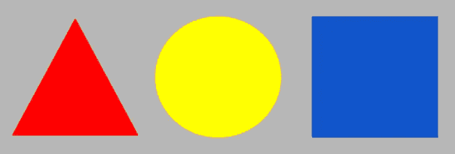

# 单词嵌入符合康定斯基的颜色理论

> 原文：<https://towardsdatascience.com/word-embeddings-align-with-kandinskys-theory-of-color-26288b864834>

罗斯·索科洛夫斯基在 [Unsplash](https://unsplash.com/s/photos/bauhaus?utm_source=unsplash&utm_medium=referral&utm_content=creditCopyText) 上的照片

## 艺术与科学交汇处的快速实验

# 介绍

在本文中，我描述了一个快速实验，旨在通过使用单词嵌入表示和余弦相似性来测试瓦西里·康丁斯基的形式和颜色理论，量化两个看似正交的集合(基本形状和原色)之间的关联。然而，尽管使用余弦相似度来测量单词之间的关联在自然语言处理文献中被广泛接受，并且尽管该实验的结果是积极的(即，结果与基础理论一致)，但本文既不旨在确认该理论，也不旨在作为强调数据科学中良好实验实践的教程，而是呼吁质疑余弦相似度在定性上下文中的价值，如讨论中更详细描述的。

# 形状和颜色

大约一个夏天，在研究包豪斯的时候(我想尝试用形式而不是文字来思考)，我偶然发现了盖蒂研究所的[康定斯基形式和色彩练习](https://www.getty.edu/research/exhibitions_events/exhibitions/bauhaus/new_artist/form_color/interactive/)；成为各种练习、测验、谜题等的欣赏者。这可以在网上找到，因为我对这个练习特别提出的问题非常感兴趣(例如，“颜色是什么形状？”)尽管如此，我还是决定试一试。

这个练习简单地要求参与者将{圆形、三角形、正方形}与{红色、蓝色、黄色}一一对应，在对这个任务进行了一些思考之后，我决定首先三角形是红色的(它们是最尖的，红色有它的尖锐性)，然后圆形是黄色的(可能太受儿童书籍中太阳的黄色圆形的影响)，最后正方形必须是蓝色的(方便地说，是地平线上的海洋)；兴奋地，我进入下一个屏幕，看看我是否正确(愿意假设一个人对提出的问题可能是正确的)。

提交的模型(来源:作者)

我的模型不正确。根据康定斯基的理论，三角形是黄色的(黄色是我误认为红色的鲜明颜色)，圆形是蓝色的(将它们的圆形与蓝色的深度和平静对齐)，正方形是红色的(“有力”和“自信”，反映了平面的方形固有的“张力”)。(读完之后，我完全同意这些解释，并认为它们是正确的——它们是很好的解释——但我确实喜欢我自己的解释，即使它们分别过度延伸，依赖于第二代表，依赖于事后推理。)

康定斯基的模型(来源:作者)

# 检验康定斯基的理论

为了测试他的理论，康定斯基向他的学生展示了一份调查(类似于上面的练习)，要求他们将形状与颜色搭配起来；我不知道他在教学中是否让他的模型出错了，但是大多数的回答确实与康定斯基的模型一致。

与康定斯基的学生相比，他们在完成调查之前可能已经受到了他的模型的影响(毕竟他们是从他那里学到的)，我看不出有什么真正的理由来假设模型本身已经影响了大量随机的英语使用者样本(例如可以对其文本 word 2 vec embeddeds[3]进行训练的样本)，以至于英语语言本身中的这些形式和颜色集合由于模型而特别对齐(即，标准英语中的单词用法似乎与模型无关)。

所以我用预训练的 word2vec 嵌入做了一个实验，看看在成对的形状和颜色之间的余弦相似性中是否有任何值得注意的模式，结果如下所示；很好地，它们也符合康定斯基的模型(！？)，其中“三角形”最接近“黄色”，“圆形”最接近“蓝色”，“方形”最接近“红色”。

用单词嵌入测试康定斯基的模型(来源:作者)

# 讨论

虽然我不一定会称康定斯基的模型从我的小实验中得到证实(圆形的形状与蓝色产生“内心共鸣”意味着什么？康定斯基的作品对我们的联想以及我们的语言产生了多大的影响*？)，结果——即使它们只是幸运的相关性——作为一种量化概念信息的方法，与单词嵌入一起考虑是很有趣的[1，2，4]。*

作为另一个例子，当颜色集合{红色、蓝色、黄色}的等级对应于康定斯基的形状集合模型{圆形、三角形、正方形}时，通过将颜色列表扩展到{粉色、深红色、红色、栗色、棕色、玫瑰色、鲑鱼色、珊瑚色、巧克力色、橙色、象牙色、金色、黄色、橄榄色、黄绿色、石灰、绿色、海蓝宝石色、青绿色、天蓝色、水绿色、青色、茶色、褐色、米色、蓝色、藏青色、烟色、石板色、紫色、紫色、梅子色、靛蓝色、淡紫色、品红色、白色、白色 其与原始颜色集的顶部颜色具有最低的相似性，实际上更像“深红”或“珊瑚色”而不是“红色”(与“红色”的 0.140 相比，相似性分别为 0.153 和 0.171)，并且它也更像“绿色”和“橙色”(0.171 和 0.155)。 (不过有趣的是，‘黄色’和‘蓝色’仍然是‘三角形’和‘圆形’的统治色。)

因此，虽然我可能从这个实验中得到了一些乐趣，虽然我对结果与理论相符感到惊讶，但我不会确切地说我已经证实了理论，因为围绕余弦相似性在这种情况下的意义仍然有一些问题值得问(例如，关联和非关联之间的界限在哪里？，一个赢者通吃的联想策略就够了吗？)以及这些相关性出现在语言中的机制(例如，三角形和黄色之间的联系是否比它们的锐度更多？圆是蓝色的，是因为它平滑得像平静，还是因为它的曲线像从上面看去的一个湖？方块是沉睡的无色思想的绿色，还是愤怒的最狂暴的红色或深红色的血液？)

# 结论

尽管我的实验范围很窄，而且它基于一个(也许很奇怪的)问题(例如，“颜色是什么形状？”)，提出了上面列出的问题，我相信我对这里给出的结果感到的惊讶可以说是反映了我看到的对诸如 ChatGPT 等语言模型表达的惊讶；因此，推而广之，我相信，我在考虑实验结果时所持的怀疑态度，应该在更普遍地考虑语言模型的输出时得到反映。

我们的语言(~我们的概念系统)显然是结构良好的，足以让接受过训练的模型以令人印象深刻的方式理解它的模式(特别是当模型所做的很难理解的时候)；然而，当评估这些模型时(当决定我们是否对它们的能力印象深刻或是否信任它们的输出时)，我认为我们可能高估了我们说话的意图的重要性，相对于我们说话的模式，在我们理解我们自己是说话的生物时；换句话说，当人类带着意图(某种生物和学习的复合体)并根据语言模式说话时，模型只根据语言模式生成文本(我看不出有什么理由去假设意图)；这种能力似乎足以产生连贯的文本(至少对于短文本来说)，但它也提出了为什么一个文本是在另一个之上产生的问题。

回到这篇文章中介绍的实验，也许康定斯基的理论是正确的，因为它捕捉到了一些真实存在的关于形式和颜色的东西，也许真实存在的东西在我们的语言中被捕捉到(也许通过理论的陈述)，但没有机制是已知的(没有梳理数据或剖析嵌入来追溯为什么结果与理论一致的一些原因)，除了我们已经拥有的，由一些数字装饰的东西，我们还有什么？

# 参考

1.  Garg、Nikhil、Londa Schiebinger、Dan Jurafsky 和 James Zou。2018."单词嵌入量化了 100 年来的性别和种族刻板印象."美国国家科学院院刊 115 (16)。https://doi.org/10.1073/pnas.1720347115[。](https://doi.org/10.1073/pnas.1720347115)
2.  科兹洛斯基，奥斯汀 c，马特塔迪，詹姆斯埃文斯。2019."文化的几何学:透过词汇嵌入分析阶级的意义."*美国社会学评论*84(5):905–49。[https://doi.org/10.1177/0003122419877135](https://doi.org/10.1177/0003122419877135)。
3.  米科洛夫、托马斯、程凯、格雷戈·科拉多和杰弗里·迪恩。2013.“向量空间中单词表示的有效估计”，一月。[http://arxiv.org/abs/1301.3781](http://arxiv.org/abs/1301.3781)。
4.  斯托尔茨，达斯汀 s .和马歇尔 a .泰勒。2021."单词嵌入的文化制图."*诗学*88(10 月):101567。[https://doi.org/10.1016/j.poetic.2021.101567](https://doi.org/10.1016/j.poetic.2021.101567)