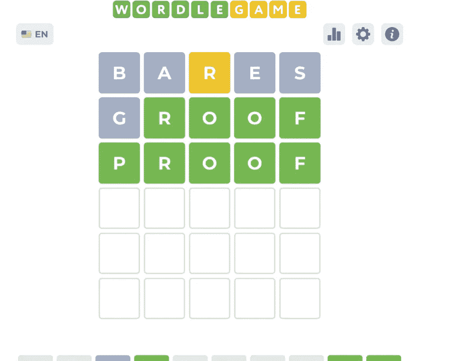
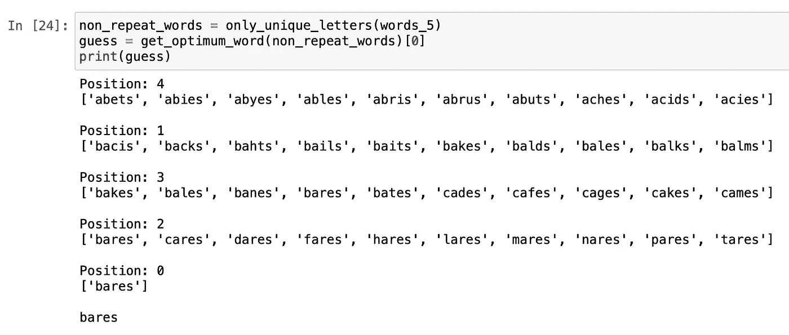
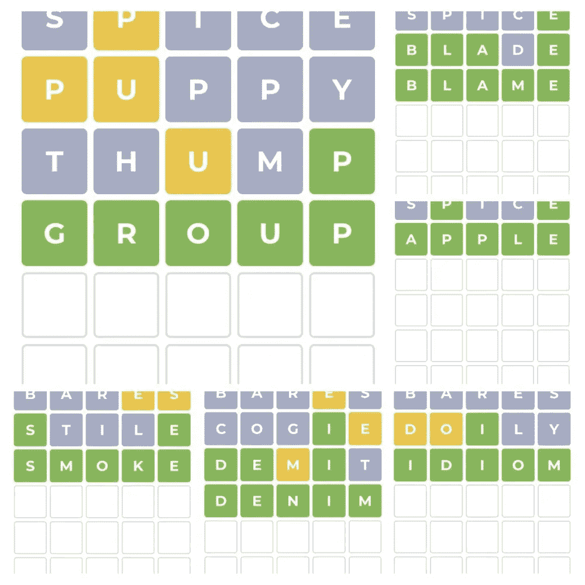

# 一种频率分析方法

> 原文：<https://towardsdatascience.com/wordle-a-frequency-analysis-approach-9989c3d7be5f>

## 单词的频率分布及其字符位置可能会揭示更多信息，以帮助优化对正确答案的搜索。

截图来自[https://wordlegame.org/](https://wordlegame.org/)—作者

像你们大多数人一样，我的社交媒体最近充满了奇怪的绿色、黑色和黄色方块，上面有 Wordle 分数。起初我不知道它是什么，但它的持续泛滥让我足够好奇，想知道炒作是怎么回事。

在了解了这个游戏之后，这是我们小时候玩的游戏策划的一个简单的转变。我习惯于通过编写游戏的懒惰解决方案来失去朋友(你可能记得我已经破坏了一些数独游戏)，我决定分析是否有一种基于统计测量的有效猜测方法。

在这个游戏中，搜索空间由长度为 5 个字符的英语单词组成。你可能已经知道，有些网站已经深入挖掘了 Wordle 源代码，[找到了使用过的单词列表](https://gist.github.com/cfreshman/cdcdf777450c5b5301e439061d29694c)。对于我的方法，我使用 NLTK 工具包将它保存在一个通用英语单词列表中。这种方法的唯一缺点是一些高可能性的单词可能会被拒绝，您必须从推荐的单词列表中选择。

最初的天真方法似乎很简单。将单词列表分解成字符，并对出现的单词进行简单的频率分布分析。

作者图片

看上面的图表，出现频率最高的 5 个字母是“a”，“e”，“s”，“o”，“r”。人们很快就会想到“崛起”这个词。

但是这种天真的方法忽略了字符的位置，而是只汇总了整个语料库的计数。如果我们根据 5 个可能的位置来计算频率呢？从下表中可以看出，分布与预期的不同。

作者图片

例如，最常见的 5 个字符的单词以“s”开头，大约有 11.4%的分布，而“a”是最常见的第二个字符，在所有 5 个字符的单词中有 18%的分布。

因此，我们可以尝试的另一种方法是:

*   计算每个位置的分布
*   选择出现频率最高的位置和字符(例如，在上面的分布中，我们看到最后一个位置的“s”得分最高，为 19.8%)
*   在其中一个字符已被锁定的情况下，将单词列表过滤为后验单词
*   对剩余的 4 个位置和选择重复频率分布

作者图片

使用这种方法，上述分析表明，从单词 _ 字母列表开始的最佳单词是单词‘bares’。如果它是使用从源代码中收集的 Wordle 单词列表加载的，它将会是单词“spice”。

您可能已经注意到，在最初的几次猜测中，我也试图使用包含 5 个独特字符的单词。这增加了我们更快缩小搜索空间的机会，同时也避免了一些错误的实现，其中重复的字符被不一致地标记(我还没有广泛地验证这一点)。

在每个单词作为一个猜测出现后，通过基于以下内容的过滤过程运行单词列表，简单地重复上述方法:

1.  已知处于正确位置的字符
2.  不在单词中的字符
3.  字符出现在错误的位置(必须出现，但不在尝试的位置)

然后重复频率分布过程，直到解出谜题。

## 结论

在我们的日常任务中，我们经常可以通过蛮力方法来解决问题，如果存在限制我们穷尽整个搜索空间的能力的约束，这并不总是最高效的，甚至是最有效的。在这个例子中，我们被限制在由近 10k 个单词组成的搜索空间中进行 6 次尝试。

这种分析表明我们可能如何使用数据和逻辑，在这种情况下，字母的频率分布比随机猜测做得更好。通过利用这样的分布，我们能够通过一些 Python 和统计数据显著缩小搜索空间。

截图自[https://wordlegame.org/](https://wordlegame.org/)—作者

我希望它激发了一些使用数据和逻辑解决一些日常问题的想法(或者在这种情况下是有趣的，抱歉)。

C [ode 可以在这里找到](https://github.com/lance10t/wordle_guess)——虽然它不是生产级的，只是为了好玩而工作的东西。