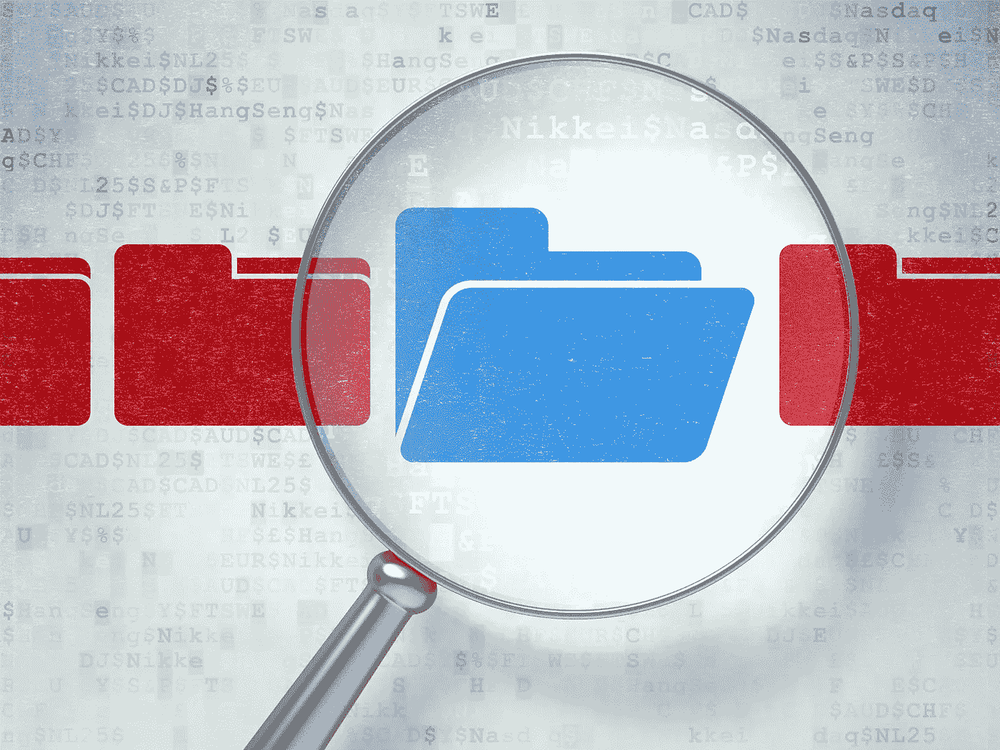
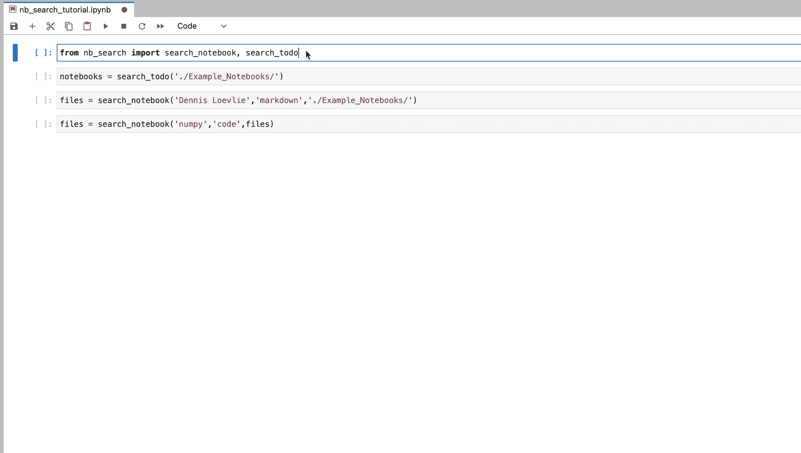

# 使用 Nb_Search 加快工作速度

> 原文：<https://towardsdatascience.com/work-faster-with-nb-search-fb381b1c88d8>

## 概述 *nb_search，*一个用于查找和组织 Jupyter 笔记本的 Python 包



文件在哪里？(图片来自 iStock，授权给 Dennis Loevlie)

H 你是否曾经需要找一本旧的 Jupyter 笔记本，却忘记把它放在哪里了？你还记得你用过的包装或者你在减价时用过的一些术语吗？ *Nb_search* 提供了一种简单高效的方法来寻找丢失的笔记本电脑以及更多！

# 目录

1.  装置
2.  搜索功能
3.  帮助加速和组织工作流程的额外实用程序
4.  使用示范
5.  我们连线吧！

# 装置

nb_search 在 PyPi 上，所以你可以简单地用 pip 安装它。

```
pip install nb_search
```

您也可以从下面的 GitHub 页面手动安装它:

[](https://github.com/loevlie/nb_search)  

# 功能

## 搜索 _ 文件

*nb_search.search_files* 递归搜索指定目录(或默认为当前目录)中的所有 Jupyter 笔记本文件。然后，它打印出所有找到的笔记本的**可点击链接**，并返回路径列表。使用 *search_files，*的一个例子，其中路径保存到名为 *files* 的变量中，如下所示:


除了目录路径，你还可以使用文件路径列表，就像上面我们保存到变量 *files* 中的那些。这允许您使用不同的过滤标准进一步细化搜索。这可以使用下面几节中的任何 *nb_search* 函数来完成。

## 搜索 _ 笔记本

*nb _ search . search _ notebook*建立在 *nb_search.search_files* 之上，允许你根据代码或降价单元格中的特定模式过滤结果。它将搜索您在第一个参数中提供的字符串的匹配项。在下面的例子中，我使用 *search_notebook* 返回目录下的所有笔记本。/PATH "我用 numpy 的地方。


另一个选项是搜索降价单元格。您可以通过更改第二个参数来实现，如下所示:


## 搜索 _ 标题

*nb _ search . search _ heading*允许您在笔记本的标题(1 至 6)中进行特定搜索。例如，我正在搜索标题中带有“title”一词的笔记本，如下所示:


# 帮助加速和组织工作流程的额外实用程序

## 标题 _pprint

*nb _ search . headings _ pprint*是查看笔记本的快捷方式(前提是笔记本在减价单元格中使用了适当的标题)。唯一的参数是笔记本的路径。下面是我之前做的一个使用 *headings_pprint* 查看 *nb_search* 辅导笔记本标题的例子:


*nb_search* 中的许多函数在耦合时甚至更有帮助。例如，在找到笔记本列表后，您可以很容易地使用 *headings_pprint* 来进一步检查每个笔记本，如下所示:


## search_todo

TODO 标记可以帮助您组织、计划甚至协作项目。通过使用以下语法，您可以在 Jupyter 笔记本的任何代码单元格中放置 TODO 标记，无论是否有到期日/描述:

不要担心错误消息。如果它困扰着你，那么你可以通过在笔记本顶部添加以下代码来摆脱它:

现在， *nb_search.search_todo* 为您提供了在目录中搜索任何添加了 todo 标签的笔记本的能力。然后，它会在可选描述和截止日期(转换为截止日期前的天数或延迟天数)下方显示每个笔记本的可点击链接。这方面的一个例子如下所示:


我个人发现 TODO 标签在与团队合作时特别有用。TODO 标记提供了一种有组织的方式来将工作分配给团队的不同成员。该描述可用于详细说明需要做什么以及谁应该专注于该特定任务。你也可以设定一个暂定的截止日期，让事情走上正轨。

# 使用示范



(图片由作者提供)

# 我们连线吧！

我希望这对于使用 *nb_search* 来组织和使用 Jupyter 笔记本是有帮助的！如果您对 *nb_search* 有任何问题或建议，请随时联系我。

1.  [推特](https://twitter.com/DennisLoevlie)
2.  [领英](https://www.linkedin.com/in/dennisloevlie/)
3.  GitHub