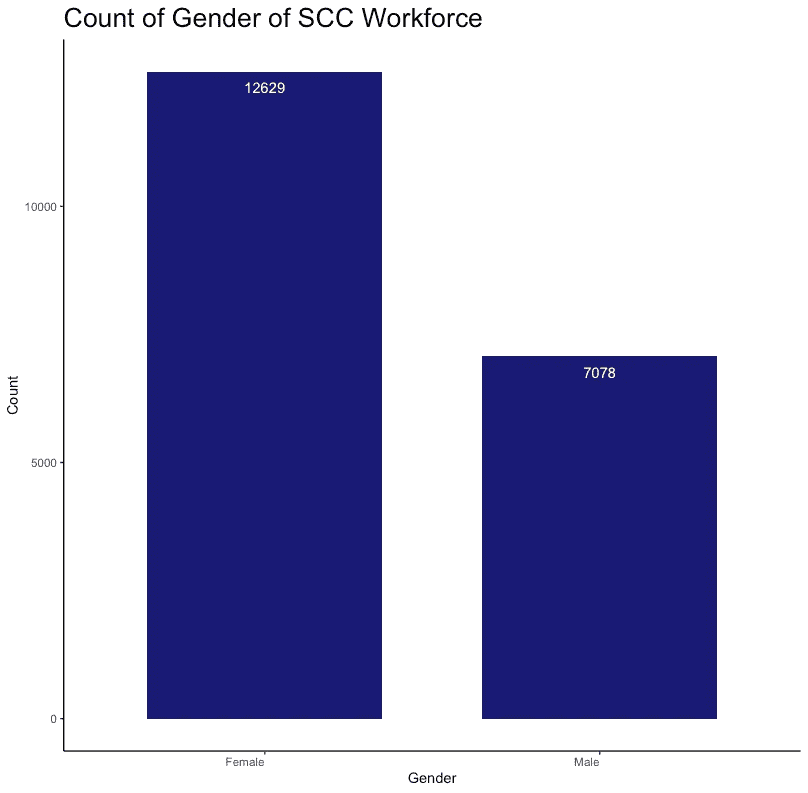
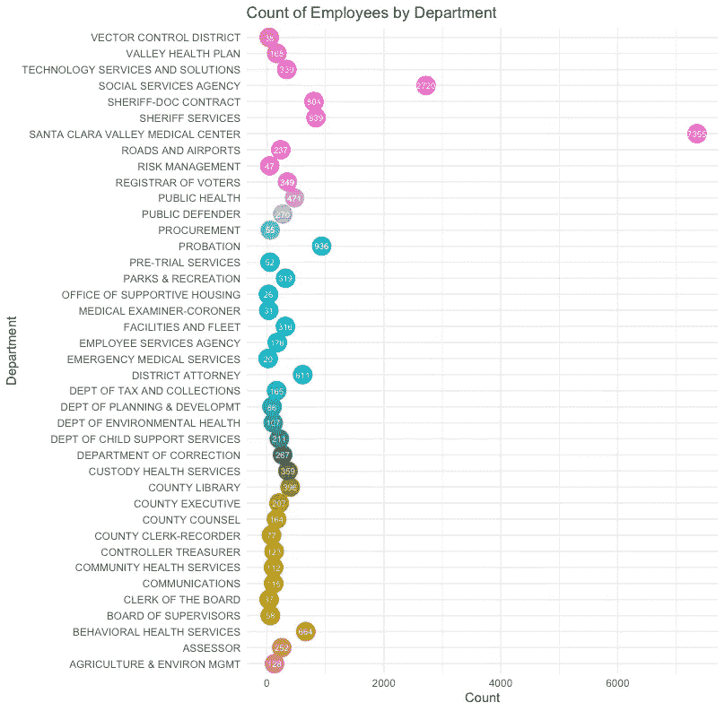

# 圣克拉拉县的劳动力公平

> 原文：<https://towardsdatascience.com/workforce-equity-at-the-county-of-santa-clara-9da948d63ec5>

# **圣克拉拉县的劳动力权益**

## 使用逻辑回归预测圣克拉拉县的全职就业结果


普里西拉·杜·普里兹在 [Unsplash](https://unsplash.com?utm_source=medium&utm_medium=referral) 上的照片

随着许多雇主开始重新评估其劳动力的人口构成，我想通过挖掘我自己雇主公开提供的劳动力数据来确定在我工作的地方人口公平是什么样的。通过这个项目，我应用了探索性数据分析(EDA)和数据可视化方法，并拟合了一个逻辑回归模型，以预测各种人口特征的全职就业状况。出于本分析的目的，全职员工被定义为被归类为(永久或试用状态)或执行管理层的员工。所有其他人都被视为非全职员工。

# **内容**

> 1.探索性数据分析和数据可视化
> 
> 2.数据清理和回归建模
> 
> 3.解释结果
> 
> 4.优势和局限

## **探索性数据分析&数据可视化**

首先，我从圣克拉拉县[开放数据门户](https://data.sccgov.org/)下载了平等机会就业数据集(n=19707)并将其导入 r。我从一些 EDA 和数据可视化开始，以扫描数据中的异常、异常值或任何其他有趣的趋势。

使用 Rstudio，我构建了条形图和点状图来可视化数据集中的关键变量。以下是我用来构建条形图的示例代码:

```
ggplot(df, aes(Gender))+ 
geom_bar(stat="count", width=0.7, fill="#1A1A75")+
geom_text(aes(label = ..count..), stat = "count", vjust = 2, colour = "white")+
labs(title = "Count of Gender of SCC Workforce", x= "Gender", y= "Count")+
theme_bw()+
theme(plot.title= element_text(size= 20), axis.text.x = element_text(hjust = 1),
      panel.grid.major = element_blank(),
      panel.grid.minor = element_blank(),
      panel.border = element_blank(),
      panel.background = element_blank(),
      axis.line = element_line(color = 'black'))
```



使用 Rstudio 创建的样本中的性别分布。[点击此处查看该分析的其他可视化效果](https://github.com/isRadata/WorkforceEquity_SCC)。图片作者。

为了创建一个点状图，我开发了一个单独的视图，只使用“部门”变量创建一个新的数据框。这使得“Department”变量的计数很容易传递到 ggplot (Rstudio 数据可视化库)中。下面是我用来按“部门”构建点状图的代码:

```
dept_count <- table(df$Department)
dept_count <- as.data.frame(dept_count)
ggplot(dept_count, aes(x=Freq, y= Var1, label= Freq)) + 
  geom_point(aes(col=Var1), size=7, show.legend = F)+
  geom_text(color="white", size=2.5, parse = T)+
  xlab("Count")+ 
  ylab("Department")+
  labs(title="Count of Employees by Department")+
  theme_minimal()
```

以下是结果输出:



图片作者。

我还使用 Google Data Studio 创建了一个简单的仪表板来显示原始数据。

作者使用 Google Data Studio 创建的仪表板。

## **数据清洗和回归建模**

从那里，我开始清理和格式化数据，以传递到逻辑回归模型中。这需要将数据编码成定量格式(对于参照组，从 0 开始对变量进行编号，变量中的每个类别增加 1)。这个[数据字典](https://github.com/isRadata/WorkforceEquity_SCC/blob/main/Data%20Dictionary.pdf)提供了关于我在模型中使用的变量是如何编码的文档。以下是我的代码示例，用于对“种族”变量进行编码，并将该变量从字符变量转换为数字变量:

```
df$Ethnicity[df$Ethnicity == "American Indian/Alaska Native"] <- 1
df$Ethnicity[df$Ethnicity == "Black/African American"] <- 2
df$Ethnicity[df$Ethnicity == "Native Hawaiian/Oth Pac Island"] <- 3 
df$Ethnicity[df$Ethnicity == "Asian"] <- 4
df$Ethnicity[df$Ethnicity == "Hispanic/Latino"] <- 5 
df$Ethnicity[df$Ethnicity == "Two or More Races"] <- 6 
df$Ethnicity[df$Ethnicity == "Not Applicable"] <- 7
df$Ethnicity[df$Ethnicity == "Not Identified"] <- 8
df$Ethnicity[df$Ethnicity == "White"] <- 0 #comparison group
df$Ethnicity <- as.numeric(df$Ethnicity) #convert from chr to numeric
```

然后，我将选定的人口统计变量拟合到回归模型中，并总结了模型的结果:

```
m <- glm(as.factor(Employment.Status) ~ as.factor(Age) + as.factor(Gender) + as.factor(Ethnicity), family = "binomial", df)summary(m)
```

## **解读结果**

下面的输出显示了逻辑回归模型的结果。“*”表示显著性，您可以看到，在对模型中包含的其他变量进行调整后，并非模型中包含的所有变量都保持显著性。

```
Call:
glm(formula = as.factor(Employment.Status) ~ as.factor(Age) + 
    as.factor(Gender) + as.factor(Ethnicity), family = "binomial", 
    data = df)Deviance Residuals: 
    Min       1Q   Median       3Q      Max  
-2.6159  -0.6046  -0.5015  -0.3303   2.4451Coefficients:
                        Estimate Std. Error z value Pr(>|z|)    
(Intercept)            -2.066504   0.062371 -33.133  < 2e-16 ***
as.factor(Age)1         4.871116   0.735350   6.624 3.49e-11 ***
as.factor(Age)2         1.404890   0.065853  21.334  < 2e-16 ***
as.factor(Age)3         0.375222   0.059230   6.335 2.37e-10 ***
as.factor(Age)4         0.001325   0.065042   0.020   0.9837    
as.factor(Age)5         0.572097   0.073372   7.797 6.33e-15 ***
as.factor(Age)6         1.811770   0.140881  12.860  < 2e-16 ***
as.factor(Gender)1      0.055374   0.042902   1.291   0.1968    
as.factor(Ethnicity)1  -0.859101   0.431944  -1.989   0.0467 *  
as.factor(Ethnicity)2  -0.181556   0.101585  -1.787   0.0739 .  
as.factor(Ethnicity)3  -0.577770   0.297139  -1.944   0.0518 .  
as.factor(Ethnicity)4   0.084497   0.054369   1.554   0.1202    
as.factor(Ethnicity)5  -0.871253   0.069348 -12.563  < 2e-16 ***
as.factor(Ethnicity)6  -0.063882   0.113879  -0.561   0.5748    
as.factor(Ethnicity)7   0.528137   0.065507   8.062 7.49e-16 ***
as.factor(Ethnicity)8 -10.607403 122.517633  -0.087   0.9310    
---
Signif. codes:  0 ‘***’ 0.001 ‘**’ 0.01 ‘*’ 0.05 ‘.’ 0.1 ‘ ’ 1(Dispersion parameter for binomial family taken to be 1)Null deviance: 16956  on 19706  degrees of freedom
Residual deviance: 15713  on 19691  degrees of freedom
AIC: 15745Number of Fisher Scoring iterations: 11
```

为了从模型中获得**优势比和 p 值**，需要对输出进行指数运算。这可以通过在模型上执行以下代码来完成:

```
exp(coefficients(m))
exp(confint(m))
```

以下是上述代码的输出:

```
#Odds Ratios:
                      exp.coefficients.m..
(Intercept)                  0.12662764672
as.factor(Age)1            130.46646380157
as.factor(Age)2              4.07508039371
as.factor(Age)3              1.45531434372
as.factor(Age)4              1.00132609820
as.factor(Age)5              1.77197884694
as.factor(Age)6              6.12127428713
as.factor(Gender)1           1.05693574512
as.factor(Ethnicity)1        0.42354252826
as.factor(Ethnicity)2        0.83397119030
as.factor(Ethnicity)3        0.56114822112
as.factor(Ethnicity)4        1.08816930350
as.factor(Ethnicity)5        0.41842702920
as.factor(Ethnicity)6        0.93811576448
as.factor(Ethnicity)7        1.69577024472
as.factor(Ethnicity)8        0.00002473223#Confidence Intervals: 
                          2.5 %      97.5 %
(Intercept)            0.1119507   0.1429609
as.factor(Age)1       38.9341090 811.6890375
as.factor(Age)2        3.5822371   4.6374648
as.factor(Age)3        1.2960778   1.6348703
as.factor(Age)4        0.8813076   1.1373159
as.factor(Age)5        1.5337998   2.0450854
as.factor(Age)6        4.6385626   8.0627385
as.factor(Gender)1     0.9718973   1.1499075
as.factor(Ethnicity)1  0.1624569   0.9095877
as.factor(Ethnicity)2  0.6811999   1.0146872
as.factor(Ethnicity)3  0.2988317   0.9668308
as.factor(Ethnicity)4  0.9783697   1.2108047
as.factor(Ethnicity)5  0.3649682   0.4790100
as.factor(Ethnicity)6  0.7478204   1.1689730
as.factor(Ethnicity)7  1.4911884   1.9278357
as.factor(Ethnicity)8         NA   1.4707108
```

我立刻注意到一个不寻常的 1 岁组的优势比，即“20 岁或以下”。回顾 EDA，我们看到这个类别只有 35 个观察值。由于该类别中有限的样本量，(和大的置信区间)，这一估计可能是不可靠的。

> 提示:如果置信区间超过 1(例如. 08–1.3)，研究组和对照组之间没有统计学差异。

**这项分析的结果包括，在圣塔克拉拉郡，西班牙裔成为全职员工的可能性比白人低 58%(CI:0.36–0.47)。在圣克拉拉县，没有发现全职职位的“男性”和“女性”之间的统计差异。与 40-49 岁的人相比，30-39 岁的人成为该县全职员工的可能性高出 45%(CI:1.30-1.63)。**

## **优势&局限**

与任何类型的建模一样，使用某些技术优于其他技术也有利弊。逻辑回归也不例外。尽管它是构建和解释起来较为简单的模型之一，但它严重依赖于具有足够样本量的格式良好的数据。

该数据集的一些局限性包括这些变量是如何测量的。例如，“性别”变量只收集了“男性”和“女性”信息，而没有 SOGI(性取向性别认同)信息。此外,“种族”变量是聚合的，因此不可能通过不同的种族亚组来确定模式或趋势。

这一分析中使用的数据已经过时，并且在一个变量的所有类别之间不平衡。为了解决这个问题，可以操纵数据来创建更大的类别(例如，更大的年龄范围)。然而，这将冲淡结果解释的粒度。更强大的数据收集将允许更准确的分析，从而更容易确定需要改进的领域，以实现更公平的员工队伍。

我的完整代码、数据字典、原始和分析数据集以及数据可视化可以在我的 Github 页面[这里](https://github.com/isRadata/WorkforceEquity_SCC)找到。