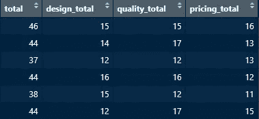
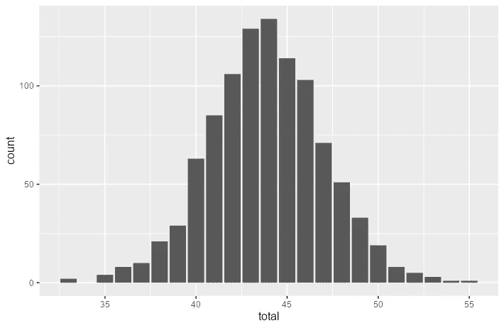
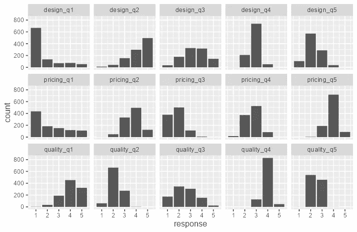
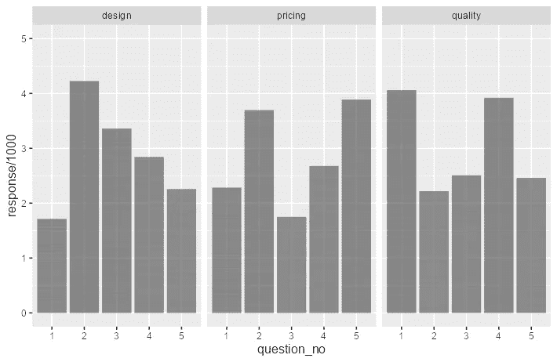

# 使用调查数据——在 R 中清理和可视化李克特量表问题

> 原文：<https://towardsdatascience.com/working-with-survey-data-clean-and-visualize-likert-scale-questions-in-r-6a78e3b9c7b2>

## 如何格式化数据以进行定量分析

由 [Celpax](https://unsplash.com/@celpax?utm_source=medium&utm_medium=referral) 在 [Unsplash](https://unsplash.com?utm_source=medium&utm_medium=referral) 上拍摄的照片

如果你曾经读过或写过一份调查，你可能遇到过李克特式的问题。这些问题在某种程度上是可以回答的，比如*强烈不同意*到*强烈同意*，或者*总是*到*从不*。这种尺度允许我们量化情感，否则是主观的。今天，我们将讨论如何清理、聚合和可视化这类数据。

# **关于数据集**

我们将使用 1000 名受访者的产品满意度调查数据。我们的目标是对这些数据进行重新编码和整形，使它们适合计算汇总统计数据和创建可视化。你可以在这里下载数据集[。](https://github.com/MartinaGiron/TDS-code/tree/main/working-with-surveys)

# **加载数据**

该数据集为我们提供了申请人 ID，以及他们对每个问题的回答，每个问题编码在一列中。如您所见，列标题不是正确的变量名。这将使得在函数中调用它们变得困难。所以让我们用`colnames()`按照类别和物品号来重命名它们。请务必将原始名称保存到单独的文件中，以供将来参考。我们还需要加载 tidyverse 包来执行我们的数据争论和可视化。

# **记录李克特反应**

我们的回复仍然是文本形式。我们需要用数字标度记录它们，以便进行定量分析。我们可以使用`case_when()`编写一个函数来完成这个任务。这也可以用`gsub()`来完成，但我更喜欢这种方法，因为它使我们的代码更紧凑，可读性更好。

有时，短语以否定的方式陈述，以确保回答调查的人不会不加选择地输入所有高分或低分答案。因此，我们必须:

1.  确定哪些项目是积极或消极的。

*   在我们的例子中，除了以下项目，所有项目都按正比例缩放:

负面陈述项目(作者图片)

2.将函数原样应用于按正比例缩放的项目，并翻转按负比例缩放的项目的比例。

*   在这里，我写了两个独立的函数，分别用于正负比例项。

*   为了应用正数，我使用`select()`删除了 id 列和所有负数比例的项目，所以我可以很容易地`mutate_all()`剩下的正数。
*   为了应用负的那个，我反其道而行之，在应用`mutate_all()`之前只保留负比例的项目。
*   在应用了这两个函数之后，我们必须使用`cbind()`重新组合我们的数据。

# **计算总数**

每个回答者的总体总数和类别总数的前 6 行(图片由作者提供)

*   由于本次调查衡量的是整体产品满意度**，**我们想知道每位受访者在所有项目上的总分。我们可以通过对重新编码的数据使用`rowSums()`函数来实现这一点。

*   现在，让我们得到每个类别的总分。我们可以使用`mutate()`来创建包含类别总计的新列。`rowwise()`函数允许我们跨列执行操作。执行完所有操作后，记得使用`ungroup()`将您的数据恢复为*整齐的*格式。
*   作为一个练习，你可以试着自己计算类别意味着什么！

# **重塑数据**

我们希望我们的数据以*整洁的*格式进行分析和可视化。在这种情况下，这意味着旋转我们的数据，这样我们的新列将只包含 ID 号、问题号、类别和响应。首先，我们将关注问题编号和回答。然后，我们可以用`mutate()`来分配它们的类别。我们将结合使用`str_match()`和*正则表达式*，或*正则表达式*，从问题列中获取类别和问题编号。这里，`“^[^_]+(?=_)”`表示*获取下划线*之前的所有字符，`“[0–9]$”`表示*获取字符串*的最后一位数字。

# **汇总数据**

每个类别回复的平均值和标准偏差(图片由作者提供)

现在，我们可以计算数据的汇总统计数据。因为我们想按类别计算统计数据，所以我们将按这个变量分组。然后，我们将把数据传递给`summarise()`函数。这是我们的预期输出:

# **可视化数据**

总分直方图(图片由作者提供)

首先，我们来了解一下总分的分布概况。我们使用了`survey_recoded`数据，因为该数据集包含每位受访者的总分。请注意，数据似乎近似遵循正态分布。这是意料之中的，因为我们有 1000 个大样本。

每个类别分数的直方图(图片由作者提供)

现在，让我们看看类别级的分布。我们将使用`survey_long`作为我们的数据，并将类别传递给`facet_wrap()`来做这件事。

每个问题分数的直方图(图片由作者提供)

我们也可以通过相同的方法来查看问题级别的分布。在这里，我添加了一个额外的参数`nrow = 3`，这样所有来自同一类别的问题都出现在一行中。

每个问题的平均分(图片由作者提供)

最后，让我们看看每个问题的平均回答水平。我们将变量 response 除以 1000，因为如果没有它，我们的图表只会给出每个问题的得分总和。我们还添加了`ylim(0,5)`，因为否则，我们的图形在 y 轴上只有 0 到 4。这是因为问题的最高平均分从来不会高于 4 分。

# **接下来的步骤**

本教程侧重于为探索性分析准备测量数据。我们创建的条形图很有见地，但我们可以对它们的美学进行改进，使它们更加专业和引人注目。请阅读我关于如何做到这一点的教程:

</customize-your-ggplot2-bar-graph-5-ways-to-instantly-improve-your-r-data-visualizations-f9c11dfe0163>  

为了进行更深入的分析，我们还可以执行统计测试来检验相关性和测量调查的可靠性。您可以阅读更多关于这些概念的内容，并尝试将它们与 R 的`cor.test()`函数和`ltm`包中的`cronbach.alpha()`一起应用。