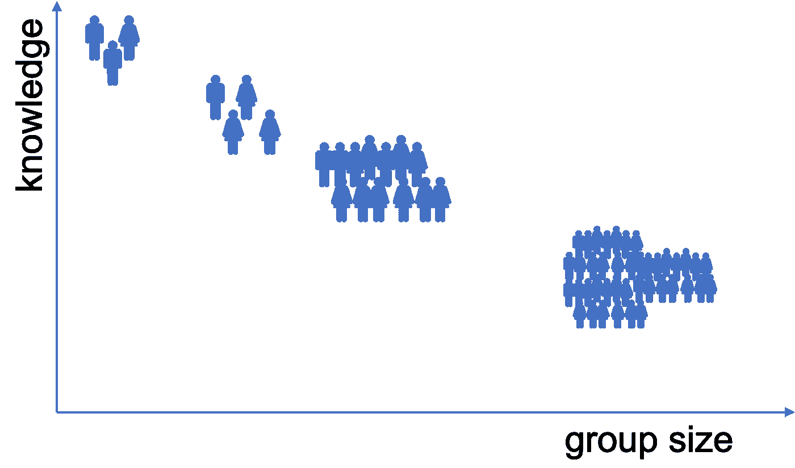
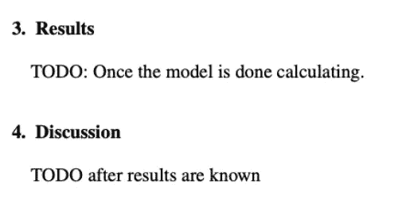

# 撰写更多成功的机器学习研究论文

> 原文：<https://towardsdatascience.com/writing-more-successful-machine-learning-research-papers-39863ca9ea90>

## 让你的评论者和同事印象深刻的事情。

你花了这么多时间做研究，有时失败了，重做，最后有了一些不错的结果。现在你想看到它们被发表——也许这是你博士学位的要求，也许只是为了你自己的自我，因为在一个有声望的期刊上发表一篇有你名字的论文是很酷的。所以，你继续写你的论文，并提交给期刊或会议。

图片作者。

但是等等——先别提交！有几件事你应该避免。我哪里知道？我正在领导一个小的研究小组，我已经做了一段时间的评论。有些错误是反复犯的。如果你想写一篇成功的机器学习论文，下面是我的建议列表:

# **1。不要假设读者知道你的主题的重要性！**

你知道你在做什么，你为什么要这么做。但是你的普通读者不会。永远记住，你至少会有四种读者:

你的读者从你确切的研究领域获得大量知识的可能性很高！图片作者。

*   你的主管。不要为你的主管写作。一个好的主管已经知道你在做什么，尤其是你为什么这么做。
*   和你在同一个研究领域的人。他们大多知道所有相关的工作，也知道所有相关的术语。但是这些人越接近你确切的研究课题，存在的就越少。所以他们不太可能是你的同龄人。
*   密切相关的研究领域的人。这些人不会确切地知道你的研究是关于什么和具体的问题。但是他们对更广泛的研究领域有很好的理解。如果你没有给出一个好的动机(包括当前的挑战和为什么你的研究是必要的)，你会失去这些读者。最后:
*   远程相关研究领域的人。这是最大的群体。**而且很有可能(至少一些)你的评审员将来自这个小组。他们不知道所有相关的工作，也不知道你的研究为什么重要，你的方法有什么特别之处。所以你需要向他们解释这一点。**

底线:

在动机上花足够的时间。清晰地表达你的想法，并用文献来支持你的主张！所有这些都进入你作品的引言部分。

# **2。写一些新颖的见解，而不是技术上的新奇。**

几乎所有的机器学习论文都会在引言的最后陈述“新颖性”。他们为什么这样做？因为这是许多期刊和会议的要求，所展示的是新的。从论文中要求这一点是很好的，因为:如果它不是小说，为什么要费心去读它？

新奇的东西是已知的东西。然而，作者(有时还有审稿人)会将其误解为:你需要开发一种突破性的新方法，否则你的论文就不够有价值。

来自我们自己的一篇论文的评论。图片作者。

因此，大多数作者认为他们需要通过创建一种与最先进的方法不同的方法来*勾选新颖性复选框*，并且很容易感觉到技术新颖性是机器学习论文最重要的方面。

有时候这是我阅卷时的印象。图片作者。

但事实并非如此。洞察力是任何论文最重要的方面(不管是哪个领域)。如果读者觉得了解了一些她/他事先不知道的事情，那么这就是一种新奇！

底线:

花时间分析和解释你的结果。如果你的方法比最先进的方法显示出更好的结果，你应该首先怀疑你的结果！分析、解释——然后，作为最后一步，发布。

# **3。不要假设读者知道你以前的作品**

有时人们会大量引用他们以前的作品。图片作者。

虽然我们都同意研究是渐进的，你很可能会发表一篇基于你以前的发现的论文:假设你的读者还没有读过那篇论文。更重要的是:**不要试图强迫他们读它。**

大多数评论者都是资深科学家或教授，他们有很多事情要做。让你的论文尽可能容易阅读对你最有利！因此，你的论文需要完全独立。

我的研究是机器学习，我看到人们为自己的东西(例如模型架构)介绍自己的缩写和名称，他们希望人们在后续的论文中知道他们在谈论什么。他们没有。

# **4。遵循科学方法**

我不想在这里责备任何人，但是从我所做的一些评论来看，下面的方法并不少见:

1.  方法的发展
2.  该方法的测试
3.  分析结果，然后
4.  解释为什么这种方法有效。

但那是糟糕的科学。这叫做倾听——结果已知后的假设。机器学习尤其倾向于倾听。

相反，假设应该总是先出现:

科学方法。图片作者。

我相信你已经知道了。但是我想激励你也这样组织你的论文。你的方法永远是对你的假设的检验！

1.  我们在数据中观察到了什么，让我们认为我们可以以特定的方式改进最先进的技术？(观察)
2.  我们需要如何设计我们的方法？(假设)
3.  我们应该用什么方式来写一个测试，来明确地找出我们的假设是对还是错？注意:下定决心如何确保你的测试没有偏差！(衍生测试)
4.  在独立的测试集(实验)上运行推理
5.  分析你的结果，并将其与你的假设联系起来！(分析)
6.  一旦你得出了结论，并且认为这些结论很有趣，你就可以开始写论文了！

# 5.做你自己的魔鬼代言人

谦虚是成为科学家的一个很好的先决条件。这意味着你应该**时刻意识到你研究的局限性。说出它们的名字并写下来。这些是你论文的重要部分。**

你的审稿人必须找出你论文的弱点:

openreview 上的 MIDL 评论中的弱点字段。图片作者。

**试着变聪明，在他们之前发现弱点。**目标不是找借口。目标实际上只是描述你所做的限度，这样其他人就不会犯可避免的错误。

以下是评论者可能会问的一些邪恶的问题:

*   这些发现可能仅仅是因为数据集/超参数/随机状态的幸运选择吗
*   为什么在你的实验设置中选择 X，Y，Z？
*   这也适用于其他数据集吗？

最后:**请不要忘记在分享之前校对你的文字。**

# 6.避免“不必要的纠结”

公式是描述非常精确的事物的一个很好的工具。然而，它们有一个副作用:与你用语言或伪代码描述你所做的事情相比，读者常常需要更长的时间来理解一个公式。

那为什么人们经常使用比必要的更多的数学呢？伊恩·古德费勒在这条推特上总结得很好:

正如伊恩所说，虽然这可能有助于你通过同行评审，但从长远来看，如果你的论文很难理解，它的影响会小得多。

所以:请使用公式，如果它能帮助读者更准确地理解你做了什么。不要加数学来炫耀。

# 7.概念第一，写作第二。

是的，最后期限正以光速逼近。是的，你需要开始写，但是你的结果还没有准备好，因为如果你现在不开始写，你会错过最后期限。

在你的结果还不知道的时候，不要写论文。图片作者。

不要写“随到随走”。写论文和写小说有很多共同之处。在写第一段之前，你应该提前了解主要的故事情节。

如果你在得到结果和进行分析之前就开始写论文，很可能是在浪费时间。

**有一个例外:**在你的结果被分析之前，我唯一能推荐开始写作的部分是引言。尽量早点写引言。会帮助你识别相关的相关工作，对自己的工作有更清晰的认识。

# **8。最后写摘要**

摘要是你论文最重要的部分。这是大多数人都会阅读的部分。我建议你在最后写摘要。只有在写完讨论之后，你才知道你论文的关键精华和要点。

永远记住摘要是对整篇论文的简短总结，包括结论。我总是试图用一到三句话来概括论文的每一部分(引言/方法/结果/讨论)。

我使用注释来构建自己的摘要。图片作者。

在撰写摘要之前，我可以推荐一个小练习:

试着用厚记号笔把你的论文包在一张纸上。试着用那张纸向别人解释你的概念。如果成功了，你就可以总结你的论文了。现在你可以开始写论文的最后一部分了！