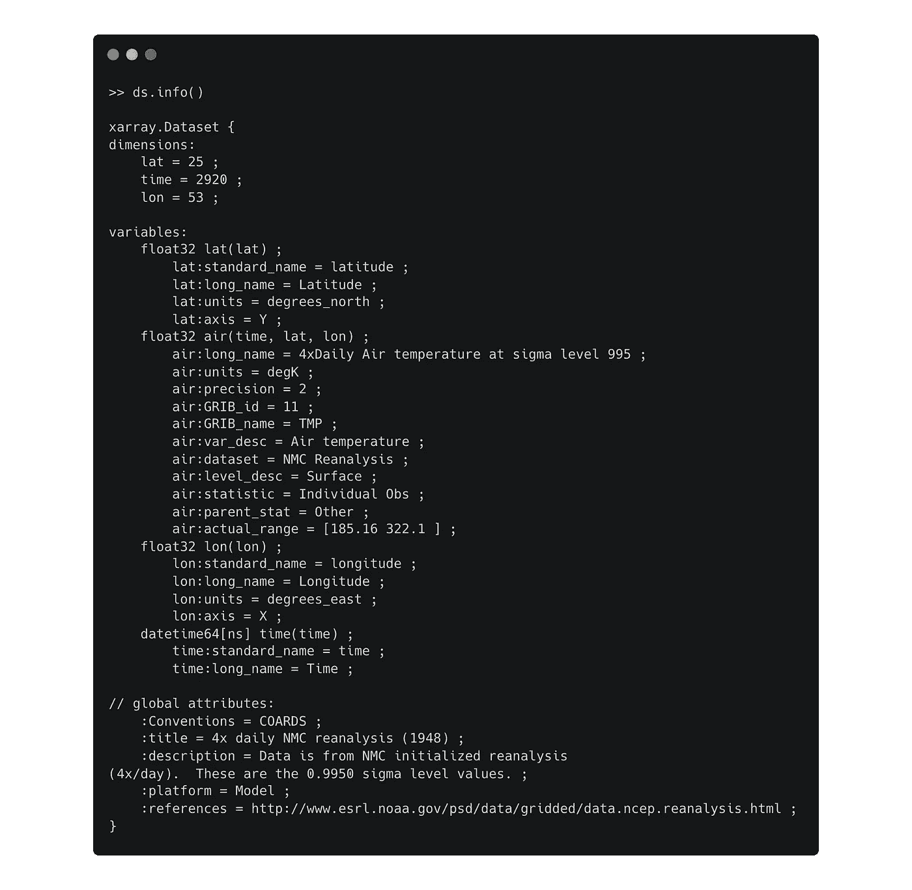

# 地球科学家的食谱

> 原文：<https://towardsdatascience.com/xarray-recipes-for-earth-scientists-c12a10c6a293>

## 气候数据科学

## 帮助您分析数据的代码片段


照片由[飞:D](https://unsplash.com/@flyd2069?utm_source=medium&utm_medium=referral) 在 [Unsplash](https://unsplash.com?utm_source=medium&utm_medium=referral) 上拍摄

地球科学数据通常打包在带有标注维度的 NetCDF 文件中，这使得`xarray`成为完美的分析工具。`Xarray`有一些强大而通用的内置方法，比如`resample()`、`groupby()`和`concat()`。这个包是地理空间分析的组成部分，这就是为什么它是 [Pangeo 软件栈](https://pangeo.io/architecture.html)的主干。`Xarray`在开源 [Apache 许可](http://www.apache.org/licenses/LICENSE-2.0.html)下可用。

本文是面向地球科学家的片段集。

```
**Table of Contents**[0\. Installation](#b377)
  [0.1 Tutorial dataset](#0b57)
[1\. Climatology and Anomalies](#e7e2)
[2\. Downsampling: Monthly Average](#ab3a)
  [2.1 Monthly Max, Min, Median, etc.](#b23c)
  [2.2 N-month Average](#4043)
[3\. Upsampling: Daily Interpolation](#3865)
[4\. Weighted Average](#c729)
[5\. Moving Average](#544f)
[6\. Ensemble Average](#88e6)
[7\. Assign New Variables or Coordinate](#3b71)
  [7.1 Assign new variable](#2360)
  [7.1 Changing time coordinate](#4417)
  [7.2 Changing longitude coordinate](#6c13)
[8\. Select a Specific Location](#7044)
[9\. Fill in Missing Values](#3108)
  [9.1 Fill NaN with value](#a0d9)
  [9.2 Replace with climatology](#d007)
  [9.3 Interpolate between points](#9608)
  [9.4 Forward/backward filling](#2521)
[10\. Filter Data](#7a5f)
[11\. Mask Data](#bbe5)
[12\. Final Thoughts](#7d35)
  [12.1 Split-apply-combine](#a90b)
```

# 0.装置

[开发者推荐](https://xarray.pydata.org/en/v0.21.1/getting-started-guide/installing.html#)使用`conda`包管理器和社区维护的`conda-forge`通道进行安装。

## 0.1 教程数据集

安装完成后，尝试加载这个[教程数据集](https://xarray.pydata.org/en/stable/generated/xarray.tutorial.open_dataset.html)，它是两年来每天采样 4 次的空气温度。

> 这个数据集可以用来研究本文中的食谱



作者图片

# 1.气候学和异常

*   **气候学**:月气候学需要对一个时间序列中的所有一月进行平均，然后是所有二月，等等。
*   **异常**:这些是与气候学的偏差或者是原始时间序列与气候学的差异。例如，如果时间序列是每月的，那么 2013 年 1 月的异常值就是 2013 年 1 月的值减去 1 月的气候学值。

`[groupby()](https://xarray.pydata.org/en/stable/generated/xarray.Dataset.groupby.html)`将收集所有相似的坐标值，在本例中，每个组包含每个月——不考虑年份。然后，我们计算每组的平均值，并将它们重新组合在一起

提供给`groupby()`的参数指定了我们想要分组的内容。您可以通过`[.dt](https://xarray.pydata.org/en/stable/generated/xarray.core.accessor_dt.DatetimeAccessor.html)` [访问器](https://xarray.pydata.org/en/stable/generated/xarray.core.accessor_dt.DatetimeAccessor.html)获取月份，这就是我们在本例中所做的。

计算月距平时，我们先按月分组，然后减去气候学。例如，从一月组的每个成员中减去一月气候学，然后每隔一个月重复一次。

# 2.缩减采样:月平均值

*   **下采样**:降低样本的频率。例如，从每日时间序列变为每月时间序列

为了用`xarray`实现这一点，我们使用`[.resample()](https://xarray.pydata.org/en/stable/generated/xarray.Dataset.resample.html)`。所提供的参数指定了时间维度(如`time`)和重采样频率(如每月)。在上面的示例中，采样频率字符串`'1MS’`表示每月采样一次，新的时间向量以月初为中心( *2000 年 1 月 1 日*、 *2000 年 2 月 1 日*等)。).

采样频率(如`‘1MS’`)指定如何对数据进行重新采样。其他选项见 [Pandas 文档](https://pandas.pydata.org/pandas-docs/stable/user_guide/timeseries.html#offset-aliases)中的偏移别名。

为了计算月平均值，你必须附上`.mean()`。移除此方法将返回 DatasetResample 对象。请务必说明您想对样本做什么。

## **2.1 月最大值、最小值、中位数等。**

还有一套其他方法可以和`resample()`一起使用，包括:`max`、`min`、`median`、`std`、`var`、`quantile`、`sum`

查看[重采样文档](https://xarray.pydata.org/en/stable/generated/xarray.Dataset.resample.html)了解更多细节

## 2.2 N 月平均值

如果你想每两个月平均一次，而不是每月平均一次，会怎么样？在这种情况下，您只需在采样频率字符串中提供采样的月数:

*   **月平均**:`‘1MS’`(1 可选)
*   **两个月平均值** : `‘2MS’`
*   …
*   **15 个月平均值** : `‘15MS’`(我不知道你为什么会想这么做，但你可以)

# 3.上采样:每日插值

*   **上采样**:增加采样频率。例如，从每月时间序列变为每天时间序列

这是一个使用线性插值将数据从月分辨率提升到日分辨率的示例。换句话说，将“低”时间分辨率(例如每月)转换成“高”分辨率(例如每天)。所提供的参数指定了时间维度(例如`time`)和重采样频率(例如每天)。在上面的例子中，采样频率字符串`'1D’`表示每天采样。

然后我们附加`.interpolate(“linear”)`在点之间进行线性插值。

# 4.加权平均值

*   **加权平均值**:根据重要性缩放的值的平均值。计算方式为权重之和乘以值除以权重之和。

对地理空间数据进行平均时，对数据进行加权通常很重要，这样小区域就不会扭曲结果。例如，如果您的数据位于一个统一的经纬度网格上，那么两极附近的数据比低纬度地区占用的面积要小。如果你计算全球的平均温度，那么北极的权重应该小于热带，因为它占据的面积更小。

在这个例子中，我做了一个普通的方法，用纬度的余弦来加权。这个例子来自于 [xarray 网页](https://xarray.pydata.org/en/stable/examples/area_weighted_temperature.html)。

当用`xarray`计算加权平均值时，注意`ds.weighted(weights)`是“加权类”的一个实例除了加权平均值，我们还可以计算加权标准差、加权和等。见选项[此处](https://xarray.pydata.org/en/stable/generated/xarray.core.weighted.DatasetWeighted.html)。

另一种方法是按网格单元面积加权，见下面的帖子

[](/the-correct-way-to-average-the-globe-92ceecd172b7) [## 平均全球的正确方法

### 为什么对数据进行面积加权很重要

towardsdatascience.com](/the-correct-way-to-average-the-globe-92ceecd172b7) 

# 5.移动平均数

*   **移动平均:**通过在特定间隔内平均来平滑数据的技术。间隔由特定数量的数据点定义，称为*窗口长度*。

滚动平均/运行平均/移动平均是一种平滑短期波动以提高信噪比的技术。您使用`[.rolling()](https://xarray.pydata.org/en/stable/generated/xarray.Dataset.rolling.html)`方法，并向其提供应用平均值和窗口长度的尺寸。

在上面的例子中，我对气温教程数据集应用了 30 天的运行平均值。由于数据每天采样 4 次，因此每 30 天有 120 个样本。

你可以提供给`rolling()`的一个可选参数是`center=True`，这将把标签设置在窗口的中心而不是开始。

# 6.总体均值

*   **总体平均**:对同一数量的多个估计值进行平均。例如，CMIP 模型的集合是集合的一个例子。

如果您有一个包含多个相关变量的数据集，您可以在一个新的维度上连接它们，然后执行统计。

我之前写过这个主题，描述了用`xarray`实现这一点的不同技术。我现在更喜欢上面的代码。

[](/pythonic-way-to-perform-statistics-across-multiple-variables-with-xarray-d0221c78e34a) [## 使用 Xarray 跨多个变量执行统计的 Pythonic 方式

### 首先在数据集中创建一个分类维度

towardsdatascience.com](/pythonic-way-to-perform-statistics-across-multiple-variables-with-xarray-d0221c78e34a) 

# 7.分配新变量或坐标

`Xarray`提供了三种“赋值”方法:

*   `[.assign()](https://xarray.pydata.org/en/stable/generated/xarray.Dataset.assign.html)` →将新的数据变量分配给数据集
*   `[.assign_coords()](https://xarray.pydata.org/en/stable/generated/xarray.Dataset.assign_coords.html)` →给数据集分配新坐标
*   `[.assign_attrs()](https://xarray.pydata.org/en/stable/generated/xarray.Dataset.assign_attrs.html)` →给数据集分配新属性

## 7.1 分配新变量

要向数据集添加新变量，可以使用`.assign()`。请记住，`xarray`没有`‘inplace’`选项，您总是需要显式地将对象赋给一个变量。

在本例中，我将单位从摄氏度改为开尔文，并将其赋给一个名为`temp_k`的变量。单位很重要，还记得[火星气候轨道器](https://solarsystem.nasa.gov/missions/mars-climate-orbiter/in-depth/)事件吗？

第二行是可选的，只是向新变量添加属性。

## 7.1 改变时间坐标

这是一个改变时间坐标的例子。当您希望时间坐标从每月的 15 号而不是 1 号开始时，这很有用。

## 7.2 改变经度坐标

经度有两种约定

*   **【360°约定】**:0°到 360°，本初子午线为 0°，数值向东递增
*   **【180°约定】** : -180W 到 180E，以本初子午线的零点为中心

> 我编造了大会的名字。如果有合适的名字，请告诉我

**从 180°变为 360°**

**从 360°变为 180°**

或者，您可以使用列表理解来使其更加直观。

# 8.选择一个特定位置

使用`sel()`选择特定的纬度/经度位置。默认情况下， `sel()`在数据集中查找精确匹配，但是提供`method=’nearest’`告诉`xarray`查找与您的选择最接近的匹配。

# 9.填写缺失的值

通常情况下，您的数据会缺少需要填充的值。

不幸的是，这个问题没有“一刀切”的解决方案

**常用方法:**

*   用某个值填充缺失的值
*   用气候学填补缺失值
*   在点之间插值
*   传播价值观

## 9.1 用值填充 NaN

使用`fillna()`方法是替换缺失值的一种简单方法。在上面的例子中，我使用 0 作为填充值，但这可以是任何值，选择取决于具体情况。

## 9.2 替换为气候学

要替换为气候值，首先必须通过`grouby()`将数据分组，然后使用随气候值一起提供的`fillna()`。

## 9.3 点之间的插值

另一种方法是使用`[interpolate_na()](https://xarray.pydata.org/en/stable/generated/xarray.Dataset.interpolate_na.html)`对缺失值进行插值。这是时间上的线性插值。

> 参见`[**interpolate_na()**](https://xarray.pydata.org/en/stable/generated/xarray.Dataset.interpolate_na.html)` [**文档**](https://xarray.pydata.org/en/stable/generated/xarray.Dataset.interpolate_na.html) 获取完整的 interp 方法列表。

## 9.4 向前/向后填充

```
ds.ffill('time')
ds.bfill('time')
```

*   [向前填充](https://xarray.pydata.org/en/stable/generated/xarray.Dataset.ffill.html) → `ffill()`向前传播数值
*   [向后填充](https://xarray.pydata.org/en/stable/generated/xarray.Dataset.bfill.html) → `bfill()`向后传播数值

这些方法用第一个非 NaN 值填充 NaN 值，沿着提供的维度，`ffill()`向前填充，`bfill()`向后填充。

# 10.过滤数据

基于条件表达式选择数据。只有表达式计算结果为 True 的数据才会被保留，其他数据都不会被保留。

# 11.分离数据

基于条件表达式屏蔽数据。如果提供的条件为真，掩码值将为真，否则为假。这可以通过简单地乘以 1 变成 1 和 0 的掩码。

# 12.最后的想法

我希望这篇文章对你的工作有所帮助，并展示了`xarray`的威力。请记住，这篇文章仅仅提供了一个人的观点。对于其中一些问题，可能有更有效或更直观的解决方案。因此，我强烈鼓励反馈和评论

我在这篇文章中没有提到的一个常见任务是重新划分数据。我鼓励你去看看令人惊叹的 xESMF 包。

最后，这篇文章中的例子可以用于其他目的。例如，计算气候学实际上是一个[分割-应用-组合策略](https://xarray.pydata.org/en/stable/user-guide/groupby.html#groupby)的应用。

## 12.1 拆分-应用-合并

1.  **将**数据分成组，
2.  **对每组应用**一个函数
3.  将所有的组重新组合在一起。

当计算气候学时，“应用”步骤是平均的。但是，这可以换成:`max`、`min`、`median`、`std`、`var`、`quantile`或`sum`。使用`map()`甚至可以提供一个自定义方法。

*感谢阅读和支持媒体作者*