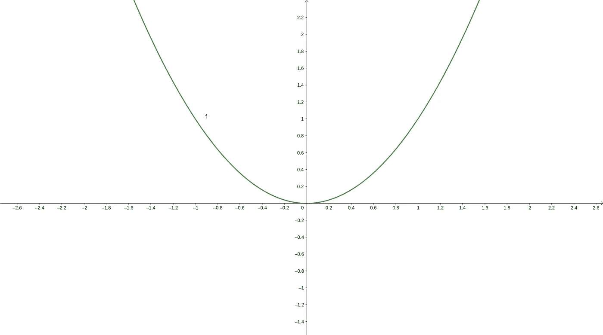
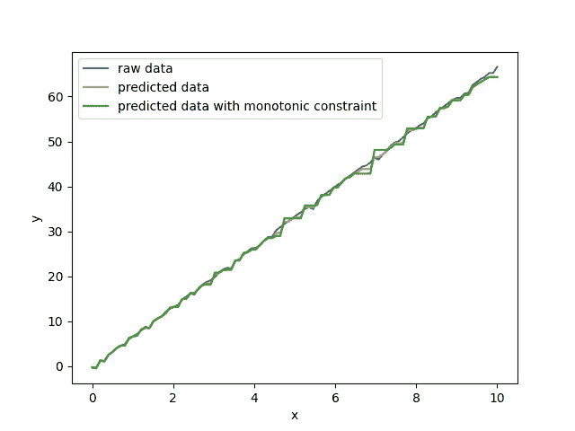
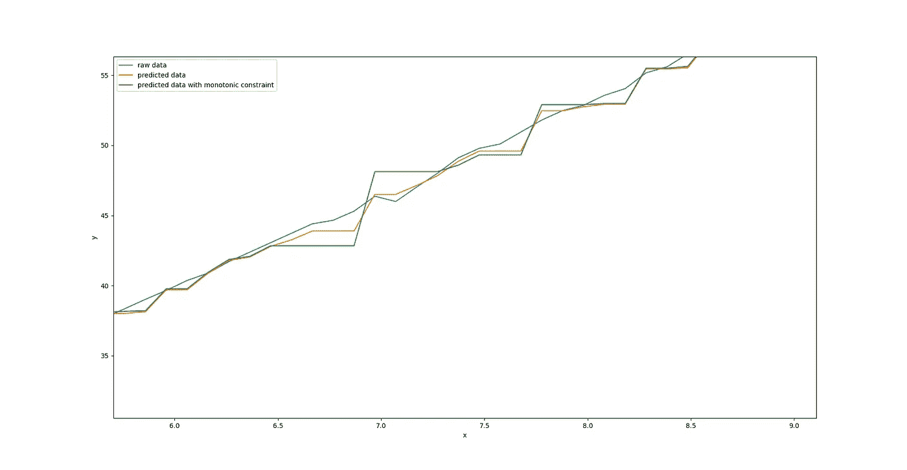

# XGBoost:使用单调约束传递业务知识

> 原文：<https://towardsdatascience.com/xgboost-transfer-business-knowledge-using-monotonic-constraints-35c61cbcb8f9>

Photo by [愚木混株 cdd20](https://unsplash.com/@cdd20?utm_source=medium&utm_medium=referral) on [Unsplash](https://unsplash.com?utm_source=medium&utm_medium=referral)

几天前，我和我的一个好朋友 Julia Simon 讨论在一个基于决策树的模型中考虑商业知识。

她想到了一个非常简单的问题，即预测的值随着给定的特征严格地增加。她想知道是否有可能强制模型确保这种约束。

答案是肯定的，而且在很久以前就已经添加到 XGBoost 中了(根据 XGBoost changelogs 的说法是 2017 年 12 月左右)，但它并不是 XGBoost 的一个非常知名的特性:单调约束。

让我们看看这是如何实现的，底层的数学是什么，以及它是如何工作的。

> 在我的书[实用梯度提升](https://amzn.to/3EctIej)中有更多关于决策树的梯度提升:

 [## 实用的渐变增强:深入探究 Python 中的渐变增强

### 这本书的梯度推进方法是为学生，学者，工程师和数据科学家谁希望…](https://amzn.to/3EctIej) 

# 单调约束

先来定义一下`monotonic constraint`。首先，在数学中，`monotonic`是一个适用于函数的术语，意思是当那个函数的输入增加时，函数的输出或者严格地增加或者减少。

例如，函数 x 是严格单调的:

x 是严格单调的。作者的锅。

相反，x 函数不是单调的，至少在其整个域 R:

x 在 R. Plot 上不是单调的。

限于 R+，x 是单调的，同样代表 R-。

从数学上讲，说 f 是`monotonic`意味着

f(x1)> f(x2)如果 x1 > x2 在单调递增的情况下。

或者

f(x_1) < f(x_2)如果 x_1 < x_2 在单调递减的情况下。

# 为什么需要单调约束？

在许多情况下，数据科学家预先知道要预测的值和某些特征之间的关系。例如，瓶装水的销售水平与温度成正比，因此在预测瓶装水销售的模型中实施这种约束可能会很有趣。

使用`monotonic`约束是向 XGBoost 模型添加这种约束的简单方法。

让我们看一个简单的例子。假设我们正在尝试对以下等式建模，其中预测`y`的值取决于`x`，如下所示:

y = 3*x。

这是一个非常简单的关系，其中`y`与`x`严格成正比。然而，在现实生活中收集数据时，会引入噪声，这会导致数据点在局部不符合该关系。在这些情况下，有必要确保模型是`monotonic`，理论公式也是如此。

下面的代码显示了如何使用 XGBoost 和`monotonic`约束:

# XGBoost 中的`monotonic`约束是如何实现的？

我在以前的文章中展示了如何从头开始实现决策树的梯度推进:

 [## 用不到 200 行 python 代码 DIY XGBoost 库

### XGBoost 解释了梯度推进方法和惠普调整，通过建立自己的梯度推进库…

towardsdatascience.com](/diy-xgboost-library-in-less-than-200-lines-of-python-69b6bf25e7d9) 

这段代码可以很容易地修改成集成`monotonic`约束。处理代码中的约束通常需要开发一个求解器，而且通常是相当复杂的代码。各种方法都是可能的。在本文中，您可以看到如何使用基于几何的迭代方法来实现这样的求解器:

 [## 使用几何构建约束条件下线性优化的迭代求解器

### 通过使用几何图形构建自己的迭代求解器，了解线性优化的工作原理。

towardsdatascience.com](/building-an-iterative-solver-for-linear-optimization-under-constraints-using-geometry-d8df2a18b37e) 

然而，在梯度提升应用于决策树的情况下，`monotonic`约束可以很容易地实现。这种实现的简单性来自于使用**二进制**决策树作为底层模型。

实际上，每个节点处理的决策是一个值和一个阈值之间的比较。因此，加强单调性只需要在决策节点级别考虑这种单调性。

例如，如果右节点包含列`A`小于阈值`T`的行，则右节点的增益必须小于左节点的增益。

## XGBoost 如何处理单调约束？

为了了解我们如何实现这种约束，让我们看看 XGBoost 是如何在其 C++代码中实现的:

从 XGBoost 代码中提取。

代码实际上非常简单。它只是确保单调性在增益级别得到尊重。如果不是这样，代码就人为地将增益设置为`negative_infinity`，以确保这种分裂不会被保持。

因此，不能确保单调性的决策节点被丢弃。

# 单调约束的应用及效果

下面的代码片段显示了如何向 XGBoost 模型添加`monotonic`约束:

用单调约束训练 XGBoost 模型。作者代码

在这个教育示例中，两个 XGBoost 模型被训练来学习一个简单的理论模型，其中`y = 6.66 x`。添加了一些严格的负面噪声，以确保训练数据不是`monotone`，即有时是`y_j < y_i`，即使是`x_i < x_j`。

第一个模型在没有任何约束的情况下被训练，而第二个模型添加了一个`monotonic`约束。

注意，这是通过定义参数`monotone_constraint`来实现的。此参数是一个元组，必须包含与模型中的特征一样多的项目。

当与特征`f_i`相关联的项目`c_i`为 0 时，不应用约束。当`c_i = 1`时，执行*增加*的单调约束，而当`c_i = -1`时，执行*减少*的单调约束。

结果预测显示在该图中:

原始数据、无约束和有约束的预测。作者的情节。

放大图可以更好地显示约束的效果:

绿色表示的受约束预测值正在严格增加。作者的情节。

它清楚地表明，没有约束的模型不能确保单调性，因为预测并不总是增加的。相反，约束模型只生成增加的预测。

# 结论

单调约束是将业务知识转移到模型的一种简单方法。这是一个非常简单而有效的方法来引导模型走向相关的模型化。

如果你想了解更多关于梯度增强及其应用的知识，我写了一本关于这个主题的书，[实用梯度增强](https://amzn.to/3XjRk9N)，它详细介绍了数学基础，并提供了实用信息来充分利用 XGBoost、LightGBM 和 CatBoost:

 [## 实用的渐变增强:深入探究 Python 中的渐变增强

### 这本书的梯度推进方法是为学生，学者，工程师和数据科学家谁希望…](https://amzn.to/3EctIej)