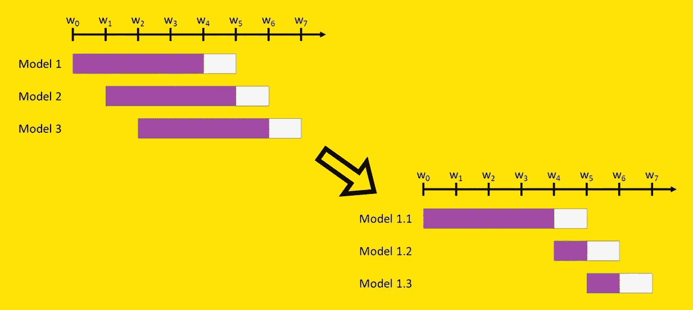
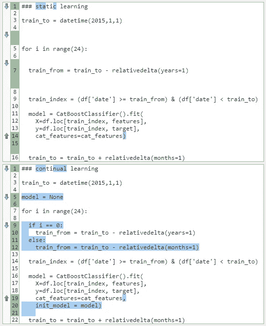
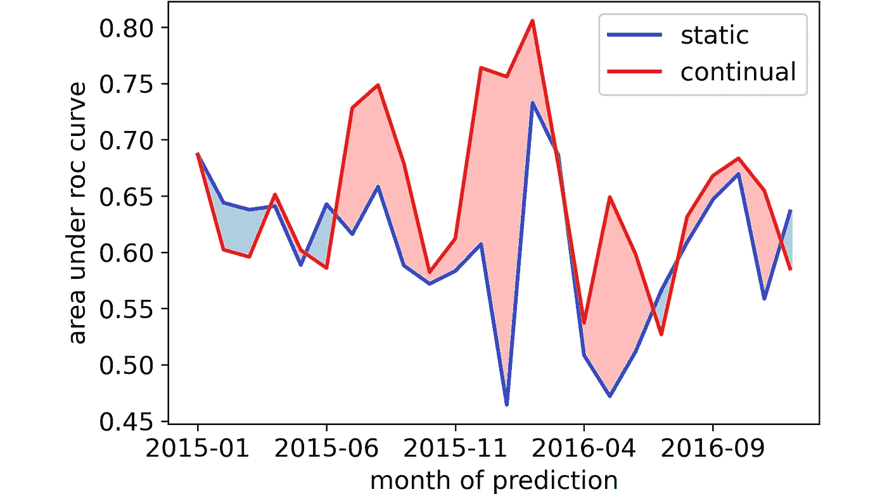

# 你不需要神经网络来持续学习

> 原文：<https://towardsdatascience.com/you-dont-need-neural-networks-to-do-continual-learning-2ed3bfe3dbfc>

## 持续学习是 ML 模型随着新数据的到来而不断学习的能力。这是如何用 XGBoost、LightGBM 或 CatBoost 在 Python 中实现的。



从静态学习到持续学习。[图片由作者提供]

持续学习是目前人工智能领域最热门的话题之一。然而，我读到的关于这件事的一切似乎都想当然地认为——为了进行持续的学习——你需要使用神经网络。

我认为这构成了广泛采用持续学习的障碍。事实上，神经网络比其他机器学习方法(例如梯度推进)需要更多的数据准备和调整。此外，它们在涉及表格数据的问题上往往表现不佳。

这就是为什么在本文中，我将向您展示**如何在 Python 中实现持续学习，而不必使用神经网络，而是使用 XGBoost、LightGBM 和 Catboost** 等库。

# 静态学习

很多时候，在实际应用中，采用的是**静态方式学习**。

它或多或少是这样工作的。您根据最新的可用数据(例如，过去 4 周的交易)来训练模型，并使用该模型对新数据进行预测。

过了一段时间，比如说一个星期，你发现你的模型的性能下降了。因此，你可以简单地扔掉现有的模型，然后重复上面同样的过程:获取最近 4 周的数据，训练一个新的模型，等等。

这也叫**无状态训练**，因为你没有跟踪之前模型的状态。换句话说，你没有记录以前的模型学到了什么。

下图描述了这一过程:


静态学习示例。每周都会构建一个全新的模型(基于前 4 周的数据)。[图片由作者提供]

现在你可能会问:“但是为什么我们每次只使用最近 4 周的数据呢？难道我们不能只取所有的数据，也就是说第一个模型 4 周的数据，第二个模型 5 周的数据…？”

在实践中采用这种方法有许多原因。

*   概念漂移:随着时间的推移，我们试图预测的现象会发生变化，因此使用较旧的数据可能会适得其反。
*   内存约束:如果您需要将数据加载到内存中来训练模型，如果您总是使用最近 4 周的数据，则数据所使用的内存或多或少是恒定的。
*   时间限制:向模型中输入过多的数据会越来越多地延长训练时间。

# 持续学习

但是，从概念上讲，扔掉旧模型意味着浪费旧模型迄今为止收集的所有知识。理想情况下，我们应该找到一种方法来保留以前的知识，同时逐渐添加来自新数据的信息。这正是**不断学习**的目的。

按照上面的例子，这是持续学习的结构:


不断学习。现有模型的新版本每周更新一次(基于上周的数据)。[图片由作者提供]

与静态学习不同，在连续学习**中，每个数据点仅进入训练程序一次:训练数据集之间没有重叠**。

请注意，在这种情况下，就像我们只有一个单一的模型，它每周都会更新。这些不是不同的模型。这些只是同一款的**不同版本。这也被称为**有状态训练**，因为模型的先前状态被保留。**

还要注意，这种方法在以下方面具有额外的优势:

*   内存消耗:每周，加载到内存中的数据远远少于静态学习中的数据。
*   时间消耗:训练过程是在较小部分的数据上进行的，因此速度要快得多。

# 好吧，但是我怎么用 Python 来做呢？

我读过的所有关于持续学习的论文和文章似乎都想当然地认为持续学习等同于深度学习。

从深度学习的角度来看，持续学习包括更新神经网络的权重。换句话说，使用第一组数据，模型学习一组权重，然后在接下来的运行中，权重被稍微调整以适应新的训练数据，等等。这样，模型从旧数据中学习到的东西会随着时间的推移“保留”在模型中。

但在许多 ML 应用中，甚至不使用神经网络，原因有很多:它们更难调整，并且往往比表格数据集上的其他模型(例如，梯度推进模型)表现更差。

因此，重要的是要知道，你也可以在不包括神经网络的项目中进行持续学习。事实上，**持续学习已经在一些最流行的机器学习现成库中实现了**。

让我们看看其中的三个。

## 1.XGBoost

假设你已经训练了一个 XGBoost 模型，名为`model_old`。现在，新的数据到来了，您希望只在新的数据上“更新”旧模型的知识。您只需要将旧模型作为新模型的参数进行传递。为此，您必须使用一个名为`xgb_model`的参数:

```
from xgboost import XGBClassifiermodel_new = XGBClassifier().fit(X_new, y_new, xgb_model=model_old)
```

## 2.LightGBM

LightGBM 也是如此，但是这个参数叫做`init_model`:

```
from lightgbm import LGBMClassifiermodel_new = LGBMClassifier().fit(X_new, y_new, init_model=model_old)
```

## 3.CatBoost

相同的语法适用于 CatBoost:

```
from catboost import CatBoostClassifiermodel_new = CatBoostClassifier().fit(X_new, y_new,
  init_model=model_old)
```

# 静态学习与真实数据集上的持续学习

让我们在一些真实数据的帮助下让代码变得生动起来。

我们需要的所有进口如下:

```
import numpy as np
import pandas as pd
from datetime import datetime
from dateutil.relativedelta import relativedelta
from catboost import CatBoostClassifier
from sklearn.metrics import roc_auc_score
```

## 1.数据集

我使用了 Kaggle (CC0:公共领域许可)的[干旱数据集。该数据集是 2000 年至 2016 年间美国所有县的天气数据和干旱信息的时间序列。](https://www.kaggle.com/cdminix/us-drought-meteorological-data)

数据集由 21 列组成:

*   FIPS:美国每个县的唯一 ID(总共有 3108 个不同的县)。
*   日期:从 2000 年 1 月 1 日到 2016 年 12 月 31 日的每一天(共 6210 天)。
*   一组 18 个天气变量，如降水量、地面气压、湿度等。
*   得分:介于 0 和 5 之间的分数，是干旱强度的量度。

以下是数据集前 5 行的屏幕截图:


干旱数据集的前 5 行。[图片由作者提供]

**任务是预测是否会有干旱**。

因为我们正在做一个小实验，所以我们将只使用所有数据的一个子集:我们将只保留从最初的 3108 个县中随机选择的 100 个县，并且我们将只保留 2014 年 1 月 1 日以后的数据。

而且我们会把数值型的目标变量变成二元变量(不管干旱的分数是否大于 0)，把这个变成二元分类问题。

```
**# import original data** df = pd.read_csv("/kaggle/input/us-drought-meteorological-data/train_timeseries/train_timeseries.csv")**# select 100 fips at random and keep only data starting from 2014** np.random.seed = 123
some_fips = np.random.choice(df["fips"].unique(), size=100,
  replace=False)df = df.loc[df["fips"].isin(some_fips), :]
df = df.loc[df["date"]>="2014", :]**# change "date" dtype from string to datetime** df.loc[:,"date"] = pd.to_datetime(df.loc[:,"date"])**# turn continuous score into binary target** df.loc[:, "score"] = (df.loc[:, "score"].fillna(0)>0).astype(int)
```

现在，让我们选择将在培训过程中使用的功能:

```
**# set name of target column**
target = "score"**# set names of features**
features = ["fips", "PRECTOT", "PS", "QV2M", "T2M", "T2MDEW",
  "T2MWET", "T2M_MAX", "T2M_MIN", "T2M_RANGE", "TS", "WS10M",
  "WS10M_MAX", "WS10M_MIN", "WS10M_RANGE", "WS50M", "WS50M_MAX",
  "WS50M_MIN", "WS50M_RANGE"]**# set position of categorical features (in our case, just "fips")**
cat_features = [0]
```

## 2.静态学习

现在，假设我们每个月都想得到一个新的模型。按照静态学习的方法，这将意味着，在每个月的第一天，我们必须根据前一年的所有数据训练一个全新的模型。

让我们重复这个过程 24 次(即 2 年)。关于预测模型，我将使用 CatBoost。这是代码的样子。

```
**### static learning**train_to = datetime(2015,1,1)for i in range(24): train_from = train_to - relativedelta(years=1) train_index = (df["date"] >= train_from) & (df["date"] < train_to)

  model = CatBoostClassifier().fit(
    X=df.loc[train_index, features], 
    y=df.loc[train_index, target],
    cat_features=cat_features) train_to = train_to + relativedelta(months=1)
```

在每个迭代的末尾，我们将培训日期提前一个月。为了清楚起见，我已经打印出了前 5 次迭代的训练周期:


静态学习前 5 次迭代的训练日期。[图片由作者提供]

## 3.持续学习

现在让我们应用同样的逻辑，但是使用持续学习。这意味着我们仍将每月把最大训练日期提前一个月。但是，这一次，我们将只使用上个月的数据，因为模型已经嵌入了它以前学习过的模式。

```
**### continual learning**train_to = datetime(2015,1,1)model = Nonefor i in range(24): if i == 0:
    train_from = train_to - relativedelta(years=1)
  else:
    train_from = train_to - relativedelta(months=1) train_index = (df["date"] >= train_from) & (df["date"] < train_to)

  model = CatBoostClassifier().fit(
    X=df.loc[train_index, features], 
    y=df.loc[train_index, target],
    cat_features=cat_features,
    init_model = model)

  train_to = train_to + relativedelta(months=1)
```

这是前 5 个训练阶段:


持续学习的前 5 次迭代的培训日期。[图片由作者提供]

在第一次迭代时(当`i=0`)，我们没有之前训练过的模型(这等于`model=None`)。因此，培训期为一年:从 2014 年 1 月 1 日至 2014 年 12 月 31 日。如果你看看上面，你会注意到这在静态学习中是完全一样的。

但是，差异从第二次迭代开始(当`i>=1`)。事实上，`model`现在是一个合适的 CatBoost 模型，因此我们可以从我们离开的地方继续训练。事实上，之前的模型已经在除了上个月之外的所有之前的数据上进行了训练。所以我们只需要继续对上个月的数据进行训练。

为了更加清晰，让我们来比较两段代码:



用于静态学习和持续学习的代码的比较。[截图来自 https://text-compare.com/

## 4.结果

既然我们已经看到了静态学习和持续学习的区别，对这两种方法的表现感到好奇是很自然的。

为了看到这一点，我们可以计算每个模型的 ROC 曲线下的面积。在我们的例子中，测试集是最大训练日期之后的一个月。

当然，这两种方法的测试数据集是相同的。因此，将下面这段代码添加到`for`循环中就足够了:

```
test_from = train_totest_to = test_from + relativedelta(months=1)test_index = (df["date"] >= test_from) & (df["date"] < test_to)

roc_auc_score(
  df.loc[test_index, target], 
  model.predict_proba(df.loc[test_index, features])[:,1])
```

这些是前 5 次迭代的测试日期:


两种方法的前 5 次迭代的测试日期。[图片由作者提供]

这些是我在每种方法的 24 次迭代中记录的`roc_auc_score`:



干旱数据集上的静态学习与持续学习。每种方法都有 24 个模型根据维持数据进行了训练和评估。[图片由作者提供]

一些统计数据:

*   在 24 次迭代中的 17 次(即 71%的时间)，持续学习比静态学习表现得更好(即 ROC 更高)。
*   静态学习平均得分为 60.5%，而持续学习平均得分为 65.0%。

当然，这只是一个实验，但它让我们得出结论:**持续学习可能比静态学习表现更好**,在不涉及神经网络(或深度学习)的应用中也是如此。

# 综上

在本文中，我们看到了如何使用开箱即用的 ML 模型(如 XGBoost、LightGBM 和 CatBoost)在 Python 中执行持续学习。

此外，在真实数据集的帮助下，我们已经看到，除了具有其他实际优势(如更低的内存消耗和更快的训练时间)之外，持续学习可能会给出比静态学习明显更好的结果。


*如果你有兴趣加深对持续学习的了解，我建议你阅读 Chip Huyen* *的* [*惊人博客，这篇文章就是受其启发而写的。*](https://huyenchip.com/2022/01/02/real-time-machine-learning-challenges-and-solutions.html)


*感谢您的阅读！我希望你喜欢这篇文章。如果你愿意，* [*在 Linkedin 上加我*](https://www.linkedin.com/in/samuelemazzanti/) *！*