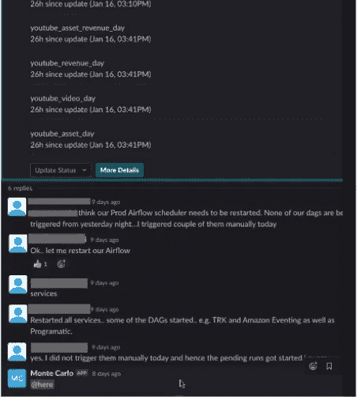
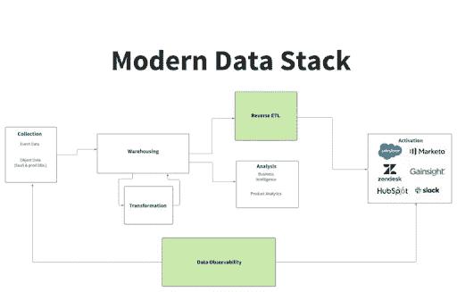

# 数据质量问题比你想象的要多

> 原文：<https://towardsdatascience.com/you-have-more-data-quality-issues-than-you-think-45d3bf6fa3b3>

## 平均来说，公司的数据仓库中每 15 个表就会遇到一个数据问题。以下是 8 个原因以及你能做什么。

一个常见的数据质量问题是数据漂移。在 [Unsplash](https://unsplash.com/s/photos/drift?utm_source=unsplash&utm_medium=referral&utm_content=creditCopyText) 上由 [Aral Tasher](https://unsplash.com/@araltasher?utm_source=unsplash&utm_medium=referral&utm_content=creditCopyText) 拍摄的照片。

跟我说:你的数据永远不会完美。

任何努力获得完全准确数据的团队都会非常失望。单元测试、异常检测和编目是重要的步骤，但是仅仅依靠技术是无法解决数据质量问题的。

像任何熵系统一样，数据会中断。正如我们所了解的那样，构建解决方案来抑制数据问题的原因和下游影响，这种情况比你想象的更经常发生。

事实上，虽然大多数数据团队知道他们有数据质量问题，但他们大大低估了每月、每周甚至每天发生的数量。

我们的[产品数据](https://www.montecarlodata.com/product/)来自与许多跨行业、跨公司规模和跨技术堆栈的数据团队的合作，显示出一般组织每年会经历的数据事件数量大约是每 15 张表就有一次。

那么，即使有了可靠的测试和其他方法，为什么这么多的数据质量问题会被忽视，只是在几个小时、几天甚至几周后才被利益相关者发现呢？是怎么走到这一步的，能做些什么？

在这篇博文中，我将深入探讨隐藏的数据质量问题的 8 个原因(或“沉默的大多数”数据停机时间)以及改进检测和跟踪的最佳实践。

1.  [隐藏在众目睽睽之下的质量问题](https://www.montecarlodata.com/blog-data-quality-issues/#hidden-in-plain-sight-quality-issues)
2.  [数据漂移](https://www.montecarlodata.com/blog-data-quality-issues/#data-drift)
3.  [预期漂移](https://www.montecarlodata.com/blog-data-quality-issues/#expectations-drift)
4.  [所有权漂移](https://www.montecarlodata.com/blog-data-quality-issues/#ownership-drift)
5.  [事件分类缺乏可见性](https://www.montecarlodata.com/blog-data-quality-issues/#lack-of-visibility-into-incident-triagenbsp)
6.  [缺乏针对数据质量问题的 KPI 和 SLAs】](https://www.montecarlodata.com/blog-data-quality-issues/#lack-of-kpis-and-slas-for-data-quality-issues)
7.  [撤除人力检查站](https://www.montecarlodata.com/blog-data-quality-issues/#the-removal-of-human-checkpoints)
8.  [数据质量问题覆盖范围](https://www.montecarlodata.com/blog-data-quality-issues/#scale-of-coverage-for-data-quality-issues)

# 隐藏在明处的质量问题

数据新鲜度是一个隐蔽的质量问题的例子。照片由[基兰伍德](https://unsplash.com/@kieran_wood?utm_source=unsplash&utm_medium=referral&utm_content=creditCopyText)在 [Unsplash](https://unsplash.com/s/photos/camoflauge?utm_source=unsplash&utm_medium=referral&utm_content=creditCopyText) 上拍摄

许多原因(包括本文中的大多数原因)导致组织低估了数据质量问题的普遍性，这些问题涉及到模糊其可见性或感知的因素。但是也有一些数据质量问题在众目睽睽之下大胆地出现，没有人知道。

例如，野外健康问题每天都会出现，但却是最难检测和识别的数据质量问题之一。

测试现场健康状况可能看似容易，有一些开源和转换工具可以提供帮助。如果一个字段不能为空，那就很简单了。

然而，定义阈值确实具有挑战性。原因是范围中间的阈值通常不同于边缘。例如，从 40%零到 50%零可能是好的。然而，从 0% null 到 0.5% null 可能意味着灾难性的失败。

另一个隐藏在眼前的数据质量问题是新鲜度(或及时性，如[六个数据质量维度](/the-six-dimensions-of-data-quality-and-how-to-deal-with-them-bdcf9a3dba71)中所述)。您的数据消费者有最后期限。他们在特定时间交付报告或执行数据相关操作。

在每个管道中，当一个表延迟时，会有一系列的过程使问题复杂化。您的业务利益相关者可能不知道利用过时的数据。另一种可能性是，他们只是没有执行需要做的事情，因为很难区分什么时候真正没有生成记录，什么时候上游出现了问题。

如果你问数据晚运行一个小时是否应该被认为是数据质量问题，那么可能是时候开始考虑开发 [**数据 SLA**](https://www.montecarlodata.com/how-to-make-your-data-pipelines-more-reliable-with-slas/)**了，因为知道的唯一方法是与你的利益相关者交谈。**

# **数据漂移**

****

**数据逐渐增加是因为底层事件还是因为数据漂移和数据质量问题？由[活动创作者](https://unsplash.com/@campaign_creators?utm_source=unsplash&utm_medium=referral&utm_content=creditCopyText)在 [Unsplash](https://unsplash.com/s/photos/chart?utm_source=unsplash&utm_medium=referral&utm_content=creditCopyText) 上拍摄的照片**

**数据漂移是指由于数据质量问题而不是真正的潜在趋势，数据在一个方向上逐渐且一致地变化。这种有害数据的潜在蔓延给任何运行基本数据质量报告或异常测试的人带来了巨大的问题，因为这些过程旨在捕捉数据中的重大变化。**

**当下游数据分析师在每份报告中看到的都是略高或略低的数字时，他们又如何能发现数据质量问题呢？**

**数据漂移也特别具有挑战性，因为下游数据分析师可能会看到一个数字略有上升或下降，但这不足以引起他们的质疑。**

# **期望漂移**

****

**就像你可以通过逐渐增加热量来煮青蛙一样，数据团队可以习惯于数据质量问题的逐渐增加。照片由 Ladd Greene 在 Unsplash 上拍摄**

**有一个古老的神话，你可以煮一只青蛙，只要你逐渐提高水温，它们就不会跳出锅外。撇开秋葵食谱不谈，数据团队也是如此。**

**只要有仪表板，就有坏掉的仪表板和试图修复它们的数据工程师。**

**长期以来，这一直是标准操作程序，以至于许多组织可能不明白，如果数据工程师不经常解决数据质量问题，他们可以为组织增加多少价值。**

**对于退一步评估他们的团队如何花费时间的数据领导者来说，结果令人震惊。**

**在推出该公司之前，我们与 150 多位数据领导者进行了交谈。我们发现，团队平均花费 30%以上的时间来解决数据质量问题。**

**在我们产品开发人员的前公司，6 个年度 okr 中有 4 个专注于以某种方式处理或提高数据可靠性。**

# **所有权漂移**

****

**如果您无法了解所有数据资产，就无法了解所有数据质量问题。照片由 krakenimages 在 Unsplash 上拍摄**

**数据仓库或湖是现代数据栈中绝对重要的组件。然而，尽管它确实是真理的来源，但它也可能遭受我们所谓的“公地悲剧”**

**当您的整个数据团队都可以访问仓库，但没有标准的控制或良好的数据卫生时，仓库可能会相对较快地变成垃圾场。理论上，确保每个数据资产都有一个所有者似乎很容易，但现实并非总是如此。**

**你永远不会看到以软件工程人员的名字命名的微服务，但是对于每个工程师来说，在仓库中拥有他们自己的模式是非常非常普遍的做法。**

**挑战在于每个团队都会有自然更替。人们来来去去。当没有强大的沿袭或其他流程来了解不同的数据集如何影响仪表板或下游的其他资产时，您将无法了解潜在的数据质量问题或事件。**

**作为[数据认证](https://www.montecarlodata.com/stop-treating-your-data-engineer-like-a-data-catalog-and-how-to-build-a-data-certification-program/)流程的一部分，标记数据 SLA 所涵盖的表是一个很好的解决方案，可以避免出现[“您正在使用那个表？!"](https://www.montecarlodata.com/how-to-solve-the-youre-using-that-table-problem/)问题。**

# **缺乏对事故分类的可见性**

****

**数据质量问题的事件分类。**

**说到可见性问题，缺乏对事件分类流程的可见性是我见过的数据领导者不仅低估其数据质量问题数量的最大原因之一。**

**当数据管道损坏、数据不准确或数据不一致时，数据工程师不想在屋顶上大喊大叫。除非有强大的数据事件分类流程和文化——这发生在持续聊天的地方，如 PagerDuty、Microsoft Teams 或 Slack——识别和缓解数据质量问题发生在电子邮件的幕后。**

# **缺乏针对数据质量问题的 KPI 和 SLA**

****

**跟踪 Red Ventures 的数据质量问题 SLA 和 SLIs。图片由布兰登·贝德尔提供。**

**具有讽刺意味的是，数据团队可能无法掌握发生的全部数据质量问题的原因之一是…缺乏数据。**

**这就是为什么越来越多的数据团队开始在数据团队和业务部门之间制定数据 SLA 或服务水平协议，指定他们可以从数据系统获得的性能水平。毕竟，你只能提高你衡量的东西。**

**高级数据科学家 Brandon Beidel [为 Red Ventures 做了同样的事情。正如布兰登所说:](https://www.montecarlodata.com/one-sla-at-a-time-our-data-quality-journey-at-red-digital/)**

**“下一层是衡量绩效。这些系统的表现如何？如果有大量的问题，那么也许我们没有以一种有效的方式建立我们的系统。或者，它可以告诉我们在哪里优化我们的时间和资源。也许我们的 7 个仓库中有 6 个运行顺利，所以让我们仔细看看不顺利的那个。**

**有了这些数据 SLA 之后，我创建了一个按业务和仓库划分的仪表板，以了解每天满足 SLA 的百分比。"**

# **取消人工检查站**

****

**像逆向 ETL 这样的过程正在将人工数据质量抽查器从循环中剔除。**

**长久以来(也许太久了)，数据分析师和业务利益相关者一直是组织数据可靠性的安全网。**

**如果坏数据被传送到仪表板，希望数据分析团队中的某个人会注意到它“看起来很滑稽”现代数据堆栈正在发展到更多的人被排除在循环之外的地步。**

**例如，许多组织开始实施 [**反向 ETL**](https://www.montecarlodata.com/blog-reverse-etl-the-missing-piece-of-the-data-quality-puzzle/) **管道**，将数据从数据仓库直接拉入操作系统(如 Marketo 或 Salesforce)。或者，也许这些数据正被用来为机器学习模型提供信息。**

**这些流程使数据更具可操作性和价值，但也使数据团队更难发现数据质量问题。自动化流程可以受益于自动化的数据可观察性和监控。**

# **数据质量问题的覆盖范围**

****

**数据质量问题的覆盖范围比你想象的要大。照片由 Unsplash 上的 Fernando @cferdophotography 拍摄。**

**对于第一次看到端到端数据可观察性解决方案的组织来说，覆盖范围始终是最令人震惊的因素。自动发现和机器学习驱动的监视器非常强大。**

**关于数据质量，我们最常听到的一句话是，“我不可能为所有这些编写一个测试。”这是真的。数据生态系统增长太快，有太多的 [**未知未知**](https://www.montecarlodata.com/blog-data-observability-vs-data-testing-everything-you-need-to-know/) 需要手动编写测试来涵盖一切。**

**通常情况下，数据团队会为过去失败的东西编写测试。但是要做到这一点，您需要所有东西都至少中断过一次，并且在此期间没有添加新的数据资产。**

**手动流程无法扩展，结果是常见的数据质量问题被遗漏，数据完整性付出了代价。**

# **第一步是知道你有问题**

**除非大家一致认为存在需要解决的问题，否则永远不会有提高数据质量的动力。**

**花一分钟时间将您环境中的表数除以 15，看看这个数字与您记录的年度事件数相比如何(如果您没有记录这些事件，请开始记录)。**

**无论如何，这都不是一个完美的估计；几乎有无限多的变量会影响您的具体结果。然而，如果这两个数字有很大差异，可能是时候建立更好的系统来捕捉和解决数据质量问题了。**

**[***藩***](https://www.linkedin.com/in/falberini/) ***本文合著。*****

*****如果您想了解更多有关如何测量数据停机时间或其他数据质量指标的信息，请联系*** [***巴尔***](https://www.linkedin.com/in/barrmoses/) ***和其余的*** [***蒙特卡洛团队******。***](https://www.montecarlodata.com/request-a-demo/)**