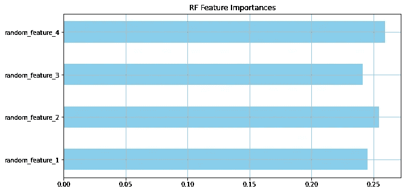
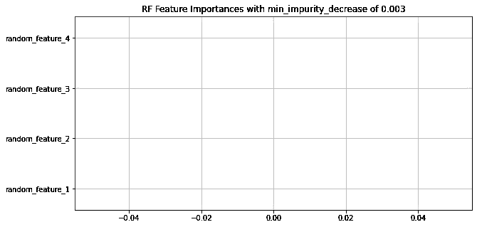

# 关于随机森林特征的重要性，他们没有告诉你的 5 个事实

> 原文：<https://towardsdatascience.com/you-should-probably-know-this-about-tree-based-feature-importances-7afc450726f5>

每个数据科学家经常面临需要使用监督学习(回归或分类)来建模特定现象的情况。在大多数情况下，模型的预测能力并不是分析的唯一期望结果，利益相关者希望了解不同因素对特定结果的影响。这就是特性重要性的来源。


图片由在 freepik.com 发现的 wayhomestudio 提供。

这个想法很简单。像往常一样，您训练一个基于树的模型来预测作为给定特征的函数的结果。然后，您可以利用基于树的模型的内置功能来报告每个特性对模型的重要性。

> 简而言之，基于树的模型根据基于每个变量获得的杂质减少量来计算特征重要性。

# 1-特征的重要性受到模型本身精度的限制

如果一个模型在测试集上的准确度很低，那么特征重要性就不可靠。模型应该能够对看不见的数据做出合理的预测，让我们相信它对特征重要性的判断。自然，过度拟合模型也不可靠。

# 2-特征重要性被标准化，并且将总是加到 1

这比大多数人意识到的更重要。重要性的标准化意味着绝对值不能被解释；相反，我们必须只关注功能的排名。绝对值可以通过添加或移除独立特征来改变，但是原始特征集和目标之间的关系没有改变。

此外，如果数据集中没有任何要素确实与目标相关，则基于每个要素获得的信息将非常少。尽管如此，正常化步骤会夸大它们的重要性。

让我来演示一下。我将创建一组随机特征和一个随机目标。直观上，随机数的序列之间没有关系，所以它们的重要性应该为零吧？让我们看看:

```
data = {'random_feature_1':[random.random() for _ in range(1000)],
        'random_feature_2':[random.random() for _ in range(1000)],
        'random_feature_3':[random.random() for _ in range(1000)],
        'random_feature_4':[random.random() for _ in range(1000)],
        'random_target':[random.random() for _ in range(1000)]}data = pd.DataFrame(data)
```

我们分成训练/测试和拟合随机森林模型，并绘制重要性:



作者图片

但是等等，我们看到每个人的重要性大约为 0.25！**这并不意味着随机特征解释了目标**的可变性，它只是重要性标准化的一个假象。

# 3-模型调整时，排名可能会发生变化

调整模型会改变基于不同要素拆分数据的方式。因此，这也将改变特性的重要性。

为了证明这一点，让我们重复上一节中的实验，但这次控制杂质减少的最小量。当信息增益小于我们可以指定为超参数的某个阈值时，该参数防止模型进行分割。让我们选择一个很小的值，比如 0.003，然后再次拟合模型。这一次，模型将赋予我们以下重要性:



作者图片

我们做到了！进口都是零。请注意，树已经“尝试”正常化重要性，但是它不能将零乘以一个数使它们相加为 1。

# 4-特征缩放对基于树的特征重要性没有影响

基于树的模型对特征比例不敏感，所以它们的重要性也不敏感是有道理的。为了证明这一点，我使用了来自 scikit-learn 数据集的“葡萄酒数据”,我们可以根据葡萄酒的化学成分对其质量进行分类。

这是当训练和超参数调整随机森林模型时，您将在第一轮中获得的特征重要性。


葡萄酒质量数据对非比例特征的重要性，按作者分类的图像

所以让我们开始重新调整一些特征:

```
data['flavanoids'] /= 1000
data['alcohol'] /= 1000
data['proline'] *= 1000
```

现在让我们再次看到它的重要性:


线性变换后的特征重要性，作者提供的图像

注意到什么不同了吗？没有吗？我也没有。

如果您认为这些只是简单的转换，那么当您执行非线性转换(如 log)时会发生什么呢？我完全支持实验，所以让我们一起来看看:

```
data['flavanoids'] = np.log(data['flavanoids'])
data['alcohol'] = data['alcohol']**2
data['proline'] = data['proline']**0.5
```

这一次，在采取相同的步骤后，我们将获得以下结果:


非线性变换后的特征重要性，按作者排列的图像

其再次显示与之前相同的值。结案了。

# 基于 5-树的特征重要性是有偏差的。

是的。你没看错。基于树的模型的特征重要性意味着快速，而不是超级准确，并且它们倾向于夸大连续或高基数特征的重要性。

# 摘要

本文强调了基于树的特性重要性的一些基本属性，以及它们如何受到超参数调整等因素的影响。总之，在判断每个独立变量对模型预测能力的贡献时，数据科学家应该了解这些属性。