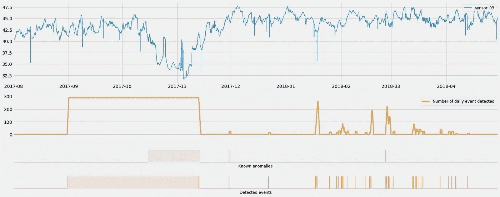
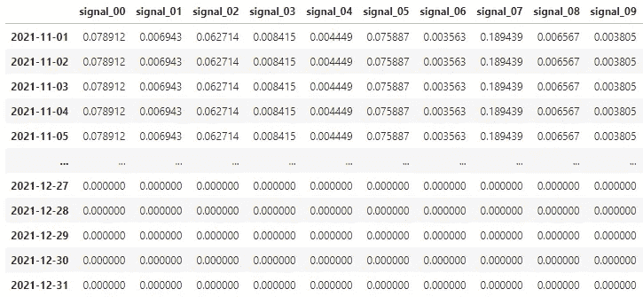
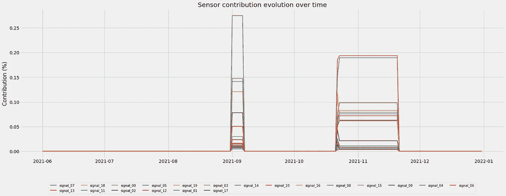
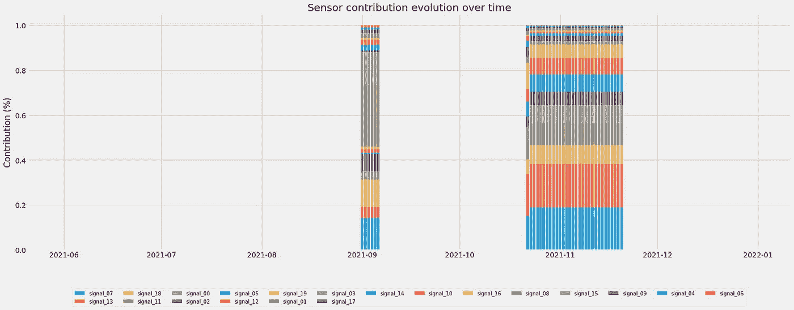
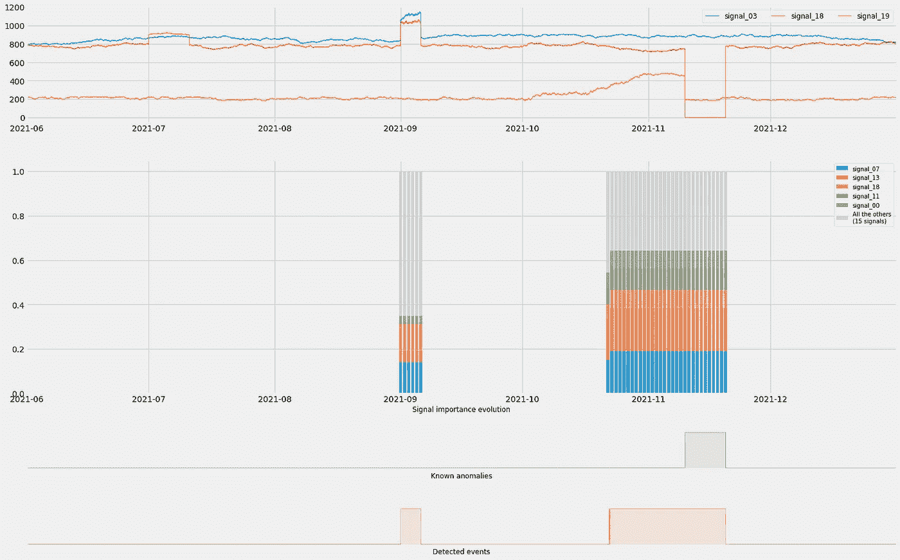

# 你的异常检测模型比你想象的要聪明

> 原文：<https://towardsdatascience.com/your-anomaly-detection-model-is-smarter-than-you-think-c1cade5fcabe>

## 多变量时间序列异常检测模型可以提供丰富的见解，如果你投资一些时间在后处理他们的结果…


马库斯·斯皮斯克在 [Unsplash](https://unsplash.com?utm_source=medium&utm_medium=referral) 上的照片

在处理工业传感器数据时，我经常处理异常检测用例。在过去的十年里，我一直在和几十个客户研究这个话题，在过去的五年里几乎每天都在研究。我接触的典型终端用户是工厂经理、工艺工程师或生产线上的操作员。大多数过程工程师都非常精通统计学，有些甚至是优秀的工业数据科学家。不过，这是一个例外，而不是常规，你最终会陷入必须回答棘手问题的讨论中:

> “我需要知道为什么你的模型检测到异常。在调整制造流程之前，我需要可靠的根本原因分析。”
> 
> “异常检测是不够的:当模型检测到异常时，已经太晚了。我需要预测来证明在这种方法上投入时间和精力的合理性。”
> 
> "我需要处方:告诉我应该怎么做才能防止失败的发生."

诸如此类……前段时间我在 LinkedIn 上发布了几个简短的演示来揭开异常检测的神秘面纱(见 [**本帖**](https://www.linkedin.com/posts/michaelhoarau_from-anomaly-detection-to-anomaly-prediction-activity-6907075565065805824-ICCP/) 和 [**本帖**](https://www.linkedin.com/posts/michaelhoarau_root-cause-investigation-with-anomaly-detection-activity-6907577865614032896-TwgY/) )。在这篇博文中，我将详细介绍如何为您自己的模型生成类似的输出，并使它们更加智能。这样你就能更好地应对上述问题了！简而言之，到本文结束时，您将拥有:

*   用 Amazon SageMaker 在云中建立一个 Jupyter 环境，
*   克隆了 GitHub repo，其中包含了遵循本文的所有代码。
*   发现一个好的数据集，下载并探索它
*   使用 Amazon Lookout for Equipment(AWS 专门用于异常检测的托管服务)训练异常检测模型
*   可视化异常检测模型的原始结果
*   对结果进行后处理，以获得更有意义的见解

所以，我们开始第一步吧！

# 让我们舒适:准备您的环境！

我鼓励你跟随这篇博文，浏览 GitHub，获取 [**这一系列的 Jupyter 笔记本**](https://github.com/michaelhoarau/smarter-anomaly-detection) 。你可以使用你常用的 Jupyter 环境，或者用 Amazon SageMaker 创建一个。

*   如果您想使用*您通常的 Jupyter 环境*，已经有了一个*训练过的异常检测模型*，并且已经在一些测试数据上对其进行了回测，以获得一些结果，那么您已经可以进入下一段了！
*   如果你想使用*你通常的 Jupyter 环境*，有一些数据，并想尝试 Amazon Lookout 的设备来训练一个异常检测模型，你将需要创建一个 AWS 帐户，并确保你的帐户凭证可以从你的环境中访问。
*   如果你想留在 AWS 环境中，你可以创建一个 AWS 账户，启动一个 Amazon SageMaker 环境，让它访问 Amazon Lookout for Equipment API。您可以使用与本文相同的数据集，也可以自带数据集。

我现在认为您的环境已经准备好了:第一步是在其中克隆这个 GitHub 库:

```
git clone [https://github.com/michaelhoarau/smarter-anomaly-detection.git](https://github.com/michaelhoarau/smarter-anomaly-detection.git)
```

该资料库中的笔记本将引导您完成从数据准备到结果后处理的整个过程。可以从第一个`[1_data_preparation.ipynb](https://github.com/michaelhoarau/smarter-anomaly-detection/blob/main/notebooks/1_data_preparation.ipynb)`开始。

# 数据概述

## 等一下…你把异常现象叫做什么？

你可能会觉得这很奇怪，但是这个问题经常被忽视！要从机器学习的角度构建您的业务问题，理解以下内容至关重要:

*   你感兴趣的异常的形状
*   他们如何积累加班时间
*   当它们被触发时会发生什么

此外，如果您想了解构建异常检测系统的潜在投资回报，您还需要了解:

*   谁是潜在用户
*   他们需要做出什么样的决定
*   哪些见解可以使这些决定更容易做出
*   这些见解应该如何传达

收集这些知识将确保您的系统被最终用户实际采用。

也就是说，让我们看看可以从时间序列数据中捕捉到的不同类型的异常:

*   **突变:**这是最容易发现的。变化(单变量或多变量，当它发生在多个时间序列时)是突然的，并且值的变化是明显的。在工业环境中，这些突然的变化经常在边缘水平被注意。特定的软件组件监控这些过程和设备。
*   **水平变化:**当一个给定的时间序列在基于基本条件或运行模式的数值范围之间变化时，这种情况就会发生。如果您想在检测异常时考虑所有操作模式，您需要注意将它们全部包含在您的训练数据中。否则，在推理时，一个新的操作模式可能会被认为是一个异常，您最终会有许多误报要处理。
*   **趋势:**一组信号可以随时间变化(不一定同向)。当您想要评估一个过程或一件设备的状况时，这些趋势异常将是搜索的很好的前兆事件。它们将帮助你在实际故障可能发生之前建立预警信号。

现在，我们已经从定义的角度对该领域进行了阐述，让我们通过查看一个实际的工业多元数据集来将其付诸实践…

## 数据集概述

搜索带有注释异常和足够历史数据的工业多元时间序列数据集本身就是一个挑战。我见过的唯一有相关异常的公开数据集是 Kaggle 提供的一个工业水泵数据集。你可以从 [**这个链接**](https://www.kaggle.com/datasets/nphantawee/pump-sensor-data) **下载这个数据集。**该数据集包含 2018 年 4 月 1 日至 2018 年 8 月 31 日(5 个月)的 52 个传感器，采样率为 1 分钟。但是，由于没有与此数据集相关联的许可，因此您不能将其用于任何商业用途。

为了帮助您入门，前面提到的 repo 中的第一个笔记本(`[synthetic_0_data_generation.ipynb](https://github.com/michaelhoarau/smarter-anomaly-detection/blob/main/notebooks/synthetic_0_data_generation.ipynb)`)将生成一个合成的多变量 timeseries 数据集，并在其上添加不同类型的异常:这不像真实的东西，但它将足够接近于在这里暴露我的思想过程。我用 20 个信号、1 年的数据和 10 分钟的采样率生成了一个数据集。

让我们加载这些数据，看看一些信号:

*   确定故障时间(下面的红点)
*   突出显示该虚拟资产被破坏或从故障中恢复的时间段(在下面用黄色标出):


综合数据时间序列概览(图片由作者提供)

使用该数据集的前五个月来训练模型(从 2021 年 1 月到 2021 年 5 月)，将为我们提供至少 2 个异常范围来评估我们的模型。

*   其中之一是 2021 年 11 月可见的黄色带
*   另一个将是 2021 年 9 月初绿色信号上可见的奇怪尖峰

让我们为这 20 个时间序列绘制一个带状图:


时间序列带状图(图片由作者提供)

我使用带状图来压缩时间序列信号信息。压缩后，每个时间序列都变成一条彩色带，其中:

*   信号的低值为绿色
*   中等值为橙色
*   高值为红色

这个简单的条形带非常便于显示何时出现低值或高值。当把我们数据集的 20 个信号的所有条带放在一起时，我们得到上图。你可以看到一些可能感兴趣的垂直红色区域。其中一些与资产被标记为损坏的已知时期相匹配(大约在 11 月)。

在某些情况下，我们还可以看到许多信号从左到右从红色变为绿色:这可能是某个日期后数据集发生漂移的迹象。这是我之前遇到的一个数据集示例，您可以看到 2017 年 12 月后发生的转变:


沿时间轴移动的带状图(图片由作者提供)

在进一步调查后，这种类型的信息对于为您训练的任何异常检测模型设置再训练触发器将是至关重要的。如果不知道这一点，您将逐渐看到您的模型发布越来越多的误报，使您的模型不可用，并可能失去模型最终用户的信任。

为了生成带状图，我使用了我的`tsia`包(`pip install tsia`)和下面的代码:

带状图生成(由作者编写代码)

如果你想了解更多关于带状图的知识，可以看看我之前的文章，在这篇文章中我深入探讨了带状图是如何产生的:

[](/using-strip-charts-to-visualize-dozens-of-time-series-at-once-a983baabb54f)  

一旦你的合成数据集生成，你可以使用第二个配套笔记本(`[synthetic_1_data_preparation.ipynb](https://github.com/michaelhoarau/smarter-anomaly-detection/blob/main/notebooks/synthetic_1_data_preparation.ipynb)`)为亚马逊寻找设备准备数据。请随意更新它，以便将数据准备成适合您自己的异常检测模型的格式。您已经准备好训练您的模型了！

# 训练异常检测模型

我将使用 Amazon Lookout for Equipment 在之前的数据集上训练一个异常检测模型。为此，您需要一个 AWS 帐户。然后，在已经提到的 GitHub repo 中，您可以运行第三个配套笔记本(称为`[synthetic_2_model_training.ipynb](https://github.com/michaelhoarau/smarter-anomaly-detection/blob/main/notebooks/synthetic_2_model_training.ipynb)`的笔记本):这将把数据推送到亚马逊 S3(大多数托管 AWS AI/ML 服务用于输入数据集的 AWS 块存储服务)，摄取数据并训练异常检测模型。

如果你想了解更多关于 Amazon Lookout for Equipment 的信息，在我的书《AWS 上的时间序列分析》中有六个章节专门介绍这项服务:

[](https://www.amazon.com/Time-Analysis-AWS-forecasting-anomalies-ebook/dp/B09MMLLWDY)  

随意看看 [**这篇博文**](https://michoara.medium.com/time-series-analysis-on-aws-book-presentation-36dc05a9c7ad) 和 [**这篇另一篇**](https://michoara.medium.com/time-series-analysis-on-aws-part-2-presentation-multivariate-anomaly-detection-26325bc0b4a7) 以获得更多关于这些章节的详细信息:

[](https://michoara.medium.com/time-series-analysis-on-aws-part-2-presentation-multivariate-anomaly-detection-26325bc0b4a7)  

训练过程包括对历史数据的回溯测试评估，在这种情况下，如果服务当时正在运行，您可以检测到它应该检测到的事件。与其他异常检测模型一样，Amazon Lookout for Equipment 的原始结果如下所示:


亚马逊寻找设备原始结果(图片由作者提供)

在顶部，我绘制了一些传感器的时间序列。下方绿色部分是虚拟资产从故障中恢复的已知时间段。在底部，红色的，是由 Lookout for Equipment 检测到的事件。当看到这些结果时，有人可能会指出:

> “有些误报，我没时间去调查每个事件！”
> 
> “你的模型只检测已经发生的异常情况，没有用！”
> 
> “我有数百个传感器:当你的模型检测到异常时，我仍然必须调查我的整个操作，我不会在这里节省任何时间！”

听起来很熟悉？让我们看看如何从您的异常检测模型中获得更多见解，并开始赢得您的最终用户的更多信任…

# 后处理模型的原始输出

如前所示，最基本的异常检测模型能够从您的时间序列数据集中标记出它认为异常的时间戳。现在让我们打开回购 的 [**第四笔记本，开始对这些结果进行更详细的后处理。**](https://github.com/michaelhoarau/smarter-anomaly-detection/blob/main/notebooks/synthetic_3_model_evaluation.ipynb)


亚马逊寻找设备原始结果(图片由作者提供)

对这个异常检测模型进行字面解释，你可能会说你有太多的误报(所有红色事件都发生在 2021 年 11 月故障之前)。您可能希望模型标记失败周期，而不标记之前或之后的任何内容。但这与许多假设有关:

*   你有失败的确切日期
*   您实际上知道这是一个故障，而不是维护事件
*   您知道在故障发生之前，您的设备或过程不会触发任何前兆事件

这有很多假设，大多数时候你不会处于这种确切的情况:在你的时间序列中任何可见的异常事件要么是前兆事件，要么是可检测的异常(对未来事件的预警)，要么是故障，要么是维护活动，要么是你的工业过程在问题后恢复的愈合期。

这一事实实际上给了我们一些余地来对我们的异常检测模型原始输出进行后处理，尤其是当您想要了解您的资产/流程所处的条件时(用于基于条件的维护方法的条件监控)。

## 测量事件率

异常检测模型触发事件，作为用户，您必须决定某个事件实际上是您关注的异常、您不想捕获的异常、预先警告失败即将到来的前兆事件还是误报。过滤掉最后一个可以通过测量你在感兴趣的一段时间内有多少事件来实现。例如，测量与我从另一个数据集获得的类似结果相对应的日常事件的数量，产生了类似于下图的图:



测量异常检测模型发布的事件率(图片由作者提供)

基于此，您可以决定仅在每日事件率达到每天至少 200 次后才通知操作员。这将允许您只对在此期间检测到的 41 个事件中的 3 个事件做出反应。我的异常检测模型输出一个数据帧，每个时间戳都有一个状态(0 表示没有检测到异常，1 表示发现了异常)。我的数据采样率为 5 分钟，因此如果我在`12 x 24 = 288 periods`上使用滚动窗口，我将覆盖一整天的数据:

使用这个简单的技术，您可以解决(至少部分解决)前面提到的一些问题。当事件发生率开始变大时，您可以使用它来做出实际反应(允许您从检测到预测)，并过滤掉误报(当检测到稀少事件时)。

现在，让我们尝试解决最后一个问题，即在帮助进行根本原因分析时，异常检测模型缺乏精确性会浪费时间…

## 测量和绘制变量贡献

许多异常检测模型也产生一些可解释的细节，例如每个变量对任何检测到的给定事件的贡献。Amazon Lookout for Equipment 也不例外，每个模型结果都会在检测到的每个事件的 JSON 输出中包含以下字段:

```
'predicted_ranges': [
    {
        'start': '2019-08-08T00:42:00.000000',
        'end': '2019-08-08T01:48:00.000000',
        'diagnostics': [
            {'name': 'synthetic\\signal_00', 'value': 0.052},
            {'name': 'synthetic\\signal_01', 'value': 0.023},
            {'name': 'synthetic\\signal_02', 'value': 0.038},
            {'name': 'synthetic\\signal_03', 'value': 0.023}, ... {'name': 'synthetic\\signal_17', 'value': 0.049},
            {'name': 'synthetic\\signal_18', 'value': 0.033},
            {'name': 'synthetic\\signal_19', 'value': 0.046},
            {'name': 'synthetic\\signal_20', 'value': 0.044}
        ]
    }, ...]
```

如果你在看我的配套笔记本，你会看到我如何重新格式化这种类型的输出。我使用了适合进一步绘图和处理的扩展数据框架:



每个时间戳的可变贡献的扩展结果数据框架(图片由作者提供)

现在，让我们绘制变量重要性随时间的演变图，而不是事件率:



可变重要性演变(图片由作者提供)

我给每个传感器分配了不同的颜色，这个图还不可读。看起来其中一个绿色信号是左边第一个大事件的关键因素。另一个信号，红色的，对右边的事件来说有上升的趋势。让我们使用累积条形图:



使用条形图的可变重要性演变(图片由作者提供)

这有点好，我们实际上可以更好地跟踪趋势，并确定多个信号可能是给定事件中最有贡献的信号。然而，当试图理解“最重要”的信号时，我们不需要绘制所有的 50+信号。让我们试着把重点放在前 5 位，并把所有其他的放在“其他信号”类别中:


关注前 5 个信号的可变重要性演变(图片由作者提供)

它的绘图速度更快，可读性更强。对于 20 个信号，如果每个信号对给定事件的贡献相同，则每个信号的贡献为 5%，5 个信号的贡献为 25%。我们可以从上面看到，前 5 名传感器始终达到 30%到 60%的贡献，这意味着这可能是非常有趣的进一步调查…

现在，让我们添加一些信号和事件(已知的或检测到的),为这个柱状图添加一些额外的上下文:



最终变量演化图(图片由作者提供)

你会在`[synthetic_3_model_evaluation.ipynb](https://github.com/michaelhoarau/smarter-anomaly-detection/blob/main/notebooks/synthetic_3_model_evaluation.ipynb)` 笔记本里找到所有的详细代码。从上面显示的扩展结果数据框架(我们称之为`df`)中，前面的条形图是用以下代码生成的:

变量演变条形图生成(作者代码)

# 下一步是什么？

在本文中，您了解了如何利用事件率将您的模型从单纯的检测提升到某种程度的预测，以及如何开始更好地了解哪些信号是应该首先研究的。

在我的下一篇文章中，我将详细介绍如何更深入地理解我的异常检测模型的结果:

[](/top-3-ways-your-anomaly-detection-models-can-earn-your-trust-f59072a6199c)  

我希望你觉得这篇文章很有见地:如果你不想错过我即将发布的帖子，请随时在这里给我留下评论，并不要犹豫订阅我的 [**中型电子邮件源**](https://michoara.medium.com/subscribe) ！想支持我和以后的工作？**通过我的推荐链接加入 Medium** :

[](https://michoara.medium.com/membership) 