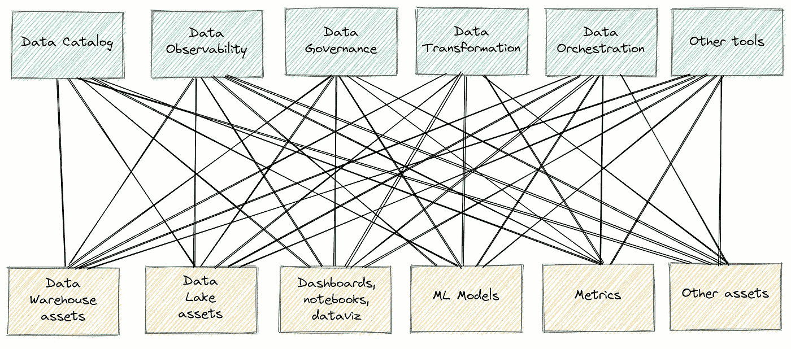
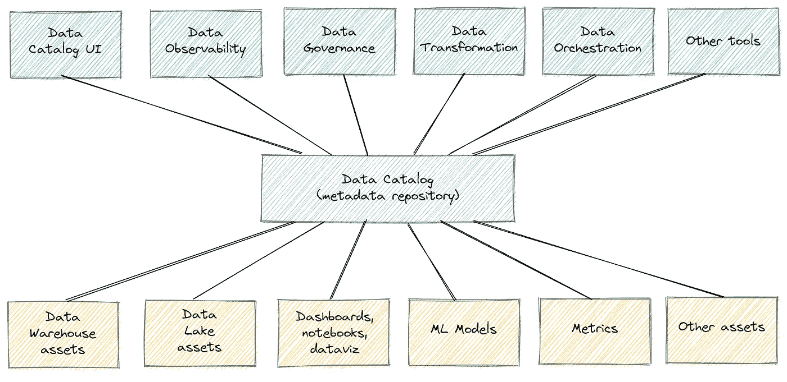

# 您的数据目录不应该只是多一个用户界面

> 原文：<https://towardsdatascience.com/your-data-catalog-shouldnt-be-just-one-more-ui-e6bffb793cf1>

## 深入了解以 API 为中心的数据目录如何通过组合不同类型的元数据来帮助您确保数据平台的成功

克劳迪奥·施瓦兹在 [Unsplash](https://unsplash.com?utm_source=medium&utm_medium=referral) 上的照片

在过去的几年中，数据领域在数据平台的设计、构建和使用方面经历了重大转变。这一变化，可以被称为数据技术的第三次浪潮</building-an-end-to-end-open-source-modern-data-platform-c906be2f31bd>*，迎来了现代数据栈的时代。在这个时代，存储和计算方面的可扩展性是一个已解决的问题。相反，我们终于有机会专注于从数据中提取尽可能多的价值，民主化对数据的访问，甚至生活质量的提升——而不必太担心技术限制和复杂性。*

*这个时代的关键支柱之一是数据目录，这一概念无论如何都不是新的或革命性的——我们可以想到 Informatica 或 Hadoop 生态系统的 Apache Atlas——但由于当今强大的现代数据堆栈，它有望释放组合不同类型元数据的未开发潜力。*

*和其他部分一样，这个问题最初是由数据驱动的科技公司解决的。Airbnb [在 2017 年谈到了 Dataportal](https://medium.com/airbnb-engineering/democratizing-data-at-airbnb-852d76c51770) ，然后网飞在 2018 年用[一篇关于 Metacat](https://netflixtechblog.com/metacat-making-big-data-discoverable-and-meaningful-at-netflix-56fb36a53520) 的博客文章进行了反击。Lyft [在 2019 年开源了基于拉的 Amundsen](https://eng.lyft.com/open-sourcing-amundsen-a-data-discovery-and-metadata-platform-2282bb436234) ，然后 LinkedIn 在 2020 年初通过[开源基于推的 DataHub](https://engineering.linkedin.com/blog/2020/open-sourcing-datahub--linkedins-metadata-search-and-discovery-p) 进行了反击。*

*期望很高:释放元数据的未开发潜力将优化我们与数据资产的交互方式，简化流程，解决当今的许多数据管理问题，并帮助我们在当今的数据谱系迷宫中导航。然而，我们已经到了 2022 年，十几个不同的数据目录只为我们的堆栈增加了一个东西:UI。*

*当然是一个有很多功能的用户界面。当今的数据目录提供了无缝的数据发现、集中的数据词汇表、广泛的集成和许多其他有用的功能。但是，这真的是 ***吗*** ？我个人不这么认为。*

*在本文中，我们将介绍数据目录应该(并且能够)实际提供的一些功能。但是首先:*

# *哪里出了问题？*

*直到 2019 年，大规模解决元数据管理仍然是一个复杂的挑战，有许多未解的问题。我们应该从不同的工具中提取元数据，还是应该由工具将元数据推入目录中？我们应该只对表进行分类，还是应该将所有种类的数据资产(仪表板、笔记本、管道等)都包括在图表中。)甚至人？我们应该考虑列级沿袭还是只会让事情变得更加复杂？*

*到 2019 年，前景变得更加清晰，许多主要的科技公司披露了他们如何解决这个问题，以及他们的方法可行/不可行。在接下来的几个月里，SaaS 工具公司能够提供类似的功能，我们很快就达到了一个状态，任何公司都可以向其堆栈中添加一个数据目录，提供数据发现和沿袭等核心功能，然后，这一进展就停滞了。*

*我们再也听不到创新的新功能或重大改进。相反，今天的数据目录似乎满足于成为数据平台中的一块砖。一块砖告诉我们仓库里有什么，资产是如何连接的，但仅此而已。*

*现代数据堆栈的当前状态依赖于一组不同的工具，每个工具都存储一些元数据。例如，我们的数据编排工具知道我们的数据资产和构建它们的管道的执行状态，我们的数据可观察性工具知道我们的资产的健康状况，我们的数据目录确保我们可以导航不同类型的数据资产。*

**

*现代数据堆栈中元数据的当前状态:连接到不同资产(黄色)并存储一部分元数据的不同工具(绿色)。(图片由作者提供)*

*在这种当前状态下，堆栈中的每个新工具都需要回到一个空白的绘图板，并解决所有其他工具已经解决的问题，例如直接从不同的源中检索元数据，并为不同的实体定义模式(例如，每个工具都需要回答诸如“我们希望为给定的表存储什么元数据？”以及“我们可以从 BI 资产中检索哪些元数据？”).*

*我个人认为，这种当前状态 ***就是*** 阻碍了数据编目的进程。如果元数据分散在定义了自己的模式和标准的十种不同工具中，我们如何释放元数据的潜力呢？许多数据目录试图通过从尽可能多的工具中提取元数据来解决这个问题，但是添加更多的连接器和集成从来都不是解决混乱的架构的正确答案。*

# *前进的道路:更少的 ui，更多的 API*

## *“元数据管理是一个已解决的问题”*

*尽管可能感觉不像，但目前没有任何技术复杂性或未解决的工程问题阻止给定的公司将其所有元数据集中在一个地方。(但行业特有的边缘案例可能依然存在。)*

*下一个合乎逻辑的步骤是让数据目录成为公司内部的中央元数据存储库，其他工具通过 API 连接到它，以检索任何所需的元数据，并用新的元数据丰富它。这种转变要求关于不同元数据实体定义的标准化，这是像 OpenMetadata [这样的开源项目已经实现的事情。](https://docs.open-metadata.org/main-concepts/metadata-standard)*

*一旦所有元数据都在一个位置可用，数据目录就变成了现代数据堆栈中的中央水平元数据存储库，而不仅仅是存储一部分元数据的一块砖。反过来，数据目录 UI 成为构建在此元数据存储库之上的独立组件。*

**

*现代数据堆栈中的元数据管理建议:连接到不同工具(绿色)和资产(黄色)的中央元数据库。(图片由作者提供)*

*这种设计提供了两个核心优势，打破了数据目录的当前状态:*

*   *我们(慢慢地)走向元数据标准:这停止了无休止的集成/连接器竞赛。数据堆栈中的每个工具不需要能够与其他每个工具和资产集成来交换元数据。相反，我们应该致力于定义标准，并推动堆栈中的现有工具与其保持一致。栈中的工具仍然可以利用元数据并丰富它，但这将通过标准化的实体和模式来实现。*
*   *数据目录成为 ***所有元数据*** 的访问点:这为我们需要组合不同类型的元数据的用例打开了大门，并且还确保我们总是可以通过简单地与目录交互来构建给定资产的完整元数据图片。*

## *激活元数据(真的)*

*将公司的所有元数据集中在一个位置具有巨大的潜在优势，这对数据平台的成功至关重要。*

*当我们谈到激活元数据时，我们不应该仅仅着眼于模式更改后的松弛通知或测试失败时的警报。相反，有更广泛的潜在使用案例:*

*   *自动检测业务关键型数据资产的上游瓶颈并发出警报:假设数据目录可以访问所有元数据，那么监控业务关键型数据资产的整个上游谱系(例如财务仪表板)并自动检测数据质量、性能甚至可能的优化方面的问题将会非常简单。*
*   *用不同类型的元数据丰富整个数据堆栈:通过 API 将不同类型的元数据从目录中提取出来，这意味着我们可以在有意义的时候将它注入堆栈中的其他工具。例如，当给定的表出现数据质量事件时，直接在依赖于该表的下游仪表板中查看警报不是很方便吗？当前的工作流希望数据用户导航到数据目录 UI，以确保信任给定的图表或数据资产是安全的，这给这种情况增加了不必要的摩擦。*
*   *立即检测并修复未优化的数据资产:例如，data catalog 将能够检测到使用筛选器频繁查询的表，该筛选器使用的列不是对该表进行分区的列，因此它可以更新该表，并使用最常用于筛选的列对其进行分区。*

*这些只是通过集中元数据并在其上构建功能所能实现的几个例子——一旦我们考虑对我们的数据平台必须提供的所有元数据类型进行基于 API 的访问，尚未开发的可能性领域就更加令人兴奋。*

## *主动数据目录*

*考虑到数据目录具有完整的数据血统，它应该是所有基于元数据的工作流的基础。*

*举个例子，让我们看看数据契约——这个概念最近得到了很多关注，但却没有一个明确的实现方法。在理想情况下，数据契约应该由数据目录的 API 支持。通过这样做，我们可以实现以下场景:*

1.  *产品开发团队中的某个人提出了一个 pull 请求，该请求更新了给定表中的一列或一个模式定义。*
2.  *CI 步骤对数据目录执行 API 调用。*
3.  *数据目录返回依赖于该列的下游表和列的列表、它们的重要性(基于业务重要性)以及它们相应的所有者。*
4.  *重要性分数高于预定义值(例如 4/5)的受影响下游表的所有所有者将作为审阅者添加到 PR 中。*
5.  *其受影响的下游表/列具有较低重要性的其他所有者得到关于提议的变更的通知(通过 Slack、电子邮件或任何其他工具)。*

*这个简单的工作流已经可以简化我们管理数据契约的方式:它可以成为管理数据资产本身的自动化部分，而不是单独管理契约和增加不必要的摩擦。数据消费者在变更发生之前得到通知(而不是在数据目录检测到变更后*收到警报),并可以在应用变更之前采取行动。**

*上述示例只是主动数据目录简化我们管理数据资产的方式并为新的增强和自动化打开大门的一个场景。*

# *正确的数据目录*

*市场上已经有大量的数据目录。因此，可能有许多选项能够处理本文中讨论的场景——但我个人知道有两个开源项目做得很好:*

## *open 元数据*

*本文中讨论的大多数想法和原则与 [OpenMetadata](https://open-metadata.org/) 背后的愿景完全一致，这是一个由[团队构建的开源项目，该团队改造了优步的数据文化](https://www.uber.com/en-FR/blog/ubers-journey-toward-better-data-culture-from-first-principles/)。OpenMetadata 旨在解决通用元数据管理问题，而不是简单地开源在优步完成的工作，或者只是从优步的角度来看待问题。*

## *数据中心*

*最初建于 LinkedIn，并于 2020 年开源， [DataHub](https://datahubproject.io/) 从第一天起就考虑到了可扩展性[。它对 API 的高度关注使它成为一个理想的目录，可以在其上丰富各种组件 LinkedIn 的团队正在做的正是这个。](https://engineering.linkedin.com/blog/2019/data-hub)*

# *结论*

*尽管它们可以说是现代数据堆栈中最令人兴奋的组件，但出于某种原因，今天的数据目录满足于现状，只是堆栈中多了一个 UI——但这需要改变。*

*前进的道路是模糊的、混乱的，而且绝不容易，但是走过这条路是值得努力的。通过将公司的所有元数据存储在一个地方，并提供优化的基于 API 的访问，我们为解决当今一些最紧迫的数据问题打开了非常广泛的可能性之门。*