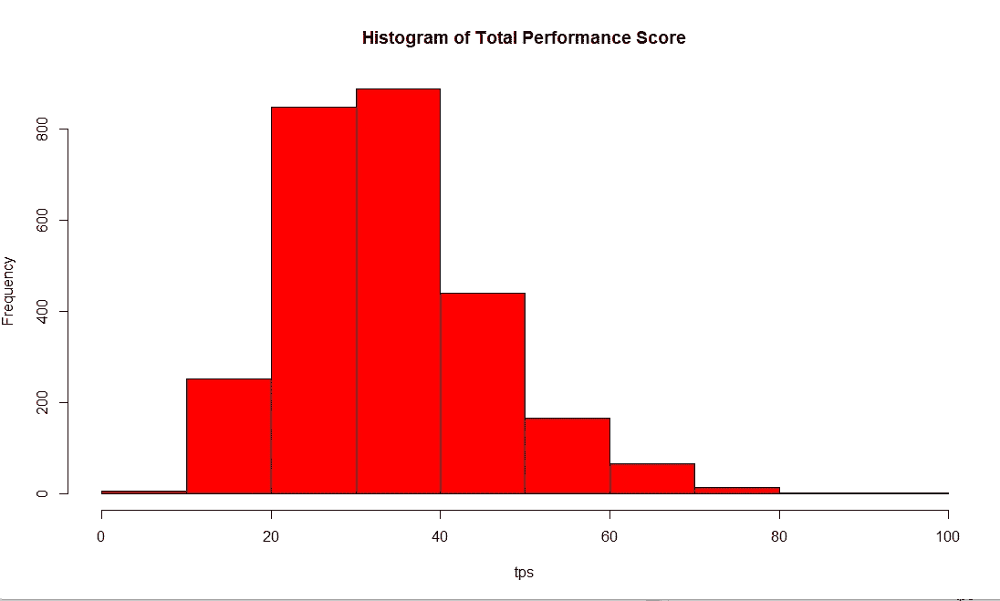
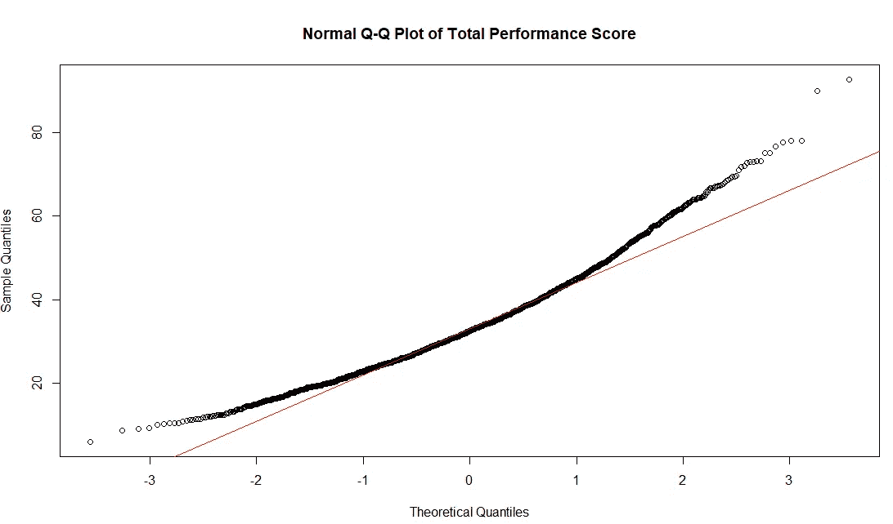
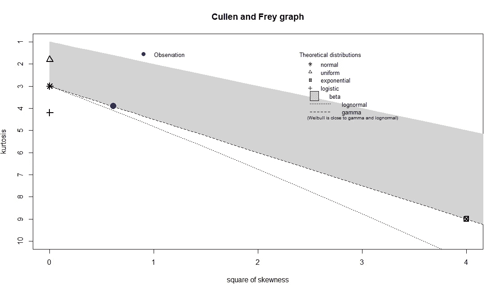
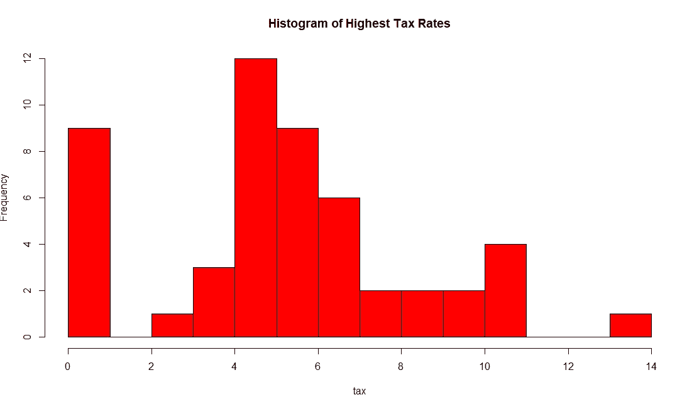
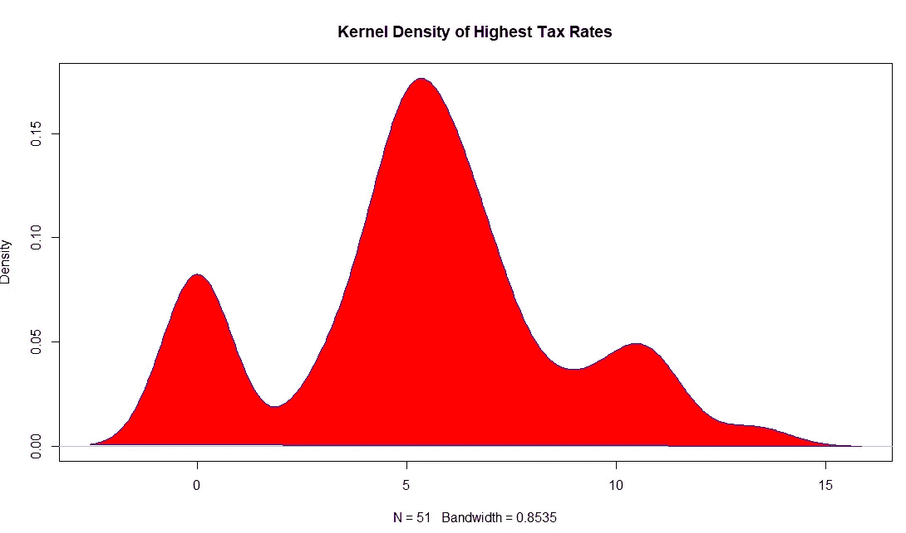
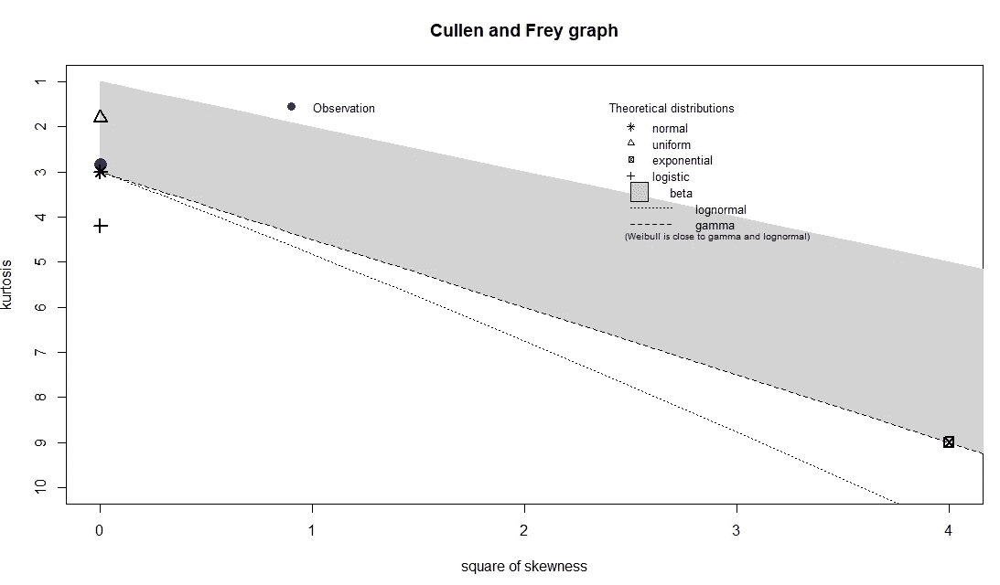
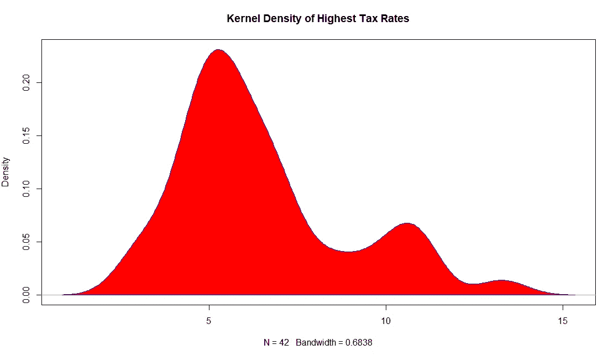
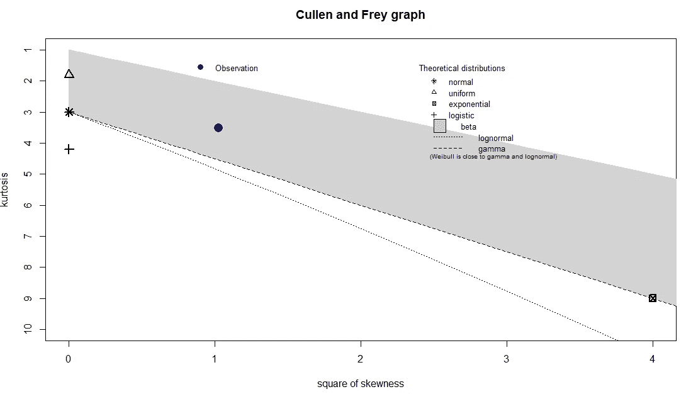

# 数据通常不正常

> 原文：<https://towardsdatascience.com/your-data-isnt-normal-54fe98b1f322>

## 使用其他数据科学技术获得更准确的见解


詹姆斯·考辛斯在 [Unsplash](https://unsplash.com/s/photos/magnifing-glass?utm_source=unsplash&utm_medium=referral&utm_content=creditCopyText) 上一张一张地拍照

不管你在统计学课上学到了什么，大多数数据都不是正态分布的。想想常见的正态分布现象的例子，如身高或高考分数。如果你能收集地球上所有人的身高并绘制成柱状图，左边的尾巴会比右边的重；婴儿和儿童比成人矮，所以分布是偏斜的。直接的统计修正是去除不符合的观察值，比如孩子，或者选择一小组符合正常模式的人群。经典的正常身高例子来自一个非常特殊的子集:19 世纪伦敦监狱中的成年男性囚犯。大学入学考试也不是整齐分布的。他们使用原始分数——正确答案的数量——进行评分，然后将其换算成正态分布。我们知道原始分数不是正态分布的，因为否则它们就不需要被缩放和拟合成正态曲线。现实生活毕竟不是那么正常。

本文首先回顾了正态分布的用途和局限性。然后，我们将检查两个非正常数据的案例研究。传统的统计工具将用于帮助确定分布。还将应用生成意外结果的数据拟合函数。将开发两个案例研究的最佳解决方案。然而，最重要的收获可能是数据本身的形状揭示了大量的信息，可能比任何统计测试都多。

## 正态分布

19 世纪初，德国数学家和物理学家卡尔·弗里德里希·高斯首次描述了正态分布。这就是为什么正态分布也被称为高斯分布。高斯记录并分析了小行星运动的观测误差。这就是“观察”一词在回归和其他分析中的来源——字面意思是通过望远镜观察。本质上，正态分布是关于人类观察现象的错误。在许多情况下，这仍然是它今天的主要目的。

正态分布有两个参数:均值()和标准差(*【σ】*)。对于任意值， *x* ，其概率分布为:[1]


美国商务部，[公共领域图像](https://www.itl.nist.gov/div898/handbook/pmc/section5/pmc51.htm)

曲线围绕平均值对称，呈钟形。对于 0 的平均值和 1 的标准偏差，一百万个随机正态观测值的曲线如下所示:


作者图片

曲线的一些特征使得统计分析更加方便。均值、中值和众数都是一样的。作为一种概率分布，即使参数改变，曲线的面积也等于 1。它的对称性是测试尾部极值的理想选择。

大数定律(LLN)与正态分布没有直接关系，但它相对于中心极限定理(CLT)来说很重要。LLN 指出，我们从分布中抽取的样本越多，它们的平均值就越有可能接近该分布的平均值。这具有直观的意义，因为更多的样本意味着更接近分布。LLN 适用于任何封闭分布，甚至高度非正态分布，因此该定律的假设是关于样本本身的。每个样本必须是随机的、同分布的和独立的。这有时被称为“i.i.d”。在数学意义上，这意味着每个样本来自相同的均值和标准差。值得注意的是，LLN 只控制随机误差，而不考虑系统误差或采样偏差。[2]CLT 指出，随着我们获取更多的 i.d .样本，它们在平均值周围的分布将收敛于正态分布。奇怪的是，LLN 不需要大量的样本；根据潜在的分布，它将只采集 15 到 30 个样本。

LLN 和 CLT 是调查分布均值和抽样误差形状的工具。就是这样。这两种工具都无法描述数据的形状或分布。两者都不会将您的数据转换为正常数据。两者对采样数据的要求都出奇的严格。总的来说，它们是统计学和数据科学中最常被误用的两种工具，我们将在两个案例研究中看到这一点。

## 案例研究:医院质量

*场景:联邦医疗保险计划通过奖励那些平衡了患者安全和整体体验并降低了保险索赔的医院来提高医疗质量。负责管理医疗保险的美国卫生与公众服务部创建了一个基于价值的采购(VBP)总绩效评分(TPS ),以比较大约 3000 家医院每年的绩效。该分数有一个复杂的计算过程，包括许多不同的输入，如患者调查、保险索赔和再入院率。作为激励措施，政府扣留国家医疗保险医院报销的 2%,并根据每个医院的 TPS 重新分配该金额。得分较高的医院获得奖金，而得分较低的医院则受到惩罚。*

*VBP 系统激发了一位医院主管的研究想法。他提议研究医院质量和领导风格之间的可能联系。TPS 被用作质量的代理，医院质量经理使用 Likert 类型的工具进行调查。数据被下载，一份调查问卷通过电子邮件发送给了 2777 名质量经理。为不止一家医院工作的管理者只收到一份调查问卷。因为先前的 TPS 数据是由合格的专家分析的，并被认为是“以 37 分为中心的相当正态的分布，少数例外的医院得分超过 80 分”，[3]所以假定当前的数据是相似的。总共回收了 150 份完整的问卷，这位高管进行了多元线性回归，以寻找质量和领导风格之间的任何相关性。消除了几个异常值，使误差残差看起来更正常，并尝试了对领导数据的不同转换。然后，LLN 和 CLT 认为误差是正态分布的。结果令人失望，领导风格解释了不到 2%的分数变化。独立变量的相关 P 值非常不显著。哪里出了问题？你建议如何纠正它？*

解决方法:我们从从属数据开始。最近的 VBP 数据看起来与前几年相似，TPS 的直方图和密度如下所示:



作者提供的图片

然而，这些数据是否如专家们所断言的那样是“相当正常的分布”呢？一个正常的 Q-Q 图表明它不是:



作者图片

分数在两个极端都偏离了参考线。如果不是正常的，那是什么？作为 R 中 MASS 库的一部分，`descdist`使单变量分布适合不同种类的数据。`descdist`使用不同的估计方法，如最大似然法和矩匹配法，生成偏度-峰度图，也称为卡伦和弗雷图。[4]创建总绩效得分的库伦和弗雷图( *tps* )的代码是:

```
library(MASS)
library(fitdistrplus)
descdist(tps, discrete = FALSE, boot = NULL, method =     "unbiased", graph = TRUE, obs.col = "darkblue", obs.pch = 16, boot.col = "orange")
```

得到的图形是:



作者图片

TPS 的蓝点观察在理论伽马分布线上。似乎专家们错了——而且有着重大的影响。

回想一下，研究人员使用了多元线性回归。这种方法的第一个假设是因变量和自变量是线性相关的。这是直观的，因为如果它们不是线性相关的，测试就是错误的。事实上，具有伽马分布的因变量需要使用最大似然估计的广义线性模型(GLM)，而不是普通的最小二乘法(OLS)。GLM 中的链接函数将针对伽玛分布中右侧尾部的极端观测值进行调整。

几个常见的错误会导致错误的设定。最初的问题，“这个数据看起来正常吗？”与“这个数据的形状是什么？”图表可以被主观地观察，引导研究者看到他们正在寻找的模式。[5]人们也很容易相信，如果采集的样本越多，那么分布看起来就越正常。TPS 是对所有医院的普查，因此是非概率的真实分布。无法采集更多的样本。误解数据本身的含义可能是另一个因素。分数并不代表质量，而是作为一种保险赔偿再分配方案。保险支付遵循伽玛分布，这就是评分系统反映伽玛分布的原因。单单研究和主题专业知识就可以取代大部分工作来确定数据是伽马分布的以及为什么是伽马分布的。

有趣的是，使用伽玛分布因变量运行 OLS 回归可能会产生与正确指定的 GLM 相差不远的估计系数结果。[6]这可能部分取决于分布的形状(其中“形状”是指定的参数之一)。然而，这位研究人员不幸地以两种方式改变了数据。通过剔除右边尾部的“异常值”，他们无意中将表现最好的医院排除在分析之外。换句话说，调查的范围缩小到非优秀医院的领导风格。研究人员还尝试对独立数据进行平方根变换，使其表现符合预期；这加剧了错误设定。这再次显示了对数据意义的误解，因为“领导能力的平方根”是无意义的。

该研究人员的方法还有其他问题。TPS 最终受到了每家医院数百名员工的影响。这代表了要调查的真实人口。研究人员选择了一种有目的的*非概率*抽样技术，仅用于挑选质量经理。回想一下，要使用 LLN 和 CLT，样本必须是随机选择的，并且独立同分布。抽样框架不再与真实人口相匹配，因此存在偏差。这也意味着误差项在线性回归中不是正态分布的。随着一些统计数据的出现，有可能声称质量经理是被研究的人群，但是由此产生的固有的非概率性偏差不能被测量或者被合并到模型中。此外，质量经理的选择不是独立的。因为一些经理为不止一家医院工作，他们的调查不能与单个 TPS 联系在一起，使他们不独立。这些因素中的每一个都促成了这个错误的研究项目。

结论:让数据引导你制定研究计划。从它的构成和形状，你可以推断出它的大概意思。不要仅仅为了满足您想要运行的特定统计测试的需要而转换数据。不要相信专家，而是要研究和验证他们的断言；这样，你就成为了数据和研究的专家。记得 LLN 和 CLT 有关于概率的假设；并非所有来自 30 个或更多样本的数据都与平均值和正态分布相关。

在我们的案例研究中，假设的最初想法可能是:“领导风格和医院质量之间存在相关性。”最终的研究结果更接近于:“领导风格的平方根和医院保险支付再分配方案(不包括优秀员工)之间存在错误的线性相关性，这是由误用于非概率数据的概率技术控制的，所有这些都受到未知和不可测量的统计偏差的影响。”最重要的是，要认识到每个假设和数据操作都会对结果的意义产生影响。

## 案例研究:税收和社会公正

场景:一位社会科学家想要研究边际税率，以检查与各种社会公正措施的相关性。理论上，他们希望找到一种关系，证明较高的最高边际税率意味着这些州对社会公正的更强承诺。社会公正数据将在以后挖掘，以适应边际税收数据。超出了这个一般的概念，研究的思想还没有成型。研究人员创建了一个向量，税*，每个州和哥伦比亚特区的最高边际所得税税率。税收数据被证明是“有问题的”，因为它的分布很奇怪，社会科学家想知道如何使用正态分布对它进行统计测试。*

解决方案:数据可能“有问题”,原因有很多。它可能无法访问或不完整。数据可能测量错误。数据框可能不代表人口。然而，正确测量和充分收集的人口信息讲述了自己独特的故事。分析数据的困难可能被证明是一个“问题”，但是数据本身可能是非常完美的。就税率而言，看一下直方图和密度图:



作者提供的图片

根据这些图表，数据肯定是不正常的，特别是因为严重的左尾巴。然而，卡伦和弗雷的图表讲述了一个不同的故事:



作者图片

卡伦和弗雷图表绘制的数据是正常的。这是因为我们的数据遵循两种不同的概率分布。很难看出这一点，但线索是直方图中的 9 个零观测值。最高边际税率为 0%表示一个州没有所得税，而所有其他值都意味着有税存在。这种非此即彼的分类就是二项式分布。在有所得税的州中，它们的最高边际税率遵循不同的分布。用这一行代码只保留有税收的州，

```
nozerotax <- tax[ tax != 0 ]
```

我们可以用图表显示*的零税率*数据:



作者图片。

其余 42 个税务管辖区的 Cullen 和 Frey 图显示了 beta 分布。这正是我们所期望的，因为百分比通常采用贝塔分布的形式，边际税率用百分比表示。

结论:研究人员选择了一个单一变量 *tax* ，它遵循两种不同的分布。这使得 LLN 和 CLT 不适用，因为违反了身份识别假设。推而广之，任何依赖于正态分布的统计检验都不能使用。*税*变量不适合研究者的目标和期望的统计方法。

## 走向

数据科学家做出的每一个方法和统计决策都会影响他们的研究结果。因为大学里教授的许多统计测试都依赖于正态分布，所以扭曲我们的数据或忽略关键假设来运行我们熟知的测试可能很有诱惑力。这有点像一句老话，如果你唯一的工具是一把锤子，那么一切看起来都像钉子。与其问数据是否正常，不如先问:它是如何分布的？这告诉了我什么？你可能会发现远远超出你预期的东西。

## 参考资料和数据来源

[1]美国商务部，NIST/SEMATECH 统计方法电子手册(2012 年)，[https://www . ITL . NIST . gov/div 898/Handbook/PMC/section 5/PMC 51 . htm](https://www.itl.nist.gov/div898/handbook/pmc/section5/pmc51.htm)

[2] J. Orloff 和 J. Bloom《中心极限定理和大数定律》，《概率统计导论》，(2014)，麻省理工学院开放课件，[https://OCW . MIT . edu/courses/mathematics/18-05-概率统计导论-spring-2014/readings/MIT 18 _ 05s 14 _ reading 6b . pdf](https://ocw.mit.edu/courses/mathematics/18-05-introduction-to-probability-and-statistics-spring-2014/readings/MIT18_05S14_Reading6b.pdf)

[3] E. Klein 和 P. Shoemaker，“基于价值的采购:质量评分和激励支付的预览”，《医疗保健财务管理》，(2012)，[https://www . ahd . com/news/HFM _ FeatureStory _ ValueBasedPurchasing _ 2012 _ January . pdf](https://www.ahd.com/news/HFM_FeatureStory_ValueBasedPurchasing_2012_January.pdf)

[4] M. Delignette-Muller 和 C. Dutang，“fitdistrplus:拟合分布的 R 包”，《统计软件杂志》，(2015)，[https://www.jstatsoft.org/article/view/v064i04](https://www.jstatsoft.org/article/view/v064i04)

[5] N .托顿和 p .怀特，“无处不在的神话般的正态分布”，《研究与创新》，(2011 年)，[https://www . researchgate . net/publication/322387030 _ The _ Ubiquitous _ mythic _ Normal _ Distribution](https://www.researchgate.net/publication/322387030_The_Ubiquitous_Mythical_Normal_Distribution)

[6] P. Johnson，“具有伽马分布因变量的 GLM”，科罗拉多大学博尔德分校，(2014 年)，[https://pj . free faculty . org/guides/stat/Regression-GLM/伽马/伽马-01.pdf](https://pj.freefaculty.org/guides/stat/Regression-GLM/Gamma/GammaGLM-01.pdf)

数据来源:总绩效得分数据在公共领域，可从医疗保险&医疗补助服务中心获得。所得税数据来自以下国家税务机关: [AL](https://revenue.alabama.gov/wp-content/uploads/2022/01/21f40bk.pdf) 、 [AZ](https://azdor.gov/individual-income-tax-filing-assistance/tax-conformity-faqs) 、 [AR](https://www.arkansasedc.com/why-arkansas/business-climate/tax-structure/personal-income-tax) 、 [CA](https://www.ftb.ca.gov/file/personal/tax-calculator-tables-rates.asp) 、 [CO](https://tax.colorado.gov/sites/tax/files/documents/DR0104Book_2021_V3.pdf) 、 [CT](https://portal.ct.gov/-/media/DRS/Forms/2021/Income/CT-1040-Online-Booklet_1221.pdf) 、 [DE](https://revenue.delaware.gov/frequently-asked-questions/personal-income-tax-faqs/) 、 [DC](https://otr.cfo.dc.gov/page/dc-individual-and-fiduciary-income-tax-rates) 、 [GA](https://dor.georgia.gov/document/booklet/2021-it-511-individual-income-tax-booklet/download) 、 [HI](https://files.hawaii.gov/tax/forms/2021/n11ins.pdf) 、 [IL](https://www2.illinois.gov/rev/research/taxrates/Pages/income.aspx) 、 [IN](https://forms.in.gov/Download.aspx?id=15122) 、 <https://forms.in.gov/Download.aspx?id=15122> [MD](https://www.marylandtaxes.gov/individual/income/tax-info/tax-rates.php) ， [MA](https://www.mass.gov/guides/personal-income-tax-for-residents#-introduction-) ， [MI](https://www.michigan.gov/taxes/-/media/Project/Websites/taxes/Forms/2021-IIT-Forms/Book-1040-Instructions-Only.pdf?rev=0ce29138c0904879a9212a0619cd8198&hash=994361C699088D9FA11D42286F01B837) ， [MN](https://www.revenue.state.mn.us/minnesota-income-tax-rates-and-brackets) ， [MS](https://www.dor.ms.gov/individual/tax-rates) ， [MO](https://dor.mo.gov/forms/2017%20Tax%20Chart_2017.pdf) ， [MT](https://montana.servicenowservices.com/citizen/kb?id=kb_article_view&sysparm_article=KB0014487) ， [NE](https://revenue.nebraska.gov/sites/revenue.nebraska.gov/files/doc/tax-forms/drafts/Tax_Cal_Sch.pdf) ， [NJ](https://www.state.nj.us/treasury/taxation/taxtables.shtml) ， [NM](https://www.tax.newmexico.gov/individuals/wp-content/uploads/sites/5/2021/12/PIT-rates_2005_2021.pdf) ， [NY](https://www.tax.ny.gov/pdf/current_forms/it/it201i.pdf#page=51) ， [NC](https://www.ncdor.gov/taxes-forms/tax-rate-schedules) ， [ND](https://www.tax.nd.gov/sites/www/files/documents/forms/individual/2021-iit/2021-individual-income-tax-booklet.pdf)